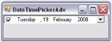

# Creating DateTimePickerAdv

DateTimePickerAdv control provides full support for the Windows Forms designer. To use a DateTimePickerAdv control in your application, all you need to do is drag and drop a DateTimePickerAdv control from the controls toolbox onto your form. You can then set any of its properties through the property grid. 

The DateTimePickerAdv can be created programmatically through code as detailed below.

1. Include the required namespace.

   ~~~ cs

             using Syncfusion.Windows.Forms.Tools;

   ~~~
   {:.prettyprint}

   ~~~ vbnet
              Imports Syncfusion.Windows.Forms.Tools
   ~~~
   {:.prettyprint}

2. Create an instance of DateTimePickerAdv. Add that instance to the Form.

   ~~~ cs

					private Syncfusion.Windows.Forms.Tools.DateTimePickerAdv dateTimePickerAdv1;

					this.dateTimePickerAdv1=new Syncfusion.Windows.Forms.Tools.DateTimePickerAdv();

					this.Controls.Add(this.dateTimePickerAdv1);
   ~~~
   {:.prettyprint}

   
   ~~~ vbnet

					Private dateTimePickerAdv1 As Syncfusion.Windows.Forms.Tools.DateTimePickerAdv

					Me.dateTimePickerAdv1 = New Syncfusion.Windows.Forms.Tools.DateTimePickerAdv()

					Me.Controls.Add(Me.dateTimePickerAdv1)
   ~~~
   {:.prettyprint}

    

   

