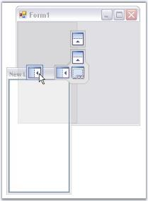
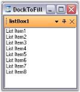

# Special Features

The following topics are discussed in this particular section.

## Dock Arrow Settings

While dragging and dropping a docked control, DockingManager guides you through the process, using DragProviderStyle property.

On setting this property to VS2005 or Whidbey style, you will be able to see arrows on four sides of the form, when a control is dragged. These arrows will guide you where to dock the window. Keeping the mouse point on a particular arrow will display a shadow like appearance based on the side of docking.

There are three docking provider Styles. They are, 

* Standard (Default value - no arrows appears for this option), 
* VS2005, 
* WhidBey and
* VS2008. 



this.dockingManager1.DragProviderStyle = Syncfusion.Windows.Forms.Tools.DragProviderStyle.VS2008;




Me.dockingManager1.DragProviderStyle = Syncfusion.Windows.Forms.Tools.DragProviderStyle.VS2008



  

  

  

In the image above, a shadow for docking a panel to the top of the form is displayed. Target area is highlighted at the top, as the mouse is hovered over the top Dock arrow.

### Visibility of the Arrows

The docking arrows visibility, while dropping a control inside the form or into another docked control, can be set using the below properties.

<table>
<tr>
<th>
DockedControl Property</th><th>
Description</th></tr>
<tr>
<td>
DockAbility</td><td>
Indicates where the user can dock in this control using drag providers.</td></tr>
<tr>
<td>
OuterDockAbilility</td><td>
Indicates where the user can dock the controls in a form using the drag providers.</td></tr>
</table>

  

  

  



[Docking](/windowsforms/Tools/DockingPackage/Docking-Events.html#docking)



## DockToFill, Freeze Resizing

The DockToFill property allows users to implement a very unique docking layout where a non-MDIContainer form or ContainerControl's entire client region is occupied by the dockable controls.

<table>
<tr>
<th>
DockingManager Property</th><th>
Description</th></tr>
<tr>
<td>
DockToFill</td><td>
Sets the boolean value indicating whether the docked control occupies the form's full client region.</td></tr>
</table>



this.dockingManager1.DockToFill = true;





Me.dockingManager1.DockToFill = True;



  

A sample which demonstrates DockToFill property is available in the below sample installation path.

…\My Documents\Syncfusion\EssentialStudio\Version Number\Windows\Tools.Windows\Samples\Advanced Editor Functions\ActionGroupingDemo

### FreezeResizing

The FreezeResizing property has been implemented for each control by which, the end users can freeze any particular control. Also, the property value can be persisted. A global FreezeResizing property is also available using which all the controls can be frozen.

The controls can also be frozen by calling the SetFreezeResizing method which freezes the specified control and the user will no more be able to resize the controls.

<table>
<tr>
<th>
Parameter</th><th>
Description</th></tr>
<tr>
<td>
SetFreezeResizing</td><td>
Freezes the specified control. The parameters are,Ctrl - The control for which docking is enabled.freeze - Represents a boolean value which decides whether to freeze the specified control.</td></tr>
</table>



this.dockingManager1.FreezeResizing = true;

this.dockingManager1.SetFreezeResize(this.panel1, true);




Me.dockingManager1.FreezeResizing = True

Me.dockingManager1.SetFreezeResize(Me.panel1, True)



A sample which uses FreezeResizing property is available in the below sample installation path.

..My Documents\Syncfusion\EssentialStudio\Version Number\Windows\Tools.Windows\Samples\2.0\Docking Package\SDIDemo



[Getting Started](/windowsforms/Tools/DockingPackage/Getting-Started)

