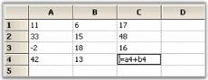
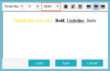

# Adding Special Controls to Grid Cells

GridStyleInfo property, CellType, lets you add special controls such as a check box or a combo box to a grid cell. Since the CellType is a member of GridStyleInfo, you can use it on a cell basis, row basis, column basis, or on a table basis, simply by setting this CellType property on the appropriate style. If you want the entire grid to be a combo box, then you simply have to set the grid's CellValue property to use combo boxes. You can derive your own controls to implement additional cell types. For more details, see deriving a cell control.

Following table lists the cell types that are supported in Essential Grid.

<table>
<tr>
<th>
GRID CELL CONTROL</th><th>
DESCRIPTION</th></tr>
<tr>
<td>
Check Box</td><td>
Displays a check box in the cell.</td></tr>
<tr>
<td>
Color Edit</td><td>
Displays a color selection and allows editing color choices.</td></tr>
<tr>
<td>
Combo Box</td><td>
Displays a combo box in the cell.</td></tr>
<tr>
<td>
Control</td><td>
Displays a System.Windows.Forms.Control in a cell.</td></tr>
<tr>
<td>
Currency Edit</td><td>
Displays a currency value and allows editing of it.</td></tr>
<tr>
<td>
Formula Cell</td><td>
Displays calculation from a formula entered in the cell.</td></tr>
<tr>
<td>
Grid List Control</td><td>
Displays multicolumn list control as a drop down.</td></tr>
<tr>
<td>
Header</td><td>
Displays cells as grid header cells with static text.</td></tr>
<tr>
<td>
Masked Edit</td><td>
Uses a mask to control values entered into the cell.</td></tr>
<tr>
<td>
Month Calendar</td><td>
Displays DateTime value and allows editing of it.</td></tr>
<tr>
<td>
Numeric Up Down</td><td>
Displays numeric text that can be edited or modified with spinner buttons.</td></tr>
<tr>
<td>
Progress Bar</td><td>
Displays ProgressBar control in a cell.</td></tr>
<tr>
<td>
Push Button</td><td>
Displays button in the cell that the user can click.</td></tr>
<tr>
<td>
Rich Text</td><td>
Displays rich text in the cell and allows editing while in a drop down.</td></tr>
<tr>
<td>
Slider</td><td>
Displays slider control in a cell.</td></tr>
<tr>
<td>
Static</td><td>
Displays text in the cell that cannot be edited.</td></tr>
<tr>
<td>
Text Box</td><td>
Displays text in the cell that can be edited.</td></tr>
</table>

## Check Box

Check Box cell type displays a check box in a grid cell. The check box has three states: Checked, Unchecked and Indeterminate. You can decide whether the check box should behave as a two-state check box or a three-state check box.

The following GridStyleInfo properties can be used to control the functioning of a check box.

<table>
<tr>
<th>
GRIDSTYLEINFO PROPERTY</th><th>
DESCRIPTION</th></tr>
<tr>
<td>
CellType</td><td>
Set to "check box" for check box control.</td></tr>
<tr>
<td>
CheckBoxOptions</td><td>
Defines the display value of True, False, or indeterminate (i.e., the value returned by GridStyleInfo.Text property).</td></tr>
<tr>
<td>
Description</td><td>
Text that appears next to the check box.</td></tr>
<tr>
<td>
TriState</td><td>
Whether or not indeterminate value is supported.</td></tr>
<tr>
<td>
CellValue</td><td>
Boolean true or false values, or empty (null or nothing).</td></tr>
</table>

The following code example illustrates how to set the cell type to CheckBox.



//Specifies display values for True/False/Indeterminate.

gridControl1.TableStyle.CheckBoxOptions = new GridCheckBoxCellInfo("True", "False", "", false);

//Sets up a check box with no tristate.

gridControl1[rowIndex,colIndex].CellValue = false;

gridControl1[rowIndex,colIndex].Description = "Click Me";

gridControl1[rowIndex,colIndex].CellType = "CheckBox";

gridControl1[rowIndex,colIndex].TriState = false;

//Sets up a check box with tristate.

gridControl1[rowIndex,colIndex + 1].CellValue = true;

gridControl1[rowIndex,colIndex + 1].CellType = "CheckBox";

gridControl1[rowIndex,colIndex + 1].TriState = true;

gridControl1[rowIndex,colIndex + 1].Description = "TriState";





' Specifies display values for True/False/Indeterminate.

gridControl1.TableStyle.CheckBoxOptions = New GridCheckBoxCellInfo("True", "False", "", False)

' Sets up a check box with no tristate.

gridControl1(rowIndex, colIndex).CellValue = False

gridControl1(rowIndex, colIndex).Description = "Click Me"

gridControl1(rowIndex, colIndex).CellType = "CheckBox"

gridControl1(rowIndex, colIndex).TriState = False

' Sets up a check box with tristate.

gridControl1(rowIndex, colIndex + 1).CellValue = True

gridControl1(rowIndex, colIndex + 1).CellType = "CheckBox"

gridControl1(rowIndex, colIndex + 1).TriState = True

gridControl1(rowIndex, colIndex + 1).Description = "TriState"



  

## Color Edit

Color Edit cell type allows you to pick up colors and set a color object as the CellValue. To do this, you have to set the CellType property to _ColorEdit_. The following code example illustrates how to set the cell type to ColorEdit.



//Sets up a Color Edit control.

gridControl1[rowIndex, colIndex].CellType = "ColorEdit";

gridControl1[rowIndex, colIndex].CellValue = Color.Aqua;





'Sets up a Color Edit control.

gridControl1(rowIndex, colIndex).CellType = "ColorEdit"

gridControl1(rowIndex, colIndex).CellValue = Color.Aqua



 

## Combo Box

When you add a combo box to a grid cell, it will enable you to choose from a drop-down list of choices. You can populate this list in several ways by setting appropriate GridStyleInfo properties. Other properties restrict the choices to those items listed in the drop down, and enable auto completion of possible matches as the user types new items.

<table>
<tr>
<th>
GRIDSTYLEINFO PROPERTY</th><th>
DESCRIPTION</th></tr>
<tr>
<td>
CellType</td><td>
Sets to "combo box" for a combo box control.</td></tr>
<tr>
<td>
ChoiceList</td><td>
StringCollection holding the strings for the drop down.</td></tr>
<tr>
<td>
ExclusiveChoiceList</td><td>
{{ 'True' | markdownify }} if you want to list the items in the drop-down, {{ 'false' | markdownify }} otherwise.</td></tr>
<tr>
<td>
DataSource</td><td>
This property lets you to populate the drop-down list by using an object that implements IListSource or IList. Examples include DataTable, DataSet, DataView and ArrayList.</td></tr>
<tr>
<td>
DisplayMember</td><td>
String that names the public property from the data source object to be displayed in the cell.</td></tr>
<tr>
<td>
ValueMember</td><td>
String that names the public property from data source object to be used as the value for this cell.</td></tr>
</table>

The following code example illustrates how to set the cell type to ComboBox.



//Generates the choices.

StringCollection items = new StringCollection();

items.Add("One");

items.Add("Two");

items.Add("Three");

items.Add("Four");

items.Add("Five");

//Sets up the control.

gridControl1[rowIndex, colIndex].CellType = "ComboBox";

gridControl1[rowIndex, colIndex].ChoiceList = items;

gridControl1[rowIndex, colIndex].Text = "Five";

gridControl1[rowIndex, colIndex].CellType = "ComboBox";

gridControl1[rowIndex, colIndex].ExclusiveChoiceList = true;

//Or uses a data source such as a table in a data set.

gridControl1[2, 2].CellType = "ComboBox";

gridControl1[2, 2].DataSource = this.dataSet11.Tables["Customers"];

gridControl1[2, 2].DisplayMember = "CustomerID";

gridControl1[2, 2].ValueMember = "CustomerID";





'Generates the choices.

Dim items As StringCollection = New StringCollection()

items.Add("One")

items.Add("Two")

items.Add("Three")

items.Add("Four")

items.Add("Five")

'Sets up the control. 

gridControl1(rowIndex, colIndex).CellType = "ComboBox"

gridControl1(rowIndex, colIndex).ChoiceList = items

gridControl1(rowIndex, colIndex).Text = "Five"

gridControl1(rowIndex, colIndex).CellType = "ComboBox"

gridControl1(rowIndex, colIndex).ExclusiveChoiceList = True

'Or uses a data source such as a table in a dataset.

gridControl1(2, 2).CellType = "ComboBox"

gridControl1(2, 2).DataSource = Me.dataSet11.Tables("Customers")

gridControl1(2, 2).DisplayMember = "CustomerID"

gridControl1(2, 2).ValueMember = "CustomerID"



 

### AutoComplete Support for Combo Box in Edit Mode

Essential Grid provides AutoComplete support for combo box cells. AutoComplete feature is a filtered suggestion list presented as drop-down that is pulled from a mapped data source as the user enters text into a text box.  AutoComplete for combo box cells provide the following properties:

* AutoComplete—Displays suggestion in the text box. The content other than what you have typed will be highlighted. 
* AutoSuggest—Dynamically populates a list based on entered text.
* Both—Enables normal editable behavior.
* None—No operations will be performed in the text box and list box areas.

#### Use Case Scenarios

You can choose the suggestion instead of typing the entire content.

<table>
<tr>
<th>
PROPERTIES </th><th>
DESCRIPTION </th><th>
TYPE </th><th>
DATA TYPE </th><th>
REFERENCE LINKS </th></tr>
<tr>
<td>
AutoComplete</td><td>
Gets a suggestion from the list based on the entered text. The suggestion will be highlighted. </td><td>
Enumerator</td><td>
N/A</td><td>
N/A</td></tr>
<tr>
<td>
AutoSuggest</td><td>
Dynamically populate a list based on the entered text.</td><td>
Enumerator</td><td>
N/A</td><td>
N/A</td></tr>
<tr>
<td>
Both</td><td>
Enables normal editable behavior.</td><td>
Enumerator</td><td>
N/A</td><td>
N/A</td></tr>
<tr>
<td>
None</td><td>
No operations will be performed in the text box and list box areas.</td><td>
Enumerator</td><td>
N/A</td><td>
N/A</td></tr>
</table>

#### Enabling AutoComplete in EditMode for Combo Box Celltype

The following steps illustrate enabling AutoComplete in EditMode for a combo Box celltype:

1. Declare the Celltype as Combo Box as given in the following code:

   ~~~ cs
     
	    this.gridControl1[RowIndex,ColIndex].CellType = GridCellTypeName.ComboBox;  
   
   ~~~
   {:.prettyprint}

   ~~~ vbnet
      
	    Me.gridControl1(RowIndex,ColIndex).CellType = GridCellTypeName.ComboBox

   ~~~
   {:.prettyprint}

   Set the Dropdown style as Editable.

   ~~~ cs

		this.gridControl1[RowIndex,ColIndex].DropDownStyle = GridDropDownStyle.Editable;
   
   ~~~
   {:.prettyprint}

   ~~~ vbnet
        
		Me.gridControl1(RowIndex,ColIndex).DropDownStyle = GridDropDownStyle.Editable  
   
   ~~~
   {:.prettyprint}

   Set the GridComboSelectionOption using AutoCompleteInEditMode property:

 

   ~~~ vbnet
        
		Me.gridControl1(RowIndex,ColIndex).AutoCompleteInEditMode = GridComboSelectionOptions.AutoSuggest

        Me.gridControl1(RowIndex,ColIndex).AutoCompleteInEditMode = GridComboSelectionOptions.AutoSuggest
   ~~~
   {:.prettyprint}

## Control

You can place an arbitrary control in a grid cell through Control cell type. This cell type differs from most other cell types shipped with Essential Grid, which cannot be shared among several cells. Control cell type requires you to instantiate control object for each cell that uses this cell type, and set that object to___style__.__Control_. A different control object is required for every cell that makes use of Control cell type. The following code example illustrates how to set cell type to Control.



//Sets up a Control Cell.

this.radioButton1.Checked = true; 

this.gridControl1.CoveredRanges.Add(GridRangeInfo.Cells(2,2,8,2));

this.gridControl1.ColWidths[2] = 200; 

this.gridControl1[2,2].CellType = "Control"; 

//Sets the control object.

this.gridControl1[2,2].Control = this.dataPanel;




'Sets up a Control Cell.

Me.radioButton1.Checked = True

Me.gridControl1.CoveredRanges.Add(GridRangeInfo.Cells(2, 2, 8, 2))

Me.gridControl1.ColWidths(2) = 200

Me.gridControl1(2, 2).CellType = "Control"

'Sets the control object.

Me.gridControl1(2, 2).Control = Me.dataPanel



The following screenshot shows a panel holding two radio buttons and a push button in the cell.

 

## Currency Edit

CurrencyEdit cell type lets you edit monetary values and display them by using different currency type formats. To achieve this, you must set the CellType property to Currency_._ You can set additional properties such as the decimal and group separator for the cell value. The following code example illustrates how to set the cell type to CurrencyEdit.



GridStyleInfo style = gridControl1[row, 2];

style.CellType = "Currency";

style.Text = "$1.00";

//Sets the clip mode.

style.CurrencyEdit.ClipMode = CurrencyClipModes.IncludeFormatting;

//Sets formatting properties.

style.CurrencyEdit.CurrencyDecimalDigits = 2;

style.CurrencyEdit.CurrencyDecimalSeparator = ".";

style.CurrencyEdit.CurrencyGroupSeparator = ",";

style.CurrencyEdit.CurrencyGroupSizes = new int[] {3};

style.CurrencyEdit.CurrencyNegativePattern = 1;

style.CurrencyEdit.CurrencyNumberDigits = 27;

style.CurrencyEdit.CurrencyPositivePattern = 0;

style.CurrencyEdit.CurrencySymbol = "$";

style.CurrencyEdit.NegativeColor = System.Drawing.Color.Red;

style.CurrencyEdit.NegativeSign = "-";

style.CurrencyEdit.PositiveColor = System.Drawing.Color.Black;

style.FloatCell = true;





Dim style As GridStyleInfo = gridControl1(row, 2)

style.CellType = "Currency"

style.Text = "$1.00"

'Sets the clip mode.

style.CurrencyEdit.ClipMode = CurrencyClipModes.IncludeFormatting

'Sets formatting properties.

style.CurrencyEdit.CurrencyDecimalDigits = 2

style.CurrencyEdit.CurrencyDecimalSeparator = "."

style.CurrencyEdit.CurrencyGroupSeparator = ","

style.CurrencyEdit.CurrencyGroupSizes = New Integer() {3}

style.CurrencyEdit.CurrencyNegativePattern = 1

style.CurrencyEdit.CurrencyNumberDigits = 27

style.CurrencyEdit.CurrencyPositivePattern = 0

style.CurrencyEdit.CurrencySymbol = "$"

style.CurrencyEdit.NegativeColor = System.Drawing.Color.Red

style.CurrencyEdit.NegativeSign = "-"

style.CurrencyEdit.PositiveColor = System.Drawing.Color.Black

style.FloatCell = True



 

## Formula Cell

FormulaCell cell type allows you to add algebraic formulas to a cell that depends on other cells. The cell value should be a well-formed formula starting with an '=' and the CellType property set to _FormulaCell_. If a Formula Cell does not begin with an '=', the cell is treated as a text box cell. For details, see Formula Support.

The following code example illustrates how to set the cell type to FormulaCell.



//Sets Cell Type as Formula Cell.

gridControl1[rowIndex, colIndex].CellType = "FormulaCell";

//Assigns a Formula.

gridControl1[rowIndex, colIndex].CellValue = "= (A1+A2) / 2";





'Sets Cell Type as Formula Cell.

gridControl1(rowIndex, colIndex).CellType = "FormulaCell"

'Assigns a Formula.

gridControl1(rowIndex, colIndex).CellValue = "= (A1+A2) / 2"


  

## Grid List Control

GridListControl cell type allows display of drop-down list that can contain multiple columns as an image. It uses DataSource, DisplayMember and ValueMember properties to control what is shown in the multiple columns. DataSource member is generally stored in parent style, and this member is then shared among grid cells which might use DisplayMember and ValueMember properties to customize their look if needed.

<table>
<tr>
<th>
Gridstyleinfo Property</th><th>
Description</th></tr>
<tr>
<td>
DisplayMember</td><td>
Any object that implements either IList or IListSource. These include DataTable, DataView, or ArrayList objects.</td></tr>
<tr>
<td>
ValueMember</td><td>
Indicates the column from the data source that is to be used for the value of the cell.</td></tr>
<tr>
<td>
ExclusiveChoiceList</td><td>
Determines whether the user is required to select an item in the drop-down list.</td></tr>
<tr>
<td>
MultiColumn</td><td>
Determines whether all the columns in the data source are displayed or if the single DisplayMember column is displayed.</td></tr>
</table>

Let us assume you have an ArrayList of US State objects. When you set the cell type to GridListControl, you will get the output as displayed in the screen shot. 



//Sets up the data source.

//Here "USStates" is an arraylist of state objects, each of which have the properties LongName and ShortName.

gridControl1.TableStyle.DataSource = USStates;

gridControl1.TableStyle.DisplayMember = "LongName";

gridControl1.TableStyle.ValueMember = "ShortName";

gridControl1[rowIndex, colIndex + 2].CellType = "GridListControl";

gridControl1[rowIndex, colIndex + 2].Text = "Wisconsin";

gridControl1[rowIndex, colIndex + 2].ExclusiveChoiceList = true;





'Sets up the data source.

'Here "USStates" is an arraylist of state objects each of which, have the properties LongName and ShortName.

gridControl1.TableStyle.DataSource = USStates

gridControl1.TableStyle.DisplayMember = "LongName"

gridControl1.TableStyle.ValueMember = "ShortName"

gridControl1(rowIndex, colIndex + 2).CellType = "GridListControl"

gridControl1(rowIndex, colIndex + 2).Text = "Wisconsin"

gridControl1(rowIndex, colIndex + 2).ExclusiveChoiceList = True



 

A sample which demonstrates Grid List Control cell type is available in the following sample installation path.

&lt;Install Location&gt;\Syncfusion\EssentialStudio\[Version Number]\Windows\Grid.Windows\Samples\Grid List Control

## Header

Header cell type displays static text similar to static CellType, but the Header cell type, in addition, has a button-like border that can have a depressed state. The following code example illustrates how to set the cell type to Header.



//Sets Cell Type as "Header".

gridControl1[rowIndex,colIndex].Text = "HeaderText";

//Sets Formatting properties.

gridControl1[rowIndex,colIndex].CellType = "Header";

gridControl1[rowIndex,colIndex].BackColor = Color.FromArgb(208, 208, 208);





'Sets Cell Type as "Header".

gridControl1(rowIndex, colIndex).Text = "HeaderText"

'Sets Formatting properties.

gridControl1(rowIndex, colIndex).CellType = "Header"

gridControl1(rowIndex, colIndex).BackColor = Color.FromArgb(208, 208, 208)



 

## Masked Edit

MaskedEdit cell type lets you edit and display specially formatted text cells that conform to an edit mask you specify. To make use of this cell type, set the CellType property to _MaskedEdit_. You can set additional properties like Mask, ClipMode, and so on, through the cell style's GridMaskEditInfo object. The various options will allow you to input masks to control the type of input that is valid within a cell. For example, you can use a MaskedEdit cell to facilitate entry of a formatted Social Security number, phone number, or 3 character alpha-code. The following code example illustrates how to set the cell type to MaskedEdit.



gridControl1[2, 3].Text = "First Name";

GridStyleInfo style1 = gridControl1[2, 4];

GridMaskEditInfo maskedEditStyle1 = style1.MaskEdit;

gridControl1[4, 3].Text = "Last Name";

gridControl1[8, 3].Text = "Social Security";

GridStyleInfo style4 = gridControl1[8, 4];

GridMaskEditInfo maskedEditStyle4 = style4.MaskEdit;

//Masked Edit Box 1

style1.CellType = "MaskEdit";

maskedEditStyle1.AllowPrompt = false;

maskedEditStyle1.ClipMode = Syncfusion.Windows.Forms.Tools.ClipModes.ExcludeLiterals;

style1.CultureInfo = new System.Globalization.CultureInfo("en-US");

maskedEditStyle1.DateSeparator = '-';

maskedEditStyle1.Mask = ">C<CCCCCCCCCCCC";

style1.MaxLength = 13;

style1.AutoSize = true;

maskedEditStyle1.SpecialCultureValue = Syncfusion.Windows.Forms.Tools.SpecialCultureValues.None;

maskedEditStyle1.UseLocaleDefault = false;

maskedEditStyle1.UseUserOverride = true;

//Masked Edit Box 4

style4.CellType = "MaskEdit";

maskedEditStyle4.AllowPrompt = false;

maskedEditStyle4.ClipMode = Syncfusion.Windows.Forms.Tools.ClipModes.IncludeLiterals;

style4.CultureInfo = new System.Globalization.CultureInfo("en-US");

maskedEditStyle4.DateSeparator = '-';

maskedEditStyle4.Mask = "999-99-9999";

style4.MaxLength = 11;

maskedEditStyle4.SpecialCultureValue = Syncfusion.Windows.Forms.Tools.SpecialCultureValues.None;

style4.Text = "___-__-____";

maskedEditStyle4.UseLocaleDefault = false;

maskedEditStyle4.UseUserOverride = true;





gridControl1(2, 3).Text = "First Name"

Dim style1 As GridStyleInfo = gridControl1(2, 4)

Dim maskedEditStyle1 As GridMaskEditInfo = style1.MaskEdit

gridControl1(4, 3).Text = "Last Name"

gridControl1(8, 3).Text = "Social Security"

Dim style4 As GridStyleInfo = gridControl1(8, 4)

Dim maskedEditStyle4 As GridMaskEditInfo = style4.MaskEdit

'Masked Edit Box 1

style1.CellType = "MaskEdit"

maskedEditStyle1.AllowPrompt = False

maskedEditStyle1.ClipMode = Syncfusion.Windows.Forms.Tools.ClipModes.ExcludeLiterals

style1.CultureInfo = New System.Globalization.CultureInfo("en-US")

maskedEditStyle1.DateSeparator = "-"c

maskedEditStyle1.Mask = ">C<CCCCCCCCCCCC"

style1.MaxLength = 13

style1.AutoSize = True

maskedEditStyle1.SpecialCultureValue = Syncfusion.Windows.Forms.Tools.SpecialCultureValues.None

maskedEditStyle1.UseLocaleDefault = False

maskedEditStyle1.UseUserOverride = True

'Masked Edit Box 4

style4.CellType = "MaskEdit"

maskedEditStyle4.AllowPrompt = False

maskedEditStyle4.ClipMode = Syncfusion.Windows.Forms.Tools.ClipModes.IncludeLiterals

style4.CultureInfo = New System.Globalization.CultureInfo("en-US")

maskedEditStyle4.DateSeparator = "-"c

maskedEditStyle4.Mask = "999-99-9999"

style4.MaxLength = 11

maskedEditStyle4.SpecialCultureValue = Syncfusion.Windows.Forms.Tools.SpecialCultureValues.None

style4.Text = "___-__-____"

maskedEditStyle4.UseLocaleDefault = False

maskedEditStyle4.UseUserOverride = True


 

## Month Calendar

MonthCalendar cell type lets you pick dates. To make use of this cell type in grid, set CellType property to _MonthCalendar_ and CellValue property to _DateTime_ object. The following code example illustrates how to set the cell type to MonthCalendar.



//Sets Cell Type.

gridControl1[rowIndex, colIndex].CellType = "MonthCalendar";

//Assigns initial value.

gridControl1[rowIndex, colIndex].CellValue = DateTime.Now;





'Sets Cell Type.

gridControl1(rowIndex, colIndex).CellType = "MonthCalendar"

'Assigns initial value.

gridControl1(rowIndex, colIndex).CellValue = DateTime.Now



  

## Numeric Up Down

NumericUpDownCellType lets you input numeric data either by editing the displayed text or by using spinner buttons to increase or decrease the displayed value. As your value hits a limit, you can either have it stick at that limit or wrap to the opposite limiting value. To hold information such as the upper and lower limits, Essential Grid uses GridNumericUpDownCellInfo object whose constructor accepts the parameters used in the control. This is illustrated in the following code.



//Sets up a NumericUpDown Control and sets up upper and lower limits.  

public GridNumericUpDownCellInfo(int min, int max, int start, int step, bool wrap)





'Sets up a NumericUpDown Control and sets up upper and lower limits.

Public Sub New(min As Integer, max As Integer, start As Integer, step1 As Integer, wrap As Boolean) 



  

## Progress Bar

There are several formatting options that can be applied to an ProgressBar cell type embedded into the grid control. The following code example illustrates this.



//Sets up a Progress Bar Control.

GridStyleInfo style3 = gridControl1[12, 2];

GridProgressBarInfo progressBarEx3 = style3.ProgressBar;

style3.CellType = "ProgressBar";

style3.Themed = false;

//Applies Styles.

progressBarEx3.BackGradientEndColor = System.Drawing.Color.RosyBrown;

progressBarEx3.BackGradientStartColor = System.Drawing.Color.DarkRed;

progressBarEx3.BackgroundStyle = Syncfusion.Windows.Forms.Tools.ProgressBarBackgroundStyles.VerticalGradient; 

progressBarEx3.BackMultipleColors = new System.Drawing.Color[0];

progressBarEx3.BackSegments = false;

progressBarEx3.BackTubeEndColor = System.Drawing.SystemColors.Control;

progressBarEx3.BackTubeStartColor = System.Drawing.Color.LightGray;

progressBarEx3.FontColor = System.Drawing.Color.Lime;

progressBarEx3.ForegroundImage = null;

progressBarEx3.GradientEndColor = System.Drawing.Color.Lime;

progressBarEx3.GradientStartColor = System.Drawing.Color.Red;

progressBarEx3.MultipleColors = new System.Drawing.Color[] 

{ 

System.Drawing.SystemColors.ControlDarkDark,

System.Drawing.SystemColors.ControlLight,

System.Drawing.SystemColors.ControlDark,

System.Drawing.SystemColors.Control

};

progressBarEx3.ProgressStyle = Syncfusion.Windows.Forms.Tools.ProgressBarStyles.Tube;

progressBarEx3.SegmentWidth = 12;

progressBarEx3.TextVisible = false;

progressBarEx3.TubeEndColor = System.Drawing.Color.Black;

progressBarEx3.TubeStartColor = System.Drawing.Color.Red;

progressBarEx3.ProgressValue = 75;





'Sets up a Progress Bar Control.

Dim style3 As GridStyleInfo = gridControl1(12, 2)

Dim progressBarEx3 As GridProgressBarInfo = style3.ProgressBar

style3.CellType = "ProgressBar"

style3.Themed = False

'Applies Styles.

progressBarEx3.BackGradientEndColor = System.Drawing.Color.RosyBrown

progressBarEx3.BackGradientStartColor = System.Drawing.Color.DarkRed

progressBarEx3.BackgroundStyle = Syncfusion.Windows.Forms.Tools.ProgressBarBackgroundStyles.VerticalGradient

progressBarEx3.BackMultipleColors = New System.Drawing.Color(0) {}

progressBarEx3.BackSegments = False

progressBarEx3.BackTubeEndColor = System.Drawing.SystemColors.Control

progressBarEx3.BackTubeStartColor = System.Drawing.Color.LightGray

progressBarEx3.FontColor = System.Drawing.Color.Lime

progressBarEx3.ForegroundImage = Nothing

progressBarEx3.GradientEndColor = System.Drawing.Color.Lime

progressBarEx3.GradientStartColor = System.Drawing.Color.Red

progressBarEx3.MultipleColors = New System.Drawing.Color() { _System.Drawing.SystemColors.ControlDarkDark, _

System.Drawing.SystemColors.ControlLight,_System.Drawing.SystemColors.ControlDark, _System.Drawing.SystemColors.Control}

progressBarEx3.ProgressStyle = Syncfusion.Windows.Forms.Tools.ProgressBarStyles.Tube

progressBarEx3.SegmentWidth = 12

progressBarEx3.TextVisible = False

progressBarEx3.TubeEndColor = System.Drawing.Color.Black

progressBarEx3.TubeStartColor = System.Drawing.Color.Red

progressBarEx3.ProgressValue = 75 



  

For other code samples, refer to the samples in the following location: _<Install Location>\Syncfusion\EssentialStudio\[Version Number]\Windows\Grid.Windows\Samples\Cell Types\Content Cell Demo_

## Push Button

To display a Push Button in a grid cell, use the PushButton cell type. To catch and handle a user, click a button, and you can add GridControl.CellButtonClicked event handler. The event arguments passed into your handler will include the row and column of the click. GridStyleInfo properties that control the behavior of a Push Button cell are listed in the following table.

<table>
<tr>
<th>
PROPERTIES</th><th>
DESCRIPTION</th></tr>
<tr>
<td>
CellAppearance</td><td>
Specifies whether the button is raised, sunken, or flat.</td></tr>
<tr>
<td>
CellType</td><td>
Sets to "PushButton" for push button control.</td></tr>
</table>

The following code example illustrates how to set the cell type to PushButton.



gridControl1[rowIndex,colIndex].Description = "PushButton1";

gridControl1[rowIndex,colIndex].CellType = "PushButton";

gridControl1[rowIndex,colIndex ].CellAppearance = GridCellAppearance.Raised;

//To catch a click, hooks up a CellButtonClicked handler.

gridControl1.CellButtonClicked += new GridCellButtonClickedEventHandler(gridControl1_CellButtonClicked);

//Adds a handler.

private void gridControl1_CellButtonClicked(object sender, GridCellButtonClickedEventArgs e)

{

MessageBox.Show("You clicked row"  + e.RowIndex.ToString() + "col"  + e.ColIndex.ToString());

}




gridControl1(rowIndex, colIndex).Description = "PushButton1"

gridControl1(rowIndex, colIndex).CellType = "PushButton"

gridControl1(rowIndex, colIndex).CellAppearance = GridCellAppearance.Raised

'To catch a click, hooks up a CellButtonClicked handler.

AddHandler gridControl1.CellButtonClicked, AddressOf gridControl1_CellButtonClicked

'Adds a handler.

Private Sub gridControl1_CellButtonClicked(ByVal sender As Object, ByVal e As GridCellButtonClickedEventArgs)

MessageBox.Show("You clicked row " + e.RowIndex.ToString() + "  col " + e.ColIndex.ToString())

End Sub



 

## Rich Text

Rich Text control will allow you to display and edit Rich Text in grid cells. The control enables you to optionally drop down an editable Rich Text window by which you can modify the Rich Text in the cell. The following code example illustrates how to set the cell type to RichText.



//Creates a Rich Text Format.

string rtf = 

@"{" +

@"\rtf1\ansi\deff0\deftab720" +

@"{" +

@"\fonttbl" +

@"{\f0\fswiss MS Sans Serif;}" +

@"{\f1\froman\fcharset2 Symbol;}" +

@"{\f2\fswiss\fprq2 System;}" +

@"{\f3\fswiss\fprq2 Arial;}" +

@"{\f4\froman Bookman Old Style;}" +

@"}" +

@"{\colortbl\red0\green0\blue0;\red255\green0\blue0;}" +

@"\deflang1033\cfpat1\pard\plain\f3\fs16\cf0 * Change the " +

@"\plain\f4\fs24\cf0\b\i\ul font \plain\f3\fs16\cf0 or " +

@"\plain\f4\fs24\cf1\b\ul color\plain\f3\fs16\cf0  " +

@"for individual characters.\par " +

" }"

;

//Sets up a Rich Text Cell.

gridControl1[rowIndex, 1].CellType = "RichText";

gridControl1[rowIndex, 1].Text = rtf;

gridControl1.RowHeights[rowIndex] = 50;

gridControl1.CoveredRanges.Add(GridRangeInfo.Cells(rowIndex, 1, rowIndex, 5));





'Creates a Rich Text Format.

Dim rtf As String = "{" + _

"\rtf1\ansi\deff0\deftab720" + _

"{" + _

"\fonttbl" + _

"{\f0\fswiss MS Sans Serif;}" + _

"{\f1\froman\fcharset2 Symbol;}" + _

"{\f2\fswiss\fprq2 System;}" + _

"{\f3\fswiss\fprq2 Arial;}" + _

"{\f4\froman Bookman Old Style;}" + _

"}" + _

"{\colortbl\red0\green0\blue0;\red255\green0\blue0;}" + _

"\deflang1033\cfpat1\pard\plain\f3\fs16\cf0 * Change the " + _

"\plain\f4\fs24\cf0\b\i\ul font \plain\f3\fs16\cf0 or " + _

"\plain\f4\fs24\cf1\b\ul color\plain\f3\fs16\cf0  " + _

"for individual characters.\par " + _

" }"

'Sets up a Rich Text Cell. 

gridControl1(rowIndex, 1).CellType = "RichText"

gridControl1(rowIndex, 1).Text = rtf

gridControl1.RowHeights(rowIndex) = 50

gridControl1.CoveredRanges.Add(GridRangeInfo.Cells(rowIndex, 1, rowIndex, 5))



### Interactive Features of RichTextBox

A range of enhancements have been made to the RichTextBox control:

* A Color combo box added to the RichTextBox Popup Panel can be used to change the Font Color.

* RichTextBox supports Hyperlinks. You can use Hyperlink element to display hyperlinks in a RichTextBox.

 

* You can load a Text document and easily format the content in the RichTextBox.

* You can alternatively edit Rich Text directly in the Grid Cell instead of the RichTextBox Popup Window by turning on the InRichTextEditMode property.



  this.grid.Model.InRichTextEditMode = true;





  Me.grid.Model.InRichTextEditMode = True



 

## Slider

You can use slider cells in grid cells. You can also share a single Slider control among multiple cells. To set slider properties for a cell, make use of the SliderStyleProperties object. The following code example illustrates how to set cell type to Slider.



//Sets up a Slider control.

GridStyleInfo style = gridControl1[row, 3];

SliderStyleProperties sp = new SliderStyleProperties(style);

style.CellType = "Slider";

//Sets Slider Properties.

sp.Maximum = 40;

sp.Minimum = 0;

sp.TickFrequency = 8;

sp.LargeChange = 16;

sp.SmallChange = 4;





'Sets up a Slider control.

Dim style As GridStyleInfo = gridControl1(row, 3)

Dim sp As SliderStyleProperties = New SliderStyleProperties(style)

style.CellType = "Slider"

'Sets Slider Properties.

sp.Maximum = 40

sp.Minimum = 0

sp.TickFrequency = 8

sp.LargeChange = 16

sp.SmallChange = 4



 

## Static

Static cell type will display text that cannot be edited. You can select it to make it the current cell, but the cell cannot be activated for editing. Static cells can be deleted by the user, if the static cells are part of the selection when the DELETE key is pressed (To prevent this deletion behavior, set static cells to ReadOnly). Static cells may also include an image in addition to the text. The following code example illustrates how to set the cell type to Static.



//Uses a static cell.

gridControl1[rowIndex,colIndex].CellType = "Static";

gridControl1[rowIndex,colIndex].Text = "Static";

//Uses a static cell with an image.

//Creates an image list and adds some images during the initialization.

ImageList imageList1 = new ImageList();

imageList1.Images.Add(SystemIcons.Warning.ToBitmap());

imageList1.Images.Add(SystemIcons.Application.ToBitmap());

imageList1.Images.Add(SystemIcons.Asterisk.ToBitmap());

imageList1.Images.Add(SystemIcons.Error.ToBitmap());

//Sets the imagelist into the TableStyle.

gridControl1.TableStyle.ImageList = imageList1;

//To use an image, sets the ImageIndex in the cell GridInfoStyle.

gridControl1[rowIndex,colIndex + 1].CellType = "Static";

gridControl1[rowIndex,colIndex + 1].Text = "Static2";

//Shows the third icon in the imagelist, which is inherited from the TableStyle.

gridControl1[rowIndex,colIndex + 1].ImageIndex = 2; 





'Uses a static cell.

gridControl1(rowIndex, colIndex).CellType = "Static"

gridControl1(rowIndex, colIndex).Text = "Static"

'Uses a static cell with an image.

'Creates an image list and adds some images during the initialization.

Dim imageList1 As New ImageList()

imageList1.Images.Add(SystemIcons.Warning.ToBitmap())

imageList1.Images.Add(SystemIcons.Application.ToBitmap())

imageList1.Images.Add(SystemIcons.Asterisk.ToBitmap())

imageList1.Images.Add(SystemIcons.Error.ToBitmap())

'Sets the imagelist into the TableStyle.

gridControl1.TableStyle.ImageList = imageList1

'To use an image, sets the ImageIndex in the cell GridInfoStyle.

gridControl1(rowIndex, colIndex + 1).CellType = "Static"

gridControl1(rowIndex, colIndex + 1).Text = "Static2"

'Shows the third icon in the imagelist which, is inherited from TableStyle.

gridControl1(rowIndex, colIndex + 1).ImageIndex = 2



 

## Text Box

Text Box cell type displays text and images that can be edited in place. The following code example illustrates how to set the cell type to TextBox.



gridControl1[rowIndex,colIndex].Text = "TextBox";

gridControl1[rowIndex,colIndex].CellType = "TextBox";

//Text box with image - assumes ImageList set the same Static sample code.

gridControl1[rowIndex,colIndex + 1].Text = "TextBox/Image";

gridControl1[rowIndex,colIndex].CellType = "TextBox";

gridControl1[rowIndex,colIndex + 1].ImageIndex = 1;





gridControl1(rowIndex, colIndex).Text = "TextBox"

gridControl1(rowIndex, colIndex).CellType = "TextBox"

'Text box with image - assumes ImageList set the same Static sample code.

gridControl1(rowIndex, colIndex + 1).Text = "TextBox/Image"

gridControl1(rowIndex, colIndex).CellType = "TextBox"

gridControl1(rowIndex, colIndex + 1).ImageIndex = 1



 

