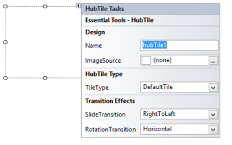

# Getting Started

This section briefly describes how to design a HubTile control in a Windows Forms Application.

* Adding a HubTile Control
* Configuring the HubTile Control

## Adding HubTile Control

* Create a new Windows Forms Application Project in VS IDE through New Project Wizard.
* Drop a HubTile control on the Form.

  
 

## Configuring HubTile Control 

The most commonly used settings of the HubTile control can be configured either by Designer, using the Smart tag or by the Properties window or by code. 

 

  
