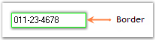

---
layout: post
title: Border Settings | WindowsForms | Syncfusion
description: Border Settings
platform: WindowsForms
control: MaskedEditBox
documentation: ug
--- 
# Border Settings

The border settings of the MaskedEditBox control are discussed in this section.

The wide variety of border options that are available for the MaskedEditBox control are given below.

<table>
<tr>
<th>
MaskedEditBox Properties</th><th>
Description</th></tr>
<tr>
<td>
Border3DStyle</td><td>
Indicates the style of the 3D border. The options included are as follows:{{ '_RaisedOuter,_' | markdownify }}{{ '_SunkenOuter,_' | markdownify }}{{ '_RaisedInner,_' | markdownify }}{{ '_SunkenInner,_' | markdownify }}{{ '_Raised,_' | markdownify }}{{ '_Etched,_' | markdownify }}{{ '_Bump,_ '| markdownify }}{{ '_Sunken,_' | markdownify }}{{ '_Adjust and_' | markdownify }}{{ '_Flat._' | markdownify }}The default value is set to 'Sunken'.</td></tr>
<tr>
<td>
BorderColor</td><td>
Specifies the color of the 2D border.</td></tr>
<tr>
<td>
BorderSides</td><td>
Indicates the border sides of the panel. The options included are as follows:{{ '_Left,_' | markdownify }}{{ '_Top,_' | markdownify }}{{ '_Right,_' | markdownify }}{{ '_Bottom,_' | markdownify }}{{ '_Middle and_' | markdownify }}{{ '_All._' | markdownify }}</td></tr>
<tr>
<td>
BorderStyle</td><td>
Indicates whether the edit control should have a border. The options included are given below:{{ '_FixedSingle,_' | markdownify }}{{ '_Fixed3D and_' | markdownify }}{{ '_None._ '| markdownify }}</td></tr>
</table>

  

this.maskedEditBox1.Border3DStyle = System.Windows.Forms.Border3DStyle.Bump;

this.maskedEditBox1.BorderColor = System.Drawing.Color.Lime;

this.maskedEditBox1.BorderSides = System.Windows.Forms.Border3DSide.All;

this.maskedEditBox1.BorderStyle = System.Windows.Forms.BorderStyle.FixedSingle;



 

Me.maskedEditBox1.Border3DStyle = System.Windows.Forms.Border3DStyle.Bump

Me.maskedEditBox1.BorderColor = System.Drawing.Color.Magenta

Me.maskedEditBox1.BorderSides = System.Windows.Forms.Border3DSide.All

Me.maskedEditBox1.BorderStyle = System.Windows.Forms.BorderStyle.FixedSingle



A Sample which demonstrates the Border Settings of MaskedEditBox control is available in the below sample installation path.

…\_My Documents\Syncfusion\EssentialStudio\Version Number\Windows\Tools.Windows\Samples\Advanced Editor Functions\ActionGroupingDemo_
