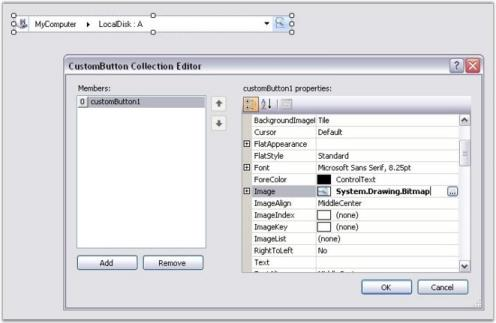

# Drop-Down Selection

NavigationView control provides drop-down selection support.

Each folder that is navigated through, is shown in the Address Bar, separated by a Forward Arrow. Clicking on this arrow, will show a drop-down list, displaying all the folders directly below the one you have opened.

 

## Images Support

NavigationView control provides support for adding images to both Parent Bars and Child Bars. It displays the image of the Selected Bar to the left of the control.



navigationView4.ImageList = this.imageList1;

Rootbar.ImageIndex = 0;

ChildBar1.ImageIndex = 1;

ChildBar2.ImageIndex = 1;





navigationView4.ImageList = Me.imageList1

Rootbar.ImageIndex = 0

ChildBar1.ImageIndex = 1

ChildBar2.ImageIndex = 1



The following illustration shows the NavigationView with Bar Images.

 

## Tracking the Previously Selected Items using DropDown Button

You can trace the previously selected locations by clicking on the Drop-Down button of the NavigationView.

The following illustration shows the NavigationView displaying Previously Selected Items.

 

## Custom Button Collection

You can add one or more custom buttons to the NavigationView through designer and code. This is illustrated below.

* Adding Custom Button Through Designer

  You can add custom buttons to the NavigationView using the CustomButton Collection Editor.

  The following illustration shows the CustomButton Collection Editor.

  

* Adding Custom Button Through Code



Syncfusion.Windows.Forms.Tools.Navigation.CustomButton customButton = new Syncfusion.Windows.Forms.Tools.Navigation.CustomButton();

customButton.Appearance = Syncfusion.Windows.Forms.ButtonAppearance.Office2007;

customButton.Name = "customButton";

Bitmap img = new Bitmap("..//..//Search.gif");

customButton.Image = img;

navigationView4.Controls.Add(customButton);





Dim customButton As Syncfusion.Windows.Forms.Tools.Navigation.CustomButton = New Syncfusion.Windows.Forms.Tools.Navigation.CustomButton()

customButton.Appearance = Syncfusion.Windows.Forms.ButtonAppearance.Office2007

customButton.Name = "customButton"

Dim img As Bitmap = New Bitmap("..//..//Search.gif")

customButton.Image = img

navigationView4.Controls.Add(customButton)



The following illustration shows the NavigationView with Custom Button.

 

