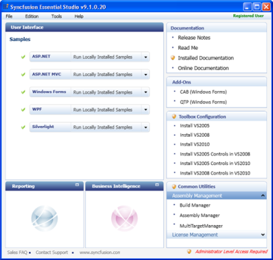
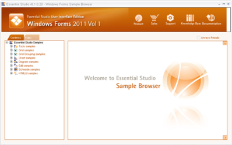
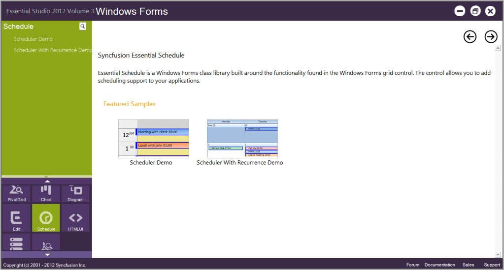

# Installation and Deployment

This section covers information on the install location, samples, licensing, patches update and updation of the recent version of Essential Studio. It comprises the following sub-sections:

## Installation

For step-by-step installation procedure for the installation of Essential Studio, refer to the Installation topic under Installation and Deployment in the Common UG.

See Also

For licensing, patches and information on adding or removing selective components refer the following topics in Common UG under Installation and Deployment.

* Licensing
* Patches
* Add / Remove Components

Sample Installation Location

The Schedule Windows Forms samples are installed in the following location, locally on the disk:

[Local Drive]:\... \Syncfusion\Essential Studio\ [VersionNumber]\ Windows\Schedule.Windows\ Samples\2.0

### Viewing Samples

To view the samples, follow the steps below:

Click Start All Programs  Syncfusion  Essential Studio <version number>  Dashboard.

Essential Studio Enterprise Edition window is displayed.

User Interface Edition panel is displayed by default.

Click the drop-down button of the Windows platform.  The following options are displayed.

* Run Locally Installed Samples – View the locally installed Schedule samples for windows using the sample browser
* Run Online Samples – View the online Schedule samples for windows
* Explore Samples – Locate the Schedule samples on the disk

You can view the samples in the preceding three ways.

1. Click Run, Locally Installed Samples link. Essential Studio User Interface Edition Windows Forms sample browser is displayed.

   

2. Under Contents tab, expand the Schedule samples to view the samples of the control.

   

3. A list of samples will be displayed on the left hand side of the page.  Select any sample and browse through the features.
4. In the right pane, click Run Sample icon to run the selected sample.

### Source Code Location

The source code for Essential Schedule Windows is available at the following default location:

[System Drive]:\Program Files\Syncfusion\Essential Studio\[Version Number]\ Windows\ Schedule.Windows\Src

## Sample and Location

This section covers the location of the installed samples and describes the procedure to run the samples through the sample browser. It also lists the location of source code.

Sample Installation Location

The Schedule Windows Forms samples are installed in the following location:

...\My Documents\Syncfusion\EssentialStudio\Version Number\Windows\Schedule.Windows\Samples\2.0

### Viewing Samples

To view the samples, follow the steps below:

1. Click Start-->All Programs-->Syncfusion-->Essential Studio <version number> -->Dashboard.
2. Essential Studio Enterprise Edition window is displayed.

   

3. In the Dashboard window, click Run Samples for Windows Forms under UI Edition. The UI Windows Form Sample Browser window is displayed.
   > Note: You can view the samples in any of the following three ways:
   >
   > * Run Samples-Click to view the locally installed samples
   > * Online Samples-Click to view online samples
   > * Explore Samples-Explore BI Web samples on disk

   
   
4. Click Schedule from the bottom-left pane. Schedule samples will be displayed.

   

5. Select any sample and browse through the features. 

### Source Code Location

The source code for Essential Schedule Windows is available at the following default location:

[System Drive]:\Program Files\Syncfusion\Essential Studio\[Version Number]\Windows\ Schedule.Windows\Src

## Deployment Requirements

### Toolbox Entries Made

Essential Schedule Windows places the following control into your Visual Studio .NET toolbox from where you can drag the control onto a form and start working with it.

* ScheduleControl

### Dll List

While deploying an application that references a Syncfusion Essential Schedule Windows assembly, the following dependencies must be included in the distribution.

* Syncfusion.Core.dll
* Syncfusion.Shared.Base.dll
* Syncfusion.Shared.Windows.dll
* Syncfusion.Schedule.Base.dll
* Syncfusion.Schedule.Windows.dll
* Syncfusion.Grid.Base.dll
* Syncfusion.Grid.Windows.dll