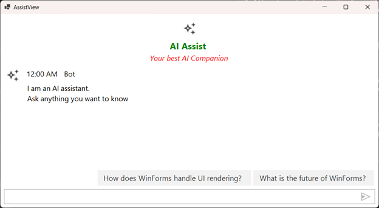
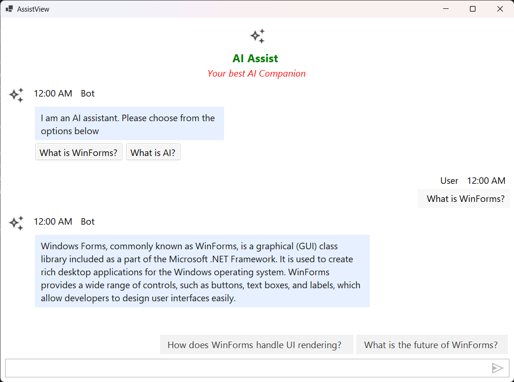
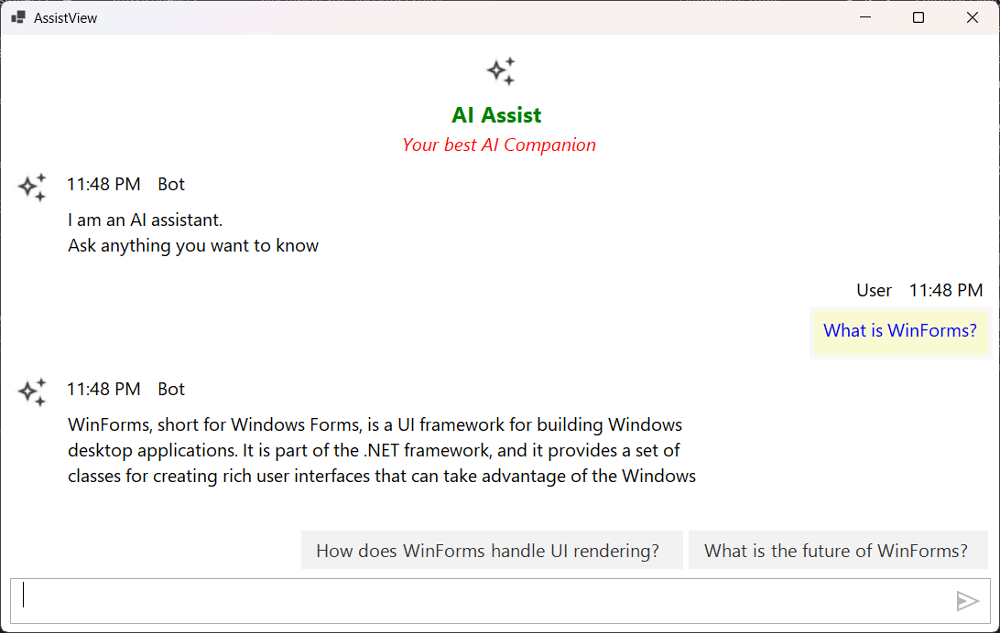
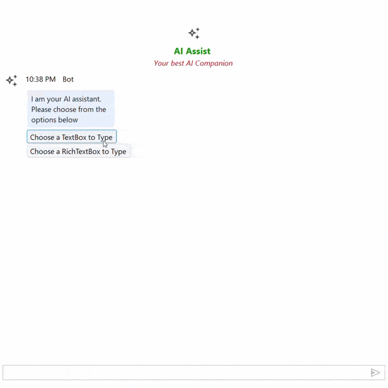
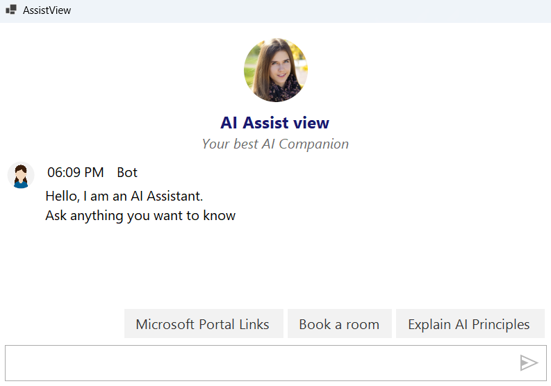
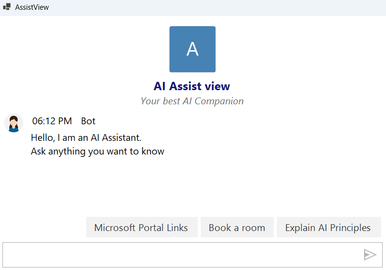
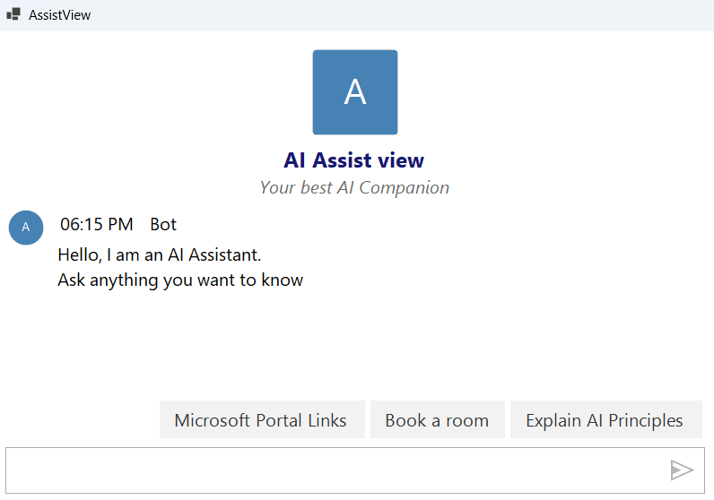
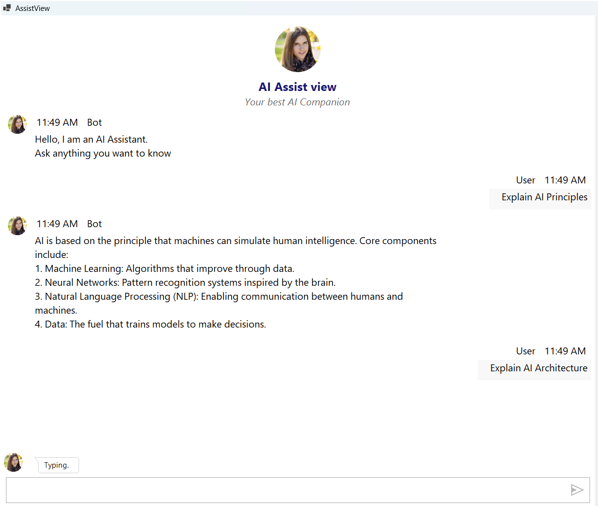

# Customization in Windows Forms AI AssistView

This section explains how to customize the BannerView, and how to create a custom BotView and UserView for the Windows Forms [SfAIAssistView](https://help.syncfusion.com/cr/windowsforms/Syncfusion.WinForms.AIAssistView.SfAIAssistView.html) control.

N> You can also explore our [sample](https://github.com/SyncfusionExamples/How-to-Customize-BannerView-and-Create-a-Custom-BotView-and-UserView-in-AIAssistView) on GitHub, which demonstrates complete customization of the BannerView, the creation of a custom BotView, and a custom UserView within an AssistView.

## Prerequisites

Before proceeding, ensure the following are in place:

- A `ViewModel` class with a `Chats` collection, `ShowTypingIndicator`, `Suggestion`, and `CurrentUser` properties exists. Refer to the [Getting Started](https://help.syncfusion.com/windowsforms/ai-assistview/getting-started) page for setup details.
- A banner image is added to the project at the path referenced in code (for example, `Asset\AI_Assist.png`).
- The following `using` directives are included in your file:




using System;
using System.Collections.Specialized;
using System.ComponentModel;
using System.Drawing;
using System.Windows.Forms;
using Syncfusion.WinForms.Forms;
using Syncfusion.WinForms.AIAssistView;




## Customizing BannerView

You can customize the BannerView and apply it to the AssistView by using the [SetBannerView](https://help.syncfusion.com/cr/windowsforms/Syncfusion.WinForms.AIAssistView.SfAIAssistView.html#Syncfusion_WinForms_AIAssistView_SfAIAssistView_SetBannerView_System_String_System_String_System_Drawing_Image_Syncfusion_WinForms_AIAssistView_BannerStyle_) method.

The following example demonstrates how to customize the Title string, TitleFont, Subtitle string, SubtitleFont, ImageSize, SubtitleColor, and TitleColor of an AssistView banner.





public partial class Form1 : Form
{
    ViewModel viewModel;
    private SfAIAssistView sfAIAssistView1;
    public Form1()
    {
        InitializeComponent();
        viewModel = new ViewModel();

        sfAIAssistView1 = new SfAIAssistView();
        sfAIAssistView1.Location = new System.Drawing.Point(41, 40);
        sfAIAssistView1.Size = new System.Drawing.Size(818, 457);
        sfAIAssistView1.Dock = DockStyle.Fill;
        this.Controls.Add(sfAIAssistView1);

        sfAIAssistView1.DataBindings.Add("Messages", viewModel, "Chats", true, DataSourceUpdateMode.OnPropertyChanged);
        sfAIAssistView1.DataBindings.Add("ShowTypingIndicator", viewModel, "ShowTypingIndicator", true, DataSourceUpdateMode.OnPropertyChanged);
        sfAIAssistView1.DataBindings.Add("Suggestions", viewModel, "Suggestion", true, DataSourceUpdateMode.OnPropertyChanged);
        viewModel.CurrentUser = sfAIAssistView1.User;

        BannerTemplate();

        sfAIAssistView1.TypingIndicator.Author = new Author() { Name = "Bot", AvatarImage = Image.FromFile(@"Asset\AI_Assist.png") };
        sfAIAssistView1.TypingIndicator.DisplayText = "Typing";
    }

    private void BannerTemplate()
    {

        BannerStyle customStyle = new BannerStyle
        {
            TitleFont = new Font("Segoe UI", 14F, System.Drawing.FontStyle.Bold),
            SubTitleFont = new Font("Segoe UI", 12F, System.Drawing.FontStyle.Italic),
            ImageSize = AvatarSize.Medium,
            SubTitleColor = Color.Red,
            TitleColor = Color.Green,
        };

        string title = "AI Assist ";
        string subTitle = "Your best AI Companion";
        sfAIAssistView1.SetBannerView(title, subTitle, Image.FromFile(@"Asset\AI_Assist.png"), customStyle);
    }
}





## Creating a Custom BotView

You can create and set a custom BotView and apply it to the AssistView by using the [SetBotView](https://help.syncfusion.com/cr/windowsforms/Syncfusion.WinForms.AIAssistView.SfAIAssistView.html#Syncfusion_WinForms_AIAssistView_SfAIAssistView_SetBotView_System_Object_System_Windows_Forms_Control_) method.

The following example demonstrates how to create and set a custom BotView in the AssistView.





public partial class Form1 : Form
{
    public Form1()
    {
        viewModel.Chats.CollectionChanged += Chats_CollectionChanged;                                                                                                                              

        // To Apply custom views to any existing default messages
        foreach (var item in viewModel.Chats)
        {
            if (item is TextMessage tm)
            {           
                sfAIAssistView1.SetBotView(tm, CreateBotView(tm));
            }
        }
    }

    private void Chats_CollectionChanged(object sender, NotifyCollectionChangedEventArgs e)
    {
        if (e.Action != NotifyCollectionChangedAction.Add) return;

        foreach (var newItem in e.NewItems ?? new object[0])
        {
            if (newItem is TextMessage message)
            {
                    sfAIAssistView1.SetBotView(message, CreateBotView(message));
            }
        }
    }

    private Control CreateBotView(TextMessage message)
    {
        string text = string.IsNullOrEmpty(message?.Text) ? "Hello from the bot." : message.Text;

        var container = new FlowLayoutPanel
        {
            AutoSize = true,

            WrapContents = true,
            Padding = new Padding(6),
            BackColor = Color.Transparent
        };

        var lbl = new Label
        {
            Text = text,
            AutoSize = true,
            BackColor = Color.FromArgb(230, 240, 255),
            ForeColor = Color.FromArgb(24, 24, 24),
            Padding = new Padding(8),
            Margin = new Padding(0, 0, 0, 6)
        };

        container.Controls.Add(lbl);

        // Only show buttons for the initial prompt message
        const string prompt = "I am an AI assistant. Please choose from the options below";
        if (string.Equals(text?.Trim(), prompt, StringComparison.OrdinalIgnoreCase))
        {
            var btnRow = new FlowLayoutPanel
            {
                AutoSize = true,
                WrapContents = true,
                Margin = new Padding(0)
            };

            string[] choices = new[] { "What is WinForms?", "What is AI?" };
            foreach (var c in choices)
            {
                var btn = new Button
                {
                    Text = c,
                    AutoSize = true,
                    Tag = c,
                    BackColor = Color.WhiteSmoke,
                    Margin = new Padding(0, 0, 6, 0)
                };

                btn.Click += (s, e) =>
                {
                    try
                    {
                        var choice = (string)((Button)s).Tag;
                        viewModel?.Chats.Add(new TextMessage
                        {
                            Author = viewModel.CurrentUser,
                            Text = choice
                        });
                    }
                    catch { }
                };

                btnRow.Controls.Add(btn);
            }

            container.Controls.Add(btnRow);
        }

        return container;
    }
}





## Creating a Custom UserView

You can create and set a custom UserView and apply it to the AssistView by calling the [SetUserView](https://help.syncfusion.com/cr/windowsforms/Syncfusion.WinForms.AIAssistView.SfAIAssistView.html#Syncfusion_WinForms_AIAssistView_SfAIAssistView_SetUserView_System_Object_System_Windows_Forms_Control_) method.

The following example demonstrates how to create and set a custom UserView in the AssistView.





public partial class Form1 : Form
{
    public Form1()
    {
        InitializeComponent();

        viewModel.Chats.CollectionChanged += Chats_CollectionChanged;
 
    }

    private void Chats_CollectionChanged(object sender, NotifyCollectionChangedEventArgs e)
    {
        if (e.Action != NotifyCollectionChangedAction.Add) return;

        foreach (var newItem in e.NewItems ?? new object[0])
        {
            if (newItem is TextMessage message)
            {
                sfAIAssistView1.SetUserView(message, CreateUserView(message));
            }
        }
    }
    private Control CreateUserView(TextMessage message)
    {
        string content = message?.Text ?? string.Empty;

        var lbl = new Label 
        {
            Text = content,
            AutoSize = true,
            MaximumSize = new System.Drawing.Size(520, 0),
            BackColor = Color.LightGoldenrodYellow,
            ForeColor = Color.Blue,
            Padding = new Padding(5),
            Margin = new Padding(0, 0, 0, 6)
        };

        return lbl;
    }
}





## AvatarStyle Customization in Windows Forms AI AssistView

The SfAIAssistView control uses avatars to visually represent participants in a conversation — the bot authored by the application, the user sending prompts, and the assistant speaking through the banner. The `AvatarStyle` class centralizes every visual aspect of these avatars so you can mix images, initials, themed character glyphs, and custom shapes without changing layout code. Combined with the [`AvatarSize`](https://help.syncfusion.com/cr/windowsforms/Syncfusion.WinForms.AIAssistView.AvatarSize.html), [`AvatarShape`](https://help.syncfusion.com/cr/windowsforms/Syncfusion.WinForms.AIAssistView.AvatarShape.html), and [`AvatarCharacterType`](https://help.syncfusion.com/cr/windowsforms/Syncfusion.WinForms.AIAssistView.AvatarCharacterType.html) enums, the same API covers the hero banner at the top of the chat, the first bot greeting, and every message exchanged during the conversation.

### Customization Using AvatarStyle

The [AvatarStyle](https://help.syncfusion.com/cr/windowsforms/Syncfusion.WinForms.AIAssistView.AvatarStyle.html) class is a strongly typed container for every avatar appearance setting. Apply a single instance to the banner, an [Author](https://help.syncfusion.com/cr/windowsforms/Syncfusion.WinForms.AIAssistView.Author.html) belonging to a chat message, or the [TypingIndicator](https://help.syncfusion.com/cr/windowsforms/Syncfusion.WinForms.AIAssistView.SfAIAssistView.html#Syncfusion_WinForms_AIAssistView_SfAIAssistView_TypingIndicator) — the rest of the control observes the same property contract.

| Property | Type | Description |
|----------|------|-------------|
| [AvatarContent](https://help.syncfusion.com/cr/windowsforms/Syncfusion.WinForms.AIAssistView.AvatarStyle.html#Syncfusion_WinForms_AIAssistView_AvatarStyle_AvatarContent) | `AvatarContentType` | Selects the rendering source — custom image, theme-driven default, initials, or a themed character glyph. |
| [AvatarImage](https://help.syncfusion.com/cr/windowsforms/Syncfusion.WinForms.AIAssistView.AvatarStyle.html#Syncfusion_WinForms_AIAssistView_AvatarStyle_AvatarImage) | `Image` | The image rendered when `AvatarContent` is `AvatarContentType.CustomImage`. |
| [AvatarName](https://help.syncfusion.com/cr/windowsforms/Syncfusion.WinForms.AIAssistView.AvatarStyle.html#Syncfusion_WinForms_AIAssistView_AvatarStyle_AvatarName) | `string` | Display name used to derive initials when `AvatarContent` is `AvatarContentType.Initials`. |
| [AvatarCharacterType](https://help.syncfusion.com/cr/windowsforms/Syncfusion.WinForms.AIAssistView.AvatarStyle.html#Syncfusion_WinForms_AIAssistView_AvatarStyle_AvatarCharacterType) | `AvatarCharacterType` | Themed character glyph rendered when `AvatarContent` is `AvatarContentType.AvatarCharacter`. |
| [AvatarInitialsType](https://help.syncfusion.com/cr/windowsforms/Syncfusion.WinForms.AIAssistView.AvatarStyle.html#Syncfusion_WinForms_AIAssistView_AvatarStyle_AvatarInitialsType) | `AvatarInitialsType` | Controls whether the avatar shows one or two characters when `AvatarContent` is `AvatarContentType.Initials`. |
| [AvatarBackColor](https://help.syncfusion.com/cr/windowsforms/Syncfusion.WinForms.AIAssistView.AvatarStyle.html#Syncfusion_WinForms_AIAssistView_AvatarStyle_AvatarBackColor) | `Color` | Background fill used when rendering initials or themed character glyphs. |
| [AvatarForeColor](https://help.syncfusion.com/cr/windowsforms/Syncfusion.WinForms.AIAssistView.AvatarStyle.html#Syncfusion_WinForms_AIAssistView_AvatarStyle_AvatarForeColor) | `Color` | Color used to draw the initials or themed character glyph on top of the background. |
| [AvatarShape](https://help.syncfusion.com/cr/windowsforms/Syncfusion.WinForms.AIAssistView.AvatarStyle.html#Syncfusion_WinForms_AIAssistView_AvatarStyle_AvatarShape) | `AvatarShape` | The geometric shape of the avatar (Circle, Square, or Custom with a configurable corner radius). |
| [CornerRadius](https://help.syncfusion.com/cr/windowsforms/Syncfusion.WinForms.AIAssistView.AvatarStyle.html#Syncfusion_WinForms_AIAssistView_AvatarStyle_CornerRadius) | `int` | Corner radius in pixels applied when `AvatarShape` is `AvatarShape.Custom`. Ignored for the preset shapes. |
| [AvatarSize](https://help.syncfusion.com/cr/windowsforms/Syncfusion.WinForms.AIAssistView.AvatarStyle.html#Syncfusion_WinForms_AIAssistView_AvatarStyle_AvatarSize) | `AvatarSize` | The relative size bucket of the avatar (ExtraSmall, Small, Medium, Large, ExtraLarge). |

#### AvatarContentType Enum

| Member | Description |
|--------|-------------|
| `Default` | Resolves the rendering source based on what is supplied — falls back to the themed character glyph when no image or name is set. |
| `CustomImage` | Renders `AvatarImage` inside the avatar shape. |
| `Initials` | Renders characters derived from `AvatarName` using `AvatarInitialsType`. |
| `AvatarCharacter` | Renders a theme-driven character glyph defined by `AvatarCharacterType`. |

#### AvatarCharacterType Enum

AvatarCharacterType is an enumeration that defines themed character glyphs, available in a sequential range from `Avatar1` through `Avatar25`. Each member represents a distinct avatar style, with `Avatar1` serving as the default option and subsequent values (`Avatar2` … `Avatar25`) providing alternative glyph variations.

#### AvatarInitialsType Enum

| Member | Description |
|--------|-------------|
| `SingleCharacter` | Renders the first letter of `AvatarName` (default — useful for short names like "Bot"). |
| `TwoCharacter` | Renders the first two letters (useful for full names such as "Finley James" → "FJ"). |

#### AvatarShape Enum

| Member | Description |
|--------|-------------|
| `Circle` | Circular avatar (default). |
| `Square` | Square avatar (sharp corners). |
| `Custom` | Use this shape together with [`CornerRadius`](https://help.syncfusion.com/cr/windowsforms/Syncfusion.WinForms.AIAssistView.AvatarStyle.html#Syncfusion_WinForms_AIAssistView_AvatarStyle_CornerRadius) to control the corner radius in pixels. |

#### AvatarSize Enum

| Member | Description |
|--------|-------------|
| `ExtraSmall` | Tiniest size bucket (18 px), typically for inline/compact rows. |
| `Small` | Compact avatar (24 px). |
| `Medium` | Standard message avatar (32 px). |
| `Large` | Used in prominent headers. |
| `ExtraLarge` | Hero-size avatar reserved for the banner. |

### Customizing the Banner Avatar

The banner at the top of the chat is the very first visual cue your users receive. Configure it with [BannerStyle](https://help.syncfusion.com/cr/windowsforms/Syncfusion.WinForms.AIAssistView.BannerStyle.html) (which carries an embedded `ImageSize` and inset for the avatar) and [SetBannerView](https://help.syncfusion.com/cr/windowsforms/Syncfusion.WinForms.AIAssistView.SfAIAssistView.html#Syncfusion_WinForms_AIAssistView_SfAIAssistView_SetBannerView_System_String_System_String_System_Drawing_Image_Syncfusion_WinForms_AIAssistView_BannerStyle_).

The banner can render either an actual `Image` (passed as the third argument to `SetBannerView`) or an `AvatarStyle` driven placeholder configured on `BannerStyle.AvatarStyle`. Pair `ImageSize` with the corresponding `AvatarSize` to keep the hero aligned with the chat avatars.

The `BannerStyle.AvatarStyle` property accepts a fully configured [`AvatarStyle`](https://help.syncfusion.com/cr/windowsforms/Syncfusion.WinForms.AIAssistView.AvatarStyle.html) instance so you can drive the banner avatar together with title/subtitle colors and fonts from one place. The control forwards the same `AvatarShape`, `AvatarSize`, `CornerRadius`, `AvatarContent`, and `AvatarBackColor` / `AvatarForeColor` settings used on chat avatars so the hero stays visually consistent.





public partial class Form1 : Form
{
    ViewModel viewModel;

    public Form1()
    {
        private string bannerTitle = "AI Assist view";
        private string bannerSubTitle = "Your best AI Companion";
        InitializeComponent();
        SetupBanner();
    }

    private void SetupBanner()
    {
        BannerStyle bannerStyle = new BannerStyle
        {
            TitleFont = new Font("Segoe UI", 14F, FontStyle.Bold),
            SubTitleFont = new Font("Segoe UI", 12F, FontStyle.Italic),
            TitleColor = Color.MidnightBlue,
            SubTitleColor = Color.DimGray,
            ImageSize = AvatarSize.ExtraLarge,

            // Drive the banner avatar from an AvatarStyle instance.
            AvatarStyle = new AvatarStyle
            {
                AvatarContent = AvatarContentType.CustomImage,
                AvatarImage = Image.FromFile(@"Ai Assistance\Ai Assistance@3x.png"),
                AvatarShape = AvatarShape.Circle,
            },
            
            Title = bannerTitle,
            SubTitle = bannerSubTitle
        };

        sfaiAssistView1.SetBannerView(bannerStyle);

        // You can also set the banner view by passing title, subtitle, icon, and optional style.
        //sfaiAssistView1.SetBannerView("AI Assist view", "Your best AI Companion", null, bannerStyle);
    }
}





### Banner Avatar with Initials Instead of Image

If you prefer a flat, modern look, drop the image and let `BannerStyle.AvatarStyle` render initials. Configure `AvatarContent = AvatarContentType.Initials`, a name like `"AI"`, and `AvatarInitialsType.SingleCharacter`. When neither an image nor initials are configured, the banner falls back to `AvatarContentType.Default`, which resolves to the themed character glyph defined by `AvatarCharacterType`.





private void SetupBannerWithInitials()
{
    BannerStyle bannerStyle = new BannerStyle
    {
        TitleFont = new Font("Segoe UI", 14F, FontStyle.Bold),
        SubTitleFont = new Font("Segoe UI", 12F, FontStyle.Italic),
        TitleColor = Color.MidnightBlue,
        SubTitleColor = Color.DimGray,
        ImageSize = AvatarSize.ExtraLarge,

        // Initials-driven banner avatar driven entirely by AvatarStyle.
        AvatarStyle = new AvatarStyle
        {
            AvatarContent = AvatarContentType.Initials,
            AvatarName = "AI",
            AvatarInitialsType = AvatarInitialsType.SingleCharacter,   // renders "A"
            AvatarShape = AvatarShape.Square,
            AvatarBackColor = Color.SteelBlue,
            AvatarForeColor = Color.White,
        },
    };

    // Pass null for the image so the BannerStyle.AvatarStyle is the single source of truth.
    sfaiAssistView1.SetBannerView("AI Assist view", "Your best AI Companion", null, bannerStyle);
}





### Customizing the Initial Bot Message Avatar

The greeting your assistant shows on first launch is bound to the first `TextMessage` in the `Chats` collection. Set its [Author](https://help.syncfusion.com/cr/windowsforms/Syncfusion.WinForms.AIAssistView.TextMessage.html#Syncfusion_WinForms_AIAssistView_TextMessage_Author) with an `AvatarStyle` to control how the bot appears before any user interaction.





private void AddInitialBotMessage()
{
    string initialMessage = "Hello, I am an AI Assistant. \nAsk anything you want to know";

    var initialBotMessage = new TextMessage
    {
        Author = new Author
        {
            Name = "Bot",
            AvatarStyle = new AvatarStyle
            {
                AvatarContent = AvatarContentType.Initials,
                AvatarName = "AI",
                AvatarInitialsType = AvatarInitialsType.SingleCharacter,
                AvatarBackColor = Color.SteelBlue,
                AvatarForeColor = Color.White,
                AvatarShape = AvatarShape.Circle,
            }
        },
        DateTime = DateTime.Now,
        Text = initialMessage,
    };

    viewModel.Chats.Add(initialBotMessage);
}





### Customizing the Chat Collection Avatars

Every message added to the `Chats` collection is paired with an [Author](https://help.syncfusion.com/cr/windowsforms/Syncfusion.WinForms.AIAssistView.Author.html) that owns its own `AvatarStyle`. Configuring avatars on the author means the same identity keeps the same appearance across user prompts, bot replies, and typing indicators.

The snippet below shows a typical chat-row avatar configuration built entirely from `AvatarStyle` — image content for the bot, a custom `CornerRadius` shape, and consistent colors/fonts so every message lines up with the banner. Reuse the same `AvatarStyle` instance for both the typing indicator and the bot replies.





private void SetupChatCollectionAvatars()
{
    // Bot identity — image avatar driven by AvatarStyle.CustomImage.
    AvatarStyle botAvatarStyle = new AvatarStyle
    {
        AvatarContent = AvatarContentType.CustomImage,
        AvatarImage = Image.FromFile("Finley.png"),
        AvatarShape = AvatarShape.Circle,
    };

    Author botAuthor = new Author
    {
        Name = "Bot",
        AvatarStyle = botAvatarStyle,
    };

    // Reuse the same bot avatar for the typing indicator.
    sfaiAssistView1.TypingIndicator.Author = botAuthor;
    sfaiAssistView1.TypingIndicator.DisplayText = "Typing";

    // Wire two canned messages to verify the avatar pipeline end-to-end.
    viewModel.Chats.Add(new TextMessage
    {
        Author = botAuthor,
        DateTime = DateTime.Now,
        Text = "Hello, I am an AI Assistant. \nAsk anything you want to know",
        Type = MessageType.Bot,
    });
}





### Avatar Shape and Corner Radius

`AvatarShape` exposes two preset shapes — `Circle` and `Square` — plus the `Custom` shape. Use `Custom` together with `CornerRadius` to control the rounding in pixels. The shape and border follow the same code path in every chat row, so setting them once on the `AvatarStyle` propagates to every message from the author.
wo preset shapes — `Circle` and `




AvatarStyle style = new AvatarStyle
{
    AvatarName = "Finley James",
    AvatarInitialsType = AvatarInitialsType.TwoCharacter,   // renders "FJ"
    AvatarBackColor = Color.Teal,
    AvatarForeColor = Color.White,
    AvatarShape = AvatarShape.Custom,
    CornerRadius = 10,                                     // pixels
};

Author bot = new Author { Name = "Finley James", AvatarStyle = style };





### Combining Avatars with the Typing Indicator

The typing indicator shows while a reply is in flight — reuse the bot's `AvatarStyle` so the dots appear under the same avatar your replies use later. The control exposes a [TypingIndicator](https://help.syncfusion.com/cr/windowsforms/Syncfusion.WinForms.AIAssistView.SfAIAssistView.html#Syncfusion_WinForms_AIAssistView_SfAIAssistView_TypingIndicator) object whose [Author](https://help.syncfusion.com/cr/windowsforms/Syncfusion.WinForms.AIAssistView.TypingIndicator.html#Syncfusion_WinForms_AIAssistView_TypingIndicator_Author) accepts a fully styled avatar.





sfaiAssistView1.TypingIndicator.Author = new Author()
{
    Name = "Bot",
    AvatarStyle = new AvatarStyle
    {
        AvatarContent = AvatarContentType.CustomImage,
        AvatarImage = Image.FromFile("Finley.png"),
        AvatarShape = AvatarShape.Circle,
    }
};
sfaiAssistView1.TypingIndicator.DisplayText = "Typing";





### Avatar Style Customization Example  

The following sample wires up all three surfaces — the banner avatar, the initial bot message avatar, and every chat message's avatar — using the same `AvatarStyle` instances so the assistant stays visually consistent from first launch to the last message of the day.





using Syncfusion.WinForms.AIAssistView;
using System.Collections.ObjectModel;
using System.Drawing;
using System.Windows.Forms;

namespace AIAssistView_Sample_WF
{
    public partial class Form1 : Form
    {
        private readonly ViewModel viewModel = new ViewModel();
        private readonly Author botAuthor;

        public Form1()
        {
            InitializeComponent();
            botAuthor = CreateBotAuthor();

            sfaiAssistView1.TypingIndicator.Author = botAuthor;

            // Bind the chat collection
            sfaiAssistView1.DataBindings.Add("Messages", viewModel, "Chats",
                true, DataSourceUpdateMode.OnPropertyChanged);

            // Apply the helper intents that target AvatarStyle usage
            BannerTemplate();
            ConfigureInitialBotMessage();
        }

        private static Author CreateBotAuthor()
        {
            return new Author
            {
                Name = "Bot",
                AvatarStyle = new AvatarStyle
                {
                    AvatarContent = AvatarContentType.Initials,
                    AvatarName = "Bot",
                    AvatarInitialsType = AvatarInitialsType.SingleCharacter,
                    AvatarBackColor = Color.SteelBlue,
                    AvatarForeColor = Color.White,
                    AvatarShape = AvatarShape.Circle,
                }
            };
        }

        private void BannerTemplate()
        {
            BannerStyle bannerStyle = new BannerStyle
            {
                TitleFont = new Font("Segoe UI", 14F, FontStyle.Bold),
                SubTitleFont = new Font("Segoe UI", 12F, FontStyle.Italic),
                TitleColor = Color.MidnightBlue,
                SubTitleColor = Color.DimGray,
                ImageSize = AvatarSize.ExtraLarge,

                // Drive the banner avatar from an AvatarStyle instance.
                AvatarStyle = new AvatarStyle
                {
                    AvatarContent = AvatarContentType.CustomImage,
                    AvatarImage = Image.FromFile(@"Ai Assistance\Ai Assistance@3x.png"),
                    AvatarShape = AvatarShape.Circle,
                }
            };

            sfaiAssistView1.SetBannerView("AI Assist view", "Your best AI Companion", null, bannerStyle);
        }

        private void ConfigureInitialBotMessage()
        {
            // Use the banner avatar / themed glyph for the very first message.
            // For consistency with the chat row avatars, set AvatarStyle explicitly here:
            var initialBotMessage = new TextMessage
            {
                Author = botAuthor,
                DateTime = DateTime.Now,
                Text = "Hello, I am an AI Assistant. \nAsk anything you want to know",
            };

            if (viewModel.Chats.Count == 0)
            {
                viewModel.Chats.Add(initialBotMessage);
            }
        }
    }
}





N> When `AvatarContent` is set to `AvatarContentType.CustomImage` and `AvatarImage` is `null`, the control falls back to `AvatarContentType.Default`, which renders the themed character glyph supplied by `AvatarCharacterType` and the active skin.

N> Use the same `AvatarStyle` instance on every `Author` who should share the same look. Creating a new instance for each message forces property change notifications that can refresh the layout unnecessarily.

N> `CornerRadius` only takes effect when `AvatarShape = AvatarShape.Custom`. The `Circle` and `Square` preset shapes ignore it.