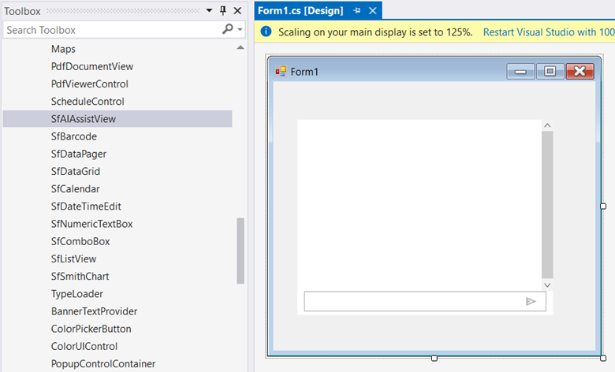
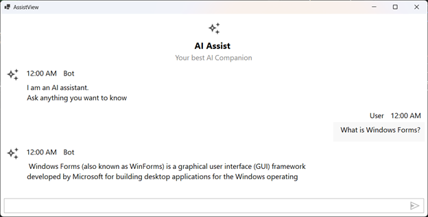

# Getting Started with Windows Forms AI AssistView

This section explains the steps required to add the Windows Forms [SfAIAssistView](https://help.syncfusion.com/cr/windowsforms/Syncfusion.WinForms.AIAssistView.SfAIAssistView.html) control with its basic features.

## Assembly Deployment

Refer [control dependencies](https://help.syncfusion.com/windowsforms/control-dependencies#sfaiassistview) section to get the list of assemblies or [NuGet package](https://help.syncfusion.com/windowsforms/installation/install-nuget-packages) needs to be added as reference to use the SfAIAssistView control in any application.

## Creating Application with SfAIAssistView

In this walk through, users will create WinForms application that contains SfAIAssistView control.

### Creating the Project

Create new Windows Forms Project in Visual Studio to display SfAIAssistView.

### Adding Control via Designer

Windows Forms AI AssistView (SfAIAssistView) control can be added to the application by dragging it from Toolbox and dropping it in Designer. The required assembly references will be added automatically.

### Adding Control in Code

In order to add control manually, do the below steps,

1. Add the required [assembly references](https://help.syncfusion.com/windowsforms/control-dependencies#sfaiassistview) to the project.

2. Create the SfAIAssistView control instance and add it to the Form.




using Syncfusion.WinForms.AIAssistView;

namespace WindowsFormsApplication1
{
    public partial class Form1 : Form
    {
        public Form1()
        {
            InitializeComponent();
            //Creating an instance of the AIAssistView control
            SfAIAssistView sfAIAssistView1 = new SfAIAssistView();
            sfAIAssistView1.Location = new System.Drawing.Point(41, 40);
            sfAIAssistView1.Size = new System.Drawing.Size(818,457);      
            sfAIAssistView1.Dock= DockStyle.Fill;
            this.Controls.Add(sfAIAssistView1);
        }
    }
}




### Creating ViewModel for AI AssistView

Create a simple chat collection as shown in the following code example in a new class file. Save it as ViewModel.cs file.



 
public class ViewModel : INotifyPropertyChanged
{
     private ObservableCollection<object> chats;
     private Author currentUser;
     public ViewModel()
     {
         this.Chats = new ObservableCollection<object>();          
         this.CurrentUser = new Author { Name="John"};
         this.GenerateMessages();
     }

     private async void GenerateMessages()
     {
         this.Chats.Add( new TextMessage { Author = CurrentUser, Text = "What is Windows Forms?" } );        
         await Task.Delay(1000);
         this.Chats.Add( new TextMessage { Author = new Author { Name = "Bot" }, Text = " Windows Forms (also known as WinForms) is a graphical user interface (GUI) framework developed by Microsoft for building desktop applications for the Windows operating system " });
     }

     public ObservableCollection<object> Chats
     {
         get
         {
             return this.chats;
         }
         set
         {
             this.chats = value;
             RaisePropertyChanged("Chats");
         }
     }

     public Author CurrentUser
     {
         get
         {
             return this.currentUser;
         }
         set
         {
             this.currentUser = value;
             RaisePropertyChanged("CurrentUser");
         }
     }

     public void RaisePropertyChanged(string propName)
     {
         if (PropertyChanged != null)
         {
             PropertyChanged(this, new PropertyChangedEventArgs(propName));
         }
     }

     public event PropertyChangedEventHandler PropertyChanged;
}




### Bind Messages

Create a ViewModel instance in the form. Bind the control's Messages property to the view-model property.



 

public partial class Form1 : Form
{
    ViewModel viewModel;
    public Form1()
    {
        InitializeComponent();
        viewModel = new ViewModel();

        SfAIAssistView sfAIAssistView1 = new SfAIAssistView();
        sfAIAssistView1.Location = new System.Drawing.Point(41, 40);
        sfAIAssistView1.Size = new System.Drawing.Size(818, 457);  
        sfAIAssistView1.Dock= DockStyle.Fill;
        this.Controls.Add(sfAIAssistView1);

        sfAIAssistView1.DataBindings.Add("Messages", viewModel, "Chats", true, DataSourceUpdateMode.OnPropertyChanged);
    }
}





