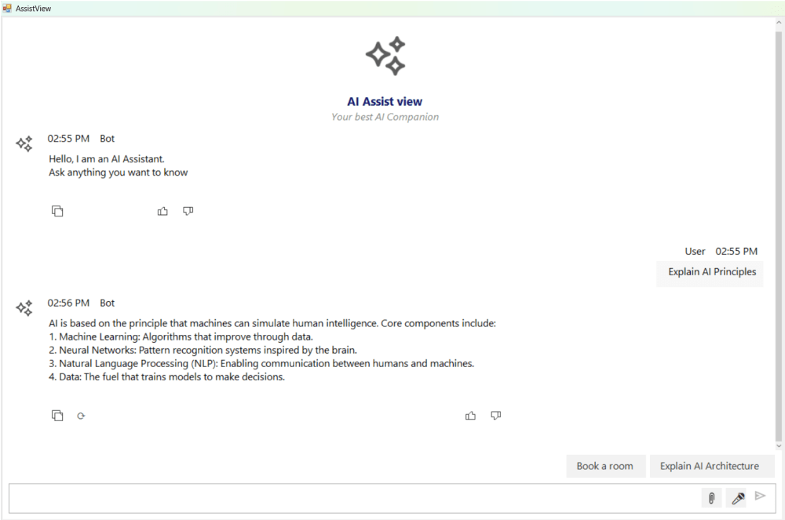

# Input Toolbar in Windows Forms AI AssistView

The SfAIAssistView control includes an Input Toolbar feature that exposes quick-action buttons beside the prompt editor. These buttons let users attach files, upload images, record audio, and invoke any custom action before a prompt is sent. The toolbar pairs naturally with the Attachments and Toast Notification features so that the selected media, status, and feedback appear in the same input area.

## Enabling the IsInputToolbarVisible

By default, the Input Toolbar is not displayed. To enable it, set the [IsInputToolbarVisible](https://help.syncfusion.com/cr/windowsforms/Syncfusion.WinForms.AIAssistView.SfAIAssistView.html#Syncfusion_WinForms_AIAssistView_SfAIAssistView_IsInputToolbarVisible) property to **true**.





public partial class Form1 : Form
{
    ViewModel viewModel;

    public Form1()
    {
        InitializeComponent();
        viewModel = new ViewModel();

        SfAIAssistView sfaiAssistView1 = new SfAIAssistView();
        sfaiAssistView1.Location = new System.Drawing.Point(41, 40);
        sfaiAssistView1.Size = new System.Drawing.Size(818, 457);
        sfaiAssistView1.Dock = DockStyle.Fill;
        this.Controls.Add(sfaiAssistView1);

        sfaiAssistView1.DataBindings.Add("Messages", viewModel, "Chats", true, DataSourceUpdateMode.OnPropertyChanged);
        sfaiAssistView1.DataBindings.Add("ShowTypingIndicator", viewModel, "ShowTypingIndicator", true, DataSourceUpdateMode.OnPropertyChanged);

        // Enable the Input Toolbar
        sfaiAssistView1.IsInputToolbarVisible = true;
    }
}





The toolbar is rendered next to the prompt editor when [IsInputToolbarVisible](https://help.syncfusion.com/cr/windowsforms/Syncfusion.WinForms.AIAssistView.SfAIAssistView.html#Syncfusion_WinForms_AIAssistView_SfAIAssistView_IsInputToolbarVisible) is true.

## Input Toolbar Items

The [InputToolbarItems](https://help.syncfusion.com/cr/windowsforms/Syncfusion.WinForms.AIAssistView.SfAIAssistView.html#Syncfusion_WinForms_AIAssistView_SfAIAssistView_InputToolbarItems) collection defines the buttons that appear on the toolbar. Each [InputToolbarItem](https://help.syncfusion.com/cr/windowsforms/Syncfusion.WinForms.AIAssistView.InputToolbarItem.html) supports the following properties:

| Property | Description |
|----------|-------------|
| Name | Unique identifier used to recognize the item in the [InputToolbarItemClicked](https://help.syncfusion.com/cr/windowsforms/Syncfusion.WinForms.AIAssistView.SfAIAssistView.html#Syncfusion_WinForms_AIAssistView_SfAIAssistView_InputToolbarItemClicked) event handler. |
| Text | Glyph or short text rendered inside the button. Emoji shortcodes such as 📎 or Unicode escape sequences (`\U0001F4CE`) are supported. |
| ToolTip | Tooltip text shown when the user hovers over the button. |
| IsVisible | Controls whether the button is rendered on the toolbar. |

### Adding Toolbar Items





using Syncfusion.WinForms.AIAssistView;
using System.Collections.ObjectModel;

sfaiAssistView1.InputToolbarItems = new ObservableCollection<InputToolbarItem>
{
    new InputToolbarItem
    {
        Name = "Attach",
        ToolTip = "Attach File",
        Text = "\U0001F4CE",
        IsVisible = true
    },
    new InputToolbarItem
    {
        Name = "ImageUpload",
        ToolTip = "Upload Image",
        Text = "\U0001F4CA",
        IsVisible = true
    },
    new InputToolbarItem
    {
        Name = "VoiceInput",
        ToolTip = "Record Audio",
        Text = "\U0001F3A4",
        IsVisible = true
    }
};





### Input Toolbar Item Click Event

The SfAIAssistView control exposes the [InputToolbarItemClicked](https://help.syncfusion.com/cr/windowsforms/Syncfusion.WinForms.AIAssistView.SfAIAssistView.html#Syncfusion_WinForms_AIAssistView_SfAIAssistView_InputToolbarItemClicked) event, which is raised whenever a toolbar button is tapped. The [InputToolbarItemClickedEventArgs](https://help.syncfusion.com/cr/windowsforms/Syncfusion.WinForms.AIAssistView.InputToolbarItemClickedEventArgs.html).ToolbarItem property gives access to the item that was clicked:





sfaiAssistView1.InputToolbarItemClicked += OnInputToolbarItemClicked;

private void OnInputToolbarItemClicked(object sender, InputToolbarItemClickedEventArgs args)
{
    var item = args.ToolbarItem;

    switch (item.Name)
    {
        case "Attach":
            HandleAttachFile();
            break;

        case "ImageUpload":
            DisplayActionPopupOnToolbarClick();
            break;

        case "VoiceInput":
            //HandleRecordAudio();
            break;
    }
}





## Action Buttons

When a toolbar item should expose a popup of secondary actions, define an [ActionButtons](https://help.syncfusion.com/cr/windowsforms/Syncfusion.WinForms.AIAssistView.SfAIAssistView.html#Syncfusion_WinForms_AIAssistView_SfAIAssistView_ActionButtons) collection on the input area. Each [ActionButton](https://help.syncfusion.com/cr/windowsforms/Syncfusion.WinForms.AIAssistView.ActionButton.html) provides a Name and Text used for display and identification.





sfaiAssistView1.ActionButtons = new ObservableCollection<ActionButton>
{
    new ActionButton
    {
        Name = "UploadFile",
        Text = "📤 Upload File",
    },
    new ActionButton
    {
        Name = "SearchWeb",
        Text = "🌐 Search Web",
    },
    new ActionButton
    {
        Name = "UploadVideo",
        Text = "🎥 Upload Video",
    }
};





### Action Button Click Event

The [ActionButtonClicked](https://help.syncfusion.com/cr/windowsforms/Syncfusion.WinForms.AIAssistView.SfAIAssistView.html#Syncfusion_WinForms_AIAssistView_SfAIAssistView_ActionButtonClicked) event is raised when the user picks an option from the popup. Use the [ActionButtonClickedEventArgs](https://help.syncfusion.com/cr/windowsforms/Syncfusion.WinForms.AIAssistView.ActionButtonClickedEventArgs.html).ActionButton.Name property to dispatch the action:





sfaiAssistView1.ActionButtonClicked += OnActionButtonClicked;

private void OnActionButtonClicked(object sender, ActionButtonClickedEventArgs args)
{
    var button = args.ActionButton;

    switch (button.Name)
    {
        case "UploadFile":
            HandleAttachFile();
            break;

        case "SearchWeb":
            //HandleSearchWebFromPopup();
            break;

        case "UploadVideo":
            //HandleUploadVideoFromPopup();
            break; 
    }
}





## Attachments

The [Attachments](https://help.syncfusion.com/cr/windowsforms/Syncfusion.WinForms.AIAssistView.SfAIAssistView.html#Syncfusion_WinForms_AIAssistView_SfAIAssistView_Attachments) collection is the recommended container for files chosen through the toolbar. Bound to the input area, it automatically displays each attachment as a card while the user drafts a prompt. The collection can be cleared once the prompt is sent.

### Creating an Attachment

Each [AttachmentItem](https://help.syncfusion.com/cr/windowsforms/Syncfusion.WinForms.AIAssistView.AttachmentItem.html) supports the following properties:

| Property | Description |
|----------|-------------|
| FileName | Display name shown on the attachment card. |
| FileSize | Pre-formatted size label, e.g. "2.45 MB". |
| FileIcon | Optional large icon or thumbnail used in the card. |
| FilePreviewIcon | Optional preview thumbnail; falls back to FileIcon when not set. |
| FileExtension | The extension of the attached file (e.g. ".pdf"). |
| FilePath | Full local path used to reference the attached file. |
| FileContent | Optional raw bytes. Use this for lazy loading or upload workflows. |

### Adding the Attachment to the Input Area

The following example demonstrates the typical end-to-end flow: building the [OpenFileDialog](https://learn.microsoft.com/en-us/dotnet/api/system.windows.forms.openfiledialog), validating the size, creating an [AttachmentItem](https://help.syncfusion.com/cr/windowsforms/Syncfusion.WinForms.AIAssistView.AttachmentItem.html), and appending it to [Attachments](https://help.syncfusion.com/cr/windowsforms/Syncfusion.WinForms.AIAssistView.SfAIAssistView.html#Syncfusion_WinForms_AIAssistView_SfAIAssistView_Attachments):





using System.IO;
using System.Drawing;
using System.Windows.Forms;
using Syncfusion.WinForms.AIAssistView;

sfaiAssistView1.Attachments = new ObservableCollection<AttachmentItem>();

private async void HandleAttachFile()
{
    var dialog = new OpenFileDialog
    {
        Filter = "All Files (*.*)|*.*",
        Multiselect = false,
        Title = "Select a file to attach"
    };

    if (dialog.ShowDialog() == DialogResult.OK)
    {
        var filePath = dialog.FileName;
        var fi = new FileInfo(filePath);

        // Validate file size (example: max 10 MB)
        const long MaxFileSize = 10L * 1024 * 1024;
        if (fi.Length > MaxFileSize)
        {
            ShowToastNotification(ToastNotificationStatus.Error,
                $"File size exceeds 10 MB limit. ({FormatFileSize(fi.Length)})");
            return;
        }

        var attachment = new AttachmentItem
        {
            FileName = fi.Name,
            FileSize = FormatFileSize(fi.Length),
            FileIcon = GetFileIcon(filePath),
            FilePath = filePath,
            FileExtension = fi.Extension,
            FileContent = null,
            FilePreviewIcon = null
        };

        ShowToastNotification(ToastNotificationStatus.Success,
            "✅ Uploaded successfully.");

        sfaiAssistView1.Attachments.Add(attachment);
    }
}





### Clearing Attachments After Send

Use the [PromptRequest](https://help.syncfusion.com/cr/windowsforms/Syncfusion.WinForms.AIAssistView.SfAIAssistView.html#Syncfusion_WinForms_AIAssistView_SfAIAssistView_PromptRequest) event to forward the user prompt along with any pending attachments, then clear the [Attachments](https://help.syncfusion.com/cr/windowsforms/Syncfusion.WinForms.AIAssistView.SfAIAssistView.html#Syncfusion_WinForms_AIAssistView_SfAIAssistView_Attachments) collection so the next prompt starts from an empty input area:





public void Chat_PromptRequest(object sender, PromptRequestEventArgs e)
{
    e.Handled = true;
    var textMessage = e.Message as TextMessage;
    viewModel.Chats.Add(textMessage);
    sfaiAssistView1.Attachments.Clear();
}





N> When sending the prompt, clear `sfaiAssistView1.Attachments` inside the `PromptRequest` handler so that the input area is empty for the next user message.

## Toast Notifications

Use toast notifications to confirm upload outcomes, surface validation errors, or display any state change that occurs while the input toolbar actions are running. The [Notification](https://help.syncfusion.com/cr/windowsforms/Syncfusion.WinForms.AIAssistView.SfAIAssistView.html#Syncfusion_WinForms_AIAssistView_SfAIAssistView_Notification) property accepts a [ToastNotificationItem](https://help.syncfusion.com/cr/windowsforms/Syncfusion.WinForms.AIAssistView.ToastNotificationItem.html) with the following properties:

| Property | Description |
|----------|-------------|
| Status | Severity of the notification. Use [ToastNotificationStatus.Info](https://help.syncfusion.com/cr/windowsforms/Syncfusion.WinForms.AIAssistView.ToastNotificationStatus.html), Success, Warning, or Error. |
| Message | Message text rendered in the toast. |
| CreatedAt | Timestamp of the notification. |
| Icon | Optional status icon. Set to null to use the default themed icon for the chosen Status. |





private void ShowToastNotification(ToastNotificationStatus status, string message)
{
    sfaiAssistView1.Notification = new ToastNotificationItem
    {
        Status = status,
        Message = message,
        CreatedAt = DateTime.Now,
        Icon = null
    };
}





## Helper Methods

The following helpers are useful when integrating the Input Toolbar with the operating system for icon extraction and size formatting:





private static string FormatFileSize(long bytes)
{
    const long KB = 1024;
    const long MB = KB * 1024;
    const long GB = MB * 1024;

    if (bytes >= GB)
        return $"{bytes / (double)GB:F2} GB";
    if (bytes >= MB)
        return $"{bytes / (double)MB:F2} MB";
    if (bytes >= KB)
        return $"{bytes / (double)KB:F2} KB";

    return $"{bytes} B";
}

private Image GetFileIcon(string filePath)
{
    try
    {
        var icon = Icon.ExtractAssociatedIcon(filePath);
        return icon?.ToBitmap();
    }
    catch
    {
        return null;
    }
}




