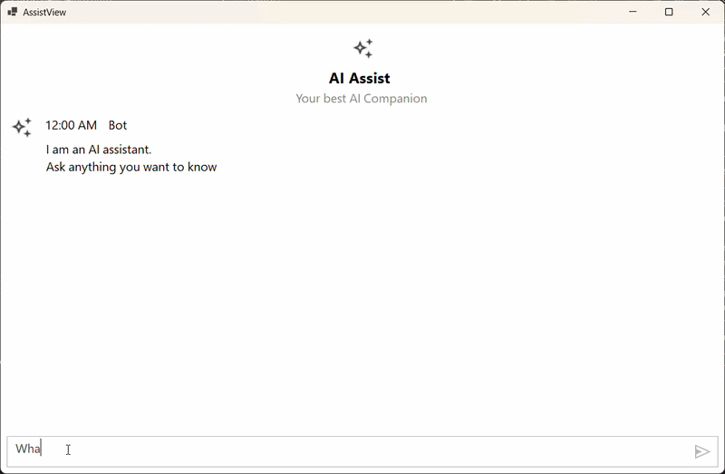

# OpenAI Connection for AI AssistView

This section explains how to connect the AI AssistView with OpenAI.

## Creating an Application with NuGet Reference

1. Create a [Windows Forms app](https://learn.microsoft.com/en-us/visualstudio/ide/create-csharp-winform-visual-studio?view=visualstudio).
2. Add a reference to the [Syncfusion.SfAIAssistView.WinForms](https://www.nuget.org/packages/Syncfusion.SfAIAssistView.WinForms) NuGet package.
3. Import the control namespace `Syncfusion.WinForms.AIAssistView` in C# code.
4. Initialize the [SfAIAssistView](https://help.syncfusion.com/cr/windowsforms/Syncfusion.WinForms.AIAssistView.SfAIAssistView.html) control.
5. Add a reference to the [Microsoft.SemanticKernel](https://www.nuget.org/packages/Microsoft.SemanticKernel) NuGet package.

## Creating the OpenAI View Model Class

The following configuration values are required to connect with OpenAI or Azure OpenAI:

- **OpenAIApiKey**: A string variable where you should add your valid OpenAI API key.
- **OpenAIModel**: A string variable representing the OpenAI language model you want to use.
- **ApiEndpoint**: A string variable representing the URL endpoint of the OpenAI API. For Azure OpenAI, this is the endpoint of your Azure OpenAI resource (the default value `https://openai.azure.com` is the Azure OpenAI endpoint, not the public OpenAI endpoint).





using System;
using System.Collections.ObjectModel;
using System.Collections.Specialized;
using System.ComponentModel;
using System.Drawing;
using System.Threading.Tasks;
using Microsoft.SemanticKernel;
using Microsoft.SemanticKernel.ChatCompletion;
using Syncfusion.WinForms.AIAssistView;

public class ViewModel : INotifyPropertyChanged
{
    AIAssistChatService service;

    private ObservableCollection<object> chats;

    public ObservableCollection<object> Chats
    {
        get
        {
            return this.chats;
        }
        set
        {
            this.chats = value;
            RaisePropertyChanged("Chats");
        }
    }

    private ObservableCollection<string> suggestion;

    public ObservableCollection<string> Suggestion
    {
        get
        {
            return this.suggestion;
        }
        set
        {
            this.suggestion = value;
            RaisePropertyChanged("Suggestion");
        }
    }

    private bool showTypingIndicator;
    public bool ShowTypingIndicator
    {
        get
        {
            return this.showTypingIndicator;
        }
        set
        {
            this.showTypingIndicator = value;
            RaisePropertyChanged("ShowTypingIndicator");
        }
    }

    private Author currentUser;
    public Author CurrentUser
    {
        get
        {
            return this.currentUser;
        }
        set
        {
            this.currentUser = value;
            RaisePropertyChanged("CurrentUser");
        }
    }

    public event PropertyChangedEventHandler PropertyChanged;

    public void RaisePropertyChanged(string propName)
    {
        if (PropertyChanged != null)
        {
            PropertyChanged(this, new PropertyChangedEventArgs(propName));
        }
    }

    public ViewModel()
    {
        this.Chats = new ObservableCollection<object>();
        this.Chats.CollectionChanged += Chats_CollectionChanged;
        this.CurrentUser = new Author() { Name = "User" };
        service = new AIAssistChatService();
        service.Initialize();
    }

    private async void Chats_CollectionChanged(object sender, NotifyCollectionChangedEventArgs e)
    {
        var item = e.NewItems?[0] as TextMessage;
        if (item == null) return;
        if (item != null)
        {
            if (item.Author?.Name == CurrentUser?.Name)
            {
                ShowTypingIndicator = true;
                await service.NonStreamingChat(item.Text);
                Chats.Add(new TextMessage
                {
                    Author = new Author { Name = "Bot", AvatarImage = Image.FromFile(@"Asset\AI_Assist.png") },
                    DateTime = DateTime.Now,
                    Text = service.Response
                });
                ShowTypingIndicator = false;
            }
        }
    }

    public class AIAssistChatService
    {
        IChatCompletionService gpt;
        Kernel kernel;

        // Add a valid OpenAI key here. Avoid committing this to source control.
        private const string OpenAIApiKey = "";
        private const string OpenAIModel = "gpt-4o-mini";
        private const string ApiEndpoint = "https://openai.azure.com";

        public string Response { get; set; }

        public async Task Initialize()
        {
            var builder = Kernel.CreateBuilder();
            builder.AddAzureOpenAIChatCompletion(
                deploymentName: OpenAIModel,
                apiKey: OpenAIApiKey,
                endpoint: ApiEndpoint
            );

            kernel = builder.Build();
            gpt = kernel.GetRequiredService<IChatCompletionService>();
        }

        public async Task NonStreamingChat(string line)
        {
            Response = string.Empty;
            var response = await gpt.GetChatMessageContentAsync(line);
            Response = response.ToString();
        }
    }
}




## Bind Messages

Create a ViewModel instance in the form. Bind the control's Messages property to the view-model property.





public partial class Form1 : Form
{      
    ViewModel viewModel;

    public Form1()
    {
        InitializeComponent();
        viewModel = new ViewModel();

        SfAIAssistView sfAIAssistView1 = new SfAIAssistView();
        sfAIAssistView1.Location = new System.Drawing.Point(41, 40);
        sfAIAssistView1.Size = new System.Drawing.Size(818, 457);  
        sfAIAssistView1.Dock= DockStyle.Fill;
        this.Controls.Add(sfAIAssistView1);

        sfAIAssistView1.DataBindings.Add("Messages", viewModel, "Chats", true, DataSourceUpdateMode.OnPropertyChanged);
        sfAIAssistView1.DataBindings.Add("ShowTypingIndicator", viewModel, "ShowTypingIndicator", true, DataSourceUpdateMode.OnPropertyChanged);
        sfAIAssistView1.DataBindings.Add("Suggestions", viewModel, "Suggestion", true, DataSourceUpdateMode.OnPropertyChanged);
        viewModel.CurrentUser = sfAIAssistView1.User;

        sfAIAssistView1.TypingIndicator.Author = new Author() { Name = "Bot", AvatarImage = Image.FromFile(@"Asset\AI_Assist.png") };
        sfAIAssistView1.TypingIndicator.DisplayText = "Typing";
    }
}





N> You can also explore our [WinForms AIAssistView example demos](https://github.com/syncfusion/winforms-demos/tree/master/assistview).