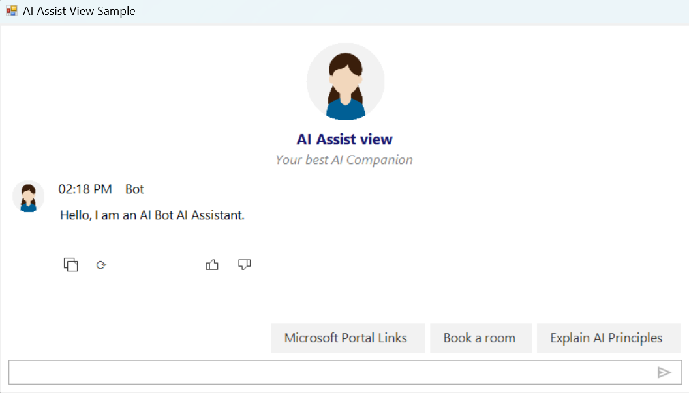

# Response ToolBar in WinForms AI AssistView

The **SfAIAssistView** control includes a **Response Toolbar** feature that allows users to perform actions on bot responses by clicking action buttons. This feature provides an interactive way for users to engage with AI responses through copy, regenerate, like, and other custom actions.

## IsResponseToolBarVisible

By default, the **Response Toolbar** is not displayed. To enable it, set the **IsResponseToolBarVisible** property to `true`.





    SfAIAssistView sfaiAssistView1 = new SfAIAssistView();
    sfaiAssistView1.IsResponseToolBarVisible = true;





## Response Toolbar Items

The **Response Toolbar** supports the following action buttons:

- **Copy** - Copies the bot response text to clipboard
- **Regenerate** - Regenerates the response for the same prompt
- **Like** - Marks the response as helpful/liked
- **Dislike** - Marks the response as not helpful
- **Custom** - User-defined custom actions

## Response Toolbar Item Click Event

The **SfAIAssistView** control provides the **ResponseToolBarItemClicked** event. This is triggered when a user clicks any toolbar action button. You can handle these actions to perform specific operations based on the toolbar item clicked.

### Event Handler Code Example





    sfaiAssistView1.ResponseToolBarItemClicked += SfaiAssistView1_ResponseToolBarItemClicked;

    private void SfaiAssistView1_ResponseToolBarItemClicked(
        object sender, 
        ResponseToolBarItemClickedEventArgs e)
    {
        // Handle the toolbar item click
        if (e.ToolBarItem.ItemType == ResponseToolBarItemType.Copy)
        {
            Clipboard.SetText(e.ChatItem.Text);
            MessageBox.Show("Message copied to clipboard!");
        }
        else if (e.ToolBarItem.ItemType == ResponseToolBarItemType.Regenerate)
        {
            MessageBox.Show("Regenerating response...");
            // Handle regeneration logic
        }
        else if (e.ToolBarItem.ItemType == ResponseToolBarItemType.Like)
        {
            MessageBox.Show("Response marked as helpful!");
        }
    }





The **ResponseToolBarItemClickedEventArgs** provides access to the **ChatItem** (the message being acted upon) and the **ToolBarItem** (the action button clicked).

## Customization

### Controlling Toolbar Visibility

You can control the visibility of the entire toolbar or individual toolbar items:





    // Hide the entire toolbar for a specific message
    sfaiAssistView1.SetToolBarVisibility(message, false);

    // Show the toolbar for a specific message
    sfaiAssistView1.SetToolBarVisibility(message, true);

    // Hide a specific toolbar item for a message
    sfaiAssistView1.SetToolBarItemVisibility(
        message, 
        ResponseToolBarItemType.Regenerate.ToString(), 
        false);

    // Hide toolbar item by name
    sfaiAssistView1.SetToolBarItemVisibility(message, "Copy", false);





### Getting Toolbar Items

Retrieve toolbar items from a message:





    // Get a specific toolbar item
    ResponseToolBarItem copyButton = sfaiAssistView1.GetToolBarItem(
        message, 
        ResponseToolBarItemType.Copy.ToString());

    if (copyButton != null)
    {
        // Use toolbar item properties
        string itemName = copyButton.Name;
    }





### Configuring Toolbar Items

Set custom toolbar items in the control:





    // Configure toolbar items
    sfaiAssistView1.ResponseToolBarItems = new ObservableCollection<ResponseToolBarItem>
    {
        new ResponseToolBarItem 
        { 
            ItemType = ResponseToolBarItemType.Copy, 
            Name = "Copy" 
        },
        new ResponseToolBarItem 
        { 
            ItemType = ResponseToolBarItemType.Regenerate, 
            Name = "Regenerate" 
        },
        new ResponseToolBarItem 
        { 
            ItemType = ResponseToolBarItemType.Like, 
            Name = "Like" 
        }
    };





### How to hide Regenerate Button for Old Messages.





    private void UpdateToolbarForLatestMessage()
    {
        var messages = (sfaiAssistView1.Messages as IList)
            ?.Cast<TextMessage>().ToList();
        
        if (messages == null) return;
        
        var botMessages = messages
            .Where(m => m.Author.Name == "Bot")
            .ToList();
        
        var latestMessage = botMessages.LastOrDefault();
        
        // Hide Regenerate button on all old bot messages
        foreach (var oldMessage in botMessages
            .Where(m => m != latestMessage))
        {
            sfaiAssistView1.SetToolBarItemVisibility(
                oldMessage, 
                ResponseToolBarItemType.Regenerate.ToString(), 
                false);
        }
    }




