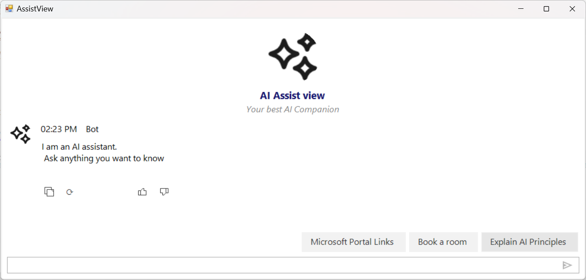

# Response Toolbar in Windows Forms AI AssistView

The [`SfAIAssistView`](https://help.syncfusion.com/cr/windowsforms/Syncfusion.WinForms.AIAssistView.SfAIAssistView.html) control includes a **Response Toolbar** feature that allows users to perform actions on bot responses by clicking action buttons. This feature provides an interactive way for users to engage with AI responses through **copy**, **regenerate**, **like**, and other **custom** actions.

The following `using` directives are included in your file:




using System.Collections;
using System.Collections.ObjectModel;
using System.Linq;
using System.Windows.Forms;
using Syncfusion.WinForms.AIAssistView;




N> An `SfAIAssistView` instance has been created and added to the form. See [Getting Started](https://help.syncfusion.com/windowsforms/ai-assistview/getting-started) for setup details.

## Enabling the Response Toolbar

By default, the Response Toolbar is not displayed. To enable it, set the [`IsResponseToolBarVisible`](https://help.syncfusion.com/cr/windowsforms/Syncfusion.WinForms.AIAssistView.SfAIAssistView.html#Syncfusion_WinForms_AIAssistView_SfAIAssistView_IsResponseToolBarVisible) property to **`true`**.





SfAIAssistView sfAIAssistView1 = new SfAIAssistView();
sfAIAssistView1.IsResponseToolBarVisible = true;





## Response Toolbar Items

The Response Toolbar supports the following action buttons, each represented by a value of the [`ResponseToolBarItemType`](https://help.syncfusion.com/cr/windowsforms/Syncfusion.WinForms.AIAssistView.ResponseToolBarItemType.html) enumeration:

| Item Type | Default Behavior |
|-----------|------------------|
| **`Copy`** | Copies the bot response text to the clipboard. |
| **`Regenerate`** | Regenerates the response for the same prompt. |
| **`Like`** | Marks the response as helpful/liked. |
| **`Dislike`** | Marks the response as not helpful. |
| **`Custom`** | User-defined custom actions. |

## Response Toolbar Item Click Event

The [`SfAIAssistView`](https://help.syncfusion.com/cr/windowsforms/Syncfusion.WinForms.AIAssistView.SfAIAssistView.html) control provides the [`ResponseToolBarItemClicked`](https://help.syncfusion.com/cr/windowsforms/Syncfusion.WinForms.AIAssistView.SfAIAssistView.html#Syncfusion_WinForms_AIAssistView_SfAIAssistView_ResponseToolBarItemClicked) event. This is triggered when a user clicks any toolbar action button. You can handle these actions to perform specific operations based on the toolbar item clicked.

### Event Args

[`ResponseToolBarItemClickedEventArgs`](https://help.syncfusion.com/cr/windowsforms/Syncfusion.WinForms.AIAssistView.ResponseToolBarItemClickedEventArgs.html) exposes:

- **`ChatItem`** — the [`TextMessage`](https://help.syncfusion.com/cr/windowsforms/Syncfusion.WinForms.AIAssistView.TextMessage.html) (or other `IChatItem`) being acted upon.
- **`ToolBarItem`** — the clicked [`ResponseToolBarItem`](https://help.syncfusion.com/cr/windowsforms/Syncfusion.WinForms.AIAssistView.ResponseToolBarItem.html) with **`ItemType`**, **`Name`**, etc.

### Event Handler Code Example





sfAIAssistView1.ResponseToolBarItemClicked += sfAIAssistView1_ResponseToolBarItemClicked;

private void sfAIAssistView1_ResponseToolBarItemClicked(
    object sender,
    ResponseToolBarItemClickedEventArgs e)
{
    if (e.ToolBarItem?.ItemType == ResponseToolBarItemType.Copy)
    {
        Clipboard.SetText(e.ChatItem?.Text);
        MessageBox.Show("Message copied to clipboard.");
    }
    else if (e.ToolBarItem?.ItemType == ResponseToolBarItemType.Regenerate)
    {
        MessageBox.Show("Regenerating response.");
        // Handle regeneration logic
    }
    else if (e.ToolBarItem?.ItemType == ResponseToolBarItemType.Like)
    {
        MessageBox.Show("Response marked as helpful.");
    }
}




## Customization

The following sections describe how to customize toolbar visibility, retrieve toolbar items, configure the default set, and selectively hide buttons on older messages.

### Controlling Toolbar Visibility

You can control the visibility of the entire toolbar or individual toolbar items on a per-message basis:




var messagesList = sfAIAssistView1.Messages as IList;
if (messagesList != null && messagesList.Count > 0)
{
    // The Response Toolbar is typically rendered on bot messages;
    // adjust the index to target the specific message you need.
    var message = messagesList[1] as TextMessage;
    // Hide the entire toolbar for a specific message
    sfAIAssistView1.SetToolBarVisibility(message, false);

    // Show the toolbar for a specific message
    sfAIAssistView1.SetToolBarVisibility(message, true);

    // Hide a specific toolbar item for a message (by enum)
    sfAIAssistView1.SetToolBarItemVisibility(
        message,
        ResponseToolBarItemType.Regenerate.ToString(),
        false);

    // Hide toolbar item by name
    sfAIAssistView1.SetToolBarItemVisibility(message, "Copy", false);
}




### Getting Toolbar Items

Retrieve toolbar items from a specific message using the [`GetToolBarItem`](https://help.syncfusion.com/cr/windowsforms/Syncfusion.WinForms.AIAssistView.SfAIAssistView.html#Syncfusion_WinForms_AIAssistView_SfAIAssistView_GetToolBarItem_Syncfusion_WinForms_AIAssistView_TextMessage_System_String_) method:




ResponseToolBarItem copyButton = sfAIAssistView1.GetToolBarItem(
    message,
    ResponseToolBarItemType.Copy.ToString());

if (copyButton != null)
{
    string itemName = copyButton.Name;
    // Use other properties on copyButton as needed
}




[`GetToolBarItem`](https://help.syncfusion.com/cr/windowsforms/Syncfusion.WinForms.AIAssistView.SfAIAssistView.html#Syncfusion_WinForms_AIAssistView_SfAIAssistView_GetToolBarItem_Syncfusion_WinForms_AIAssistView_TextMessage_System_String_) returns **`null`** when no matching item exists for the given message.

### Configuring Toolbar Items

Set custom toolbar items on the control using the [`ResponseToolBarItems`](https://help.syncfusion.com/cr/windowsforms/Syncfusion.WinForms.AIAssistView.SfAIAssistView.html#Syncfusion_WinForms_AIAssistView_SfAIAssistView_ResponseToolBarItems) property. This replaces the default toolbar items with the specified collection of [`ResponseToolBarItem`](https://help.syncfusion.com/cr/windowsforms/Syncfusion.WinForms.AIAssistView.ResponseToolBarItem.html) objects.



sfAIAssistView1.ResponseToolBarItems = new ObservableCollection<ResponseToolBarItem>
{
    new ResponseToolBarItem { ItemType = ResponseToolBarItemType.Copy,      Name = "Copy" },
    new ResponseToolBarItem { ItemType = ResponseToolBarItemType.Regenerate, Name = "Regenerate" },
    new ResponseToolBarItem { ItemType = ResponseToolBarItemType.Like,       Name = "Like" }
};




### How to Hide the Regenerate Button for Old Messages

The following example hides the **`Regenerate`** toolbar item on every bot message except the most recent one using [`SetToolBarItemVisibility`](https://help.syncfusion.com/cr/windowsforms/Syncfusion.WinForms.AIAssistView.SfAIAssistView.html#Syncfusion_WinForms_AIAssistView_SfAIAssistView_SetToolBarItemVisibility_Syncfusion_WinForms_AIAssistView_TextMessage_System_String_System_Boolean_):




private void UpdateToolbarForLatestMessage()
{
    var messages = (sfAIAssistView1.Messages as IList)?
        .Cast<TextMessage>().ToList();

    if (messages == null) return;

    var botMessages = messages
        .Where(m => m.Author?.Name == "Bot")
        .ToList();

    var latestMessage = botMessages.LastOrDefault();
    if (latestMessage == null) return;

    // Hide Regenerate on all old bot messages
    foreach (var oldMessage in botMessages.Where(m => m != latestMessage))
    {
        sfAIAssistView1.SetToolBarItemVisibility(
            oldMessage,
            ResponseToolBarItemType.Regenerate.ToString(),
            false);
    }
}




Call `UpdateToolbarForLatestMessage` whenever a new bot response is added (for example, in the `Chats_CollectionChanged` handler used in the OpenAI integration).