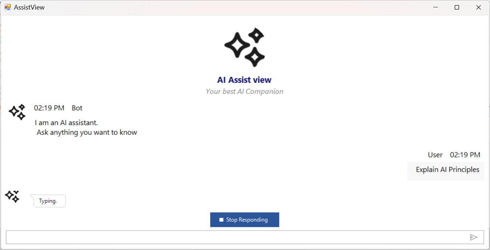
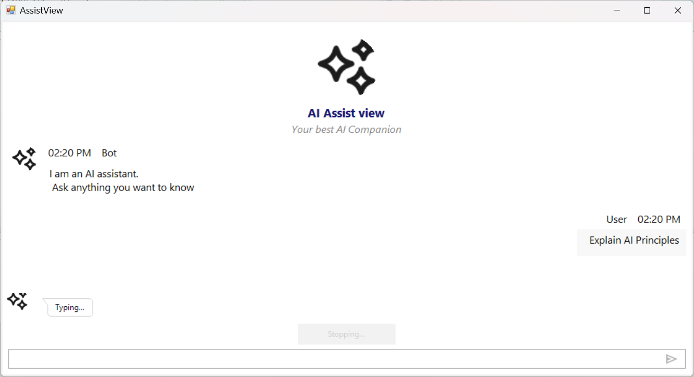
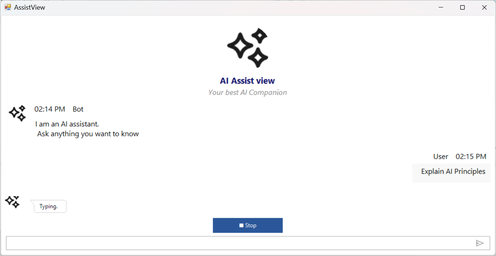

# Stop Responding in Windows Forms AI AssistView

The [`SfAIAssistView`](https://help.syncfusion.com/cr/windowsforms/Syncfusion.WinForms.AIAssistView.SfAIAssistView.html) control includes a `Stop Responding` feature that allows users to cancel an ongoing AI response by clicking the **Stop Responding** button. This feature ensures that users can interrupt the response if it is no longer needed.

The following `using` directives are included in your file:




using System;
using System.Threading;
using System.Threading.Tasks;
using Syncfusion.WinForms.AIAssistView;




N> An `SfAIAssistView` instance has been created and added to the form. See [Getting Started](https://help.syncfusion.com/windowsforms/ai-assistview/getting-started) for setup details.

## Enabling the Stop Responding Button

By default, the Stop Responding button is not displayed. To enable it, set the [EnableStopResponding](https://help.syncfusion.com/cr/windowsforms/Syncfusion.WinForms.AIAssistView.SfAIAssistView.html#Syncfusion_WinForms_AIAssistView_SfAIAssistView_EnableStopResponding) property to `true`.





SfAIAssistView sfAIAssistView1 = new SfAIAssistView();
sfAIAssistView1.EnableStopResponding = true;




The button is displayed when [EnableStopResponding](https://help.syncfusion.com/cr/windowsforms/Syncfusion.WinForms.AIAssistView.SfAIAssistView.html#Syncfusion_WinForms_AIAssistView_SfAIAssistView_EnableStopResponding) is set to `true`.

## Stop Responding Event

The `SfAIAssistView` control provides the [StopRespondingButtonClicked](https://help.syncfusion.com/cr/windowsforms/Syncfusion.WinForms.AIAssistView.SfAIAssistView.html#Syncfusion_WinForms_AIAssistView_SfAIAssistView_StopRespondingButtonClicked) event. This is triggered when the Stop Responding button is clicked. Use it to cancel any in-flight AI request:




sfAIAssistView1.StopRespondingButtonClicked += SfaiAssistView1_StopResponding;

private void SfaiAssistView1_StopResponding(object sender, EventArgs e)
{
    CancelAIRequest();
}

private CancellationTokenSource ct;

private void CancelAIRequest()
{
    if (ct != null && !ct.IsCancellationRequested)
    {
        ct.Cancel();
        ct.Dispose();
        ct = null;
    }
}




`CancellationTokenSource` is created and assigned to `ct` when an AI request is started, and the resulting token is passed into the AI service call. The event handler cancels that token when the user clicks Stop.

### Wiring Cancellation into an AI Request





private async void Chats_CollectionChanged(object sender, NotifyCollectionChangedEventArgs e)
{
    if (e.NewItems == null || e.NewItems.Count == 0) return;
    var item = e.NewItems[0] as TextMessage;
    if (item == null) return;
    if (item.Author?.Name != viewModel.CurrentUser?.Name) return;

    viewModel.ShowTypingIndicator = true;
    ct = new CancellationTokenSource();

    try
    {
        string response = await aiService.NonStreamingChatAsync(item.Text, ct.Token);
        viewModel.Chats.Add(new TextMessage
        {
            Author = new Author { Name = "Bot" },
            Text = response
        });
    }
    catch (OperationCanceledException)
    {
        // User clicked Stop Responding; no response is added.
    }
    finally
    {
        viewModel.ShowTypingIndicator = false;
    }
}




## Customization

The button text and the hold duration can be customized using the properties below. The Stop Responding button remains disabled for the configured hold time after it is clicked, preventing repeated cancellation requests.

| Property | Description | Default |
|----------|-------------|---------|
| `StopRespondingButtonText` | Text shown on the button before cancellation. | `"\u25A0 Stop Responding"` |
| `StopRespondingButtonCancelingText` | Text shown on the button while cancellation is in progress. | `"Cancelling..."` |
| `StopRespondingHoldSeconds` | Number of seconds the button stays disabled after being clicked. | `1` |





// Set button text
sfAIAssistView1.StopRespondingButtonText = "\u23F9 Stop";

// Set canceling text (shown while canceling)
sfAIAssistView1.StopRespondingButtonCancelingText = "Stopping...";

// Set hold time (seconds the button stays disabled after click)
sfAIAssistView1.StopRespondingHoldSeconds = 2;





