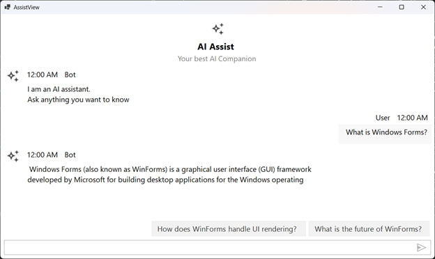

# Suggestions in Windows Forms AI AssistView

By using the [Suggestions](https://help.syncfusion.com/cr/windowsforms/Syncfusion.WinForms.AIAssistView.SfAIAssistView.html#Syncfusion_WinForms_AIAssistView_SfAIAssistView_Suggestions) property, the AssistView displays AI-driven suggestions in the bottom right corner, making it easy for users to quickly respond or choose from relevant options.





public class ViewModel : INotifyPropertyChanged
{
    private ObservableCollection<object> chats;
    private Author currentUser;
    private IEnumerable<string> suggestion;

    public ViewModel()
    {
        this.Chats = new ObservableCollection<object>();
        this.CurrentUser = new Author { Name = "John" };
        Suggestion = new ObservableCollection<string>();
        this.GenerateMessages();
    }

    private async void GenerateMessages()
    {
        this.Chats.Add(new TextMessage { Author = CurrentUser, Text = "What is Windows Forms?" });
        await Task.Delay(1000);
        this.Chats.Add(new TextMessage { Author = new Author { Name = "Bot"}, Text = "Windows Forms (also known as WinForms) is a graphical user interface (GUI) framework developed by Microsoft for building desktop applications for the Windows operating system." });            
        Suggestion = new ObservableCollection<string> { "What is the future of WinForms?", "How does WinForms handle UI rendering?" };
    }

    public IEnumerable<string> Suggestion
    {
        get
        {
            return this.suggestion;
        }
        set
        {
            this.suggestion = value;
            RaisePropertyChanged("Suggestion");
        }
    }

    public ObservableCollection<object> Chats
    {
        get
        {
            return this.chats;
        }
        set
        {
            this.chats = value;
            RaisePropertyChanged("Chats");
        }
    }

    public Author CurrentUser
    {
        get
        {
            return this.currentUser;
        }
        set
        {
            this.currentUser = value;
            RaisePropertyChanged("CurrentUser");
        }
    }

    public void RaisePropertyChanged(string propName)
    {
        if (PropertyChanged != null)
        {
            PropertyChanged(this, new PropertyChangedEventArgs(propName));
        }
    }

    public event PropertyChangedEventHandler PropertyChanged;
}





## Binding Suggestions 

The following code snippet shows how to bind the suggestion to your ViewModel.





public partial class Form1 : Form
{
    ViewModel viewModel;
    public Form1()
    {
        InitializeComponent();
        viewModel = new ViewModel();

        SfAIAssistView sfAIAssistView1 = new SfAIAssistView();
        sfAIAssistView1.Location = new System.Drawing.Point(41, 40);
        sfAIAssistView1.Size = new System.Drawing.Size(818, 457);  
        sfAIAssistView1.Dock= DockStyle.Fill;
        this.Controls.Add(sfAIAssistView1);

        sfAIAssistView1.DataBindings.Add("Messages", viewModel, "Chats", true, DataSourceUpdateMode.OnPropertyChanged);
        sfAIAssistView1.DataBindings.Add("Suggestions", viewModel, "Suggestion", true, DataSourceUpdateMode.OnPropertyChanged);
    }
}





