# Add Windows Forms Syncfusion® Controls 

The Syncfusion® Windows Forms controls can be added to a Visual Studio project by using any of the following ways:

* [Through Designer](#through-designer)
* [Through Code-Behind](#through-code-behind)
* [Through Project Template](#through-project-template)
* [Through Item Template](#through-item-template)

## Prerequisites

Before adding Syncfusion® Windows Forms controls, complete the following setup:

* Install [Syncfusion® Essential Studio® Windows Forms](https://help.syncfusion.com/common/essential-studio/download) — this page explains how to download the trial or licensed Essential Studio installer.
* Make sure your environment meets the [system requirements](https://help.syncfusion.com/windowsforms/system-requirements).
* If you are using NuGet, install the Syncfusion® package required for the control used in your application. See [Install Syncfusion Windows Forms NuGet packages](https://help.syncfusion.com/windowsforms/installation/install-nuget-packages).
* Register your Syncfusion® license key. See the [license registration overview](https://help.syncfusion.com/common/essential-studio/licensing/how-to-register-in-an-application) for details.

> The exact steps may vary based on the installed Syncfusion version and Visual Studio version. Refer to the Syncfusion Windows Forms documentation for the latest setup instructions.

## Through Designer

> **Prerequisite:** Syncfusion® Essential Studio® Windows Forms must be installed so that the controls are registered in the Visual Studio Toolbox. If the Syncfusion tab is not visible, refer to the [installation guide](Installation.html) or the [troubleshooting](#troubleshooting) section.

Syncfusion® UI for Windows Forms controls are added automatically to the Visual Studio Toolbox during installation. The following steps help you add the required Essential® Windows Forms control by dragging and dropping it from the Toolbox. Example: **TextBoxExt**.

1. Create a Windows Forms project in Visual Studio (for example, **Windows Forms App (.NET Framework)** or **Windows Forms App** on .NET 6/7+).

2. Find **TextBoxExt** by typing "TextBoxExt" in the Toolbox search box.

   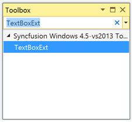

3. Drag **TextBoxExt** and drop it onto the designer.

   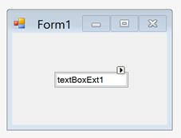

4. Build and run the project to verify that the control is rendered correctly. To apply a Syncfusion theme, refer to the [Windows Forms skins / SkinManager documentation](https://help.syncfusion.com/windowsforms/skins/getting-started).

## Through Code-Behind

> **Prerequisite:** Install the Syncfusion® package required for the control used in your application (for example, the **Syncfusion® Windows Forms Controls** NuGet package), or reference the required Syncfusion® assemblies from your local install path. Refer to the [installation guide](Installation.html) for details.

Syncfusion® UI for Windows Forms controls can be added at runtime using C# or VB. The following steps help you add the required Essential® Windows Forms control through code. Example: **TextBoxExt**.

> The code below can be placed in the form constructor after `InitializeComponent()` or in the `Form_Load` event handler.

1. Create a Windows Forms project in Visual Studio and add a reference to the required Syncfusion® assembly.

   For the **TextBoxExt** control, the required assembly is:

   * Syncfusion.Shared.Base.dll

   The exact assembly may vary based on the Syncfusion® version and the control used. Refer to the Syncfusion® API reference for the required assembly details.

2. Add the required `using` directive in C# or `Imports` statement in VB.






using Syncfusion.Windows.Forms.Tools;





Imports Syncfusion.Windows.Forms.Tools





{{ codesnippet0 | OrderList_Indent_Level_1 }}

3. Create an instance of **TextBoxExt**.






TextBoxExt textBoxExt1 = new TextBoxExt();





Dim textBoxExt1 As New TextBoxExt()





{{ codesnippet1 | OrderList_Indent_Level_1 }}

4. Set the `Location` and `Size` of the control. Here, the location is set to `(100, 100)` and the size is set to `(200, 25)`.






textBoxExt1.Location = new System.Drawing.Point(100, 100);
textBoxExt1.Size = new System.Drawing.Size(200, 25);





textBoxExt1.Location = New System.Drawing.Point(100, 100)
textBoxExt1.Size = New System.Drawing.Size(200, 25)





{{ codesnippet2 | OrderList_Indent_Level_1 }}

5. Add the created instance to the `Controls` collection of the parent form or the required layout panel.






// Here, this refers to the parent form.
this.Controls.Add(textBoxExt1);





' Here, Me refers to the parent form.
Me.Controls.Add(textBoxExt1)





{{ codesnippet3 | OrderList_Indent_Level_1 }}

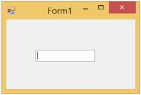

> You can also set commonly used properties such as `Text`, `Name`, and theme-related properties as needed. To apply a Syncfusion® visual style, refer to the [Windows Forms skins / SkinManager documentation](https://help.syncfusion.com/windowsforms/skins/getting-started).

## Through Project Template

> **Prerequisite:** Install Syncfusion® Essential Studio® Windows Forms or the Syncfusion® WinForms Visual Studio extension so that the Syncfusion® WinForms project templates are available in Visual Studio. For installation details, refer to the [Syncfusion Essential Studio installer documentation](https://help.syncfusion.com/common/essential-studio/download) or the [Syncfusion WinForms Visual Studio extension installation guide](https://help.syncfusion.com/windowsforms/visual-studio-integration/download-and-installation).

Syncfusion® provides the Visual Studio Project Templates for the Syncfusion® Windows Forms platform to create a Syncfusion® Windows Forms Application.

I> The Syncfusion® Windows Forms templates are available from v14.3.0.49. The wizard and options described below may differ in newer releases. Refer to the Syncfusion Windows Forms documentation for the latest setup instructions.

**Supported Visual Studio versions:** Syncfusion® WinForms Template Studio is compatible with Visual Studio 2022, Visual Studio 2019, and Visual Studio 2017. For complete environment details, refer to the [Windows Forms system requirements](https://help.syncfusion.com/windowsforms/system-requirements).

**Supported target frameworks:** The supported .NET Framework and .NET versions depend on the installed Syncfusion® version and Visual Studio version. For the latest supported framework details, refer to the [Windows Forms system requirements](https://help.syncfusion.com/windowsforms/system-requirements).

### Create Syncfusion® Windows Forms Project

The following steps guide you in creating the Syncfusion® Windows Forms project through the Visual Studio Project Template.

1. To create a Syncfusion® Windows Forms project, choose **New Project → Syncfusion® → Windows → Syncfusion® Windows Forms Application** from Visual Studio.

   

2. Name the Project, choose the destination location when required and set the Framework of the project, Then click **OK**..  

   N> Minimum target Framework is 3.5 for Syncfusion® Windows Forms project templates. 

3. Configure the Syncfusion® Windows Forms Application using the **Project Configuration Wizard**.

   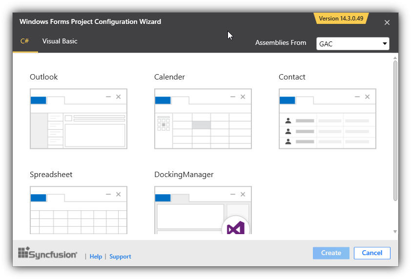

   **Project configuration options:**

   | Option | Description |
   |--------|-------------|
   | **Language** | Select the project language: **C#** or **VB**. |
   | **Assemblies From** | Choose the assembly source, such as **GAC**, **NuGet**, or the **Installed location**. This determines where the required Syncfusion® assembly references are added. |
   | **Select Control** | Choose the Syncfusion® Windows Forms controls to include in the project template. |

  **Language:** Select the project language.

   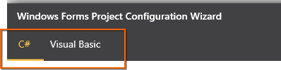

   **Assemblies From:** Choose the assembly source from which the required Syncfusion® assemblies should be added.

   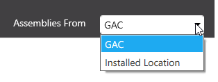

   **Select Control:** Choose the required Syncfusion® Windows Forms control based on your application needs.

   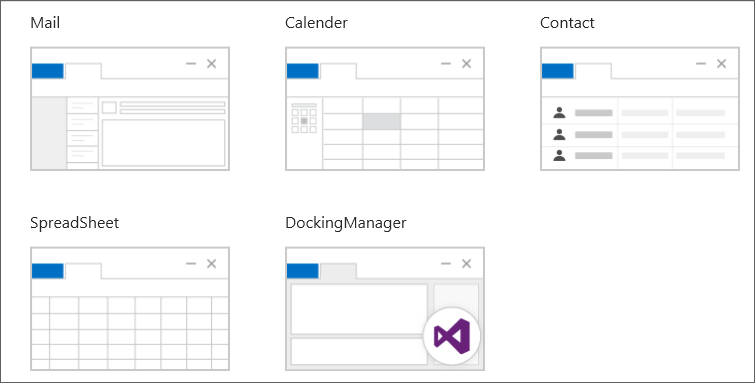
      
4. Once the Project Configuration Wizard is done, the Syncfusion® Windows Forms project is created with required references and forms. 

   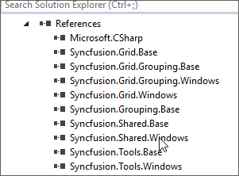

   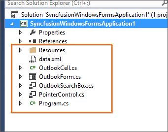

5. Then, Syncfusion® licensing registration required message box will be shown as follow, if you are installed the trial setup or NuGet packages since Syncfusion® introduced the licensing system from 2018 Volume 2 (v16.2.0.41) Essential Studio® release. Please navigate to the [help topic](https://help.syncfusion.com/common/essential-studio/licensing/overview#how-to-generate-syncfusion-license-key) which is shown in the licensing message box to generate and register the Syncfusion® license key to your project. Refer to this [blog](https://www.syncfusion.com/blogs/post/whats-new-in-2018-volume-2.aspx) post for understanding the licensing changes introduced in Essential Studio®.

      

## Through Item Template

> **Prerequisite:** Install Syncfusion® Essential Studio® for Windows Forms so that the Syncfusion® item templates are available in Visual Studio. For installation details, refer to the [Syncfusion Essential Studio installer documentation](https://help.syncfusion.com/common/essential-studio/download) or the [Syncfusion WinForms Visual Studio extension installation guide](https://help.syncfusion.com/windowsforms/visual-studio-integration/download-and-installation).

> **Supported Visual Studio versions:** The supported Visual Studio versions depend on the installed Syncfusion® build. The item template is available from Syncfusion® Essential Studio® v13.1.0.21. Refer to the [Windows Forms system requirements](https://help.syncfusion.com/windowsforms/system-requirements).

The Syncfusion® Item Templates add a new item to the Windows Forms platform. To add the Syncfusion® item files in Visual Studio, install Syncfusion® Essential Studio® for the Windows Forms platform.

### Using Syncfusion® Item Template Gallery

Follow the given steps to add the Syncfusion® item in Visual Studio.

1. Open a new or existing Windows Forms application.

2. Right-click the Windows Forms project in **Solution Explorer** and select **Add Syncfusion® Item → New Item...**. Refer to the following screenshot for more information.

   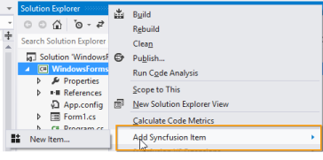

3. The **Syncfusion® Item Template Gallery** window opens.

   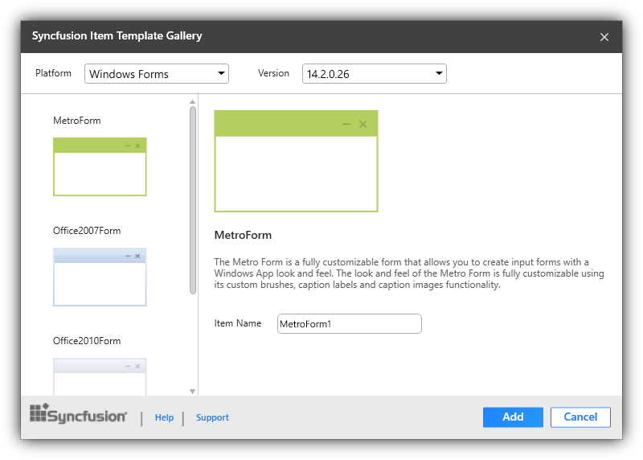
   
4. Select the required version and themes or Form from the Syncfusion® Item Template Gallery. 

   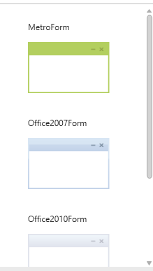

   

### Gallery Options

The Item Template Gallery exposes the following options:

**Platform** — a combo box that lets you choose the application’s platform. The list of supported platforms may differ between Syncfusion® versions.

**Version** — lists all Syncfusion® Essential Studio® build versions v13.1.0.21 and later installed on this machine for the installed Windows Forms platform. The exact list depends on which builds are installed locally.

**Template Gallery** — a set of Syncfusion® Item Templates that you can choose from based on your needs. When you click **Add**, the selected item template is added to the project.

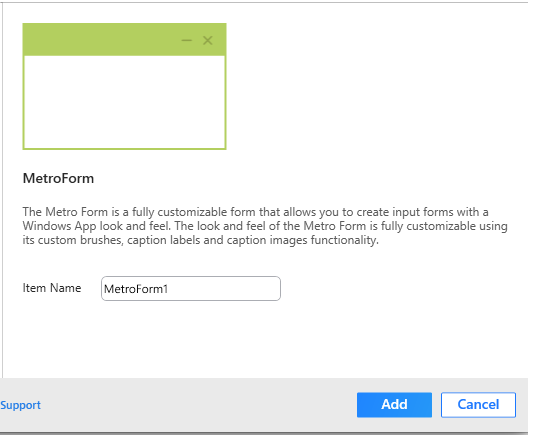

5.Then, Syncfusion® licensing registration required message box will be shown as follow, if you are installed the trial setup or NuGet packages since Syncfusion® introduced the licensing system from 2018 Volume 2 (v16.2.0.41) Essential Studio® release. Please navigate to the [help topic](https://help.syncfusion.com/common/essential-studio/licensing/overview#how-to-generate-syncfusion-license-key) which is shown in the licensing message box to generate and register the Syncfusion® license key to your project. Refer to this [blog](https://www.syncfusion.com/blogs/post/whats-new-in-2018-volume-2.aspx) post for understanding the licensing changes introduced in Essential Studio®.

   

### Using Visual Studio Add New Item

Syncfusion® Item Templates can also be added from the Visual Studio **Add New Item** dialog. Right-click the Windows Forms project and choose **Add → New Item**. Refer to the following screenshot for more information.

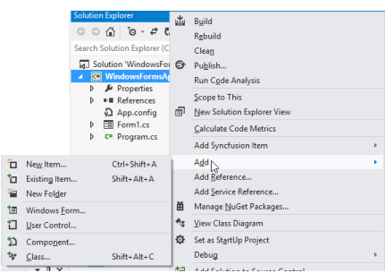

1. The Syncfusion® Item Templates are available under the **Syncfusion®** tab. They are available for both C# and VB items.

   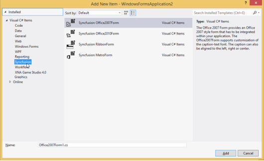

2. The selected template is added to the project along with the required Syncfusion® references.

   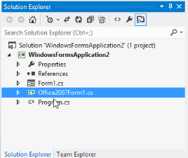

   

3. Then, Syncfusion® licensing registration required message box will be shown as follow, if you are installed the trial setup or NuGet packages since Syncfusion® introduced the licensing system from 2018 Volume 2 (v16.2.0.41) Essential Studio® release. Please navigate to the [help topic](https://help.syncfusion.com/common/essential-studio/licensing/overview#how-to-generate-syncfusion-license-key) which is shown in the licensing message box to generate and register the Syncfusion® license key to your project. Refer to this [blog](https://www.syncfusion.com/blogs/post/whats-new-in-2018-volume-2.aspx) post for understanding the licensing changes introduced in Essential Studio®.

   

## Choosing an Approach

Use the following comparison to decide which approach best fits your scenario:

| Approach | When to use |
|----------|-------------|
| **Through Designer** | You prefer a visual workflow, need to lay out controls on a form, and want to see the result immediately. |
| **Through Code-Behind** | You need to create controls dynamically, want full programmatic control, or are working with code-only scenarios. |
| **Through Project Template** | You want to start a new Syncfusion® Windows Forms application that is pre-configured with the required references. |
| **Through Item Template** | You want to add a Syncfusion®-themed Form or User Control to an existing Windows Forms project. |

## Troubleshooting

If you encounter any of the following issues, try the suggested steps before contacting support:

* **Syncfusion® controls do not appear in the Visual Studio Toolbox.**  
  Confirm that Syncfusion® Essential Studio® Windows Forms is installed and that the Syncfusion® Visual Studio extension is enabled. Reinstall the extension if needed. Refer to the [Syncfusion WinForms Visual Studio extension installation guide](https://help.syncfusion.com/windowsforms/visual-studio-integration/download-and-installation).

* **Project or item template is not visible in the dialog.**  
  Confirm that the Syncfusion® Visual Studio extension is installed and that the target Visual Studio version is supported. Restart Visual Studio after installation. Refer to the [Windows Forms system requirements](https://help.syncfusion.com/windowsforms/system-requirements).

* **License registration message is displayed at runtime.**  
  Generate and register a Syncfusion® license key as described in the [Syncfusion Windows Forms licensing overview](https://help.syncfusion.com/windowsforms/licensing/overview).

* **Build errors about missing assemblies or namespaces.**  
  Install the Syncfusion® package required for the control used in your application, for example, through NuGet, or reference the assemblies from your local install path. Confirm that the namespace matches the one used in your code. Refer to [Install Syncfusion Windows Forms NuGet packages](https://help.syncfusion.com/windowsforms/installation/).

## See Also

* [Syncfusion® Windows Forms Installation](https://help.syncfusion.com/windowsforms/installation/)
* [Syncfusion® WinForms Visual Studio Extension Installation](https://help.syncfusion.com/windowsforms/visual-studio-integration/download-and-installation)
* [Syncfusion® Windows Forms System Requirements](https://help.syncfusion.com/windowsforms/system-requirements)
* [Syncfusion® Windows Forms Licensing](https://help.syncfusion.com/windowsforms/licensing/overview)
* [Syncfusion® Windows Forms Visual Style / SkinManager](https://help.syncfusion.com/windowsforms/skins/getting-started)
* [Syncfusion® Windows Forms Overview](https://help.syncfusion.com/windowsforms/overview)
