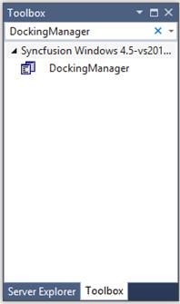

# Add Syncfusion Controls

### Through Drag and Drop

The following steps will help you to add required Essential WF Control, for example: DockingManager, by Drag and Drop.

1) Create a WF project in Visual Studio.  </td></tr>
2) Find DockingManager control by typing the name of the DockingManager in the search box.  </td></tr>

3) Drag DockingManager and drop it in the designer.  </td></tr>

### Through C# / VB

The following steps will help you to add required Essential WF Control. For example: DockingManager through C# or VB Code.

1) Create a WF project in Visual Studio and refer to the following assemblies.

 * Syncfusion.Tools.Base
 * Syncfusion.Tools.Windows
 * Syncfusion.Shared.Base
 * Syncfusion.Shared.Windows
 * Syncfusion.Grid.Base
 * Syncfusion.Grid.Windows

2) Add the following namespace.

<table>
<tr>
<td>
**[**C**#]**  using Syncfusion.Windows.Forms.Tools;  using Syncfusion.Windows.Forms;  </td></tr>
</table>

<table>
<tr>
<td>
**[**VB**]**  Imports Syncfusion.Windows.Forms.Tools  Imports Syncfusion.Windows.Forms  </td></tr>
</table>

3) Create an instance of Docking Manager.

<table>
<tr>
<td>
**[**C**#]**  private Syncfusion.Windows.Forms.Tools.DockingManager DockingManager = new Syncfusion.Windows.Forms.Tools.DockingManager(this.components);  </td></tr>
</table>

<table>
<tr>
<td>
**[**VB**]**  private Syncfusion.Windows.Forms.Tools.DockingManager DockingManager = new Syncfusion.Windows.Forms.Tools.DockingManager(this.components)  </td></tr>
</table>
