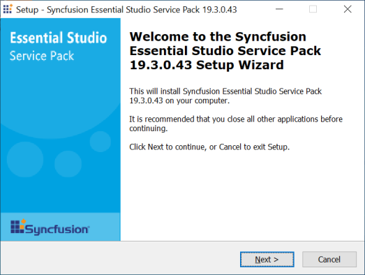
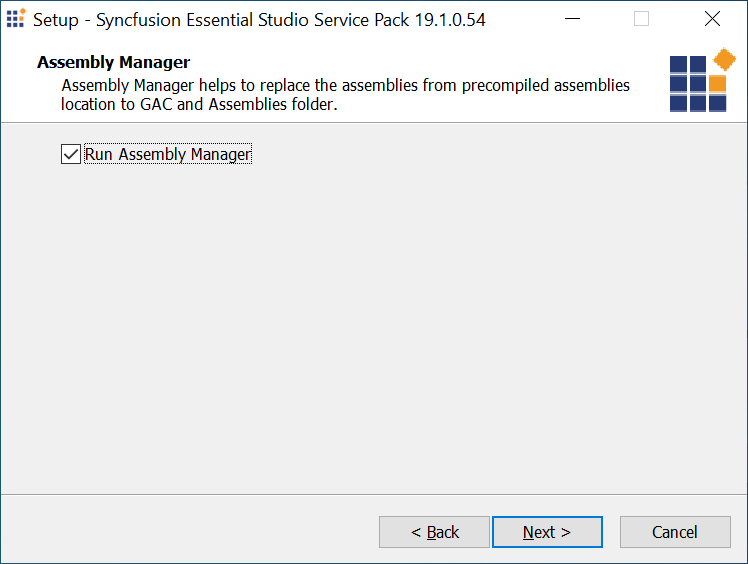
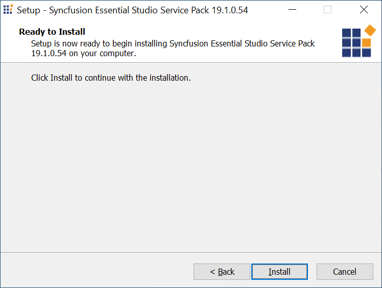
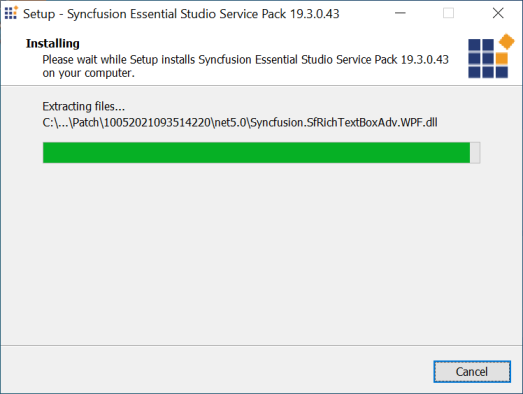
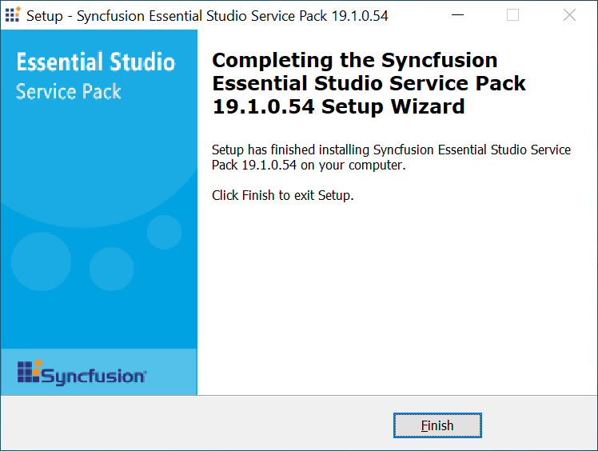
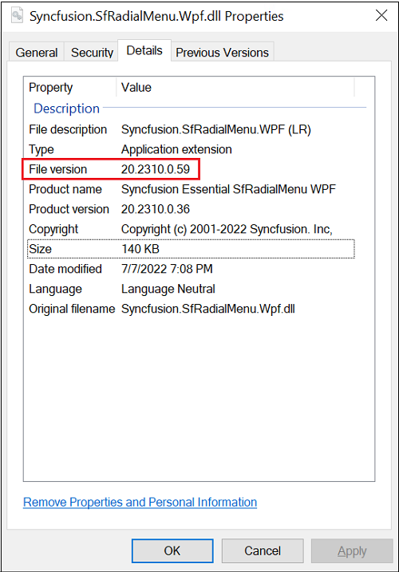
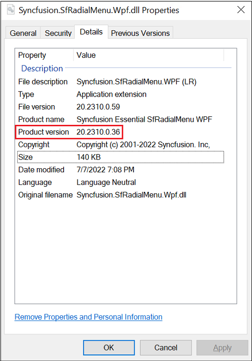

# Applying the Patches

Syncfusion provides patch installer for major version or service pack version, either to add new features or to fix issues. You have to install the patches in the order you have received.

## Installing the Patch installer

The steps below show how to install a patch.

I> Before installing the patch, ensure that the corresponding Essential Studio version is installed on your machine.

1. Double-click the Syncfusion Essential Studio patch installer. The Syncfusion Essential Studio Service Pack opens.
   
   

2. Click Next. The Assembly Manager screen opens.
   
   

3. Select the Run Assembly Manager check box to install the assemblies in GAC.

4. Click Next. The Ready To Install screen opens.
   
   

5. Click Install to continue installing.
   
   

   N> The patch is installed on your computer, and a dialog box appears when the installation is complete.

    

6. Click Finish. The new assemblies are placed in the **Pre-Compiled Assemblies** folder. By default this folder is located at `%ProgramFiles%\Syncfusion\Essential Studio\<Version>\Pre-Compiled Assemblies`. These new assemblies can be referenced in your project.
   
## Patch Assembly Version Format
   
In the patch assembly, the **File Version** and **Product Version** will be different. The **Product Version** matches the release version of Essential Studio. The **File Version** increments the release version's **revision** number; each patch ships with a different File Version, which is how you distinguish a patched assembly from a release assembly. To view these values, right-click a Syncfusion assembly, choose **Properties**, and open the **Details** tab.

**File Version of the assembly shipped in build:**
   

   
**Product Version of the assembly shipped in patch:**
   

