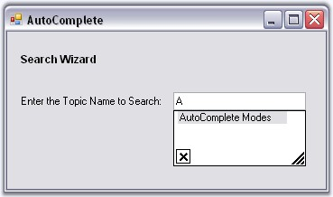

# Creating AutoComplete Control

This section will guide you to implement a simple AutoComplete control with a TextBox via designer and programmatically.

## Through Designer

This tutorial illustrates the usage of the AutoComplete control for TextBox, without any external data source. 

1. Create a new Windows Forms application and open the main form for the application in the designer. Add the Syncfusion controls to the VS .NET toolbox, if you have not done so already. Drag-and-drop an AutoComplete control onto the form.

   

2. The AutoComplete control will appear as a component in the component tray of the design environment. Similarly add aText box, two labels and a button to make the form interactive. 

   

3. When the AutoComplete control is added to the form, the AutoComplete on autocomplete property is added to the text box control properties. This property specifies the type of autocompletion to be provided by the autoComplete1 control for the comboBox1 control. The default value for AutoComplete on autoComplete1 will be set to AutoCompleteModes.Disabled. Use the drop-down box provided in the property grid to change it to the mode of autocompletion toAutoSuggest. The different modes of autocompletion are detailed in AutoComplete Modes topic. 

   

4. Set AutoComplete.AutoAddItem property to true. Run the application, type any text in the textbox and hit Enter to save the entry. Select the text, delete it and then retype the first letter of the text you saved. You should see autocompletion of the letter, as shown below.

> Note: The text entered can be saved only when AutoAddItem property is set to True.

  

> Note: We can also add a list of autocomplete items through designer, which can used as a source for AutoComplete control. SeeSee_ Source for AutoComplete Control _topic for details.

## Through Code

 This section will guide you, to programmatically add, and associate an AutoComplete control to a textbox.

5. Include the required namespace.

   ~~~ cs

		using Syncfusion.Windows.Forms.Tools;

   ~~~
   {:.prettyprint }

   ~~~ vbnet

		Imports Syncfusion.Windows.Forms.Tools

   ~~~
   {:.prettyprint }

6. Create an instances of AutoComplete and TextBox controls.

   ~~~ cs

		private Syncfusion.Windows.Forms.Tools.AutoComplete autoComplete1;

		private System.Windows.Forms.TextBox textBox1;

		this.textBox1=new TextBox();

		this.autoComplete1=new AutoComplete();

   ~~~
   {:.prettyprint }

   ~~~ vbnet

		Private autoComplete1 As Syncfusion.Windows.Forms.Tools.AutoComplete

		Private textBox1 As System.Windows.Forms.TextBox

		
		Me.textBox1 = New TextBox()

		Me.autoComplete1 = New AutoComplete()

   ~~~
   {:.prettyprint }

7. Associate AutoComplete with TextBox using SetAutoComplete() method.

   ~~~ cs

		this.autoComplete1.SetAutoComplete(this.textBox1,Syncfusion.Windows.Forms.Tools.AutoCompleteModes.AutoSuggest);

   ~~~
   {:.prettyprint }

   ~~~ vbnet

		Me.autoComplete1.SetAutoComplete(Me.textBox1,Syncfusion.Windows.Forms.Tools.AutoCompleteModes.AutoSuggest)

   ~~~
   {:.prettyprint }

8. Specify its properties.

   ~~~ cs

    	this.autoComplete1.AutoAddItem=true;

		this.autoComplete1.AutoSerialize=true;

   ~~~
   {:.prettyprint }

   ~~~ vbnet

		Me.autoComplete1.AutoAddItem=True

		Me.autoComplete1.AutoSerialize=True

   ~~~
   {:.prettyprint }

9. Finally add textBox to the Form.

   ~~~ cs

		this.Controls.Add(this.textBox1);

   ~~~
   {:.prettyprint }

   ~~~ cs

		Me.Controls.Add(Me.textBox1)

   ~~~
   {:.prettyprint }

 See also Through Designer