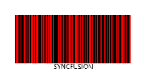
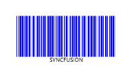

# Barcode Customization in Windows Forms Barcode

The color of the barcode can be customized by modifying the [DarkBarColor](https://help.syncfusion.com/cr/windowsforms/Syncfusion.Windows.Forms.Barcode.SfBarcode.html#Syncfusion_Windows_Forms_Barcode_SfBarcode_DarkBarColor) and [LightBarColor](https://help.syncfusion.com/cr/windowsforms/Syncfusion.Windows.Forms.Barcode.SfBarcode.html#Syncfusion_Windows_Forms_Barcode_SfBarcode_LightBarColor) properties of the barcode control.



this.sfBarcode1.DarkBarColor = System.Drawing.Color.FromArgb(255, 0, 0);
this.sfBarcode1.LightBarColor = System.Drawing.Color.FromArgb(255, 0, 0);


Me.SfBarcode1.DarkBarColor = System.Drawing.Color.FromArgb(255, 0, 0)
Me.SfBarcode1.LightBarColor = System.Drawing.Color.FromArgb(255, 0, 0)



The DarkBarColor represents the color of the dark bar (black color usually) and the LightBarColor represents the color of the gap between two adjacent black bars (white color usually).

Barcode color combinations- Red
{:.caption}

Barcode color combinations- Blue
{:.caption}

N> The DarkBarColor and LightBarColor customizations are applicable only for one-dimensional barcodes. In order for a barcode symbol to be recognized by a scanner, there must be adequate contrast between the dark bars and the light spaces, and not all barcode scanners have support for colored barcodes.
