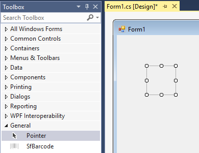

# Getting Started

## Add Barcode control to an Application 

The following assembly reference is required for deploying Barcode.



Namespace: Syncfusion.Windows.Forms.Barcode.SfBarcode

Assembly: Syncfusion.SfBarcode.Windows



To create the SfBarcode control in Visual Studio:

1. Create a new Windows Forms project. 

2. Drag the SfBarcode control from the Toolbox window to the Design View. An instance of the SfBarcode control is created in the Design view.

   

   SfBarcode Control after Dragging to Design View
   {:.caption}

## Text

The text to be encoded can be set using the Text property. By default, this original text will be displayed at the bottom of the bar code. The location of the text can be toggled between top and bottom using TextLocation property. The horizontal alignment of the text can be set using TextAlignment. The text brush and other various font customization can also be done using the built-in font properties. Optionally, the user can hide the barcode text by setting the DisplayText property to false.



            this.sfBarcode1.Text = "http://www.google.com";
            this.sfBarcode1.DisplayText = true;
            this.sfBarcode1.Symbology = Syncfusion.Windows.Forms.Barcode.BarcodeSymbolType.QRBarcode;


