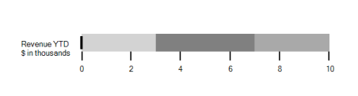
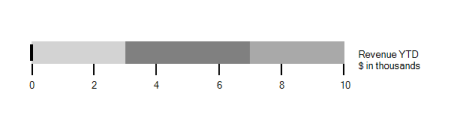

# Caption Settings in Windows Forms Bullet Graph

The caption for a Bullet Graph specifies a unique label describing the value represented in the BulletGraph. The caption is set by using the [Caption](https://help.syncfusion.com/cr/windowsforms/Syncfusion.Windows.Forms.BulletGraph.BulletGraph.html#Syncfusion_Windows_Forms_BulletGraph_BulletGraph_Caption) property.



BulletGraph bullet = new BulletGraph();
bullet.Dock = DockStyle.Fill;
bullet.Caption = " Revenue YTD \n $ in thousands";
bullet.QualitativeRanges.Add(new QualitativeRange() { RangeEnd = 3, RangeStroke = Color.LightGray });
bullet.QualitativeRanges.Add(new QualitativeRange() { RangeEnd = 7, RangeStroke = Color.Gray });
bullet.QualitativeRanges.Add(new QualitativeRange() { RangeEnd = 10, RangeStroke = Color.DarkGray });
this.Controls.Add(bullet);



Dim bullet As New BulletGraph()
bullet.Dock = DockStyle.Fill
bullet.Caption = " Revenue YTD " & Environment.NewLine & " $ in thousands"
bullet.QualitativeRanges.Add(New QualitativeRange() With {.RangeEnd = 3, .RangeStroke = Color.LightGray})
bullet.QualitativeRanges.Add(New QualitativeRange() With {.RangeEnd = 7, .RangeStroke = Color.Gray})
bullet.QualitativeRanges.Add(New QualitativeRange() With {.RangeEnd = 10, .RangeStroke = Color.DarkGray})
Me.Controls.Add(bullet)



### Caption Position

The caption in the Bullet Graph is placed at the start or end of the quantitative scale by choosing from one of the two options available in the [CaptionPosition](https://help.syncfusion.com/cr/windowsforms/Syncfusion.Windows.Forms.BulletGraph.BulletGraph.html#Syncfusion_Windows_Forms_BulletGraph_BulletGraph_CaptionPosition) property. They are:

* Near (Default)
* Far



BulletGraph bullet = new BulletGraph();
bullet.Dock = DockStyle.Fill;
bullet.Caption = " Revenue YTD \n $ in thousands";
bullet.CaptionPosition = BulletGraphCaptionPosition.Far;
bullet.QualitativeRanges.Add(new QualitativeRange() { RangeEnd = 3, RangeStroke = Color.LightGray });
bullet.QualitativeRanges.Add(new QualitativeRange() { RangeEnd = 7, RangeStroke = Color.Gray });
bullet.QualitativeRanges.Add(new QualitativeRange() { RangeEnd = 10, RangeStroke = Color.DarkGray });
this.Controls.Add(bullet);



Dim bullet As New BulletGraph()
bullet.Dock = DockStyle.Fill
bullet.Caption = " Revenue YTD " & Environment.NewLine & " $ in thousands"
bullet.CaptionPosition = BulletGraphCaptionPosition.Far
bullet.QualitativeRanges.Add(New QualitativeRange() With {.RangeEnd = 3, .RangeStroke = Color.LightGray})
bullet.QualitativeRanges.Add(New QualitativeRange() With {.RangeEnd = 7, .RangeStroke = Color.Gray})
bullet.QualitativeRanges.Add(New QualitativeRange() With {.RangeEnd = 10, .RangeStroke = Color.DarkGray})
Me.Controls.Add(bullet)



