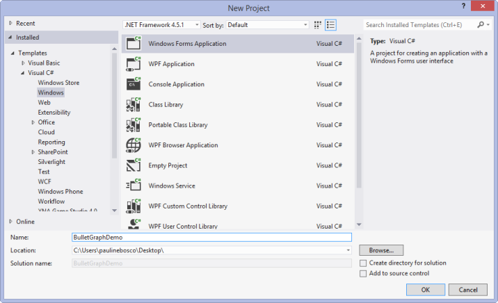
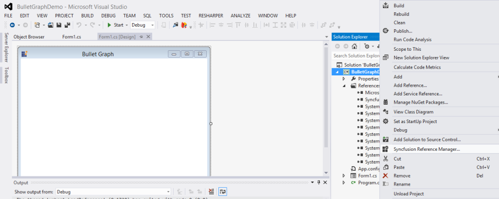
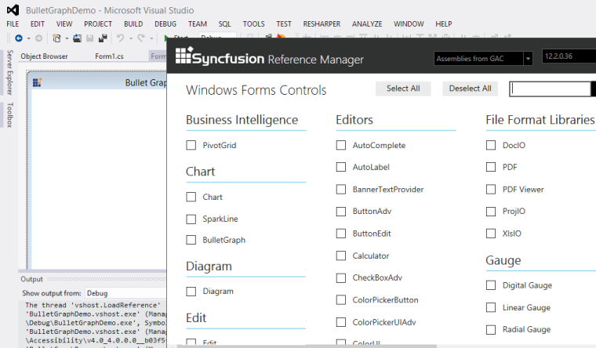
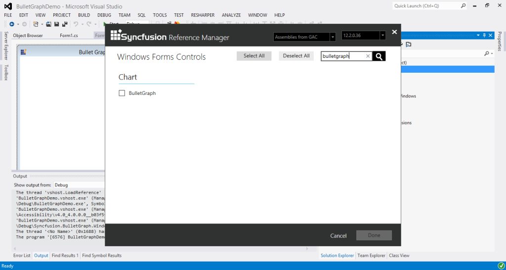
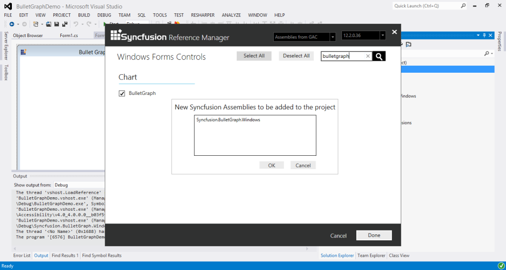
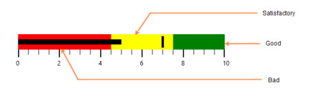

# Getting Started with Windows Forms Bullet Graph

The Bullet Graph is composed of a quantitative scale, qualitative ranges, a featured measure, and a comparative measure. The main purpose of the Bullet Graph is described using the caption. The quantitative scale of the Bullet Graph includes ticks and labels. The view of the Bullet Graph is changed by setting the [Orientation](https://help.syncfusion.com/cr/windowsforms/Syncfusion.Windows.Forms.BulletGraph.BulletGraph.html#Syncfusion_Windows_Forms_BulletGraph_BulletGraph_Orientation) property.

## Assembly deployment

Refer to the [control dependencies](https://help.syncfusion.com/windowsforms/control-dependencies#bulletgraph) section to get the list of assemblies or NuGet packages that need to be added as reference to use the control in any application.

For more details on how to install NuGet packages in a Windows Forms application, refer to the following link:

[How to install NuGet packages](https://help.syncfusion.com/windowsforms/installation/install-nuget-packages)

## Create the Bullet Graph Programmatically

* Assembly information

The Bullet Graph is available in the following assembly.

Assembly: Syncfusion.BulletGraph.Windows

* Namespace

The Bullet Graph is available in the following namespace.

Namespace: Syncfusion.Windows.Forms.BulletGraph

### Steps to create a simple Bullet Graph control:

1. Create a new Windows Forms application project in Visual Studio.

   
   
2. Add references to Syncfusion.BulletGraph.Windows.
3. Add the Bullet Graph control in the code behind as follows.

   
   
   BulletGraph bullet = new BulletGraph();
   bullet.Dock = DockStyle.Fill;
   bullet.FlowDirection = BulletGraphFlowDirection.Forward;
   bullet.Orientation = Orientation.Horizontal;
   bullet.FeaturedMeasure = 4.5;
   bullet.ComparativeMeasure = 7;
   bullet.LabelFontSize = 10;
   bullet.LabelStroke = Color.Black;
   bullet.MajorTickStroke = Color.Black;
   bullet.Minimum = 0;
   bullet.Maximum = 10;
   bullet.Interval = 2;
   bullet.MinorTicksPerInterval = 3;
   bullet.QualitativeRanges.Add(new QualitativeRange() { RangeEnd = 4, RangeCaption = "Bad", RangeStroke = Color.Red });
   bullet.QualitativeRanges.Add(new QualitativeRange() { RangeEnd = 7, RangeCaption = "Satisfactory", RangeStroke = Color.Yellow });
   bullet.QualitativeRanges.Add(new QualitativeRange() { RangeEnd = 10, RangeCaption = "Good", RangeStroke = Color.Green });
   this.Controls.Add(bullet);
   

   
   Dim bullet As New BulletGraph()
   bullet.Dock = DockStyle.Fill
   bullet.FlowDirection = BulletGraphFlowDirection.Forward
   bullet.Orientation = Orientation.Horizontal
   bullet.FeaturedMeasure = 4.5
   bullet.ComparativeMeasure = 7
   bullet.LabelFontSize = 10
   bullet.LabelStroke = Color.Black
   bullet.MajorTickStroke = Color.Black
   bullet.Minimum = 0
   bullet.Maximum = 10
   bullet.Interval = 2
   bullet.MinorTicksPerInterval = 3
   bullet.QualitativeRanges.Add(New QualitativeRange() With {.RangeEnd = 4, .RangeCaption = "Bad", .RangeStroke = Color.Red})
   bullet.QualitativeRanges.Add(New QualitativeRange() With {.RangeEnd = 7, .RangeCaption = "Satisfactory", .RangeStroke = Color.Yellow})
   bullet.QualitativeRanges.Add(New QualitativeRange() With {.RangeEnd = 10, .RangeCaption = "Good", .RangeStroke = Color.Green})
   Me.Controls.Add(bullet)
   
   

4. Run the application to view the Bullet Graph.

   

## Create the Bullet Graph using Syncfusion® Reference Manager

The Syncfusion® Reference Manager is used to add Syncfusion® tools.

To add a Bullet Graph control, refer to the following steps:

1. Create a simple Windows Forms application using Visual Studio.

   

2. Right-click the project and select Syncfusion Reference Manager.

   

3. The Syncfusion® Reference Manager wizard opens as shown in the following screenshot.

   

4. Search for the Bullet Graph using the search box and select the Bullet Graph control. Click Done to add the selected Bullet Graph control.

   

5. The Bullet Graph assemblies are automatically added to the project after clicking OK.

   

6. Add the following code example in the code behind to create a simple Bullet Graph control.

   
   
   BulletGraph bullet = new BulletGraph();
   bullet.Dock = DockStyle.Fill;
   bullet.FlowDirection = BulletGraphFlowDirection.Forward;
   bullet.Orientation = Orientation.Horizontal;
   bullet.FeaturedMeasure = 4.5;
   bullet.ComparativeMeasure = 7;
   bullet.LabelFontSize = 10;
   bullet.LabelStroke = Color.Black;
   bullet.MajorTickStroke = Color.Black;
   bullet.Minimum = 0;
   bullet.Maximum = 10;
   bullet.Interval = 2;
   bullet.MinorTicksPerInterval = 3;
   bullet.QualitativeRanges.Add(new QualitativeRange() { RangeEnd = 4, RangeCaption = "Bad", RangeStroke = Color.Red });
   bullet.QualitativeRanges.Add(new QualitativeRange() { RangeEnd = 7, RangeCaption = "Satisfactory", RangeStroke = Color.Yellow });
   bullet.QualitativeRanges.Add(new QualitativeRange() { RangeEnd = 10, RangeCaption = "Good", RangeStroke = Color.Green });
   this.Controls.Add(bullet);
   

   
   Dim bullet As New BulletGraph()
   bullet.Dock = DockStyle.Fill
   bullet.FlowDirection = BulletGraphFlowDirection.Forward
   bullet.Orientation = Orientation.Horizontal
   bullet.FeaturedMeasure = 4.5
   bullet.ComparativeMeasure = 7
   bullet.LabelFontSize = 10
   bullet.LabelStroke = Color.Black
   bullet.MajorTickStroke = Color.Black
   bullet.Minimum = 0
   bullet.Maximum = 10
   bullet.Interval = 2
   bullet.MinorTicksPerInterval = 3
   bullet.QualitativeRanges.Add(New QualitativeRange() With {.RangeEnd = 4, .RangeCaption = "Bad", .RangeStroke = Color.Red})
   bullet.QualitativeRanges.Add(New QualitativeRange() With {.RangeEnd = 7, .RangeCaption = "Satisfactory", .RangeStroke = Color.Yellow})
   bullet.QualitativeRanges.Add(New QualitativeRange() With {.RangeEnd = 10, .RangeCaption = "Good", .RangeStroke = Color.Green})
   Me.Controls.Add(bullet)
   
   

7. The simple Bullet Graph control is created as shown in the following screenshot.

   

   N> 1. The Syncfusion® Reference Manager is available in versions 11.3.0.30 and later. It supports referencing assemblies from version 10.4.0.71 to the current version.
   N>
   N> 2. The Syncfusion® Reference Manager is used only in Visual Studio 2015 or higher.
