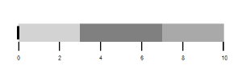

# Orientation in Windows Forms Bullet Graph

The view of the Bullet Graph is changed by setting the Orientation property. Quantitative scale contains two major components: Ticks and Labels. The length of the quantitative scale is customized by using the QuantitativeScaleLength property. The direction of the quantitative scale is personalized by making use of the FlowDirection property it’s either Forward or Backward.



    BulletGraph bullet = new BulletGraph();

    bullet.Dock = DockStyle.Fill;

    bullet.FlowDirection = BulletGraphFlowDirection.Forward;

    bullet.Orientation = Orientation.Horizontal;

     bullet.QualitativeRanges.Add(new QualitativeRange() { RangeEnd = 3, RangeStroke = Color.LightGray });

    bullet.QualitativeRanges.Add(new QualitativeRange() { RangeEnd = 7, RangeStroke = Color.Gray });

    bullet.QualitativeRanges.Add(new QualitativeRange() { RangeEnd = 10, RangeStroke = Color.DarkGray });                    

    this.Controls.Add(bullet);



<table>
<tr>
<td>
{{' ' | markdownify }}

</td><td>
{{' ' | markdownify }}

</td></tr>
</table>
