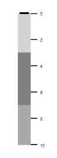
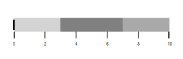

# Orientation in Windows Forms Bullet Graph

The view of the Bullet Graph is changed by setting the [Orientation](https://help.syncfusion.com/cr/windowsforms/Syncfusion.Windows.Forms.BulletGraph.BulletGraph.html#Syncfusion_Windows_Forms_BulletGraph_BulletGraph_Orientation) property. The quantitative scale contains two major components: ticks and labels. The length of the quantitative scale is customized by using the [QuantitativeScaleLength](https://help.syncfusion.com/cr/windowsforms/Syncfusion.Windows.Forms.BulletGraph.BulletGraph.html#Syncfusion_Windows_Forms_BulletGraph_BulletGraph_QuantitativeScaleLength) property. The direction of the quantitative scale is customized by using the [FlowDirection](https://help.syncfusion.com/cr/windowsforms/Syncfusion.Windows.Forms.BulletGraph.BulletGraph.html#Syncfusion_Windows_Forms_BulletGraph_BulletGraph_FlowDirection) property. It is either Forward or Backward.


BulletGraph bullet = new BulletGraph();
bullet.Dock = DockStyle.Fill;
bullet.FlowDirection = BulletGraphFlowDirection.Forward;
bullet.Orientation = Orientation.Horizontal;
bullet.QualitativeRanges.Add(new QualitativeRange() { RangeEnd = 3, RangeStroke = Color.LightGray });
bullet.QualitativeRanges.Add(new QualitativeRange() { RangeEnd = 7, RangeStroke = Color.Gray });
bullet.QualitativeRanges.Add(new QualitativeRange() { RangeEnd = 10, RangeStroke = Color.DarkGray });
this.Controls.Add(bullet);


<table>
<tr>
<td>
{{' ' | markdownify }}

</td><td>
{{' ' | markdownify }}

</td></tr>
</table>

