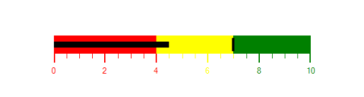

# Range Settings in Windows Forms Bullet Graph

Ranges for a Bullet Graph are a collection of qualitative ranges. A qualitative range is a visual element that ends at a specified [RangeEnd](https://help.syncfusion.com/cr/windowsforms/Syncfusion.Windows.Forms.BulletGraph.QualitativeRange.html#Syncfusion_Windows_Forms_BulletGraph_QualitativeRange_RangeEnd) at the start of the previous range's RangeEnd. The qualitative ranges are arranged according to each RangeEnd value.

### Customizing Range:

The width of the ranges is customized by setting the [QualitativeRangesSize](https://help.syncfusion.com/cr/windowsforms/Syncfusion.Windows.Forms.BulletGraph.BulletGraph.html#Syncfusion_Windows_Forms_BulletGraph_BulletGraph_QualitativeRangesSize) property. By changing the [RangeStroke](https://help.syncfusion.com/cr/windowsforms/Syncfusion.Windows.Forms.BulletGraph.QualitativeRange.html#Syncfusion_Windows_Forms_BulletGraph_QualitativeRange_RangeStroke) of the qualitative range, the stroke of the range is customized. By setting the [RangeOpacity](https://help.syncfusion.com/cr/windowsforms/Syncfusion.Windows.Forms.BulletGraph.QualitativeRange.html#Syncfusion_Windows_Forms_BulletGraph_QualitativeRange_RangeOpacity) of the qualitative range, the opacity of the range is modified.


BulletGraph bullet = new BulletGraph();
bullet.Dock = DockStyle.Fill;
bullet.FeaturedMeasure = 4.5;
bullet.ComparativeMeasure = 7;
bullet.MinorTicksPerInterval = 3;
bullet.QualitativeRanges.Add(new QualitativeRange() { RangeEnd = 4, RangeCaption = "Bad", RangeStroke = Color.Red });
bullet.QualitativeRanges.Add(new QualitativeRange() { RangeEnd = 7, RangeCaption = "Satisfactory", RangeStroke = Color.Yellow });
bullet.QualitativeRanges.Add(new QualitativeRange() { RangeEnd = 10, RangeCaption = "Good", RangeStroke = Color.Green });
this.Controls.Add(bullet);



Dim bullet As New BulletGraph()
bullet.Dock = DockStyle.Fill
bullet.FeaturedMeasure = 4.5
bullet.ComparativeMeasure = 7
bullet.MinorTicksPerInterval = 3
bullet.QualitativeRanges.Add(New QualitativeRange() With {.RangeEnd = 4, .RangeCaption = "Bad", .RangeStroke = Color.Red})
bullet.QualitativeRanges.Add(New QualitativeRange() With {.RangeEnd = 7, .RangeCaption = "Satisfactory", .RangeStroke = Color.Yellow})
bullet.QualitativeRanges.Add(New QualitativeRange() With {.RangeEnd = 10, .RangeCaption = "Good", .RangeStroke = Color.Green})
Me.Controls.Add(bullet)


### Binding RangeStroke to Ticks and Labels:

By setting [BindRangeStrokeToLabels](https://help.syncfusion.com/cr/windowsforms/Syncfusion.Windows.Forms.BulletGraph.BulletGraph.html#Syncfusion_Windows_Forms_BulletGraph_BulletGraph_BindRangeStrokeToLabels), the stroke of the labels is set related to the stroke of the specified ranges. Similarly, by setting [BindRangeStrokeToTicks](https://help.syncfusion.com/cr/windowsforms/Syncfusion.Windows.Forms.BulletGraph.BulletGraph.html#Syncfusion_Windows_Forms_BulletGraph_BulletGraph_BindRangeStrokeToTicks), the stroke of the ticks is set related to the stroke of the specified ranges.


BulletGraph bullet = new BulletGraph();
bullet.Dock = DockStyle.Fill;
bullet.FeaturedMeasure = 4.5;
bullet.ComparativeMeasure = 7;
bullet.MajorTickStroke = Color.Black;
bullet.MinorTicksPerInterval = 3;
bullet.QualitativeRanges.Add(new QualitativeRange() { RangeEnd = 4, RangeCaption = "Bad", RangeStroke = Color.Red });
bullet.QualitativeRanges.Add(new QualitativeRange() { RangeEnd = 7, RangeCaption = "Satisfactory", RangeStroke = Color.Yellow });
bullet.QualitativeRanges.Add(new QualitativeRange() { RangeEnd = 10, RangeCaption = "Good", RangeStroke = Color.Green });
bullet.BindRangeStrokeToTicks = true;
bullet.BindRangeStrokeToLabels = true;
this.Controls.Add(bullet);



Dim bullet As New BulletGraph()
bullet.Dock = DockStyle.Fill
bullet.FeaturedMeasure = 4.5
bullet.ComparativeMeasure = 7
bullet.MajorTickStroke = Color.Black
bullet.MinorTicksPerInterval = 3
bullet.QualitativeRanges.Add(New QualitativeRange() With {.RangeEnd = 4, .RangeCaption = "Bad", .RangeStroke = Color.Red})
bullet.QualitativeRanges.Add(New QualitativeRange() With {.RangeEnd = 7, .RangeCaption = "Satisfactory", .RangeStroke = Color.Yellow})
bullet.QualitativeRanges.Add(New QualitativeRange() With {.RangeEnd = 10, .RangeCaption = "Good", .RangeStroke = Color.Green})
bullet.BindRangeStrokeToTicks = True
bullet.BindRangeStrokeToLabels = True
Me.Controls.Add(bullet)


