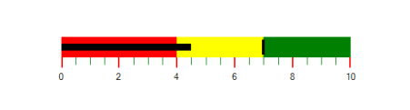
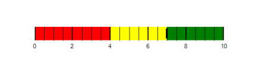

# Scale Tick Mark Settings in Windows Forms Bullet Graph

The quantitative scale is displayed with two types of ticks:

* Major ticks: The primary scale indicators.
* Minor ticks: The secondary scale indicators that fall in between the major ticks.

### Customizing Ticks:

The stroke of the major and minor ticks is customized by setting the [MajorTickStroke](https://help.syncfusion.com/cr/windowsforms/Syncfusion.Windows.Forms.BulletGraph.BulletGraph.html#Syncfusion_Windows_Forms_BulletGraph_BulletGraph_MajorTickStroke) and [MinorTickStroke](https://help.syncfusion.com/cr/windowsforms/Syncfusion.Windows.Forms.BulletGraph.BulletGraph.html#Syncfusion_Windows_Forms_BulletGraph_BulletGraph_MinorTickStroke) properties. The size is modified by using the [MajorTickSize](https://help.syncfusion.com/cr/windowsforms/Syncfusion.Windows.Forms.BulletGraph.BulletGraph.html#Syncfusion_Windows_Forms_BulletGraph_BulletGraph_MajorTickSize) and [MinorTickSize](https://help.syncfusion.com/cr/windowsforms/Syncfusion.Windows.Forms.BulletGraph.BulletGraph.html#Syncfusion_Windows_Forms_BulletGraph_BulletGraph_MinorTickSize) properties. By setting [MajorTickStrokeThickness](https://help.syncfusion.com/cr/windowsforms/Syncfusion.Windows.Forms.BulletGraph.BulletGraph.html#Syncfusion_Windows_Forms_BulletGraph_BulletGraph_MajorTickStrokeThickness) and [MinorTickStrokeThickness](https://help.syncfusion.com/cr/windowsforms/Syncfusion.Windows.Forms.BulletGraph.BulletGraph.html#Syncfusion_Windows_Forms_BulletGraph_BulletGraph_MinorTickStrokeThickness), the stroke's thickness is customized.



BulletGraph bullet = new BulletGraph();
bullet.Dock = DockStyle.Fill;
bullet.FeaturedMeasure = 4.5;
bullet.ComparativeMeasure = 7;
bullet.MajorTickStroke = Color.Black;
bullet.MajorTickSize = 15;
bullet.MinorTickSize = 10;
bullet.MajorTickStroke = Color.Red;
bullet.MinorTickStroke = Color.Green;
bullet.MinorTicksPerInterval = 3;
bullet.QualitativeRanges.Add(new QualitativeRange() { RangeEnd = 4, RangeCaption = "Bad", RangeStroke = Color.Red });
bullet.QualitativeRanges.Add(new QualitativeRange() { RangeEnd = 7, RangeCaption = "Satisfactory", RangeStroke = Color.Yellow });
bullet.QualitativeRanges.Add(new QualitativeRange() { RangeEnd = 10, RangeCaption = "Good", RangeStroke = Color.Green });
this.Controls.Add(bullet);



Dim bullet As New BulletGraph()
bullet.Dock = DockStyle.Fill
bullet.FeaturedMeasure = 4.5
bullet.ComparativeMeasure = 7
bullet.MajorTickStroke = Color.Black
bullet.MajorTickSize = 15
bullet.MinorTickSize = 10
bullet.MajorTickStroke = Color.Red
bullet.MinorTickStroke = Color.Green
bullet.MinorTicksPerInterval = 3
bullet.QualitativeRanges.Add(New QualitativeRange() With {.RangeEnd = 4, .RangeCaption = "Bad", .RangeStroke = Color.Red})
bullet.QualitativeRanges.Add(New QualitativeRange() With {.RangeEnd = 7, .RangeCaption = "Satisfactory", .RangeStroke = Color.Yellow})
bullet.QualitativeRanges.Add(New QualitativeRange() With {.RangeEnd = 10, .RangeCaption = "Good", .RangeStroke = Color.Green})
Me.Controls.Add(bullet)



### TickPosition:

The ticks in the scale are placed above or below the ranges of the quantitative scale by choosing the options available in the [TickPosition](https://help.syncfusion.com/cr/windowsforms/Syncfusion.Windows.Forms.BulletGraph.BulletGraph.html#Syncfusion_Windows_Forms_BulletGraph_BulletGraph_TickPosition) property.

They are:

* Below (Default)
* Above
* Cross



BulletGraph bullet = new BulletGraph();
bullet.Dock = DockStyle.Fill;
bullet.ComparativeMeasure = 7;
bullet.TickPosition = BulletGraphTicksPosition.Cross;
bullet.MajorTickSize = 30;
bullet.MinorTickSize = 30;
bullet.MinorTicksPerInterval = 3;
bullet.QualitativeRanges.Add(new QualitativeRange() { RangeEnd = 4, RangeCaption = "Bad", RangeStroke = Color.Red });
bullet.QualitativeRanges.Add(new QualitativeRange() { RangeEnd = 7, RangeCaption = "Satisfactory", RangeStroke = Color.Yellow });
bullet.QualitativeRanges.Add(new QualitativeRange() { RangeEnd = 10, RangeCaption = "Good", RangeStroke = Color.Green });
this.Controls.Add(bullet);



Dim bullet As New BulletGraph()
bullet.Dock = DockStyle.Fill
bullet.ComparativeMeasure = 7
bullet.TickPosition = BulletGraphTicksPosition.Cross
bullet.MajorTickSize = 30
bullet.MinorTickSize = 30
bullet.MinorTicksPerInterval = 3
bullet.QualitativeRanges.Add(New QualitativeRange() With {.RangeEnd = 4, .RangeCaption = "Bad", .RangeStroke = Color.Red})
bullet.QualitativeRanges.Add(New QualitativeRange() With {.RangeEnd = 7, .RangeCaption = "Satisfactory", .RangeStroke = Color.Yellow})
bullet.QualitativeRanges.Add(New QualitativeRange() With {.RangeEnd = 10, .RangeCaption = "Good", .RangeStroke = Color.Green})
Me.Controls.Add(bullet)



