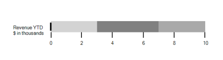

# Caption Settings

The Caption for a Bullet Graph specifies a unique label describing the value represented in the BulletGraph. 



			BulletGraph bulletgraph = new BulletGraph();

            bulletgraph.Dock = DockStyle.Fill;

            bulletgraph.Caption = " Revenue YTD \n $ in thousands";

            bulletgraph.QualitativeRanges.Add(new QualitativeRange() { RangeEnd = 3, RangeStroke = Color.LightGray });

            bulletgraph.QualitativeRanges.Add(new QualitativeRange() { RangeEnd = 7, RangeStroke = Color.Gray });

            bulletgraph.QualitativeRanges.Add(new QualitativeRange() { RangeEnd = 10, RangeStroke = Color.DarkGray });                    

            this.Controls.Add(bulletgraph);



### Caption Position

The caption in the Bullet Graph is placed at the start or end of the quantitative scale by choosing from one of the two options available in the CaptionPosition property. They are:

* Near (Default)
* Far



            BulletGraph bulletgraph = new BulletGraph();

            bulletgraph.Dock = DockStyle.Fill;

            bulletgraph.Caption = " Revenue YTD \n $ in thousands";

            bulletgraph.CaptionPosition = BulletGraphCaptionPosition.Far;            bulletgraph.QualitativeRanges.Add(new QualitativeRange() { RangeEnd = 3, RangeStroke = Color.LightGray });

            bulletgraph.QualitativeRanges.Add(new QualitativeRange() { RangeEnd = 7, RangeStroke = Color.Gray });

            bulletgraph.QualitativeRanges.Add(new QualitativeRange() { RangeEnd = 10, RangeStroke = Color.DarkGray });                    

            this.Controls.Add(bulletgraph);



