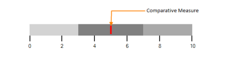

# Measure Settings (Featured / Comparative Measure)

### Featured Measure:

Featured Measure displays the primary data, or the current value of the data that you are measuring. It should usually be encoded as a bar, like the bar on a bar graph, and be prominent.

#### Customizing Featured Measure:

The value of the Featured Measure of the BulletGraph is set by the FeaturedMeasure property. By setting the FeaturedMeasureBarStroke property, the stroke of the FeatureMeasure bar is customized. The thickness of the Featured Measure bar is modified by using FeaturedMeasureBarStrokeThickness.



            BulletGraph bulletgraph = new BulletGraph();

            bulletgraph.Dock = DockStyle.Fill;

            bulletgraph.FeaturedMeasure = 5;

            bulletgraph.FeaturedMeasureBarStroke = Color.Red;

            bulletgraph.QualitativeRanges.Add(new QualitativeRange() { RangeEnd = 3, RangeStroke = Color.LightGray });

            bulletgraph.QualitativeRanges.Add(new QualitativeRange() { RangeEnd = 7, RangeStroke = Color.Gray });

            bulletgraph.QualitativeRanges.Add(new QualitativeRange() { RangeEnd = 10, RangeStroke = Color.DarkGray });                    

            this.Controls.Add(bulletgraph);



### Comparative Measure:

Comparative Measure should be less visually dominant than the Featured Measure. It should always be encoded as a short line that runs perpendicular to the orientation of the graph. A good example is a target for YTD revenue. Whenever the Featured Measure intersects a Comparative Measure, the Comparative Measure appears behind the Featured Measure.

#### Customizing Comparative Measure:

The value of the Comparative Measure is set by using the ComparativeMeasure property. By setting the ComparativeMeasureSymbolStroke property, the stroke of the Comparative Measure symbol is customized. The thickness of the Comparative Measure symbol is modified by using ComparativeMeasureSymbolStrokeThickness.



            BulletGraph bulletgraph = new BulletGraph();

            bulletgraph.Dock = DockStyle.Fill;

            bulletgraph.ComparativeMeasure = 5;

            bulletgraph.ComparativeMeasureSymbolStroke = Color.Red;

            bulletgraph.QualitativeRanges.Add(new QualitativeRange() { RangeEnd = 3, RangeStroke = Color.LightGray });

            bulletgraph.QualitativeRanges.Add(new QualitativeRange() { RangeEnd = 7, RangeStroke = Color.Gray });

            bulletgraph.QualitativeRanges.Add(new QualitativeRange() { RangeEnd = 10, RangeStroke = Color.DarkGray });                    

            this.Controls.Add(bulletgraph);



