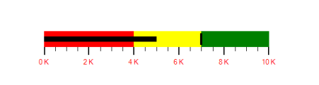

# Scale Label settings

### Labels:

A quantitative scale label specifies the numeric value according to the major ticks in the range of the scale.

### Customizing Labels:

The label’s offset is changed by using the LabelOffset property. The foreground of the label is customized by setting LabelStroke. By setting LabelSize, the font size of the labels is modified. 



			BulletGraph bulletgraph = new BulletGraph();

            bulletgraph.Dock = DockStyle.Fill;

            bulletgraph.FeaturedMeasure = 5;

            bulletgraph.ComparativeMeasure = 7;

            bulletgraph.LabelOffset = 5;

            bulletgraph.LabelFontSize = 10;

            bulletgraph.LabelFormat = "#0 K";

            bulletgraph.LabelStroke =Color.Red;

            bulletgraph.MinorTicksPerInterval = 3;

            bulletgraph.QualitativeRanges.Add(new QualitativeRange() { RangeEnd = 4, RangeCaption = "Bad", RangeStroke = Color.Red });

            bulletgraph.QualitativeRanges.Add(new QualitativeRange() { RangeEnd = 7, RangeCaption = "Satisfactory", RangeStroke = Color.Yellow });

            bulletgraph.QualitativeRanges.Add(new QualitativeRange() { RangeEnd = 10, RangeCaption = "Good", RangeStroke = Color.Green });

            this.Controls.Add(bulletgraph); 

 

### Label Position

The labels in the scale are placed above or below the qualitative ranges by choosing the following options available in the LabelPosition property. 

* Below (Default)
* Above



			BulletGraph bulletgraph = new BulletGraph();

            bulletgraph.Dock = DockStyle.Fill;

            bulletgraph.FeaturedMeasure = 5;

            bulletgraph.ComparativeMeasure = 7;

            bulletgraph.LabelPosition = BulletGraphLabelsPosition.Above;

            bulletgraph.MinorTicksPerInterval = 3;

            bulletgraph.QualitativeRanges.Add(new QualitativeRange() { RangeEnd = 4, RangeCaption = "Bad", RangeStroke = Color.Red });

            bulletgraph.QualitativeRanges.Add(new QualitativeRange() { RangeEnd = 7, RangeCaption = "Satisfactory", RangeStroke = Color.Yellow });

            bulletgraph.QualitativeRanges.Add(new QualitativeRange() { RangeEnd = 10, RangeCaption = "Good", RangeStroke = Color.Green });

            this.Controls.Add(bulletgraph);   



