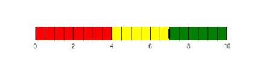

# Scale Tick Mark Settings

Quantitative scale is displayed with two types of ticks: 

Major ticks, the primary scale indicators.

Minor ticks, the secondary scale indicators that fall in between the major ticks.

### Customizing Ticks:

The stroke of the major and minor ticks is customized by setting the MajorTickStroke and MinorTickStroke properties. The size is modified by using the MajorTickSize and MinorTickSize properties. By setting MajorTickStrokeThickness and MinorTickStrokeThickness, the stroke’s thickness is customized.



			BulletGraph bulletgraph = new BulletGraph();

            bulletgraph.Dock = DockStyle.Fill;            

            bulletgraph.FeaturedMeasure = 4.5;

            bulletgraph.ComparativeMeasure = 7;            

            bulletgraph.MajorTickStroke = Color.Black;

            bulletgraph.MajorTickSize = 15;

            bulletgraph.MinorTickSize = 10;

            bulletgraph.MajorTickStroke = Color.Red;

            bulletgraph.MinorTickStroke = Color.Green;

            bulletgraph.MinorTicksPerInterval = 3;

            bulletgraph.QualitativeRanges.Add(new QualitativeRange() { RangeEnd = 4, RangeCaption = "Bad", RangeStroke = Color.Red });

            bulletgraph.QualitativeRanges.Add(new QualitativeRange() { RangeEnd = 7, RangeCaption = "Satisfactory", RangeStroke = Color.Yellow });

            bulletgraph.QualitativeRanges.Add(new QualitativeRange() { RangeEnd = 10, RangeCaption = "Good", RangeStroke = Color.Green });  

            this.Controls.Add(bulletgraph);



### TickPosition:

The ticks in the scale are placed above or below the ranges of the quantitative scale by choosing the options available in the TickPosition property. 

They are:

* Below (Default)
* Above
* Cross



			BulletGraph bulletgraph = new BulletGraph();

            bulletgraph.Dock = DockStyle.Fill;

            bulletgraph.ComparativeMeasure = 7;

            bulletgraph.TickPosition = BulletGraphTicksPosition.Cross;

            bulletgraph.MajorTickSize = 30;

            bulletgraph.MinorTickSize = 30;

            bulletgraph.MinorTicksPerInterval = 3;

            bulletgraph.QualitativeRanges.Add(new QualitativeRange() { RangeEnd = 4, RangeCaption = "Bad", RangeStroke = Color.Red });

            bulletgraph.QualitativeRanges.Add(new QualitativeRange() { RangeEnd = 7, RangeCaption = "Satisfactory", RangeStroke = Color.Yellow });                          

            bulletgraph.QualitativeRanges.Add(new QualitativeRange() { RangeEnd = 10, RangeCaption = "Good", RangeStroke = Color.Green });               

            this.Controls.Add(bulletgraph);



