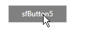
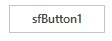

# Appearance in Windows Forms Button (SfButton)

This section describes how to customize the appearance of the [Windows Forms Button](https://www.syncfusion.com/winforms-ui-controls/button) (SfButton) control.

## Background

The background of the SfButton can be filled with solid color, gradient colors, or image. 

### BackColor

The background of the SfButton can be filled with solid color by initializing the [BackColor](https://help.syncfusion.com/cr/windowsforms/Syncfusion.WinForms.Controls.SfButton.html#Syncfusion_WinForms_Controls_SfButton_BackColor) property.



//Initialize the Gray color to the background of SfButton
sfButton1.BackColor = Color.Gray;




### Gradient BackColor

The background of the SfButton can be filled with gradient colors by initializing the GradientBrush property.



//Initialize the gradient background brush to SfButton.
sfButton1.Style.GradientBrush = new BrushInfo(GradientStyle.ForwardDiagonal, Color.Green, Color.Yellow);




### Background Image

The background of the SfButton can be filled with image by initialize the BackgroundImage property. The background image layout can be changed by initializing any one of ImageLayout enumeration value to BackgroundImageLayout property.




//Initializing the image value to BackgroundImage property.
this.sfButton1.BackgroundImage = Image.FromFile(@"..\..\Data\BackgroundImage.png");

//Sets the center image layout to the Background image.
this.sfButton1.BackgroundImageLayout = System.Windows.Forms.ImageLayout.Center;




## Customizing Appearance based on Button State

The SfButton provide options to customize the appearance based on the button state.

### Backcolor and Fore Color

The backcolor and fore color of the SfButton in hover state can be changed by using the [HoverBackColor](https://help.syncfusion.com/cr/windowsforms/Syncfusion.WinForms.Controls.Styles.ButtonVisualStyle.html#Syncfusion_WinForms_Controls_Styles_ButtonVisualStyle_HoverBackColor) and [HoverForeColor](https://help.syncfusion.com/cr/windowsforms/Syncfusion.WinForms.Controls.Styles.ButtonVisualStyle.html#Syncfusion_WinForms_Controls_Styles_ButtonVisualStyle_HoverForeColor) properties. Like the hover state, you can customize in pressed state, focused state, normal state, and disable state of the SfButton.



//Initializing the back color.
sfButton1.Style.BackColor = Color.Gray;

//Initializing the fore color.  
sfButton1.Style.ForeColor = Color.Black;

//Initializing the hover back color.
sfButton1.Style.HoverBackColor = Color.Gray;

//Initializing the hover fore color.
sfButton1.Style.HoverForeColor = Color.White;

//Initializing the focused back color.
sfButton1.Style.FocusedBackColor = Color.LightGray;

//Initializing the focused fore color.
sfButton1.Style.FocusedForeColor = Color.Black;
 



### Image

The SfButton allows changing the image in hover state by using the [HoverImage](https://help.syncfusion.com/cr/windowsforms/Syncfusion.WinForms.Controls.Styles.ButtonVisualStyle.html#Syncfusion_WinForms_Controls_Styles_ButtonVisualStyle_HoverImage) property. Like hover state, you can change the image in focused, disabled, and pressed states by using the [FocusedImage](https://help.syncfusion.com/cr/windowsforms/Syncfusion.WinForms.Controls.Styles.ButtonVisualStyle.html#Syncfusion_WinForms_Controls_Styles_ButtonVisualStyle_FocusedImage), [DisabledImage](https://help.syncfusion.com/cr/windowsforms/Syncfusion.WinForms.Controls.Styles.ButtonVisualStyle.html#Syncfusion_WinForms_Controls_Styles_ButtonVisualStyle_DisabledImage), and [PressedImage](https://help.syncfusion.com/cr/windowsforms/Syncfusion.WinForms.Controls.Styles.ButtonVisualStyle.html#Syncfusion_WinForms_Controls_Styles_ButtonVisualStyle_PressedImage) properties.



//Initializing the image for SfButton default state
sfButton1.Style.Image = Image.FromFile(@"..\..\Data\DefaultImage.png");

//Initializing the hover image for SfButton.
sfButton1.Style.HoverImage = Image.FromFile(@"..\..\Data\HoverImage.png");

//Initializing the pressed image for SfButton.
sfButton1.Style.PressedImage = Image.FromFile(@"..\..\Data\PressedImage.png");

//Initializing the Focused image for SfButton.
sfButton1.Style.FocusedImage = Image.FromFile(@"..\..\Data\FocusedImage.png");

//Initializing the disabled image for SfButton.
sfButton1.Style.DisabledImage = Image.FromFile(@"..\..\Data\DisabledImage.png");




### Border

The border can be changed based on the button state by using the [Border](https://help.syncfusion.com/cr/windowsforms/Syncfusion.WinForms.Controls.Styles.ButtonVisualStyle.html#Syncfusion_WinForms_Controls_Styles_ButtonVisualStyle_Border), [HoverBorder](https://help.syncfusion.com/cr/windowsforms/Syncfusion.WinForms.Controls.Styles.ButtonVisualStyle.html#Syncfusion_WinForms_Controls_Styles_ButtonVisualStyle_HoverBorder), [FocusedBorder](https://help.syncfusion.com/cr/windowsforms/Syncfusion.WinForms.Controls.Styles.ButtonVisualStyle.html#Syncfusion_WinForms_Controls_Styles_ButtonVisualStyle_FocusedBorder), [PressedBorder](https://help.syncfusion.com/cr/windowsforms/Syncfusion.WinForms.Controls.Styles.ButtonVisualStyle.html#Syncfusion_WinForms_Controls_Styles_ButtonVisualStyle_PressedBorder), and [DisabledBorder](https://help.syncfusion.com/cr/windowsforms/Syncfusion.WinForms.Controls.Styles.ButtonVisualStyle.html#Syncfusion_WinForms_Controls_Styles_ButtonVisualStyle_DisabledBorder) properties.



//Initialize the hover border
sfButton6.Style.HoverBorder = new Pen(Color.DarkGray, 2);



## Animating the Image

The animation image (.gif image) can be displayed in the SfButton by enabling the [AllowImageAnimation](https://help.syncfusion.com/cr/windowsforms/Syncfusion.WinForms.Controls.SfButton.html#Syncfusion_WinForms_Controls_SfButton_AllowImageAnimation) property and initialize the animation image to the [Image](https://help.syncfusion.com/cr/windowsforms/Syncfusion.WinForms.Controls.SfButton.html#Syncfusion_WinForms_Controls_SfButton_Image) property.



//Enable the Image animation
sfButton1.AllowImageAnimation = true;

//Initialize the animation image to SfButton.
sfButton1.Style.Image = Image.FromFile(@"..\..\Data\animationImage.gif");




**Note**: The SfButton does not allow you to animate the image, if the animated image set as FocusedImage, HoverImage, or PressedImage so, to show the animation image inside the button, initialize the animation image (gif image) using the Image property.

## Show or Hide Focus Rectangle

A thin dotted rectangular frame can be drawn inside the SfButton when it got focus. This feature can be enabled by setting the [FocusRectangleVisible](https://help.syncfusion.com/cr/windowsforms/Syncfusion.WinForms.Controls.SfButton.html#Syncfusion_WinForms_Controls_SfButton_FocusRectangleVisible) property to true.



//Enable the focus rectangle for SfButton
sfButton1.FocusRectangleVisible = true;




## Rounded Rectangle Button

The SfButton with rounded rectangle shape can be implemented programmatically by drawing the border using Paint event.

To draw the rounded rectangle shape for the SfButton follow the steps:

1. Raise the Paint event of the SfButton.
​


//Raises the paint event of the SfButton
sfButton1.Paint += sfButton1_Paint;



{{ codesnippet1 | OrderList_Indent_Level_1 }}

2. Calculate the rounded rectangle area for the client area of the button, and set to the region of the SfButton. Draw the border with calculated rounded rectangle area. The Paint event method is as follows.

​


private void sfButton1_Paint(object sender, PaintEventArgs e)
{
    //Rounded rectangle corder radius. The radius must be less than 10.
    int radius = 5;
    e.Graphics.SmoothingMode = SmoothingMode.AntiAlias;
    Rectangle rect = new Rectangle(this.sfButton1.ClientRectangle.X + 1, 
                                   this.sfButton1.ClientRectangle.Y + 1,
                                   this.sfButton1.ClientRectangle.Width - 2,
                                   this.sfButton1.ClientRectangle.Height - 2);
    sfButton1.Region = new Region(GetRoundedRect(rect, radius));
    rect = new Rectangle(rect.X + 1, rect.Y + 1, rect.Width - 2, rect.Height - 2);
    e.Graphics.DrawPath(new Pen(Color.Red), GetRoundedRect(rect, radius));
}



{{ codesnippet2 | OrderList_Indent_Level_1 }}

Refer to the following sample shows how to implement the rounded rectangle in the SfButton control.

[Sample](http://www.syncfusion.com/downloads/support/directtrac/general/SFBUTT~1449710690.ZIP)

**Note**: When using the previous implementation to draw the rounded rectangle, the border customization properties like Border, HoverBorder, PressedBorder, FocusedBorder, and DisabledBorder does not work.

## Themes

The SfButton offers four built-in themes for professional representation as follows:

* Office2016Colorful
* Office2016White
* Office2016DarkGray
* Office2016Black

Themes can be applied to the SfButton by using the following steps:

1. [Load theme assembly](#load-theme-assembly)
2. [Apply theme](#apply-theme)

### Load theme assembly

The Syncfusion.Office2016Theme.WinForms assembly should be added as reference to set theme for the SfButton in any application.

Before applying theme to the SfButton, required theme assembly should be loaded. 





using Syncfusion.WinForms.Controls;

         static class Program
    {
        /// 

        /// The main entry point for the application.
        /// 

        
        static void Main()
        {
            SfSkinManager.LoadAssembly(typeof(Office2016Theme).Assembly);
            Application.EnableVisualStyles();
            Application.SetCompatibleTextRenderingDefault(false);
            Application.Run(new Form1());
        }
    }





Imports Syncfusion.WinForms.Controls

 Friend Module Program
        ''' 

        ''' The main entry point for the application.
        ''' 

        Sub Main()
            SfSkinManager.LoadAssembly(GetType(Office2016Theme).Assembly)
            Application.EnableVisualStyles()
            Application.SetCompatibleTextRenderingDefault(False)
            Application.Run(New Form1())
        End Sub
    End Module





### Apply theme

Appearance of the SfButton can be changed by using the [ThemeName](https://help.syncfusion.com/cr/windowsforms/Syncfusion.WinForms.Controls.SfButton.html#Syncfusion_WinForms_Controls_SfButton_ThemeName).

#### Office2016Colorful

This option helps to set the Office2016Colorful Theme.





// Office2016Colorful

 this.sfButton.ThemeName = "Office2016Colorful";





' Office2016Colorful 

Me.sfButton.ThemeName = "Office2016Colorful"





#### Office2016White

This option helps to set the Office2016White Theme.





// Office2016White

 this.sfButton.ThemeName = "Office2016White";





' Office2016White 

Me.sfButton.ThemeName = "Office2016White"





#### Office2016DarkGray

This option helps to set the Office2016DarkGray Theme.





// Office2016DarkGray

 this.sfButton.ThemeName = "Office2016DarkGray";





' Office2016DarkGray 

Me.sfButton.ThemeName = "Office2016DarkGray"





#### Office2016Black

This option helps to set the Office2016Black Theme.





// Office2016Black

 this.sfButton.ThemeName = "Office2016Black";





' Office2016Black 

Me.sfButton.ThemeName = "Office2016Black"





