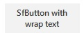
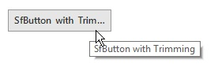

# Button Content in Windows Forms Button (SfButton)

## Adding Rich Text

The rich text can be displayed inside the SfButton by enabling the [AllowRichText](https://help.syncfusion.com/cr/windowsforms/Syncfusion.WinForms.Controls.SfButton.html#Syncfusion_WinForms_Controls_SfButton_AllowRichText) property and the proper rich text can be added in the [Text](https://help.syncfusion.com/cr/windowsforms/Syncfusion.WinForms.Controls.SfButton.html#Syncfusion_WinForms_Controls_SfButton_Text) property.



//Enable the rich text support
this.sfButton1.AllowRichText = true

//Adding the rich text value.
this.sfButton1.Text = "{\\rtf1\\ansi\\deff0{\\colortbl;\\red0\\green0\\blue0;\\red255\\green0\\blue0;}" +
"{\\fonttbl{\\f0 Monotype Corsiva;\r\n}}\\qc\\f0\\fs30 {\\i Italic} {\\b Bold} \\cf2 Red}";




**Note**: When the AllowRichText property is false, even if you add the rich text to the Text property, it will draw as normal text inside the button.

## Wrapping the Text

The text can be wrapped in the SfButton by setting the [AllowWrapText](https://help.syncfusion.com/cr/windowsforms/Syncfusion.WinForms.Controls.SfButton.html#Syncfusion_WinForms_Controls_SfButton_AllowWrapText) property to true.



//Initialize the text to SfButton
sfButton1.Text = "SfButton with wrap text";

//Enable the text wrapping
sfButton1.AllowWrapText = true;




**Note**: If the AutoSize property is enabled, the SfButton does not allow you to wrap the text.

## Trimming and Showing Ellipsis Character

The ellipsis character can be shown inside the SfButton by enabling the [AllowEllipsis](https://help.syncfusion.com/cr/windowsforms/Syncfusion.WinForms.Controls.SfButton.html#Syncfusion_WinForms_Controls_SfButton_AutoEllipsis) property.



//Enable AutoEllipsis property to show the ellipsis character.
sfButton1.AutoEllipsis = true;




**Note**: The SfButton will trim the characters only when disabling the AutoSize property and text length should be greater than the button width.

## Auto Fit the SfButton

The SfButton allows auto fitting the size based on the content by setting the [AutoSize](https://help.syncfusion.com/cr/windowsforms/Syncfusion.WinForms.Controls.SfButton.html#Syncfusion_WinForms_Controls_SfButton_AutoSize) property to true.



//Auto fit the content of SfButton
sfButton1.AutoSize = true;



## Content Alignment

This section describes how to change the text and image alignment inside the SfButton.

### Text

The text alignment can be changed by initializing any one of the ContentAlignment enumeration value to the TextAlign property.



//Initialize the Top Center alignment to text.
sfButton1.TextAlign = ContentAlignment.TopCenter;




### Image

The image alignment can be changed by initializing any one of the ContentAlignment enumeration value to the ImageAlign property.



//Initialize the Top Center alignment to Image.
sfButton1.ImageAlign = ContentAlignment.TopCenter;



