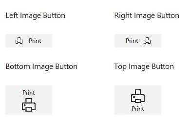

# Button Types in Windows Forms Button (SfButton)

This section describes various types of button supported by the SfButton.

## Text and Image Button

The text and image can be displayed inside the SfButton by initializing the [Text](https://help.syncfusion.com/cr/windowsforms/Syncfusion.WinForms.Controls.SfButton.html#Syncfusion_WinForms_Controls_SfButton_Text) and [Image](https://help.syncfusion.com/cr/windowsforms/Syncfusion.WinForms.Controls.SfButton.html#Syncfusion_WinForms_Controls_SfButton_Image) properties.



//Adding the text value.
this.sfButton1.Text = Print;

//Adding the image value to SfButton
this.sfButton1.Image = Image.FromFile(@"..\..\Data\Image1.png");




### Positioning Text and Image

The text and image positions can be adjusted by using the [TextImageRelation](https://help.syncfusion.com/cr/windowsforms/Syncfusion.WinForms.Controls.SfButton.html#Syncfusion_WinForms_Controls_SfButton_TextImageRelation) property.



//Initializing the text and image positions.
sfButton1.TextImageRelation = TextImageRelation.ImageBeforeText;




### Customizing Image Size 

The [ImageSize](https://help.syncfusion.com/cr/windowsforms/Syncfusion.WinForms.Controls.SfButton.html#Syncfusion_WinForms_Controls_SfButton_ImageSize) property allows you to specify the dimensions of the image displayed on the button.



// Setting image size to 24x24 pixels
sfButton1.ImageSize = new Size(24, 24);



### Auto Resizing

The [AutoSize](https://help.syncfusion.com/cr/windowsforms/Syncfusion.WinForms.Controls.SfButton.html#Syncfusion_WinForms_Controls_SfButton_AutoSize) property enables the SfButton to automatically resize itself based on its content, including both text and image. When this property is set to true, the button dynamically adjusts its dimensions to fit the combined size of the image and text.



// Enable automatic resizing
sfButton1.AutoSize = true;



### Spacing between Text and Image

The space between the text and image can be adjusted by using the [TextMargin](https://help.syncfusion.com/cr/windowsforms/Syncfusion.WinForms.Controls.SfButton.html#Syncfusion_WinForms_Controls_SfButton_TextMargin) and [ImageMargin](https://help.syncfusion.com/cr/windowsforms/Syncfusion.WinForms.Controls.SfButton.html#Syncfusion_WinForms_Controls_SfButton_ImageMargin) properties.



//Adjust the text margin of the SfButton
sfButton1.TextMargin = new Padding(3, 3, 3, 3);

//Adjust the image margin of the SfButton
sfButton1.ImageMargin = new Padding(3, 3, 3, 3);




## Image Button

The SfButton can be displayed only with the image by setting the empty string value to the [Text](https://help.syncfusion.com/cr/windowsforms/Syncfusion.WinForms.Controls.SfButton.html#Syncfusion_WinForms_Controls_SfButton_Text) property and initialize the image value to the [Image](https://help.syncfusion.com/cr/windowsforms/Syncfusion.WinForms.Controls.SfButton.html#Syncfusion_WinForms_Controls_SfButton_Image) property. The size of the image can be changed by using the ImageSize property.

## Icon Button

The SfButton can be displayed only with an icon by setting the empty string value to the Text property and initialize the icon value to [Image](https://help.syncfusion.com/cr/windowsforms/Syncfusion.WinForms.Controls.SfButton.html#Syncfusion_WinForms_Controls_SfButton_Image) property. You can show the icon button alone by setting the borders to null, and setting the back color of the button same as the background area.



//To show the icon button, initialize the background color same as the screen or background area color.
this.IconButton2.Style.BackColor = System.Drawing.Color.White;
this.IconButton2.Style.DisabledBackColor = System.Drawing.Color.White;
this.IconButton2.Style.FocusedBackColor = System.Drawing.Color.White;
this.IconButton2.Style.HoverBackColor = System.Drawing.Color.White;
this.IconButton2.Style.HoverBackColor = System.Drawing.Color.White;

//Sets the border to null for all button states.
IconButton2.Style.Border = null;
IconButton2.Style.HoverBorder = null;
IconButton2.Style.FocusedBorder = null;
IconButton2.Style.PressedBorder = null;




