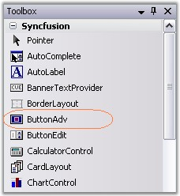

# Creating  ButtonAdv

The ButtonAdv control can be made available through designer by just dragging and dropping the control from the toolbox onto the form. 

It can be created programmatically by following the below steps.

1. Include the Tools Windows namespace to cs / VB file.




using Syncfusion.Windows.Forms.Tools;





Imports Syncfusion.Windows.Forms.Tools



 
2. Create an instance of ButtonAdv control and add it to the form.




private Syncfusion.Windows.Forms.ButtonAdv buttonAdv1;
this.buttonAdv1 = new Syncfusion.Windows.Forms.ButtonAdv();
this.Controls.Add(this.buttonAdv1);





Private buttonAdv1 As Syncfusion.Windows.Forms.ButtonAdv
Me.buttonAdv1 = New Syncfusion.Windows.Forms.ButtonAdv 
Me.Controls.Add(Me.buttonAdv1)



