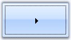

# How to draw or hide focus rectangle for the ButtonAdv control

ButtonControl shows some special features which the user interacts with the control. Those properties are discussed in this section.

<table>
<tr>
<th>
Properties</th><th>
Description</th></tr>
<tr>
<td>
KeepFocusRectangle</td><td>
Specifies whether rectangle will be drawn around the control when it is focussed at run time.</td></tr>
</table>



this.buttonAdv1.KeepFocusRectangle = true;





Me.buttonAdv1.KeepFocusRectangle = True



 

