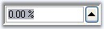

# How to hide a child button of a ButtonEdit control?

By calling the ButtonEdit.HideButton method, we can hide a child button. 

Table 151: Methods Table

<table>
<tr>
<th>
Method</th><th>
Description</th></tr>
<tr>
<td>
HideButton</td><td>
Indicates whether a child button is hidden or visible. The parameters are,
btnIndex - Specifies the index of the button.
visible - Specifies the visibility of the button. 
It can be true or false. 
If true, the button will be visible and if false, 
the button will not be visible.</td></tr>
</table>



this.buttonEdit1.HideButton(0, false);





Me.buttonEdit1.HideButton(0, False)



## How to replace the default TextBox in a ButtonEdit control?

We can replace the default TextBox of the ButtonEdit control with other TextBox by doing the following steps.

1. Drag a ButtonEdit control and a PercentTextBox control that you would like to replace with the default TextBox of the ButtonEdit control.

   

2. From the property window of ButtonEdit, select the PercentTextBox to be the TextBox control of the ButtonEdit control as shown below. 

    

3. From the same properties window, you can set the percent properties for the ButtonEdit control.

    

## How to set tooltip for ButtonEdit Child buttons?

 To set tooltip for a child button in a ButtonEdit control, drag and drop a ToolTip control from the toolbox. Text for tooltip is set using the extender property of the particular child button.

  

We can also set the Tooltip for ButtonEdit control programmatically using its SetToolTip() method.



this.toolTip1.SetToolTip(this.buttonEdit1, "Click here to search");





Me.toolTip1.SetToolTip(Me.buttonEdit1, "Click here to search")



  
