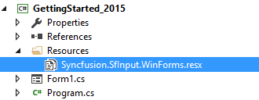

# Globalization in Windows Forms Calendar (SfCalendar)

The `SfCalendar` control provides globalization support to design and develop a world-ready application that supports localized interfaces and regional data for users in multiple cultures. Before beginning the design phase, determine the cultures that your application supports.

## Change culture

The culture information can be applied to the calendar by using the [Culture](https://help.syncfusion.com/cr/windowsforms/Syncfusion.WinForms.Input.SfCalendar.html#Syncfusion_WinForms_Input_SfCalendar_Culture) property. The following code example illustrates how to change the culture for the calendar:





//Setting the culture

calendar.Culture = new CultureInfo("he-IL");





' Setting the culture

calendar.Culture = New CultureInfo("he-IL")



 

## Localization

The `SfCalendar` control allows you to localize the static text used in the calendar footer such as today button and none button contents based on application requirement. The following steps are used to override the default resource files from the application resource files and change the static text:

* **Step 1**: Add the Resources folder to the application.    

* **Step 2**: Add the default resource file of SfCalender into Resources folder. You can download the `Syncfusion.SfInput.WinForms.resx` [here](https://www.syncfusion.com/downloads/support/directtrac/general/ze/Syncfusion.SfInput.WinForms-110589688.zip).     

  
                                     
* **Step 3**: Right-click on the Resources folder, select Add and then NewItem.

* **Step 4**: In Add New Item wizard, select the Resource File option and name the filename as Syncfusion.SfInput.WinForms.&lt;culture name&gt;.resx. For example, have to give name as Syncfusion.SfInput.WinForms.de-DE.resx for German culture.

* **Step 5**: The culture name that indicates the name of language and country.

* **Step 6**: Now, select Add option to add the resource file in Resources folder.

* **Step 7**: Add the required text to the `NoneButtonText` and `TodayButtonText`.





//Setting the Localization for Today and None Button

Thread.CurrentThread.CurrentCulture = new System.Globalization.CultureInfo("de-DE");

Thread.CurrentThread.CurrentUICulture = new System.Globalization.CultureInfo("de-DE");

// To retrieve Localization resources from target application.

InputLocalizationResource.SetResources(typeof(Form1).Assembly,"GettingStarted_2015.Resources.Syncfusion.SfInput.WinForms");





' Setting the Localization for Today and None Button

Thread.CurrentThread.CurrentCulture = New System.Globalization.CultureInfo("de-DE")

Thread.CurrentThread.CurrentUICulture = New System.Globalization.CultureInfo("de-DE")

' To retrieve Localization resources from target application.

InputLocalizationResource.SetResources(GetType(Form1).Assembly, "GettingStarted_2015.Resources.Syncfusion.SfInput.WinForms")



 

N> Refer to the following sample [link](https://www.syncfusion.com/downloads/support/directtrac/general/ze/Localization1520034310.zip) that demonstrates the localization support in SfCalender.
