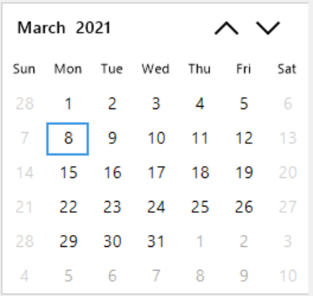

# Selection in Windows Forms Calendar (SfCalendar)

The SfCalendar allows you to select one or more dates. The selected date in the calendar can be changed by the mouse, keyboard, and touch interaction.

## Change selection

The `SfCalendar` control allows you to change the selection by clicking the specific date. 

### Change selection through keyboard

The selected date of the `SfCalendar` control can be changed by the keyboard. `Up/Down` and `Left/Right` arrow keys help you to change the selection according to the key board interaction. 

### Change selection programmatically

The selection of the calendar control can be changed programmatically by setting the [SelectedDate](https://help.syncfusion.com/cr/windowsforms/Syncfusion.WinForms.Input.SfCalendar.html#Syncfusion_WinForms_Input_SfCalendar_SelectedDate) property. The [GoToDate](https://help.syncfusion.com/cr/windowsforms/Syncfusion.WinForms.Input.SfCalendar.html#Syncfusion_WinForms_Input_SfCalendar_GoToDate_System_DateTime_) method is used to validate and move the current view to the view which contains the date value passed as argument for [GoToDate](https://help.syncfusion.com/cr/windowsforms/Syncfusion.WinForms.Input.SfCalendar.html#Syncfusion_WinForms_Input_SfCalendar_GoToDate_System_DateTime_) method. If the date value is not fall between minimum and maximum ranges or blackout dates contains the date, it returns `false`. The following code example illustrates the same:





// Move the current view to the date based on given value. Return value as false when the date is not fall within min max range or Blackout dates contains the date.

if (calendar.GoToDate(new DateTime(2018,02,02)))
{
    calendar.SelectedDate = new DateTime(2018,02,02);
}





' Move the current view to the date based on given value. Return value as false when the date is not fall within min max range or Blackout dates contains the date.

If calendar.GoToDate(New DateTime(2018, 2, 2)) Then

    calendar.SelectedDate = New DateTime(2018, 2, 2)

End If



 

### CellClick event

The [CellClick](https://help.syncfusion.com/cr/windowsforms/Syncfusion.WinForms.Input.SfCalendar.html#Syncfusion_WinForms_Input_SfCalendar_CellClick) event occurs when clicking a calendar cell.

#### Event data

The event handler receives an argument of [CalendarCellEventArgs](https://help.syncfusion.com/cr/windowsforms/Syncfusion.WinForms.Input.Events.CalendarCellEventArgs.html) type that contains data related to this event. The following CalendarCellEventArgs members provide information specific to this event.

<table>
<tr>
<th>
Members</th><th>
Description</th></tr>
<tr>
<td>
{{ '[IsSpecialDate](https://help.syncfusion.com/cr/windowsforms/Syncfusion.WinForms.Input.Events.CalendarCellEventArgs.html#Syncfusion_WinForms_Input_Events_CalendarCellEventArgs_IsSpecialDate)' | markdownify }}</td><td>
Gets a value that indicates whether the date of cell is SpecialDate in SfCalendar.</td></tr>
<tr>
<td>
{{ '[ViewType](https://help.syncfusion.com/cr/windowsforms/Syncfusion.WinForms.Input.Events.CalendarCellEventArgs.html#Syncfusion_WinForms_Input_Events_CalendarCellEventArgs_ViewType)' | markdownify }}</td><td>
Gets the CalendarViewType of the cell to draw in SfCalendar; whether it is month, year, decade or century view in SfCalendar.</td></tr>
<tr>
<td>
{{ '[IsBlackoutDate](https://help.syncfusion.com/cr/windowsforms/Syncfusion.WinForms.Input.Events.CalendarCellEventArgs.html#Syncfusion_WinForms_Input_Events_CalendarCellEventArgs_IsBlackoutDate)' | markdownify }}</td><td>
Gets a value that indicates whether the date of cell is SpecialDate in SfCalendar.</td></tr>
<tr>
<td>
{{ '[DateRange](https://help.syncfusion.com/cr/windowsforms/Syncfusion.WinForms.Input.Events.CalendarCellEventArgs.html#Syncfusion_WinForms_Input_Events_CalendarCellEventArgs_DateRange)' | markdownify }}</td><td>
Gets the StartDate and endDate range values of the clicked cell.</td></tr>
<tr>
<td>
{{ '[IsWeekNumber](https://help.syncfusion.com/cr/windowsforms/Syncfusion.WinForms.Input.Events.CalendarCellEventArgs.html#Syncfusion_WinForms_Input_Events_CalendarCellEventArgs_IsSpecialDate)' | markdownify }}</td><td>
Gets a value that indicates whether the date of cell is WeekNumber in SfCalendar.</td></tr>
<tr>
<td>
{{ '[Value](https://help.syncfusion.com/cr/windowsforms/Syncfusion.WinForms.Input.Events.CalendarCellEventArgs.html#Syncfusion_WinForms_Input_Events_CalendarCellEventArgs_Value)' | markdownify }}</td><td>
Gets the value of the clicked cell date value.</td></tr>
<tr>
<td>
{{ '[Text](https://help.syncfusion.com/cr/windowsforms/Syncfusion.WinForms.Input.Events.CalendarCellEventArgs.html#Syncfusion_WinForms_Input_Events_CalendarCellEventArgs_Text)' | markdownify }}</td><td>
Gets the value of the clicked cell text.</td></tr>
</table>





private void SfCalendar1_CellClick(object sender, Syncfusion.WinForms.Input.Events.CalendarCellEventArgs e)
{
  // e.DateRange - Start and end range value of clicked cell
  // e.IsBlackoutDate - Indicate whether the date cell is BlackoutDate
  // e.IsSpecialDate - Indicate whether the date cell is SpecialDate
  // e.IsWeekNumber - Indicate whether the date cell is WeekNumber
  // e.Text - Value of clicked cell text
  // e.Value - Clicked cell date value
  // e.ViewType - Specifies the calendar viewtype
}





Private Sub SfCalendar1_CellClick(ByVal sender As Object, ByVal e As Syncfusion.WinForms.Input.Events.CalendarCellEventArgs)
   ' e.DateRange - Start and end range value of clicked cell
   ' e.IsBlackoutDate - Indicate whether the date cell is BlackoutDate
   ' e.IsSpecialDate - Indicate whether the date cell is SpecialDate
   ' e.IsWeekNumber - Indicate whether the date cell is WeekNumber
   ' e.Text - Value of clicked cell text
   ' e.Value - Clicked cell date value
   ' e.ViewType - Specifies the calendar viewtype
End Sub



 

## Multiple selection

The `SfCalendar` control allows you to select multiple dates when the [AllowMultipleSelection](https://help.syncfusion.com/cr/windowsforms/Syncfusion.WinForms.Input.SfCalendar.html#Syncfusion_WinForms_Input_SfCalendar_AllowMultipleSelection) property is true. The following code example illustrates how to configure the calendar control to allow multiple date selection:





// Setting to Allow Multiple Selection

calendar.AllowMultipleSelection = true;





' Setting to Allow Multiple Selection

calendar.AllowMultipleSelection = true



 

### Multiple selection through mouse

The `SfCalendar` allows you to select multiple dates through the mouse interaction by selecting separate cells while pressing the `Ctrl`.

The specific range of dates can be selected by pressing the `Shift`. Select a date to set the start date of the range selection and select an end date when pressing the `Shift`.

### Multiple selection through keyboard 

The `SfCalendar` allows you to select multiple dates through the keyboard by selecting the cells while pressing `Shift + UP/DOWN/LEFT/RIGHT` and `Shift + HOME/END` arrow keys.

* Shift + UP: Selects previous week dates from the selected date.

* Shift + DOWN: Selects next week dates from the selected date.

* Shift + RIGHT: Selects next date from the selected date.

* Shift + LEFT: Selects previous date from the selected date.

*  Shift + HOME: Selects the date range from first day of month to the current selected date.

*  Shift + END: Selects the date range from current selected date to the last date of a month.

### Multiple selection programmatically

Multiple dates in the calendar control can be selected programmatically by adding dates to the [SelectedDates](https://help.syncfusion.com/cr/windowsforms/Syncfusion.WinForms.Input.SfCalendar.html#Syncfusion_WinForms_Input_SfCalendar_SelectedDates) collection. If the date which passed for adding with selected dates is not fall within minimum or maximum ranges or present in blackout dates, it will not be added to selected dates. The following code example illustrates how to add the selected dates programmatically. In the below code example, blackout dates contain the first date that is added to selected dates. So, except that first added date, other dates are added to selected dates.





calendar.AllowMultipleSelection = true;

calendar.BlackoutDates.Add(new DateTime(2018, 02, 12));

calendar.SelectedDates.Add(new DateTime(2018, 02, 12));

calendar.SelectedDates.Add(new DateTime(2018, 02, 13));

calendar.SelectedDates.Add(new DateTime(2018, 02, 14));

calendar.SelectedDates.Add(new DateTime(2018, 02, 15));

calendar.SelectedDates.Add(new DateTime(2018, 02, 16));

calendar.SelectedDates.Add(new DateTime(2018, 02, 17));

calendar.SelectedDates.Add(new DateTime(2018, 02, 18));         





## Disable selection

The `BlackoutDates` refers the disabled dates that restrict the user from selecting it. List of dates can be provided to set the [BlackoutDates](https://help.syncfusion.com/cr/windowsforms/Syncfusion.WinForms.Input.SfCalendar.html#Syncfusion_WinForms_Input_SfCalendar_BlackoutDates) for the SfCalendar. The following code example illustrates how to set the `BlackoutDates`:





//Setting the Blackout Dates

var weekends = GetDaysBetween(minDateTimeEdit.Value.Value, maxDateTimeEdit.Value.Value).Where(d => d.DayOfWeek == DayOfWeek.Saturday || d.DayOfWeek == DayOfWeek.Sunday);

List<DateTime> time = new List<DateTime>();

time = weekends.ToList();

calendar.BlackoutDates = time;





        'Setting the Blackout Dates

        Dim weekends = GetDaysBetween(minDateTimeEdit.Value.Value, maxDateTimeEdit.Value.Value).Where(() => {  }, ((d.DayOfWeek = DayOfWeek.Saturday)  _
                        OrElse (d.DayOfWeek = DayOfWeek.Sunday)))

        Dim time As List(Of DateTime) = New List(Of DateTime)

        time = weekends.ToList

        calendar.BlackoutDates = time



 

## Minimum datetime

[MinDate](https://help.syncfusion.com/cr/windowsforms/Syncfusion.WinForms.Input.SfCalendar.html#Syncfusion_WinForms_Input_SfCalendar_MinDate) helps you to restrict the `SelectedDate` of calendar falling lesser than the specific date. If the `SelectedDate` of calendar is less than the `MinDate`, then the `SelectedDate` property will be reset to `MinDate`. If the new `MinDate` value is greater than the `MaxDate`, then the `MaxDate` will be reset to the `MinDate`.

## Maximum datetime

[MaxDate](https://help.syncfusion.com/cr/windowsforms/Syncfusion.WinForms.Input.SfCalendar.html#Syncfusion_WinForms_Input_SfCalendar_MaxDate) helps you to restrict the [SelectedDate](https://help.syncfusion.com/cr/windowsforms/Syncfusion.WinForms.Input.SfCalendar.html#Syncfusion_WinForms_Input_SfCalendar_SelectedDate) of calendar falling greater than the specific date. If the `SelectedDate` of calendar is greater than `MaxDate`, then the `SelectedDate` property will be reset to `MaxDate`. When the `MaxDate` is set, if the `MinDate` property is greater than the new `MaxDate`, then the `MinDate` will be reset to the `MaxDate`. 

Sometimes, the value should be restricted between some date ranges. In that scenario, the `MinDate` and `MaxDate` help you to select only the dates between these range, and dates other than this range will not be displayed in the calendar.





// Setting the Minimum and Maximum date

Syncfusion.WinForms.Input.SfCalendar calendar = new Syncfusion.WinForms.Input.SfCalendar();

calendar.Value = new DateTime(2018, 1, 12);

calendar.MinDate = new DateTime(2018, 1, 05);

calendar.MaxDate = new DateTime(2018, 1, 25);





' Setting the Minimum and Maximum date

Dim calendar  As New Syncfusion.WinForms.Input.SfCalendar ()

calendar.Value = New DateTime(2018, 1, 12)

calendar.MinDate = new DateTime(2018, 1, 05)

calendar.MaxDate = new DateTime(2018, 1, 25)



 

## Handle selection change
 
 Restricts setting the selected date to handle on-demand. While changing the selection, user can restrict the selection change based on the new selected date by handling the `SelectionChanging` event.
 
 The [SelectionChanging](https://help.syncfusion.com/cr/windowsforms/Syncfusion.WinForms.Input.SfCalendar.html#Syncfusion_WinForms_Input_SfCalendar_SelectionChanging) event is invoked before the selected date is changed in the calendar. The `SelectionChangingEventArgs` provides the following properties for the `SelectionChanging` event:

* OldValue: Old selected date of the SfCalendar.
* NewValue: New selected date of the SfCalendar.

The [SelectionChanged](https://help.syncfusion.com/cr/windowsforms/Syncfusion.WinForms.Input.SfCalendar.html#Syncfusion_WinForms_Input_SfCalendar_SelectionChanged) event is invoked after the selected date is changed in the calendar. The `SelectionChangedEventArgs` provides the following properties for the `SelectionChanged` event:

* OldValue: Old selected date of the SfCalendar.
* NewValue: New selected date of the SfCalendar.
* IsMultipleDatesSelected: Indicates whether multiples dates are selected in the calendar or not.

The following code example illustrates how to restrict the selection change on-demand:





// Invoking selection changing event

calendar.SelectionChanging += SfCalendar_SelectionChanging;

// Invoking selection changed event

calendar.SelectionChanged += SfCalendar_SelectionChanged;

// Occurs before the selected date changed in Calendar.

private void SfCalendar_SelectionChanging(SfCalendar sender, Syncfusion.WinForms.Input.Events.SelectionChangingEventArgs args)

{
    if(args.NewValue == new DateTime(2018, 1, 16))

    args.Cancel = true;
}

// Occurs after the selected date changed in Calendar. 

private void SfCalendar_SelectionChanged(object sender, EventArgs e)

{

    MessageBox.Show("Selection changed");

}





' Invoking selection changing event

calendar.SelectionChanging = (Me.sfCalendar.SelectionChanging + SfCalendar_SelectionChanging)

' Invoking selection changed event

calendar.SelectionChanged = (Me.sfCalendar.SelectionChanged + SfCalendar_SelectionChanged)

' Occurs before the selected date changed in Calendar.

Private Sub SfCalendar_SelectionChanging(ByVal sender As SfCalendar, ByVal args As Syncfusion.WinForms.Input.Events.SelectionChangingEventArgs)

    args.Cancel = true

End Sub

' Occurs after the selected date changed in Calendar. 

Private Sub SfCalendar_SelectionChanged(ByVal sender As Object, ByVal e As EventArgs)

    MessageBox.Show("Selection changed")

End Sub





## Clear Selection

Selected dates of the calendar control will be cleared when the single date is selected. The calendar control also provides support to remove single date from the selected dates by selecting the already selected date while pressing the `CTRL` key.

### Clear selected dates programmatically

Selected dates of the calendar control can be removed from the selection by programmatically. The SfCalendar provides [ClearSelection](https://help.syncfusion.com/cr/windowsforms/Syncfusion.WinForms.Input.SfCalendar.html#Syncfusion_WinForms_Input_SfCalendar_ClearSelection_System_DateTime_) method that helps to remove already selected dates and also provides options to select the new date. The following code example illustrates how to remove the selected dates and select new date:





// Clear the selected dates and set the new date as selected date

calendar.ClearSelection(new DateTime(2018, 02, 16));



 

## Disable weekends from selection

Weekends of the calendar can be disabled by providing the Date collection to [BlackoutDates](https://help.syncfusion.com/cr/windowsforms/Syncfusion.WinForms.Input.SfCalendar.html#Syncfusion_WinForms_Input_SfCalendar_BlackoutDates). The following code snippet illustrates how to disable weekends from selection:





// disabling the weekends

sfCalendar1.MinDate = new DateTime(2000, 1, 05);
sfCalendar1.MaxDate = new DateTime(2500, 1, 25);
for (var date = sfCalendar1.MinDate; date <= sfCalendar1.MaxDate; date = date.AddDays(1))
            {
                if (date.DayOfWeek == DayOfWeek.Sunday || date.DayOfWeek == DayOfWeek.Saturday)
                sfCalendar1.BlackoutDates.Add(date);
            }



 

