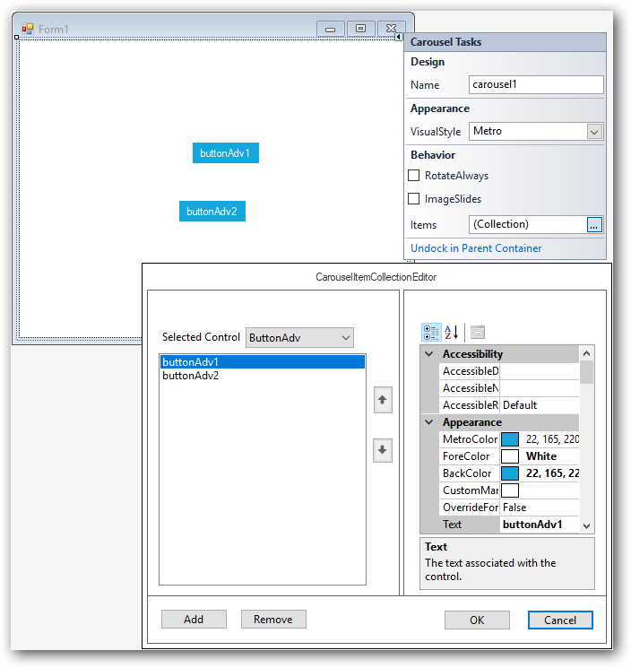
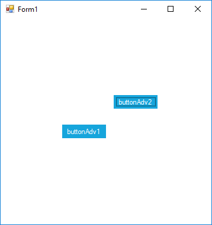
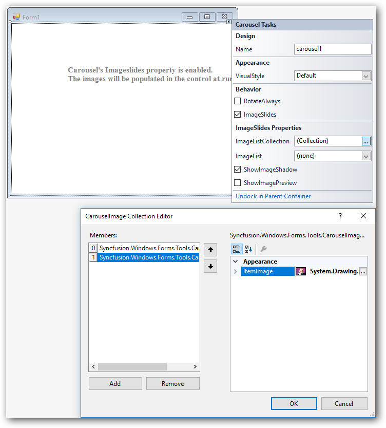

# Getting started

This section describes how to design a `Carousel` control in a Windows Forms application and overview of its basic functionalities.

* Adding Carousel control 
* Configuring Carousel

## Assembly deployment

The following list of assemblies should be added as reference to use the Carousel in any application:

<table>
<tr>
<td>
{{'**Required assemblies**'| markdownify }}
</td>
<td>
{{'**Description**'| markdownify }}
</td>
</tr>
<tr>
<td>
Syncfusion.Grid.Base.dll
</td>
<td>
Syncfusion.Grid.Base contains classes that contains fundamentals and base classes of GridControl.
</td>
</tr>
<tr>
<td>
Syncfusion.Grid.Windows.dll
</td>
<td>
Syncfusion.Grid.Windows contains classes that handles all UI operations, fundamentals and base classes of GridControl which are used in the Carousel control.
</td>
</tr>
<tr>
<td>
Syncfusion.Shared.Base.dll
</td>
<td>
Syncfusion.Shared.Base contains style related properties of Carousel and various editor controls.
</td>
</tr>
<tr>
<td>
Syncfusion.Shared.Windows.dll
</td>
<td>
Syncfusion.Shared.Windows contains style related properties of Carousel and various editor controls.
</td>
</tr>
<tr>
<td>
Syncfusion.Tools.Base.dll
</td>
<td>
Syncfusion.Tools.Base contains base class which used for Carousel control.
</td>
</tr>
<tr>
<td>
Syncfusion.Tools.Windows.dll
</td>
<td>
Syncfusion.Tools.Windows contains the class that handles all UI operations and contains helper class of Carousel control.
</td>
</tr>
</table>

## Installing NuGet packages

To use Carousel control in Windows Forms application via nuget, the following packages should be installed.
 
<table>
<tr>
<td>{{'**S.No**'| markdownify }}
</td>
<td>{{'**Framework version**'| markdownify }}
</td>
<td>{{'**NuGet Packages**'| markdownify }}
</td>
</tr>
<tr>
<td> 1
</td>
<td> 2.0
</td>
<td> Syncfusion.Tools.Windows20
</td>
</tr>
<tr>
<td> 2
</td>
<td> 3.5
</td>
<td> Syncfusion.Tools.Windows35
</td>
</tr>
<tr>
<td> 3
</td>
<td> 4.0
</td>
<td> Syncfusion.Tools.Windows40
</td>
</tr>
<tr>
<td> 4
</td>
<td> 4.5
</td>
<td> Syncfusion.Tools.Windows45
</td>
</tr>
<tr>
<td> 5
</td>
<td> 4.5.1
</td>
<td> Syncfusion.Tools.Windows451
</td>
</tr>
<tr>
<td> 6
</td>
<td> 4.6
</td>
<td> Syncfusion.Tools.Windows46
</td>
</tr>
</table>

Please find more details regarding how to install the nuget packages in windows form application in the below link:

[How to install nuget packages](https://help.syncfusion.com/windowsforms/nuget-packages)

# Creating simple application with Carousel

You can create the Windows Forms application with Carousel control as follows:

1. [Creating project](#creating-the-project)
2. [Adding control via Designer](#adding-control-via-designer)
3. [Adding control manually in code](#adding-control-manually-in-code)
4. [Configuration of Carousel](#Configuration-of-carousel)
5. [Adding controls into Carousel](#adding-controls-into-carousel)
5. [Adding images into Carousel](#adding-images-into-carousel)

### Creating the project

Create a new Windows Forms project in the Visual Studio to display the Carousel with basic information.

## Adding control via designer

Carousel control can be added to the application by dragging it from the toolbox and dropping it in a designer view. The following required assembly references will be added automatically:

* Syncfusion.Tools.Windows.dll
* Syncfusion.Grid.Base.dll
* Syncfusion.Grid.Windows.dll
* Syncfusion.Shared.Base.dll
* Syncfusion.Shared.Windows.dll
* Syncfusion.Tools.Base.dll

 

## Adding control manually in code

To add control manually in C#, follow the given steps:

1. Add the following required assembly references to the project:

 * Syncfusion.Tools.Base.dll
 * Syncfusion.Tools.Windows.dll
 * Syncfusion.Shared.Base.dll
 * Syncfusion.Shared.Windows.dll
 * Syncfusion.Grid.Base.dll
 * Syncfusion.Grid.Windows.dll

2. Include the namespaces **Syncfusion.Windows.Forms.Tools**.





using Syncfusion.Windows.Forms.Tools;





Imports Syncfusion.Windows.Forms.Tools





2. Create `Carousel` control instance and add it to the form.





Carousel carousel = new Carousel();

this.Controls.Add(carousel);





Dim carousel As Carousel = New Carousel

Me.Controls.Add(carousel)





## Configuration of Carousel
 
 Carousel control is a circular conveyor used for displaying and rotating the custom controls or images objects

## Adding controls into Carousel

 Custom controls can be added to carousel via both designer and code.

### Adding controls through Designer

 To load custom controls in Carousel, it needs to added into `Items` collection property in designer view.

 

### Adding controls manually through code

 To load custom controls in Carousel, it needs to added into `Items` collection property in Carousel class.

 


ButtonAdv buttonAdv1 =new ButtonAdv();
ButtonAdv buttonAdv2 =new ButtonAdv();

this.carousel1.Controls.Add(this.buttonAdv1);
this.carousel1.Controls.Add(this.buttonAdv2);

this.carousel1.Items.Add(this.buttonAdv1);
this.carousel1.Items.Add(this.buttonAdv2);





Dim buttonAdv1 As ButtonAdv = New ButtonAdv

Dim buttonAdv2 As ButtonAdv = New ButtonAdv

Me.carousel1.Controls.Add(this.buttonAdv1)

Me.carousel1.Controls.Add(this.buttonAdv2)

Me.carousel1.Items.Add(this.buttonAdv1)

Me.carousel1.Items.Add(this.buttonAdv2)





 

## Adding images into Carousel

Image objects can be added to carousel via both designer and code.

### Adding images through designer

To load images in Carousel, it needs to added into `ImageListCollection` property in designer view.

  

### Adding images manually through code

 To load images in Carousel,it needs to added into `ImageListCollection` property in Carousel class.





CarouselImage carouselImage1 = new CarouselImage();

CarouselImage carouselImage2 = new CarouselImage();

carouselImage1.ItemImage = ((System.Drawing.Image)(resources.GetObject("carouselImage1.ItemImage")));

carouselImage2.ItemImage = ((System.Drawing.Image)(resources.GetObject("carouselImage2.ItemImage")));

this.carousel1.ImageListCollection.Add(carouselImage1);

this.carousel1.ImageListCollection.Add(carouselImage2);





Dim carouselImage1 As CarouselImage = New CarouselImage

Dim carouselImage2 As CarouselImage = New CarouselImage

carouselImage1.ItemImage = ((System.Drawing.Image)(resources.GetObject("carouselImage1.ItemImage")))

carouselImage2.ItemImage = ((System.Drawing.Image)(resources.GetObject("carouselImage2.ItemImage")))

Me.carousel1.ImageListCollection.Add(carouselImage1);

Me.carousel1.ImageListCollection.Add(carouselImage2);





