# Chart Series

Provide data for the chart through the ChartSeries. ChartSeries acts as a wrapper around data that is to be displayed, and associates styles with the data. The data that is to be displayed is contained in either the IChartSeriesModel or the IEditableChartSeriesModel implementation. The style used to display the points is stored in a contained implementation of IChartSeriesStylesModel. 

Here is some sample code to create a new series and add it to the chart.

[C#]

// 1) One way to create a series:

ChartSeries series = new ChartSeries("Sales Performance", ChartSeriesType.Bar);

series.Points.Add(0,200);

series.Points.Add(1,300);

// Remember to add the series to the chart.

chartControl1.Series.Add(series);

// 2) Another way to create a series

// This will automatically add the series to the chart

ChartSeries series = chartControl1.Model.NewSeries("Sales Performance", ChartSeriesType.Bar);

series.Points.Add(0,200);

series.Points.Add(1,300);

[VB.NET]

' 1) One way to create a series:

Dim series1 As ChartSeries = New ChartSeries("Sales Performance", ChartSeriesType.Bar)

series.Points.Add(0,200)

series.Points.Add(1,300)

' Remember to add the series to the chart.

Me.chartControl1.Series.Add(series)

' 2) Another way to create a series

' This will automatically add the series to the chart

ChartSeries series = Me.chartControl1.Model.NewSeries("Sales Performance", ChartSeriesType.Bar)

series.Points.Add(0,200)

series.Points.Add(1,300)

> {  | markdownify }
{:.image }
_Note: Same ChartSeries object being added to more than one chart is not supported. It binds the series to the default primary axis always._

Chart Points

The ChartPoint class holds value information about a single point in a series (x and y values). The following table describes the kind of x and y values you can specify via a chart point.

_Table_ _7__: Chart Points_

<table>
<tr>
<td>
Axis</td><td>
Number of Values</td><td>
Value Types</td></tr>
<tr>
<td>
X</td><td>
1</td><td>
double or DateTime</td></tr>
<tr>
<td>
Y</td><td>
1 or more</td><td>
double or DateTime</td></tr>
</table>

Here is some sample code that shows adding data points to the Points collection. You could also optionally create a ChartPoint instance first and then add it to the Points collection.

[C#]

// Option 1: 1 X double value; 2 double Y values in a point

series1.Points.Add(0, 2.5, 3.5);

// Option 2: 1 X double value; 1 DateTime Y value

series2.Points.Add(1, DateTime.Now);

// Option 3: 1 X DateTime value; 1 double Y value

series1.Points.Add(DateTime.Now, 5.3);

[VB.NET]

' Option 1: 1 X double value; 2 double Y values in a point

series1.Points.Add(0, 2.5, 3.5)

' Option 2: 1 X double value; 1 DateTime Y value

series2.Points.Add(1, DateTime.Now)

' Option 3: 1 X DateTime value; 1 double Y value

series1.Points.Add(DateTime.Now, 5.3)

ValueType

Always use the ChartAxis.ValueType property to specify what kind of values you have added in the series data points for the corresponding axis.

[C#]

// To specify DateTime values in the X axis

this.chartControl1.PrimaryXAxis.ValueType = ChartValueType.DateTime;

// To specify Double values

this.chartControl1.PrimaryXAxis.ValueType = ChartValueType.Double;

[VB.NET]

' To specify DateTime values in the X axis

Me.chartControl1.PrimaryXAxis.ValueType = ChartValueType.DateTime

' To specify Double values

Me.chartControl1.PrimaryXAxis.ValueType = ChartValueType.Double

> {  | markdownify }
{:.image }
_Note : To display the text right next to the data points, the DisplayText property of the data point's style should be set._

The Chart Series features are elaborated in more detail in the following sub-topics.

## Series Customization

Essential Chart offers numerous appearance and behavior customization capabilities at the series level and on individual points.

Some of these options are applicable only for the whole series while the rest could be applied on the specific data points. Similarly some of these options are specific to certain chart types.

Note that styles set at the series level automatically propagate to the points in the series. 

Interestingly the Chart control lets the user to edit the styles of a series by double clicking on it during run-time. This feature can be turned on by setting the AllowUserEditStyles property to true.

The table below lists the customization options available in ChartSeries and their restrictions.

_Table_ _8__: Series Customization_

<table>
<tr>
<td>
Customization Option</td><td>
Applies to Series or DataPoints*</td><td>
Applies to Chart Type</td></tr>
<tr>
<td>
AngleOffset</td><td>
Series</td><td>
Pie Chart</td></tr>
<tr>
<td>
Border</td><td>
Series and points</td><td>
Pyramid, Funnel, Area, Bar, Bubble, Column Chart, Candle Chart, Renko chart, Three Line Break Chart, Box and Whisker Chart, Gantt Chart, Histogram Chart, Tornado Chart, Polar and Radar Chart and Pie Chart.</td></tr>
<tr>
<td>
BubbleType</td><td>
Series</td><td>
Bubble chart.</td></tr>
<tr>
<td>
ColumnDrawMode</td><td>
</td><td>
Column Chart, ColumnRange Chart,Bar Chart, BoxAndWhisker Chart, Gantt Chart.</td></tr>
<tr>
<td>
ColumnWidthMode</td><td>
Series</td><td>
Column charts</td></tr>
<tr>
<td>
ColumnFixedWidth</td><td>
Series</td><td>
Column charts</td></tr>
<tr>
<td>
ColumnType</td><td>
Series</td><td>
Column</td></tr>
<tr>
<td>
ColorsMode</td><td>
Series</td><td>
Renko chart.</td></tr>
<tr>
<td>
DarkLightPower</td><td>
Series</td><td>
Renko chart.</td></tr>
<tr>
<td>
DisplayShadow</td><td>
Series and points</td><td>
Area Chart, Bar Chart, Bubble Chart, Column Chart, Stacking Column Chart, Stacking Column100 Chart, Line Chart, Spline Chart, Rotated Spline chart, Stepline Chart, Candle Chart, Kagi Chart, Point and Figure Chart, Renko Chart, Threeline Break Charts, Gantt Chart, Histogram chart, Tornado Chart, Combination Chart, Box and Whisker Chart.</td></tr>
<tr>
<td>
DisplayText</td><td>
Series and points</td><td>
All Chart types.</td></tr>
<tr>
<td>
DoughnutCoeficient</td><td>
Series</td><td>
Pie Chart.</td></tr>
<tr>
<td>
DrawColumnSeparatingLines</td><td>
Series</td><td>
Column Chart.</td></tr>
<tr>
<td>
DrawErrorBars</td><td>
Series</td><td>
Column Chart, Line Chart and HiLo Chart.</td></tr>
<tr>
<td>
DrawHistogramNormalDistribution</td><td>
Series</td><td>
Histogram chart.</td></tr>
<tr>
<td>
DrawSeriesNameInDepth</td><td>
Series</td><td>
All Chart types.</td></tr>
<tr>
<td>
ElementBorders</td><td>
Series and points</td><td>
Area Charts, Bar Charts, Bubble Chart, Column Charts, Line  Charts, Candle Chart, Renko chart, Three Line Break Chart, Box and Whisker Chart, Gantt Chart, Tornado Chart, Polar and Radar Chart.</td></tr>
<tr>
<td>
EnablePhongStyle</td><td>
Series</td><td>
Bubble Chart.</td></tr>
<tr>
<td>
ErrorBarsSymbolShape</td><td>
Series</td><td>
Column Chart, Line Chart and HiLo Chart.</td></tr>
<tr>
<td>
ExplodedAll</td><td>
Series</td><td>
Pie Chart, Doughnut Chart.</td></tr>
<tr>
<td>
ExplodedIndex</td><td>
Series</td><td>
Pie Chart.</td></tr>
<tr>
<td>
ExplosionOffset</td><td>
Series</td><td>
Pie Chart.</td></tr>
<tr>
<td>
FancyToolTip</td><td>
Series</td><td>
All Chart Types.</td></tr>
<tr>
<td>
FigureBase</td><td>
Series</td><td>
Funnel and Pyramid chart.</td></tr>
<tr>
<td>
FillMode</td><td>
Series</td><td>
Pie Chart</td></tr>
<tr>
<td>
FunnelMode</td><td>
Series</td><td>
Funnel and Pyramid chart.</td></tr>
<tr>
<td>
Font</td><td>
Series and points</td><td>
All Chart types.</td></tr>
<tr>
<td>
GanttDrawMode</td><td>
Series</td><td>
Gantt Chart.</td></tr>
<tr>
<td>
GapRatio</td><td>
Series</td><td>
Funnel and Pyramid chart.</td></tr>
<tr>
<td>
Gradient</td><td>
Series</td><td>
Pie Chart.</td></tr>
<tr>
<td>
HeightBox</td><td>
Series</td><td>
Point And Figure Chart.</td></tr>
<tr>
<td>
HeightByAreaDepth</td><td>
Series</td><td>
Pie Chart.</td></tr>
<tr>
<td>
HeightCoeficient</td><td>
Series</td><td>
Pie Chart.</td></tr>
<tr>
<td>
HighlightInterior</td><td>
Series</td><td>
Bar Charts, Pie, Funnel, Pyramid,Bubble, Column, Area, Stacking Area, Stacking Area100, Line Charts, Box and Whisker, Gantt Chart and Tornado Chart.</td></tr>
<tr>
<td>
HitTestRadius</td><td>
Series</td><td>
Line Chart and Step Line Chart.</td></tr>
<tr>
<td>
ImageIndex</td><td>
Series and points</td><td>
Area Charts, Bar Charts, Bubble Chart, Column Charts, Line  Charts, Candle Chart, Renko chart, Three Line Break Chart, Box and Whisker Chart, Gantt Chart, Tornado Chart, Polar and Radar Chart.</td></tr>
<tr>
<td>
Images</td><td>
Series and points</td><td>
Area Charts, Bar Charts, Bubble Chart, Column Charts, Line  Charts, Candle Chart, Renko chart, Three Line Break Chart, Box and Whisker Chart, Gantt Chart, Tornado Chart, Polar and Radar Chart.</td></tr>
<tr>
<td>
InSideRadius</td><td>
Series</td><td>
Pie Chart.</td></tr>
<tr>
<td>
Interior</td><td>
Series and points</td><td>
All Chart Types.</td></tr>
<tr>
<td>
LabelPlacement</td><td>
Series</td><td>
Funnel and Pyramid Charts.</td></tr>
<tr>
<td>
LabelStyle</td><td>
Series</td><td>
Funnel and Pyramid, Pie</td></tr>
<tr>
<td>
LegendItem</td><td>
Series</td><td>
All Chart Types.</td></tr>
<tr>
<td>
LightAngle</td><td>
Series</td><td>
Scatter Chart, Column Charts , Bar Charts, Box and Whisker Chart, Gantt Chart, Histogram Chart, Tornado Chart, Polar and Radar Chart.</td></tr>
<tr>
<td>
LightColor</td><td>
Series</td><td>
Scatter Chart, Column Charts , Bar Charts, Box and Whisker Chart, Gantt Chart, Histogram Chart, Tornado Chart, Polar and Radar Chart.</td></tr>
<tr>
<td>
Name</td><td>
Series</td><td>
All chart types.</td></tr>
<tr>
<td>
NumberOfHistogramIntervals</td><td>
Series</td><td>
Histogram Chart.</td></tr>
<tr>
<td>
OpenCloseDrawMode</td><td>
Series</td><td>
HiLo OpenClose chart.</td></tr>
<tr>
<td>
OptimizePiePointPositions</td><td>
Series</td><td>
Pie chart</td></tr>
<tr>
<td>
PhongAlpha</td><td>
Series</td><td>
Column Chart.</td></tr>
<tr>
<td>
PieType</td><td>
Series</td><td>
Pie chart</td></tr>
<tr>
<td>
PieWithSameRadius</td><td>
Series</td><td>
Pie chart and Doughnut chart.</td></tr>
<tr>
<td>
PointsToolTipFormat</td><td>
Series</td><td>
All Chart Types.</td></tr>
<tr>
<td>
PointWidth</td><td>
Series and points</td><td>
Gantt Chart.</td></tr>
<tr>
<td>
PriceDownColor</td><td>
Series</td><td>
Financial types</td></tr>
<tr>
<td>
PriceUpColor</td><td>
Series</td><td>
Financial types</td></tr>
<tr>
<td>
PyramidMode</td><td>
Series</td><td>
Pyramid</td></tr>
<tr>
<td>
Radar Type</td><td>
Series</td><td>
Polar and Radar Chart.</td></tr>
<tr>
<td>
RadarStyle</td><td>
Series</td><td>
Polar and Radar Chart.</td></tr>
<tr>
<td>
RelatedPoints</td><td>
Series and points</td><td>
Gantt Chart.</td></tr>
<tr>
<td>
ReversalAmount</td><td>
Series</td><td>
Kagi, PointAndFigure, Renko</td></tr>
<tr>
<td>
Rotate</td><td>
Series</td><td>
Column Charts, Bar Charts, Area charts, Line Chart, Spline Chart, Stepline Chart, Candle Chart, HiLo Chart, HiLo Open Chart, Kagi Chart, BoxandWhisker chart, Histogram chart, Polar and Radar Chart.</td></tr>
<tr>
<td>
ScatterConnectType</td><td>
Series</td><td>
Scatter Chart.</td></tr>
<tr>
<td>
ScatterSplineTension</td><td>
Series</td><td>
Scatter Chart.</td></tr>
<tr>
<td>
SeriesToolTipFormat</td><td>
Series</td><td>
Area Charts.</td></tr>
<tr>
<td>
ShadingMode</td><td>
Series</td><td>
Column Chart, BarCharts, Candle Chart, HiLO Chart, HiLoOpenClose Chart, Tornado chart, BoxandWhisker chart, Gantt Chart, Histogram Chart, Polar and Radar Chart.</td></tr>
<tr>
<td>
ShadowInterior</td><td>
Series and points</td><td>
Column Charts, Bubble Chart, Line Charts, BarCharts, Candle Chart, Kagi Chart, Point and Figure Chart, Renko Chart, Three Line Break Chart, Box and Whisker Chart, Gantt Chart, Histogram Chart, Tornado Chart, Pie Chart, Polar and Radar Chart.</td></tr>
<tr>
<td>
ShadowOffset</td><td>
Series and points</td><td>
Column Charts, Bubble Chart, Line Charts, BarCharts, Candle Chart, Kagi Chart, Point and Figure Chart, Renko Chart, Three Line Break Chart, Box and Whisker Chart, Gantt Chart, Histogram Chart, Tornado Chart, Pie Chart, Polar and Radar Chart.</td></tr>
<tr>
<td>
ShowDataBindLabels</td><td>
Series</td><td>
Pie Chart, Doughnut Chart, Funnel and Pyramid charts.</td></tr>
<tr>
<td>
ShowHistogramDataPoints</td><td>
Series</td><td>
Histogram Chart</td></tr>
<tr>
<td>
ShowTicks</td><td>
Series</td><td>
Pie Chart.</td></tr>
<tr>
<td>
SmartLabels</td><td>
Series</td><td>
All Chart Types.</td></tr>
<tr>
<td>
Spacing</td><td>
Series and Points.</td><td>
Column Charts, BarCharts, Box and Whisker Chart, Gantt Chart, Tornado Chart.</td></tr>
<tr>
<td>
Spacing Between Series</td><td>
Series</td><td>
Area Charts, BarCharts, Line Charts, Bubble Chart, Financial Charts, Gantt Chart, Histogram chart, Tornado Chart, Combination Chart, Box and Whisker Chart.</td></tr>
<tr>
<td>
SpacingBetweenPoints</td><td>
Series Points</td><td>
Column Chart, Bar Chart, HiLo Chart, HiLo Open Close Chart, Candle Chart, Tornado Chart, Boxes and Whisker Chart.</td></tr>
<tr>
<td>
StepItem.Inverted</td><td>
Series</td><td>
StepAreaChart, StepLine Chart.</td></tr>
<tr>
<td>
Summary</td><td>
Series</td><td>
All Chart Types.</td></tr>
<tr>
<td>
Symbol</td><td>
Series and points</td><td>
Column Chart, Bar Chart, Bubble Chart, Financial Chart, Line Chart, BoxandWhisker Chart, Gantt chart, Tornado chart, Radar Chart</td></tr>
<tr>
<td>
Text (Series)</td><td>
Series</td><td>
All Chart Types.</td></tr>
<tr>
<td>
Text (Style)</td><td>
Series and Points</td><td>
All Chart Types.</td></tr>
<tr>
<td>
TextColor</td><td>
Series and points</td><td>
All Chart Types.</td></tr>
<tr>
<td>
TextFormat</td><td>
Series and points</td><td>
All Chart Types.</td></tr>
<tr>
<td>
TextOffset</td><td>
Series and points</td><td>
All Chart Types.</td></tr>
<tr>
<td>
TextOrientation</td><td>
Series and points</td><td>
All Chart Types.</td></tr>
<tr>
<td>
ToolTip</td><td>
Series and points</td><td>
Scatter Chart.</td></tr>
<tr>
<td>
ToolTipFormat</td><td>
Series and points</td><td>
Scatter Chart.</td></tr>
<tr>
<td>
Visible</td><td>
Series</td><td>
All Chart Types.</td></tr>
<tr>
<td>
VisibleAllPies</td><td>
Series</td><td>
Pie Chart.</td></tr>
<tr>
<td>
XType</td><td>
Series</td><td>
All Chart Types.</td></tr>
<tr>
<td>
YType</td><td>
Series</td><td>
All Chart Types.</td></tr>
<tr>
<td>
ZOrder</td><td>
Series</td><td>
Gantt chart, StackingBar chart, StackingBar100 chart, StackingColumn chart, StackedColumn100 chart, StackingArea chart, StackingArea100 chart.</td></tr>
</table>

* Indicates whether the property affects ALL the points in the series or if the property can be set on individual points as well.

### AngleOffset

The offset angle that is to be used when rendering Pie charts.

Details

Possible Values - Accepts real values like 45f, 90f etc.

Default Value – 0.     

2D / 3D Limitations – No.

Applies to Chart Element - All Series.

Applies to Chart Types – PieChart.

Here is some sample code.

[C#]

 // Create chart series and add data points into it.

ChartSeries series1 = new ChartSeries("Market");

series1.Points.Add(0, 20);

series1.Points.Add(1, 28);

series1.Type = ChartSeriesType.Pie;

 // Add the series to the chart series collection.

this.chartControl1.Series.Add(series1);

this.chartControl1.Series3D = true;

this.chartControl1.Series[0].ConfigItems.PieItem.AngleOffset = 45f;

[VB.NET]

' Create chart series and add data points into it.

Private series1 As New ChartSeries("Market")

series1.Points.Add(0, 20)

series1.Points.Add(1, 28)

series1.Type = ChartSeriesType.Pie

 ' Add the series to the chart series collection.

Me.chartControl1.Series.Add(series1)

Me.chartControl1.Series3D = True

Me.chartControl1.Series(0).ConfigItems.PieItem.AngleOffset = 45f

{  | markdownify }
{:.image }

_Figure_ _96__:_ _PieChart with No AngleOffset_

{  | markdownify }
{:.image }

_Figure_ _97__:_ _PieChart with AngleOffset = "45f"_

See Also

Pie Chart

### Border

The user can also set the Border color and Border style for the chart series. 

_Table_ _9__: Border_

<table>
<tr>
<td>
Features</td><td>
Details</td></tr>
<tr>
<td>
Possible Values</td><td>
Any Color, Width, Style for the Borders</td></tr>
<tr>
<td>
Default Value     </td><td>
Color  - BlackWidth value - 1DashStyle - Solid</td></tr>
<tr>
<td>
2D / 3D Limitations</td><td>
No</td></tr>
<tr>
<td>
Applies to Chart Element</td><td>
All series and points</td></tr>
<tr>
<td>
Applies to Chart Types</td><td>
Pyramid, Funnel, Area, Bar, Bubble, Column Chart, Candle Chart, Renko chart, Three Line Break Chart, Box and Whisker Chart, Gantt Chart, Histogram Chart, Tornado Chart, Polar and Radar Chart and Pie Chart</td></tr>
</table>

The line type can be configured using the ChartSeries.Style.Border property as in the following example.

[C#]                    

// Set the border style required for the column chart.

series.Style.Border.Width = 3;

series.Style.Border.Color = Color.White;

// Set the Series style

series.Style.DisplayShadow = true;

series.Style.ShadowInterior = new Syncfusion.Drawing.BrushInfo(Color.White);

series.Style.ShadowOffset = new Size(3, 3);

[VB.NET]

' Set the border style required for the column chart.

series.Style.Border.Width = 3

series.Style.Border.Color = Color.White

' Set the Series style

series.Style.DisplayShadow = True

series.Style.ShadowInterior = New Syncfusion.Drawing.BrushInfo(Color.White)

series.Style.ShadowOffset = New Size(3, 3)

{  | markdownify }
{:.image }

_Figure_ _98__:_ _Border Lined Column Chart_

To apply this on specific data points:

[C#]                    

//Sets border for the 1st point in 1st series

series1.Styles[0].Border.Width = 3;

series1.Styles[0].Border.Color = Color.White;

//Sets border for the 3rd point in 2nd series

series2.Styles[2].Border.Width = 3;

series2.Styles[2].Border.Color = Color.White;

[VB.NET]

'Sets border for the 1st point in 1st series

series1.Styles(0).Border.Width = 3

series1.Styles(0).Border.Color = Color.White

'Sets border for the 3rd point in 2nd series

series2.Styles(2).Border.Width = 3

series2.Styles(2).Border.Color = Color.White

{  | markdownify }
{:.image }

_Figure_ _99__: Individual Data Points with White Border_

See Also

Pyramid Chart, Funnel Chart, Area Charts, BarCharts, Bubble Chart, Column Chart, Candle Chart, Renko chart, Three Line Break Chart, Box and Whisker Chart, Gantt Chart, Histogram Chart, Tornado Chart, Polar and Radar Chart, Pie Chart

### BubbleType

BubbleType - Specifies whether to render the data point symbols as circle, square or as image.

_Table_ _10__: Features_

<table>
<tr>
<td>
Features</td><td>
Details</td></tr>
<tr>
<td>
Possible Values</td><td>
Circle - Symbol is rendered as a circleSquare - Symbol is rendered as a squareImage - Symbol is rendered as an image</td></tr>
<tr>
<td>
Default Value     </td><td>
Circle</td></tr>
<tr>
<td>
2D / 3D Limitations</td><td>
No</td></tr>
<tr>
<td>
Applies to Chart Element</td><td>
All Series</td></tr>
<tr>
<td>
Applies to Chart Types</td><td>
Bubble</td></tr>
</table>

Here is some sample code to specify an Image BubbleType.

Series wide setting

[C#]

this.chartControl1.Series[0].ConfigItems.BubbleItem.BubbleType = ChartBubbleType.Image;

this.chartControl1.Series[0].Style.Images = new ChartImageCollection(this.imageList1.Images );

this.chartControl1.Series[0].Style.ImageIndex = 0;

[VB.NET]

Me.chartControl1.Series[0].ConfigItems.BubbleItem.BubbleType = ChartBubbleType.Image

Me.chartControl1.Series[0].Style.Images = New ChartImageCollection(Me.imageList1.Images)

Me.chartControl1.Series[0].Style.ImageIndex = 0

Specific Data Point Setting

Specify image for specific data points.

[C#]

this.chartControl1.Series[0].Styles[0].Images = new ChartImageCollection(this.imageList1.Images );

this.chartControl1.Series[0].Styles[0].ImageIndex = 0;

this.chartControl1.Series[0].Styles[1].Images = new ChartImageCollection(this.imageList1.Images );

this.chartControl1.Series[0].Styles[1].ImageIndex = 1;

[VB.NET]

Me.chartControl1.Series[0].Styles(0).Images = New ChartImageCollection(Me.imageList1.Images)

Me.chartControl1.Series[0].Styles[0).ImageIndex = 0

Me.chartControl1.Series[0].Styles(1).Images = New ChartImageCollection(Me.imageList1.Images)

Me.chartControl1.Series[0].Styles(1).ImageIndex = 1

{  | markdownify }
{:.image }

_Figure_ _100__: Image BubbleType Chart Series_

See Also

Bubble Chart

### ColumnDrawMode

It indicates the drawing mode of columns in charts when there are multiple series.

_Table_ _11__: Features_

<table>
<tr>
<td colspan = "2">
Features</td><td>
Details</td></tr>
<tr>
<td>
Possible Values</td><td colspan = "2">
InDepthMode - Columns from different series are drawn at different depths.PlaneMode - Columns from all series are drawn side-by-side.ClusteredMode - Columns from all series are drawn in depth with the same size.</td></tr>
<tr>
<td>
Default Value     </td><td colspan = "2">
InDepthMode</td></tr>
<tr>
<td>
2D / 3D Limitations</td><td colspan = "2">
3D only</td></tr>
<tr>
<td>
Applies to Chart Element</td><td colspan = "2">
All Series</td></tr>
<tr>
<td>
Applies to Chart Types</td><td colspan = "2">
Column Chart, ColumnRange Chart,Bar Chart, BoxAndWhisker Chart, Gantt Chart</td></tr>
</table>

Here is the sample code snippet using ColumnDrawMode in Column Chart.

[C#]

this.chartControl1.ColumnDrawMode = ChartColumnDrawMode.PlaneMode;

[VB.NET]

Me.chartControl1.ColumnDrawMode = ChartColumnDrawMode.PlaneMode

{  | markdownify }
{:.image }

_Figure_ _101__: ColumnDrawMode set to "PlaneMode"_

{  | markdownify }
{:.image }

_Figure_ _102__: ColumnDrawMode set to "InDepthMode"_

{  | markdownify }
{:.image }

_Figure_ _103__: ColumnDrawMode set to "ClusteredMode"_

See Also

Column Chart, ColumnRange Chart, Bar Chart, BoxAndWhisker Chart, Gantt Chart

### ColumnWidthMode

It specifies the width drawing mode for the columns in a column chart.

_Table_ _12__: Features_

<table>
<tr>
<td colspan = "2">
Features</td><td>
Details</td></tr>
<tr>
<td>
Possible Values</td><td colspan = "2">
* DefaultWidthMode - The width of the columns will always be calculated to fill the space between columns.* FixedWidthMode - The width should be given in Series.Points[i].YValues[1], in pixels. If the width of the columns are not given in point YValues[1], then they are calculated to fill the space between columns.* RelativeWidthMode - Similar to the FixedWidthMode, the width is specified in YValues[1], but in units of X-axis range.</td></tr>
<tr>
<td>
 Default Value     </td><td colspan = "2">
DefaultWidthMode</td></tr>
<tr>
<td>
2D / 3D Limitations</td><td colspan = "2">
No</td></tr>
<tr>
<td>
Applies to Chart Element</td><td colspan = "2">
All Series</td></tr>
<tr>
<td>
Applies to Chart Types</td><td colspan = "2">
Column charts, BoxAndWhiskerChart, Candle Chart</td></tr>
</table>

Here is some sample code.

[C#]

ChartSeries series1 = new ChartSeries("Series");

series.Points.Add(1, 24);

series.Points.Add(2, 36);

series.Points.Add(3, 48);

chartControl1.Series.Add(series1);

chartControl1.ColumnWidthMode = ChartColumnWidthMode.DefaultWidthMode;

[VB.NET]

Dim series1 As ChartSeries = New ChartSeries("Series")

series.Points.Add(1, 24)

series.Points.Add(2, 36)

series.Points.Add(3, 48)

chartControl1.Series.Add(series1)

chartControl1.ColumnWidthMode = ChartColumnWidthMode.DefaultWidthMode 

{  | markdownify }
{:.image }

_Figure_ _104__: Column Chart with DefaultWidthMode_

[C#]

double Interval = this.chartControl1.PrimaryXAxis.Range.Interval;

ChartSeries series = new ChartSeries("Team 1");                

// 2nd Y value specifies the column width

series.Points.Add(1, new double[] { 24, Interval * 0.75 });

series.Points.Add(2, new double[] { 36, Interval * 0.75 });

series.Points.Add(3, new double[] { 48, Interval * 0.75 }); 

this.chartControl1.Series.Add(series);

this.chartControl1.ColumnWidthMode = ChartColumnWidthMode.RelativeWidthMode;

[VB.NET]

Dim Interval As Double = Me.chartControl1.PrimaryXAxis.Range.Interval

Dim series As New ChartSeries("Team 1")

' 2nd Y value specifies the column width

series.Points.Add(1, New Double() { 24, Interval * 0.75 })

series.Points.Add(2, New Double() { 36, Interval * 0.75 })

series.Points.Add(3, New Double() { 48, Interval * 0.75 })

Me.chartControl1.Series.Add(series)

Me.chartControl1.ColumnWidthMode = ChartColumnWidthMode.RelativeWidthMode

{  | markdownify }
{:.image }

_Figure_ _105__: Column Chart with RelativeWidthMode_

[C#]

ChartSeries series1 = new ChartSeries("Series");

// 2nd Y value specifies the column width

series1.Points.Add(1, new double[] { 24, 25});

series1.Points.Add(2, new double[] { 36, 25});

series1.Points.Add(3, new double[] { 48, 25});

chartControl1.Series.Add(series1);

chartControl1.ColumnWidthMode = ChartColumnWidthMode.FixedWidthMode;

[VB.NET]

Dim series1 As ChartSeries = New ChartSeries("Series")

' 2nd Y value specifies the column width

series1.Points.Add(1, New Double() { 24, 25})

series1.Points.Add(2, New Double() { 36, 25})

series1.Points.Add(3, New Double() { 48, 25})

chartControl1.Series.Add(series1) 

chartControl1.ColumnWidthMode = ChartColumnWidthMode.FixedWidthMode 

> {  | markdownify }
{:.image }
_Note: The width of the column can also be specified by ColumnFixedWidth property. If both second Y value and ColumnFixedWidth are specified, second Y value takes higher priority._

{  | markdownify }
{:.image }

_Figure_ _106__: Column Chart with FixedWidthMode_

See Also

Column charts,BoxAndWhiskerChart, Candle Chart, ColumnFixedWidth

### ColumnFixedWidth

It specifies the width of each column when ColumnWidthMode is set to FixedWidthMode.

_Table_ _13__: Features_

<table>
<tr>
<td colspan = "2">
Features</td><td>
Details</td></tr>
<tr>
<td>
Possible Values</td><td colspan = "2">
An integer value</td></tr>
<tr>
<td>
Default Value     </td><td colspan = "2">
20</td></tr>
<tr>
<td>
2D / 3D Limitations</td><td colspan = "2">
None</td></tr>
<tr>
<td>
Applies to Chart Element</td><td colspan = "2">
All Series</td></tr>
<tr>
<td>
Applies to Chart Types</td><td colspan = "2">
Column Charts, BoxAndWhiskerChart, Candle Chart</td></tr>
</table>

Here is some sample code.

[C#]

ChartSeries series1 = new ChartSeries("Series");

series1.Points.Add(1, new double[] { 24});

series1.Points.Add(2, new double[] { 36});

series1.Points.Add(3, new double[] { 48});

chartControl1.Series.Add(series1);

chartControl1.ColumnWidthMode = ChartColumnWidthMode.FixedWidthMode;

chartControl1.ColumnFixedWidth = 45;

[VB.NET]

Dim series1 As ChartSeries = New ChartSeries("Series")

series1.Points.Add(1, New Double() { 24})

series1.Points.Add(2, New Double() { 36})

series1.Points.Add(3, New Double() { 48})

chartControl1.Series.Add(series1) 

chartControl1.ColumnWidthMode = ChartColumnWidthMode.FixedWidthMode 

chartControl1.ColumnFixedWidth = 45 

> {  | markdownify }
{:.image }
_Note: The ColumnFixedWidth property can be overridden by specifying a second y value in the data point. See_ ColumnWidthMode _for a sample._

{  | markdownify }
{:.image }

_Figure_ _107__: ColumnChart with ColumnFixedWidth = "45"_

See Also

Column charts, BoxAndWhiskerChart, ColumnWidthMode, Candle Charts

### ColumnType

It specifies whether the columns should be rendered as bars or cylinders.

_Table_ _14__: Features_

<table>
<tr>
<td colspan = "2">
Features</td><td>
Details</td></tr>
<tr>
<td>
Possible Values</td><td colspan = "2">
Box - Renders the columns as boxes. Cylinder - Renders the columns as cylinders.</td></tr>
<tr>
<td>
Default Value     </td><td colspan = "2">
Box</td></tr>
<tr>
<td>
2D / 3D Limitations</td><td colspan = "2">
3D only</td></tr>
<tr>
<td>
Applies to Chart Element</td><td colspan = "2">
All series</td></tr>
<tr>
<td>
Applies to Chart Types</td><td colspan = "2">
Column Chart, Column Range Chart, Stacking Column Chart, Candle Chart, Bar Chart, Stacking Bar Chart</td></tr>
</table>

Here is some sample.

[C#]

this.chartControl1.Series[0].ConfigItems.ColumnItem.ColumnType = ChartColumnType.Cylinder;

this.chartControl1.Series[1].ConfigItems.ColumnItem.ColumnType = ChartColumnType.Box;

[VB.NET]

Me.chartControl1.Series(0).ConfigItems.ColumnItem.ColumnType = ChartColumnType.Cylinder

Me.chartControl1.Series(1).ConfigItems.ColumnItem.ColumnType = ChartColumnType.Box

{  | markdownify }
{:.image }

_Figure_ _108__: Column Chart_

See Also

Column Chart, Column Range Chart, Stacking Column Chart, Candle Chart, Bar Chart, Stacking Bar Chart

### ColorsMode

Gets / sets ColorsMode of the boxes in the financial chart types.

_Table_ _15__: Features_

<table>
<tr>
<td colspan = "2">
Features</td><td>
Details</td></tr>
<tr>
<td>
Possible Values</td><td colspan = "2">
* DarkLight -Draws series data points as a darklight colorsmode.* Fixed - Draws series data points as a Fixed colorsmode.* Mixed - Draws series data points as a Mixed colorsmode.</td></tr>
<tr>
<td>
 Default Value     </td><td colspan = "2">
Fixed</td></tr>
<tr>
<td>
2D / 3D Limitations</td><td colspan = "2">
None</td></tr>
<tr>
<td>
Applies to Chart Element</td><td colspan = "2">
All series</td></tr>
<tr>
<td>
Applies to Chart Types</td><td colspan = "2">
Renko Chart (Financial Chart)</td></tr>
</table>

Here is some sample code.

[C#]

// Setting ColorsMode for series

this.chartControl1.Series[0].ConfigItems.FinancialItem.ColorsMode = ChartFinancialColorMode.DarkLight;

[VB.NET]

' Setting ColorsMode for series

Me.chartControl1.Series(0).ConfigItems.FinancialItem.ColorsMode = ChartFinancialColorMode.DarkLight

{  | markdownify }
{:.image }

_Figure_ _109__: Renko Chart with "DarkLight" ColorsMode_

{  | markdownify }
{:.image }

_Figure_ _110__: Renko Chart with "Mixed" ColorsMode_

See Also

Renko Chart

### DarkLightPower

Gets or sets the intensity of the dark and light colors used in DarkLight color mode.

_Table_ _16__: Features_

<table>
<tr>
<td colspan = "2">
Features</td><td>
Details</td></tr>
<tr>
<td>
Possible Values</td><td colspan = "2">
Ranges from 0 to 255 bytes</td></tr>
<tr>
<td>
Default Value     </td><td colspan = "2">
100</td></tr>
<tr>
<td>
2D / 3D Limitations</td><td colspan = "2">
No</td></tr>
<tr>
<td>
Applies to Chart Element</td><td colspan = "2">
All series</td></tr>
<tr>
<td>
Applies to Chart Types</td><td colspan = "2">
Renko Chart (Financial Charts)</td></tr>
</table>

Here is some sample code.

[C#]

// Setting ColorsMode as DarkLight

this.chartControl1.Series[0].ConfigItems.FinancialItem.ColorsMode = ChartFinancialColorMode.DarkLight;

// Setting the power value of the darklight

this.chartControl1.Series[0].ConfigItems.FinancialItem.DarkLightPower = 200;

[VB.NET]

' Setting ColorsMode as DarkLight

Me.chartControl1.Series(0).ConfigItems.FinancialItem.ColorsMode = ChartFinancialColorMode.DarkLight

' Setting the power value of the darklight

Me.chartControl1.Series(0).ConfigItems.FinancialItem.DarkLightPower = 200

{  | markdownify }
{:.image }

See Also

Renko Chart

### DisplayShadow

It specifies if shadow should be displayed for the series.

_Table_ _17__: Features_

<table>
<tr>
<td colspan = "2">
Features</td><td>
Details</td></tr>
<tr>
<td>
Possible Values</td><td colspan = "2">
True, False</td></tr>
<tr>
<td>
Default Value     </td><td colspan = "2">
False</td></tr>
<tr>
<td>
2D / 3D Limitations</td><td colspan = "2">
Only 2D</td></tr>
<tr>
<td>
Applies to Chart Element</td><td colspan = "2">
All series and points</td></tr>
<tr>
<td>
Applies to Chart Types</td><td colspan = "2">
Area Chart, Bar Chart, Bubble Chart, Column Chart, Stacking Column Chart, Stacking Column100 Chart, Line Chart, Spline Chart, Rotated Spline chart, Stepline Chart, Candle Chart, Kagi Chart, Point and Figure Chart, Renko Chart, Threeline Break Charts, Gantt Chart, Histogram chart, Tornado Chart, Combination Chart, Box and Whisker Chart, Pie Chart, Polar And Radar Chart, Step Area Chart</td></tr>
</table>

Here is some sample code.

Series Wide Setting

[C#]

this.chartControl1.Series[0].Style.DisplayShadow = true;

//To display shadow for specific data points use Styles[]

series1.Styles[0].DisplayShadow = true;

[VB.NET]

Me.chartControl1.Series(0).Style.DisplayShadow = True

'To display shadow for specific data points use Styles[]

series1.Styles(0).DisplayShadow = True

{  | markdownify }
{:.image }

_Figure_ _112__: Line Chart with Shadow Series_

Specific Data Point Setting

[C#]

this.chartControl1.Series[0].Styles[0].DisplayShadow = true;

this.chartControl1.Series[0].Styles[1].DisplayShadow = true;

[VB.NET]

Me.chartControl1.Series(0).Styles(0).DisplayShadow = True

Me.chartControl1.Series(0).Styles(1).DisplayShadow = True

See Also

Line Charts, Area Chart, Bubble Chart, Column Chart, Stacking Column Chart, Stacking Column100 Chart, Bar Chart, Pie Chart, Candle Chart, Kagi Chart, Point and Figure Chart, Renko Chart, Three line Break Chart, Gantt Chart, Histogram chart, Tornado Chart, Combination Chart, Box and Whisker Chart, Polar And Radar Chart, Step Area Chart

### DisplayText

It indicates whether a label indicating the data point value should be displayed at the data points.

_Table_ _18__: Features_

<table>
<tr>
<td colspan = "2">
Features</td><td>
Details</td></tr>
<tr>
<td>
Possible Values</td><td colspan = "2">
True, False</td></tr>
<tr>
<td>
Default Value     </td><td colspan = "2">
False</td></tr>
<tr>
<td>
2D / 3D Limitations</td><td colspan = "2">
No</td></tr>
<tr>
<td>
Applies to Chart Element</td><td colspan = "2">
All series and points</td></tr>
<tr>
<td>
Applies to Chart Types</td><td colspan = "2">
All Chart types</td></tr>
</table>

Here is some sample code.

Series wide setting

[C#]

// Enabling DisplayText

this.chartControl1.Series[0].Style.DisplayText = true;

this.chartControl1.Series[0].Style.TextColor = Color.LightSlateGray;

[VB.NET]

 ' Enabling DisplayText

Me.chartControl1.Series(0).Style.DisplayText = True

Me.chartControl1.Series(0).Style.TextColor = Color.LightSlateGray

{  | markdownify }
{:.image }

_Figure_ _113__: DisplayText in Pie Chart_

{  | markdownify }
{:.image }

_Figure_ _114__: DisplayText in Column Chart_

Specific Data Point Setting

To specify text for specific points, use the below code.

[C#]

// Enabling DisplayText for the first data point

this.chartControl1.Series[0].Styles[0].DisplayText = true;

this.chartControl1.Series[0].Styles[0].TextColor = Color.LightSlateGray;

[VB.NET]

'Enabling DisplayText for the first data point

Me.chartControl1.Series(0).Styles(0).DisplayText = True

Me.chartControl1.Series(0).Styles(0).TextColor = Color.LightSlateGray

See Also

Chart Types

### DoughnutCoeficient

Specifies the percentage of the overall radius of the chart that will be used for the Doughnut center hole. For example, if it is set to 0, the doughnut hole will not exist, therefore, the chart will look like a Pie chart. 

_Table_ _19__: Features_

<table>
<tr>
<td colspan = "2">
Features</td><td>
Details</td></tr>
<tr>
<td>
Possible Values</td><td colspan = "2">
Ranges from 0.0 to 0.9</td></tr>
<tr>
<td>
Default Value     </td><td colspan = "2">
0</td></tr>
<tr>
<td>
2D / 3D Limitations</td><td colspan = "2">
No.</td></tr>
<tr>
<td>
Applies to Chart Element</td><td colspan = "2">
All series.</td></tr>
<tr>
<td>
Applies to Chart Types</td><td colspan = "2">
Doughnut Chart, Pie Chart.</td></tr>
</table>

PieCharts with a DoughnutCoeficient specified will be rendered as doughnuts. By default, this value is set to 0.0 and hence the chart will be rendered as a full pie.

The DoughnutCoeficient property specifies the fraction of the radius occupied by the doughnut whole. Hence the value can range from 0.0 to 0.9.

[C#]

this.chartControl1.Series[0].ConfigItems.PieItem.DoughnutCoeficient = 0.5f;

[VB.NET]

Me.chartControl1.Series(0).ConfigItems.PieItem.DoughnutCoeficient = 0.5f

{  | markdownify }
{:.image }

_Figure_ _115__: Pie Chart with DoughnutCoeficient Property Set_

See Also

Doughnut Chart, Pie Chart

### DrawColumnSeparatingLines

The drawing of separating line between columns is controlled by this property.

_Table_ _20__: Features_

<table>
<tr>
<td colspan = "2">
Features</td><td>
Details</td></tr>
<tr>
<td>
Possible Values</td><td colspan = "2">
True or False</td></tr>
<tr>
<td>
Default Value     </td><td colspan = "2">
False</td></tr>
<tr>
<td>
2D / 3D Limitations</td><td colspan = "2">
No</td></tr>
<tr>
<td>
Applies to Chart Element</td><td colspan = "2">
All series</td></tr>
<tr>
<td>
Applies to Chart Types</td><td colspan = "2">
Column Chart and Bar Chart</td></tr>
</table>

Here is some sample code.

[C#]

this.chartControl1.Series[0].DrawColumnSeparatingLines = true;

[VB.NET]

Me.chartControl1.Series(0).DrawColumnSeparatingLines = True

{  | markdownify }
{:.image }

_Figure_ _116__: Column Chart without ColumnSeparatingLines_

See Also

Column Chart, Bar Chart

### DrawErrorBars

Error Bars are used to indicate a degree of uncertainty in the plotted data through a bar indicating an "error range". 

The 2nd y value is used to indicate the error range. For example, a value of 5 indicates an error range of -5 to +5 from the specified y value.

_Table_ _21__: Features_

<table>
<tr>
<td colspan = "2">
Features</td><td>
Details</td></tr>
<tr>
<td>
Possible Values</td><td colspan = "2">
True or False</td></tr>
<tr>
<td>
Default Value     </td><td colspan = "2">
False</td></tr>
<tr>
<td>
2D / 3D Limitations</td><td colspan = "2">
No</td></tr>
<tr>
<td>
Applies to Chart Element</td><td colspan = "2">
All series</td></tr>
<tr>
<td>
Applies to Chart Types</td><td colspan = "2">
Column Chart, Line Chart and HiLo Chart</td></tr>
</table>

Here is some sample code.

[C#]

 // Generating Series

ChartSeries series = new ChartSeries("Sales", ChartSeriesType.Column);

 // 2nd Y value indicates the error range

series.Points.Add(1, new double[] { 20, 5 });

series.Points.Add(2, new double[] { 70, 6 });

series.Points.Add(3, new double[] { 10, 3 });

series.Points.Add(4, new double[] { 40, 6 });

series.Text = series.Name;

// Adding Series to the Chart

this.chartControl1.Series.Add(series);

// Specifies the Error Bar in Column chart.

this.chartControl1.Series[0].DrawErrorBars = true;

[VB.NET]

' Generating Series

series As New ChartSeries("Sales", ChartSeriesType.Column)

 ' 2nd Y value indicates the error range

series.Points.Add(1, New Double() { 20, 5 })

series.Points.Add(2, New Double() { 70, 6 })

series.Points.Add(3, New Double() { 10, 3 })

series.Points.Add(4, New Double() { 40, 6 })

series.Text = series.Name

' Adding Series to the Chart

Me.chartControl1.Series.Add(series)

' Specifies the Error Bar in Column chart.

Private Me.chartControl1.Series(0).DrawErrorBars = True

{  | markdownify }
{:.image }

_Figure_ _117__: ColumnChart with ErrorBars_

{  | markdownify }
{:.image }

_Figure_ _118__: Line Chart with ErrorBars and ErrorBarsSymbolShape="Diamond"_

ErrorBar Orientation

Orientation of the ErrorBars can be specified in the ErrorBars.Orientation property. It can be _Vertical_ or _Horizontal_. 

[C#]

//Creates a New Series

ChartSeries s1 = new ChartSeries("series");

//Points for the Series

s1.Points.Add(10, new double[] {20, 2, 2});

s1.Points.Add(20, new double[] {70, 2, 2});

s1.Points.Add(30, new double[] {10, 2, 2});

s1.Points.Add(40, new double[] {40, 2, 2});

s1.Points.Add(40, new double[] {40, 2, 2});

s1.Text = s1.Name;

//Type of Series

s1.Type = ChartSeriesType.Line;

s1.ConfigItems.ErrorBars.Enabled = true;

// Set the orientation to horizontal

s1.ConfigItems.ErrorBars.Orientation = ChartOrientation.Horizontal;

s1.ConfigItems.ErrorBars.SymbolShape = ChartSymbolShape.None;

s1.Style.Interior = new Syncfusion.Drawing.BrushInfo(Color.Red);

this.chartControl1.PrimaryXAxis.DrawGrid = false;

this.chartControl1.PrimaryYAxis.DrawGrid = false;

this.chartControl1.Series.Add(s1);

[VB.NET]

'Creates a New Series 

Dim s1 As New ChartSeries("series")

'Points for the Series 

s1.Points.Add(10, New Double() {20, 2, 2}) 

s1.Points.Add(20, New Double() {70, 2, 2}) 

s1.Points.Add(30, New Double() {10, 2, 2}) 

s1.Points.Add(40, New Double() {40, 2, 2}) 

s1.Points.Add(40, New Double() {40, 2, 2}) 

s1.Text = s1.Name 

'Type of Series 

s1.Type = ChartSeriesType.Line 

s1.ConfigItems.ErrorBars.Enabled = True 

' Set the orientation to horizontal 

s1.ConfigItems.ErrorBars.Orientation = ChartOrientation.Horizontal 

s1.ConfigItems.ErrorBars.SymbolShape = ChartSymbolShape.None 

s1.Style.Interior = New Syncfusion.Drawing.BrushInfo(Color.Red) 

Me.chartControl1.PrimaryXAxis.DrawGrid = False 

Me.chartControl1.PrimaryYAxis.DrawGrid = False 

Me.chartControl1.Series.Add(s1) 

{  | markdownify }
{:.image }

_Figure_ _119__: Errorbar Orientation = "Horizontal"_

See Also

Line Chart, Column Chart, Hi Lo Chart, ErrorBarsSymbolShape

### DrawHistogramNormalDistribution

The normal distribution curve is drawn by setting this property of the ChartSeries class to true.

_Table_ _22__: Features_

<table>
<tr>
<td colspan = "2">
Features</td><td>
Details</td></tr>
<tr>
<td>
Possible Values</td><td colspan = "2">
True or False</td></tr>
<tr>
<td>
Default Value     </td><td colspan = "2">
False</td></tr>
<tr>
<td>
2D / 3D Limitations</td><td colspan = "2">
No</td></tr>
<tr>
<td>
Applies to Chart Element</td><td colspan = "2">
All series</td></tr>
<tr>
<td>
Applies to Chart Types</td><td colspan = "2">
Histogram Chart</td></tr>
</table>

Here is some sample code.

[C#]

// This draws the normal distribution curve for the histogram chart.

series2.DrawHistogramNormalDistribution = true;

// Set the desired number of intervals required for the histogram chart.

series2.NumberOfHistogramIntervals = 10;

[VB.NET]

' This draws the normal distribution curve for the histogram chart.

series2.DrawHistogramNormalDistribution = True

' Set the desired number of intervals required for the histogram chart.

series2.NumberOfHistogramIntervals = 10

{  | markdownify }
{:.image }

_Figure_ _120__: Histogram Chart with Normal Distribution Curve_

See Also

Histogram Chart

### DrawSeriesNameInDepth

Indicates whether to draw series name at opposed position to origin, along x-axis.

_Table_ _23__: Features_

<table>
<tr>
<td colspan = "2">
Features</td><td>
Details</td></tr>
<tr>
<td>
Possible Values</td><td colspan = "2">
True or False</td></tr>
<tr>
<td>
Default Value     </td><td colspan = "2">
False</td></tr>
<tr>
<td>
2D / 3D Limitations</td><td colspan = "2">
3D Only</td></tr>
<tr>
<td>
Applies to Chart Element</td><td colspan = "2">
All series</td></tr>
<tr>
<td>
Applies to Chart Types</td><td colspan = "2">
All chart types</td></tr>
</table>

Here is some sample code.

[C#]

// Specified 3D View

this.chartControl1.Series3D = true;

// Setting Text Format

this.chartControl1.Series[0].Style.Font.FontStyle = FontStyle.Underline;

this.chartControl1.Series[0].Style.TextColor = Color.Black;

this.chartControl1.Series[0].Style.Font.Size = 7;

this.chartControl1.Series[0].Style.Font.Facename = "Times New Roman";

// Set SeriesNameDepth as True

this.chartControl1.Series[0].DrawSeriesNameInDepth = true;

[VB.NET]

' Specified 3D View

Me.chartControl1.Series3D = True

' Setting Text Format

Me.chartControl1.Series(0).Style.Font.FontStyle = FontStyle.Underline

Me.chartControl1.Series(0).Style.TextColor = Color.Black

Me.chartControl1.Series(0).Style.Font.Size = 7

Me.chartControl1.Series(0).Style.Font.Facename = "Times New Roman"

' Set SeriesNameDepth as True

Me.chartControl1.Series(0).DrawSeriesNameInDepth = True

{  | markdownify }
{:.image }

_Figure_ _121__: DrawSeriesNameInDepth in BarChart_

See Also

Chart Types

### DropSeriesPoints

The chart also provides you an option to drop some points (by not drawing some points) while rendering large number of chart points. 

You can enable this, by setting the DropSeriesPoints property to true.

[C#]

this.chartControl1.DropSeriesPoints = true;

[VB.NET]

Me.chartControl1.DropSeriesPoints = True

### ElementBorders

Gets / sets the border settings for elements associated with the chart point. You can specify the inner and outer border. It is currently used only by symbols rendered by the ChartPoint (inherited from ChartStyleInfo).

_Table_ _24__: Features_

<table>
<tr>
<td colspan = "2">
Features</td><td>
Details</td></tr>
<tr>
<td>
Possible Values</td><td colspan = "2">
Border setting object</td></tr>
<tr>
<td>
Default Value     </td><td colspan = "2">
* Weight – Thin* Width value – 1* Style - Standard</td></tr>
<tr>
<td>
 2D / 3D Limitations</td><td colspan = "2">
No</td></tr>
<tr>
<td>
Applies to Chart Element</td><td colspan = "2">
All series and points</td></tr>
<tr>
<td>
Applies to Chart Types</td><td colspan = "2">
Area Charts, Bar Charts, Bubble Chart, Column Charts, Line  Charts, Candle Chart, Renko chart, Three Line Break Chart, Box and Whisker Chart, Gantt Chart, Tornado Chart, Polar and Radar Chart</td></tr>
</table>

Here is some sample code.

Series Wide Setting

[C#]

// Setting Symbol for the ChartSeries

this.chartControl1.Series[0].Style.Symbol.Color = Color.Yellow;

this.chartControl1.Series[0].Style.Symbol.Shape = ChartSymbolShape.InvertedTriangle;

// Setting ElementBorder for a symbol

ChartBordersInfo cbi = new ChartBordersInfo();

cbi.Outer = new ChartBorder(ChartBorderStyle.Solid, Color.White);

cbi.Inner = new ChartBorder(ChartBorderStyle.DashDot, Color.Cyan);

this.chartControl1.Series[0].Style.ElementBorders = cbi;

[VB.NET]

 ' Setting Symbol for the ChartSeries

Me.chartControl1.Series(0).Style.Symbol.Color = Color.Yellow

Me.chartControl1.Series(0).Style.Symbol.Shape = ChartSymbolShape.InvertedTriangle

 ' Setting ElementBorder for a symbol

cbi As ChartBordersInfo = New ChartBordersInfo()

cbi.Outer = New ChartBorder(ChartBorderStyle.Solid, Color.White)

cbi.Inner = New ChartBorder(ChartBorderStyle.DashDot, Color.Cyan)

Me.chartControl1.Series(0).Style.ElementBorders = cbi

{  | markdownify }
{:.image }

_Figure_ _122__: Column Chart with ElementBorder_

Specific Data Point Setting

[C#]

//Specifying element border for the first data point Styles(0), second data point Styles(1) and so on..

this.chartControl1.Series[0].Styles[0].ElementBorders = cbi;

[VB.NET]

'Specifying element border for the first data point Styles(0), second data point Styles(1) and so on..

this.chartControl1.Series(0).Styles(0).ElementBorders = cbi

See Also

Area Charts, Bar Charts, Bubble Chart, Column Charts, Line Charts, Candle Chart, Renko chart, Three Line Break Chart,

Box and Whisker Chart, Gantt Chart, Tornado Chart, Polar and Radar Chart

### EnablePhongStyle

Specifies if the PhongStyle is enabled.

_Table_ _25__: Features_

<table>
<tr>
<td colspan = "2">
Features</td><td>
Details</td></tr>
<tr>
<td>
Possible Values</td><td colspan = "2">
True or False</td></tr>
<tr>
<td>
Default Value     </td><td colspan = "2">
True</td></tr>
<tr>
<td>
2D / 3D Limitations</td><td colspan = "2">
No</td></tr>
<tr>
<td>
Applies to Chart Element</td><td colspan = "2">
All Series</td></tr>
<tr>
<td>
Applies to Chart Types</td><td colspan = "2">
Bubble Chart</td></tr>
</table>

Here is some sample code.

[C#]

this.chartControl1.Series[0].ConfigItems.BubbleItem.EnablePhongStyle = false;

[VB.NET]

Me.chartControl1.Series(0).ConfigItems.BubbleItem.EnablePhongStyle = False

{  | markdownify }
{:.image }

_Figure_ _123__: Bubble Chart with PhongStyle disabled for One Series_

See Also

Bubble Chart

### EnableAreaToolTip

To display proper tooltip for the Area charts, use the Series.EnableAreaToolTip property. When this property is enabled, the series index and the point index will be returned, which will be suitable for the various PointsToolTipFormats also.

This splits up the region between two points into two parts while hovering the mouse on the region and displays the tooltip with respect to the nearby chart point.

[C#]

this.chartControl1.Series[0].EnableAreaToolTip = true;

`

[VB.NET]

Me.chartControl1.Series(0).EnableAreaToolTip = True

{  | markdownify }
{:.image }

_Figure_ _124__: EnableAreaToolTip = "True"_

### ErrorBarsSymbolShape

This property determines the shape of the error bar symbol when DrawErrorBars is true.

_Table_ _26__: Features_

<table>
<tr>
<td colspan = "2">
Features</td><td>
Details</td></tr>
<tr>
<td>
Possible Values</td><td colspan = "2">
* None - No marker will be shown.* Line - A Line will be drawn as the marker.* Square - A Square will be drawn as the marker.* Circle - A Circle will be drawn as the marker.* Diamond - A Diamond will be drawn as the marker.* Triangle - A Triangle will be drawn as the marker.* VertLine - A VerticalLine will be drawn as the marker.* Cross - A Cross will be drawn as the marker.* Hexagon - An Hexagon will be drawn as the marker.* HorizLine - An Horizontal Line will be drawn as the marker.* Image - An Image will be drawn as the marker.* InvertedTriangle - A InvertedTriangle will be drawn as the marker.* Pentagon - A Pentagon will be drawn as the marker.* Star - A Star will be drawn as the marker.</td></tr>
<tr>
<td>
 Default Value     </td><td colspan = "2">
Diamond</td></tr>
<tr>
<td>
2D / 3D Limitations</td><td colspan = "2">
No</td></tr>
<tr>
<td>
Applies to Chart Element</td><td colspan = "2">
All Series</td></tr>
<tr>
<td>
Applies to Chart Types</td><td colspan = "2">
Line Chart</td></tr>
</table>

Here is some sample code.

[C#]

this.chartControl1.Series[0].DrawErrorBars = true;

this.chartControl1.Series[0].ErrorBarsSymbolShape = ChartSymbolShape.Circle;

[VB.NET]

Me.chartControl1.Series(0).DrawErrorBars = true

Me.chartControl1.Series(0).ErrorBarsSymbolShape = ChartSymbolShape.Circle

{  | markdownify }
{:.image }

_Figure_ _125__: Line Chart with ErrorBarSymbol set to "Circle"_

See Also

Line Chart, DrawErrorBars

### ExplodedAll

Indicates whether to explode all slice in the Pie or Doughnut chart.

_Table_ _27__: Features_

<table>
<tr>
<td colspan = "2">
Features</td><td>
Details</td></tr>
<tr>
<td>
Possible Values</td><td colspan = "2">
True, False</td></tr>
<tr>
<td>
Default Value     </td><td colspan = "2">
False</td></tr>
<tr>
<td>
2D / 3D Limitations</td><td colspan = "2">
No</td></tr>
<tr>
<td>
Applies to Chart Element</td><td colspan = "2">
All series</td></tr>
<tr>
<td>
Applies to Chart Types</td><td colspan = "2">
Pie Chart, Doughnut Chart</td></tr>
</table>

Here is some sample code.

[C#]

this.chartControl1.Series[0].ExplodedAll = true;

[VB.NET]

Me.chartControl1.Series(0).ExplodedAll = True

{  | markdownify }
{:.image }

_Figure_ _126__: Exploded Pie Chart_

See Also

Doughnut Chart, Pie Chart

### ExplodedIndex

Gets / sets the Index point that is to be used when a point is to be exploded from the main display.

_Table_ _28__: Features_

<table>
<tr>
<td colspan = "2">
Features</td><td>
Details</td></tr>
<tr>
<td>
Possible Values</td><td colspan = "2">
An integer indicating the index of the slice to be exploded.</td></tr>
<tr>
<td>
Default Value     </td><td colspan = "2">
-1</td></tr>
<tr>
<td>
2D / 3D Limitations</td><td colspan = "2">
No</td></tr>
<tr>
<td>
Applies to Chart Element</td><td colspan = "2">
All series</td></tr>
<tr>
<td>
Applies to Chart Types</td><td colspan = "2">
Pie Chart, Doughnut Chart</td></tr>
</table>

Here is some sample code.

[C#]

this.chartControl1.Series[0].ExplodedIndex = 0;

[VB.NET]

Me.chartControl1.Series(0).ExplodedIndex = 0

{  | markdownify }
{:.image }

_Figure_ _127__: Pie Chart with Exploded Index_

See Also

Doughnut Chart, Pie Chart

### ExplosionOffset

Gets / sets the offset value that is to be used when slices are to be exploded in a pie chart.

_Table_ _29__: Features_

<table>
<tr>
<td colspan = "2">
Features</td><td>
Details</td></tr>
<tr>
<td>
Possible Values</td><td colspan = "2">
Float type values</td></tr>
<tr>
<td>
Default Value     </td><td colspan = "2">
20</td></tr>
<tr>
<td>
2D / 3D Limitations</td><td colspan = "2">
No</td></tr>
<tr>
<td>
Applies to Chart Element</td><td colspan = "2">
All series</td></tr>
<tr>
<td>
Applies to Chart Types</td><td colspan = "2">
Pie Chart, Doughnut Chart</td></tr>
</table>

Here is some sample code.

[C#]

this.chartControl1.Series[0].ExplodedAll = true;

this.chartControl1.Series[0].ExplosionOffset = 30f;

[VB.NET]

Me.chartControl1.Series[0].ExplodedAll = True

Me.chartControl1.Series(0).ExplosionOffset = 30f

{  | markdownify }
{:.image }

_Figure_ _128__: Exploded Pie Chart_

See Also

Doughnut Chart, Pie Chart

### FancyToolTip

Defines the styles for a fancy tooltip. These styles include font, marker style, symbol shape, back color and other related styles.

_Table_ _30__: Features_

<table>
<tr>
<td colspan = "2">
Features</td><td>
Details</td></tr>
<tr>
<td>
Possible Values</td><td colspan = "2">
Specifies symbol, symbol styles for the ToolTip.</td></tr>
<tr>
<td>
Default Value     </td><td colspan = "2">
* Visible - False* Angle  - 15* Alignment - Left* ForeColor - Color.Black* BackColor - Color.Info* SymbolColor - Color.Red* Font - Arial, 8 pt* Symbol Size - (10,10)* Symbol - Circle* Style - SmoothRectangle</td></tr>
<tr>
<td>
 2D / 3D Limitations</td><td colspan = "2">
No</td></tr>
<tr>
<td>
Applies to Chart Element</td><td colspan = "2">
All series</td></tr>
<tr>
<td>
Applies to Chart Types</td><td colspan = "2">
All Chart Types</td></tr>
</table>

Here is some sample code.

[C#]

this.chartControl1.Series[0].FancyToolTip.Angle = 180;

this.chartControl1.Series[0].FancyToolTip.Style = MarkerStyle.SmoothRectangle;

this.chartControl1.Series[0].FancyToolTip.Symbol = ChartSymbolShape.Hexagon;

this.chartControl1.Series[0].FancyToolTip.Visible = true;

[VB.NET]

Me.chartControl1.Series(0).FancyToolTip.Angle = 180

Me.chartControl1.Series(0).FancyToolTip.Style = MarkerStyle.SmoothRectangle

Me.chartControl1.Series(0).FancyToolTip.Symbol = ChartSymbolShape.Hexagon

Me.chartControl1.Series(0).FancyToolTip.Visible = True

{  | markdownify }
{:.image }

_Figure_ _129__: StackingBar Chart with FancyToolTip_

See Also

Chart Types

### FigureBase

Specifies the drawing style for the funnel or pyramid chart base.

_Table_ _31__: Features_

<table>
<tr>
<td colspan = "2">
Features</td><td>
Details</td></tr>
<tr>
<td>
Possible Values</td><td colspan = "2">
* Circle - Renders the chart with a circular base.* Square - Renders the chart with a square base.</td></tr>
<tr>
<td>
 Default Value     </td><td colspan = "2">
* Funnel Chart - Circle* Pyramid Chart - Square</td></tr>
<tr>
<td>
 2D / 3D Limitations</td><td colspan = "2">
3D Only</td></tr>
<tr>
<td>
Applies to Chart Element</td><td colspan = "2">
All series</td></tr>
<tr>
<td>
Applies to Chart Types</td><td colspan = "2">
Funnel and Pyramid</td></tr>
</table>

Here is some sample code.

[C#]

// Setting FigureBase For Pyramid Chart

this.chartControl1.Series[0].ConfigItems.PyramidItem.FigureBase = ChartFigureBase.Circle;

this.chartControl1.Series[0].ConfigItems.PyramidItem.FigureBase = ChartFigureBase.Square;

// Setting FigureBase For Funnel Chart

this.chartControl1.Series[0].ConfigItems.FunnelItem.FigureBase = ChartFigureBase.Circle;

this.chartControl1.Series[0].ConfigItems.FunnelItem.FigureBase = ChartFigureBase.Square;

[VB.NET]

' Setting FigureBase For Pyramid

Me.chartControl1.Series(0).ConfigItems.PyramidItem.FigureBase=ChartFigureBase.Circle

Me.chartControl1.Series(0).ConfigItems.PyramidItem.FigureBase=ChartFigureBase.Square

' Setting FigureBase For Funnel Chart

Me.chartControl1.Series(0).ConfigItems.FunnelItem.FigureBase = ChartFigureBase.Circle

Me.chartControl1.Series(0).ConfigItems.FunnelItem.FigureBase = ChartFigureBase.Square

Pyramid Chart

{  | markdownify }
{:.image }

_Figure_ _130__: Pyramid Chart with Figure Base = " Circle"_

{  | markdownify }
{:.image }

_Figure_ _131__: Pyramid Chart with Figure Base ="Square"_

Funnel Chart

{  | markdownify }
{:.image }

_Figure_ _132__: Funnel Chart with Figure Base ="Circle"_

{  | markdownify }
{:.image }

_Figure_ _133__: Funnel Chart with Figure Base ="Square"_

See Also

Pyramid Chart,Funnel Chart

### FillMode

Specifies how the slice interior should be filled with gradient colors.

_Table_ _32__: Features_

<table>
<tr>
<td colspan = "2">
Features</td><td>
Details</td></tr>
<tr>
<td>
Possible Values</td><td colspan = "2">
* AllPie - Controls the interior shape style of All PieItem.* EveryPie - Controls the interior shape style of Every PieItem.</td></tr>
<tr>
<td>
 Default Value     </td><td colspan = "2">
AllPie</td></tr>
<tr>
<td>
2D / 3D Limitations</td><td colspan = "2">
No</td></tr>
<tr>
<td>
Applies to Chart Element</td><td colspan = "2">
All series</td></tr>
<tr>
<td>
Applies to Chart Types</td><td colspan = "2">
Pie Chart</td></tr>
</table>

Here is some sample code.

[C#]

// Setting Pietype

this.chartControl1.Series[0].ConfigItems.PieItem.PieType = ChartPieType.Round;

// Setting the interiors of shapes in this GraphicsPath object are filled.

this.chartControl1.Series[0].ConfigItems.PieItem.FillMode = ChartPieFillMode.EveryPie;

[VB.NET]

' Setting Pietype

Me.chartControl1.Series(0).ConfigItems.PieItem.PieType = ChartPieType.Round

' Setting the interiors of shapes in this GraphicsPath object are filled.

Me.chartControl1.Series(0).ConfigItems.PieItem.FillMode = ChartPieFillMode.EveryPie

{  | markdownify }
{:.image }

_Figure_ _134__: Pie Chart with "EveryPie" FillMode_

{  | markdownify }
{:.image }

_Figure_ _135__: Pie Chart with "AllPie" FillMode_

See Also

Pie Chart

### FunnelMode

Gets or sets the chart funnel mode.

_Table_ _33__: Features_

<table>
<tr>
<td colspan = "2">
Features</td><td>
Details</td></tr>
<tr>
<td>
Possible Values</td><td colspan = "2">
* YIsWidth - DataPoint y-value controls the radius of the funnel segment. * YIsHeight - DataPoint y-value controls the height of the funnel segment.</td></tr>
<tr>
<td>
 Default Value     </td><td colspan = "2">
YIsHeight</td></tr>
<tr>
<td>
2D / 3D Limitations</td><td colspan = "2">
No</td></tr>
<tr>
<td>
Applies to Chart Element</td><td colspan = "2">
All series</td></tr>
<tr>
<td>
Applies to Chart Types</td><td colspan = "2">
Funnel Chart</td></tr>
</table>

Here is some sample code.

[C#]

this.chartControl1.Series[0].ConfigItems.FunnelItem.FunnelMode = ChartFunnelMode.YIsHeight;

this.chartControl1.Series[0].ConfigItems.FunnelItem.FunnelMode = ChartFunnelMode.YIsWidth;

[VB.NET]

Me.chartControl1.Series(0).ConfigItems.FunnelItem.FunnelMode = ChartFunnelMode.YIsHeight

Me.chartControl1.Series(0).ConfigItems.FunnelItem.FunnelMode = ChartFunnelMode.YIsWidth

{  | markdownify }
{:.image }

_Figure_ _136__: Funnel Chart with FunnelMode as "Height"_

{  | markdownify }
{:.image }

_Figure_ _137__: Funnel Chart with FunnelMode as "Width"_

See Also

Funnel Chart

### Font

Gets or sets a font object used for drawing the data point labels.

_Table_ _34__: Features_

<table>
<tr>
<td colspan = "2">
Features</td><td>
Details</td></tr>
<tr>
<td>
Possible Values</td><td colspan = "2">
Specifying font face, size and style.</td></tr>
<tr>
<td>
Default Value     </td><td colspan = "2">
* FontStyle - Regular* Face Name - MicroSoft Sans Serif* Size -  8.25</td></tr>
<tr>
<td>
 2D / 3D Limitations</td><td colspan = "2">
No</td></tr>
<tr>
<td>
Applies to Chart Element</td><td colspan = "2">
All series and points</td></tr>
<tr>
<td>
Applies to Chart Types</td><td colspan = "2">
All Chart types</td></tr>
</table>

Here is some sample code.

Series Wide Setting

[C#]

this.chartControl1.Series[0].Style.DisplayText = true; 

this.chartControl1.Series[0].Style.Font.Bold = true;

this.chartControl1.Series[0].Style.Font.Facename = "Arial";

this.chartControl1.Series[0].Style.Text = "Series 1";

[VB.NET]

Me.chartControl1.Series(0).Style.DisplayText = True

Me.chartControl1.Series(0).Style.Font.Bold = True

Me.chartControl1.Series(0).Style.Font.Facename = "Arial"

Me.chartControl1.Series(0).Style.Text = "Series 1"

Specific Data Point Setting

[C#]

//font style set for first data point

this.chartControl1.Series[0].Styles[0].Font.Bold = true;

this.chartControl1.Series[0].Styles[0].Font.Facename = "Arial";

[VB.NET]

'font style set for first data point

Me.chartControl1.Series(0).Styles(0).Font.Bold = True

Me.chartControl1.Series(0).Styles(0).Font.Facename = "Arial"

{  | markdownify }
{:.image }

_Figure_ _138__:_ _Column Chart with Text_

See Also

Chart Types

### GanttDrawMode

Specifies the drawing mode of Gantt chart.

_Table_ _35__: Features_

<table>
<tr>
<td colspan = "2">
Features</td><td>
Details</td></tr>
<tr>
<td>
Possible Values</td><td colspan = "2">
* AutoSizeMode - Plots the Gantt Chart side by side.* CustomPointWidthMode - Plots the Gantt Chart as Overlapped.</td></tr>
<tr>
<td>
 Default Value     </td><td colspan = "2">
CustomPointWidthMode</td></tr>
<tr>
<td>
2D / 3D Limitations</td><td colspan = "2">
None</td></tr>
<tr>
<td>
Applies to Chart Element</td><td colspan = "2">
All series</td></tr>
<tr>
<td>
Applies to Chart Types</td><td colspan = "2">
Gantt Chart</td></tr>
</table>

Here is some sample code.

[C#]

// Specifies GenttDrawMode as CustomPointWidthMode

this.chartControl1.Series[0].GanttDrawMode = ChartGanttDrawMode.CustomPointWidthMode;

this.chartControl1.Series[0].Style.PointWidth = 0.7f;

this.chartControl1.Series[1].GanttDrawMode = ChartGanttDrawMode.CustomPointWidthMode;

this.chartControl1.Series[1].Style.PointWidth = 1f;

[VB.NET]

' Specifies GenttDrawMode as CustomPointWidthMode

Me.chartControl1.Series(0).GanttDrawMode = ChartGanttDrawMode.CustomPointWidthMode

Me.chartControl1.Series(0).Style.PointWidth = 0.7f

Me.chartControl1.Series(1).GanttDrawMode = ChartGanttDrawMode.CustomPointWidthMode

Me.chartControl1.Series(1).Style.PointWidth = 1f

[C#]

// Specifies GenttDrawMode as AutoSizeMode

this.chartControl1.Series[0].GanttDrawMode = ChartGanttDrawMode.AutoSizeMode;

this.chartControl1.Series[1].GanttDrawMode = ChartGanttDrawMode.AutoSizeMode;

[VB.NET]

' Specifies GenttDrawMode as AutoSizeMode

Me.chartControl1.Series(0).GanttDrawMode = ChartGanttDrawMode.AutoSizeMode

Me.chartControl1.Series(1).GanttDrawMode = ChartGanttDrawMode.AutoSizeMode

{  | markdownify }
{:.image }

_Figure_ _139__: Gantt Chart with AutoSizeMode_

{  | markdownify }
{:.image }

_Figure_ _140__:_ _Gantt Chart with CustomPointWidthMode_

See Also

Gantt Chart

### GapRatio

Gets or sets the gap size between funnel chart or pyramid chart segments. Default value is 0.0. The maximum gap size is limited by the number of points.

_Table_ _36__: Features_

<table>
<tr>
<td colspan = "2">
Features</td><td>
Details</td></tr>
<tr>
<td>
Possible Values</td><td colspan = "2">
Ranges from 0.0</td></tr>
<tr>
<td>
Default Value     </td><td colspan = "2">
0</td></tr>
<tr>
<td>
2D / 3D Limitations</td><td colspan = "2">
No</td></tr>
<tr>
<td>
Applies to Chart Element</td><td colspan = "2">
All series</td></tr>
<tr>
<td>
Applies to Chart Types</td><td colspan = "2">
Funnel Chart, Pyramid Chart</td></tr>
</table>

Here is some sample code.

[C#]

// Setting GapRatio for Funnel Chart

this.chartControl1.Series[0].ConfigItems.FunnelItem.GapRatio = 0.1f;

// Setting GapRatio for Pyramid Chart

this.chartControl1.Series[0].ConfigItems.PyramidItem.GapRatio = 0.1f;

[VB.NET]

' Setting GapRatio for Funnel Chart

Me.chartControl1.Series(0).ConfigItems.FunnelItem.GapRatio = 0.1f

' Setting GapRatio for Pyramid Chart

Me.chartControl1.Series(0).ConfigItems.PyramidItem.GapRatio = 0.1f

{  | markdownify }
{:.image }

_Figure_ _141__: Funnel chart with 0.1 GapRatio_

{  | markdownify }
{:.image }

_Figure_ _142__: Pyramid chart with 0.1 GapRatio_

See Also

Pyramid Chart, Funnel Chart

### Gradient

Gets / sets ColorBlend for a pie item. ColorBlend defines arrays of colors and positions used for interpolating color blending in a multicolor gradient.

_Table_ _37__: Features_

<table>
<tr>
<td colspan = "2">
Features</td><td>
Details</td></tr>
<tr>
<td>
Possible Values</td><td colspan = "2">
A ColorBlend object</td></tr>
<tr>
<td>
Default Value     </td><td colspan = "2">
None</td></tr>
<tr>
<td>
2D / 3D Limitations</td><td colspan = "2">
No</td></tr>
<tr>
<td>
Applies to Chart Element</td><td colspan = "2">
All series</td></tr>
<tr>
<td>
Applies to Chart Types</td><td colspan = "2">
Pie Chart</td></tr>
</table>

Here is some sample code.

[C#]

series.ConfigItems.PieItem.PieType = ChartPieType.Custom;

ColorBlend clrblnd = new ColorBlend();

clrblnd.Positions = new float[] { 0f, 0.05f, 1f };

clrblnd.Colors = new Color[] { Color.SteelBlue, Color.LightSteelBlue, Color.AliceBlue };

// Specifying Gradient Style 

series.ConfigItems.PieItem.Gradient = clrblnd;

[VB.NET]

series.ConfigItems.PieItem.PieType = ChartPieType.Custom

Private clrblnd As ColorBlend = New ColorBlend()

clrblnd.Positions = New Single() { 0f, 0.05f, 1f }

clrblnd.Colors = New Color() { Color.SteelBlue, Color.LightSteelBlue, Color.AliceBlue }

' Specifying Gradient Style 

series.ConfigItems.PieItem.Gradient = clrblnd

{ 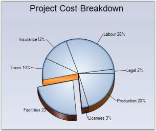 | markdownify }
{:.image }

_Figure_ _143__: Pie Chart with Gradient Styles Set_

See Also

Pie Chart

### HeightBox

Gets / sets the height of the boxes in the financial chart types.

_Table_ _38__: Features_

<table>
<tr>
<td colspan = "2">
Features</td><td>
Details</td></tr>
<tr>
<td>
Possible Values</td><td colspan = "2">
A double value</td></tr>
<tr>
<td>
Default Value     </td><td colspan = "2">
1</td></tr>
<tr>
<td>
2D / 3D Limitations</td><td colspan = "2">
No</td></tr>
<tr>
<td>
Applies to Chart Element</td><td colspan = "2">
All series</td></tr>
<tr>
<td>
Applies to Chart Types</td><td colspan = "2">
Point And Figure Chart</td></tr>
</table>

Here is some sample code.

[C#]

this.chartControl1.Series[0].HeightBox = 2f;

[VB.NET]

Me.chartControl1.Series(0).HeightBox = 2f

{  | markdownify }
{:.image }

_Figure_ _144__: PointAndFigure Chart with Box Size of 1 (Default)_

{  | markdownify }
{:.image }

_Figure_ _145__: PointAndFigure Chart with Box Size of 2_

See Also

PointAndFigure Chart

### HeightByAreaDepth

Indicates whether to draw series using the ChartArea.Depth property.

_Table_ _39__: Features_

<table>
<tr>
<td colspan = "2">
Features</td><td>
Details</td></tr>
<tr>
<td>
Possible Values</td><td colspan = "2">
True or False</td></tr>
<tr>
<td>
Default Value     </td><td colspan = "2">
False</td></tr>
<tr>
<td>
2D / 3D Limitations</td><td colspan = "2">
3D Only</td></tr>
<tr>
<td>
Applies to Chart Element</td><td colspan = "2">
All series</td></tr>
<tr>
<td>
Applies to Chart Types</td><td colspan = "2">
Pie Chart</td></tr>
</table>

Here is some sample code.

[C#]

this.chartControl1.Series[0].ConfigItems.PieItem.HeightByAreaDepth = true;

this.chartControl1.ChartArea.Depth = 25f;

[VB.NET]

Me.chartControl1.Series(0).ConfigItems.PieItem.HeightByAreaDepth = True

Me.chartControl1.ChartArea.Depth = 25f

{  | markdownify }
{:.image }

_Figure_ _146__: Pie Chart with Default Dimension_

{  | markdownify }
{:.image }

_Figure_ _147__: Pie Chart with HeightByAreaDepth Enabled_

See Also

Pie Chart

### HeightCoeficient

When in 3D mode, the relative height of the pie chart can be specified via the property. Note that the HeightByAreaDepth property should be set as false for this to take effect. 

_Table_ _40__: Features_

<table>
<tr>
<td colspan = "2">
Features</td><td>
Details</td></tr>
<tr>
<td>
Possible Values</td><td colspan = "2">
Valid Ranges From 0 to 1</td></tr>
<tr>
<td>
Default Value     </td><td colspan = "2">
0.2</td></tr>
<tr>
<td>
2D / 3D Limitations</td><td colspan = "2">
3D Only</td></tr>
<tr>
<td>
Applies to Chart Element</td><td colspan = "2">
All series</td></tr>
<tr>
<td>
Applies to Chart Types</td><td colspan = "2">
Pie Chart</td></tr>
</table>

Here is the sample code.

[C#]

this.chartControl1.Series[0].ConfigItems.PieItem.HeightByAreaDepth = false;

this.chartControl1.Series[0].ConfigItems.PieItem.HeightCoeficient = 0.1f;

[VB.NET]

Me.chartControl1.Series(0).ConfigItems.PieItem.HeightByAreaDepth = False

Me.chartControl1.Series(0).ConfigItems.PieItem.HeightCoeficient=0.1f

{  | markdownify }
{:.image }

_Figure_ _148__: Pie Chart with HeightCoeficient_

See Also

Pie Chart

### HighlightInterior

The auto highlight color for any series can be changed by setting the color at the HighlightInterior property of ChartStyleInfo class.

_Table_ _41__: Features_

<table>
<tr>
<td colspan = "2">
Features</td><td>
Details</td></tr>
<tr>
<td>
Possible Values</td><td colspan = "2">
RBG values ranges from 0 to 255</td></tr>
<tr>
<td>
Default Value     </td><td colspan = "2">
None</td></tr>
<tr>
<td>
2D / 3D Limitations</td><td colspan = "2">
No</td></tr>
<tr>
<td>
Applies to Chart Element</td><td colspan = "2">
All series</td></tr>
<tr>
<td>
Applies to Chart Types</td><td colspan = "2">
Bar Charts, Pie, Funnel, Pyramid,Bubble, Column, Area, Stacking Area, Stacking Area100, Line Charts, Box and Whisker, Gantt Chart , Tornado Chart, Polar And Radar Chart, Hi Lo Chart, Hi Lo Open Close Chart</td></tr>
</table>

Here is some sample code.

Series Wide Setting

[C#]

this.chartControl1.AutoHighlight = true;

ChartSeries series1 = this.chartControl1.Series[0];

series1.Style.HighlightInterior = new BrushInfo(GradientStyle.ForwardDiagonal, Color.Red, Color.White);

[VB.NET]

Me.chartControl1.AutoHighlight = True

Dim series1 As ChartSeries = Me.chartControl1.Series(0)

series1.Style.HighlightInterior = New BrushInfo(GradientStyle.ForwardDiagonal, Color.Red, Color.White)

{  | markdownify }
{:.image }

_Figure_ _149__: Column Chart with HighlightInterior_

Specific Data Point Setting

To set interior color for individual highlighted datapoints,

[C#]

series1.Styles[0].HighlightInterior = new BrushInfo(GradientStyle.ForwardDiagonal, Color.Red, Color.White);

series1.Styles[1].HighlightInterior = new BrushInfo(GradientStyle.ForwardDiagonal, Color.Green, Color.White);

series1.Styles[2].HighlightInterior = new BrushInfo(GradientStyle.ForwardDiagonal, Color.Yellow, Color.White);

series1.Styles[3].HighlightInterior = new BrushInfo(GradientStyle.ForwardDiagonal, Color.Pink, Color.White);

[VB.NET]

series1.Styles(0).HighlightInterior = New BrushInfo(GradientStyle.ForwardDiagonal, Color.Red, Color.White)

series1.Styles(1).HighlightInterior = New BrushInfo(GradientStyle.ForwardDiagonal, Color.Green, Color.White)

series1.Styles(2).HighlightInterior = New BrushInfo(GradientStyle.ForwardDiagonal, Color.Yellow, Color.White)

series1.Styles(3).HighlightInterior = New BrushInfo(GradientStyle.ForwardDiagonal, Color.Pink, Color.White)

See Also

Bar Charts, Pie Chart, Funnel Chart, Pyramid Chart, Bubble Chart, Column Chart, Area Chart, Stacking Area Chart, Stacking Area100 Chart, Line Charts, Box and Whisker Chart, Gantt Chart, Tornado Chart, Polar And Radar Chart, Hi Lo Chart, Hi Lo Open Close Chart

### HitTestRadius

HitTestRadius property controls the circle around this point, which will be considered within the bounds of this point for hit-testing purposes. The ChartRegion events such as ChartRegionClick, ChartRegionMouseDown, ChartRegionMouseHover, ChartRegionMouseLeave, ChartRegionMouseMove and ChartRegionMouseEnter, are being affected by this property.

_Table_ _42__: Features_

<table>
<tr>
<td colspan = "2">
Features</td><td>
Details</td></tr>
<tr>
<td>
Possible Values</td><td colspan = "2">
A double values</td></tr>
<tr>
<td>
Default Value     </td><td colspan = "2">
7.5</td></tr>
<tr>
<td>
2D / 3D Limitations</td><td colspan = "2">
None</td></tr>
<tr>
<td>
Applies to Chart Element</td><td colspan = "2">
All series</td></tr>
<tr>
<td>
Applies to Chart Types</td><td colspan = "2">
Line Chart and Step Line Chart</td></tr>
</table>

Here is some sample code.

[C#]

// Specifies the circle radius around the point for HitTest

this.chartControl1.Series[0].Style.HitTestRadius = 20;

// ChartClick Event will be fired if clicked within the above circle

void chartControl1_ChartRegionClick(object sender, Syncfusion.Windows.Forms.Chart.ChartRegionMouseEventArgs e)

{

  // Message appears when User hits the test radius region 

  if (e.Region.IsChartPoint)

  {     

    MessageBox.Show("Point is Hit");

  }

}

[VB.NET]

' Specifies the circle radius around the point for HitTest

Me.chartControl1.Series(0).Style.HitTestRadius = 20

' ChartClick Event will be fired if clicked within the above circle

Private Sub chartControl1_ChartRegionClick(ByVal sender As Object, ByVal e As Syncfusion.Windows.Forms.Chart.ChartRegionMouseEventArgs)

  ' Message appears when User hits the test radius region 

  If e.Region.IsChartPoint Then

MessageBox.Show("Point is Hit")

  End If

End Sub

{  | markdownify }
{:.image }

_Figure_ _150__: Chart with HitTestRadius = "20"_

See Also

Line Chart , StepLineChart, ChartRegionClick Events

### ImageIndex

Gets / sets the image index from the associated ImageList property.

_Table_ _43__: Features_

<table>
<tr>
<td colspan = "2">
Features</td><td>
Details</td></tr>
<tr>
<td>
Possible Values</td><td colspan = "2">
A numeric value indicating an index of the image list.</td></tr>
<tr>
<td>
Default Value     </td><td colspan = "2">
None</td></tr>
<tr>
<td>
2D / 3D Limitations</td><td colspan = "2">
No</td></tr>
<tr>
<td>
Applies to Chart Element</td><td colspan = "2">
All series and points</td></tr>
<tr>
<td>
Applies to Chart Types</td><td colspan = "2">
Area Charts, Bar Charts, Bubble Chart, Column Charts, Line  Charts, Candle Chart, Renko chart, Three Line Break Chart, Box and Whisker Chart, Gantt Chart, Tornado Chart, Polar and Radar Chart</td></tr>
</table>

Here is some sample code.

Series Wide Setting

[C#]

// Setting Images For the Series1

series1.Style.Images = new ChartImageCollection(this.imageList1.Images);

series1.Style.Symbol.ImageIndex = 0;

series1.Style.Symbol.Size = new Size(20, 20);

series1.Style.Symbol.Shape = ChartSymbolShape.Image;

[VB.NET]

' Setting Images For the Series1

series1.Style.Images = New ChartImageCollection(Me.imageList1.Images)

series1.Style.Symbol.ImageIndex = 0

series1.Style.Symbol.Size = New Size(20, 20)

series1.Style.Symbol.Shape = ChartSymbolShape.Image

{  | markdownify }
{:.image }

_Figure_ _151__: Bubble Chart_

Specific Data Point Setting

[C#]

//Symbol set for specific data points (first point)

series1.Styles[0].Images = new ChartImageCollection(this.imageList1.Images);

series1.Styles[0].Symbol.ImageIndex = 0;

series1.Styles[0].Symbol.Size = new Size(20, 20);

series1.Styles[0].Symbol.Shape = ChartSymbolShape.Image;

//Symbol set for specific data points (Second point)

series1.Styles[1].Images = new ChartImageCollection(this.imageList1.Images);

series1.Styles[1].Symbol.ImageIndex = 1;

series1.Styles[1].Symbol.Size = new Size(20, 20);

series1.Styles[1].Symbol.Shape = ChartSymbolShape.Image;

[VB.NET]

'Symbol set for specific data points (first point )

series1.Styles(0).Images = New ChartImageCollection(Me.imageList1.Images)

series1.Styles(0).Symbol.ImageIndex = 0

series1.Styles(0).Symbol.Size = New Size(20, 20)

series1.Styles(0).Symbol.Shape = ChartSymbolShape.Image

//Symbol set for specific data points (Second point here)

series1.Styles(1).Images = New ChartImageCollection(Me.imageList1.Images)

series1.Styles(1).Symbol.ImageIndex = 1

series1.Styles(1).Symbol.Size = New Size(20, 20)

series1.Styles(1).Symbol.Shape = ChartSymbolShape.Image

See Also

Area Charts, Bar Charts, Bubble Chart, Column Charts, Line Charts, Candle Chart, Renko chart, Three Line Break Chart, Box and Whisker Chart, Gantt Chart, Tornado Chart, Polar and Radar Chart

### Images

Gets / sets the imagelist that is to be associated with this ChartPoint. This property is used in conjunction with the ImageIndex property to display images associated with this point.

_Table_ _44__: Features_

<table>
<tr>
<td colspan = "2">
Features</td><td>
Details</td></tr>
<tr>
<td>
Possible Values</td><td colspan = "2">
Value that represents the custom ImageList.</td></tr>
<tr>
<td>
Default Value     </td><td colspan = "2">
None</td></tr>
<tr>
<td>
2D / 3D Limitations</td><td colspan = "2">
No</td></tr>
<tr>
<td>
Applies to Chart Element</td><td colspan = "2">
All series and points</td></tr>
<tr>
<td>
Applies to Chart Types</td><td colspan = "2">
Area Charts, Bar Charts, Bubble Chart, Column Charts, Line  Charts, Candle Chart, Renko chart, Three Line Break Chart, Box and Whisker Chart, Gantt Chart, Tornado Chart, Polar and Radar Chart</td></tr>
</table>

Here is some sample code.

[C#]

// Setting Images For the Series1

series1.Style.Images = new ChartImageCollection(this.imageList1.Images);

series1.Style.Symbol.ImageIndex = 0;

series1.Style.Symbol.Size = new Size(20, 20);

series1.Style.Symbol.Shape = ChartSymbolShape.Image;

// Disabling PhongStyle

this.chartControl1.Series[0].ConfigItems.BubbleItem.EnablePhongStyle = false;

[VB.NET]

' Setting Images For the Series1

series1.Style.Images = New ChartImageCollection(Me.imageList1.Images)

series1.Style.Symbol.ImageIndex = 0

series1.Style.Symbol.Size = New Size(20, 20)

series1.Style.Symbol.Shape = ChartSymbolShape.Image

' Disabling PhongStyle

Me.chartControl1.Series(0).ConfigItems.BubbleItem.EnablePhongStyle = False

{  | markdownify }
{:.image }

_Figure_ _152__: Bubble Chart with Image_

Specific Data Point Setting

You can also specify different image collections for different data points using the below code.

[C#]

series1.Styles[0].Images = new ChartImageCollection(this.imageList1.Images);

series1.Styles[0].Symbol.ImageIndex = 1;

series1.Styles[0].Symbol.Size = new Size(20, 20);

series1.Styles[0].Symbol.Shape = ChartSymbolShape.Image;

series1.Styles[1].Images = new ChartImageCollection(this.imageList2.Images);

series1.Styles[1].Symbol.ImageIndex = 2;

series1.Styles[1].Symbol.Size = new Size(20, 20);

series1.Styles[1].Symbol.Shape = ChartSymbolShape.Image;

[VB.NET]

series1.Styles(0).Images = New ChartImageCollection(Me.imageList1.Images)

series1.Styles(0).Symbol.ImageIndex = 1

series1.Styles(0).Symbol.Size = New Size(20, 20)

series1.Styles(0).Symbol.Shape = ChartSymbolShape.Image

series1.Styles(1).Images = New ChartImageCollection(Me.imageList2.Images)

series1.Styles(1).Symbol.ImageIndex = 2

series1.Styles(1).Symbol.Size = New Size(20, 20)

series1.Styles(1).Symbol.Shape = ChartSymbolShape.Image

See Also

Area Charts, Bar Charts, Bubble Chart, Column Charts, Line Charts, Candle Chart, Renko chart, Three Line Break Chart, Box and Whisker Chart, Gantt Chart, Tornado Chart, Polar and Radar Chart

### InSideRadius

Sets / Gets the radius of the doughnut hole of Pie chart as a fraction of the radius of the pie.

_Table_ _45__: Features_

<table>
<tr>
<td colspan = "2">
Features</td><td>
Details</td></tr>
<tr>
<td>
Possible Values</td><td colspan = "2">
Ranges from 0.0f to 1.0f.</td></tr>
<tr>
<td>
Default Value     </td><td colspan = "2">
None.</td></tr>
<tr>
<td>
2D / 3D Limitations</td><td colspan = "2">
No.</td></tr>
<tr>
<td>
Applies to Chart Element</td><td colspan = "2">
All series.</td></tr>
<tr>
<td>
Applies to Chart Types</td><td colspan = "2">
Pie Chart.</td></tr>
</table>

Here is some sample code.

[C#]

ChartSeries series1 = new ChartSeries("Market");

series1.InSideRadius = 0.5f;

[VB.NET]

Dim series1 As New ChartSeries("Market")

series1.InSideRadius = 0.5f

{  | markdownify }
{:.image }

_Figure_ _153__: InSideRadius Pie Chart_

See Also

Pie Chart

### Interior

This property will allow the user to set a solid back color, gradient or pattern style for the data points.

_Table_ _46__: Features_

<table>
<tr>
<td colspan = "2">
Features</td><td>
Details</td></tr>
<tr>
<td>
Possible Values</td><td colspan = "2">
A BrushInfo object</td></tr>
<tr>
<td>
Default Value     </td><td colspan = "2">
None</td></tr>
<tr>
<td>
2D / 3D Limitations</td><td colspan = "2">
No</td></tr>
<tr>
<td>
Applies to Chart Element</td><td colspan = "2">
All series and points</td></tr>
<tr>
<td>
Applies to Chart Types</td><td colspan = "2">
All Chart Types</td></tr>
</table>

Series Wide Setting

The spline area interior brush can be customized using the ChartSeries.Style.Interior property as shown below.

The interior color of the chart series can be customized by using the Interior property of the ChartStyleInfo class. The following code illustrates this.

[C#]

// This sets the interior color for the series. This can be done for any number of series.

this.chartControl1.Series[0].Style.Interior = new BrushInfo(GradientStyle.Horizontal ,Color.AliceBlue, Color.Green);

[VB.NET]

' This sets the interior color for the series. This can be done for any number of series.

Me.chartControl1.Series(0).Style.Interior = New BrushInfo(GradientStyle.Horizontal,Color.AliceBlue, Color.Green)

{  | markdownify }
{:.image }

_Figure_ _154__: Chart control with Gradient Control_

Specific Data Point Setting

You can also set interior color for individual data points using Series.Styles[0].Interior property.

[C#]

this.chartControl1.Series[0].Styles[0].Interior = new BrushInfo(GradientStyle.Horizontal ,Color.AliceBlue, Color.Green);

this.chartControl1.Series[0].Styles[1].Interior = new BrushInfo(GradientStyle.Horizontal ,Color.Blue, Color.AliceBlue);

[VB.NET]

Me.chartControl1.Series(0).Styles[0].Interior = New BrushInfo(GradientStyle.Horizontal,Color.AliceBlue, Color.Green)

Me.chartControl1.Series(0).Styles[1].Interior = New BrushInfo(GradientStyle.Horizontal,Color.Blue, Color.AliceBlue)

PieChart Specific

When rendering pie charts, it's sometimes very helpful to render a patterned background for each slice, while printing the pie on a gray scale printer. You can do as easily as shown below. The code here is for a Pie Chart series with 4 points.

[C#]

series1.Styles[0].Interior = new BrushInfo(PatternStyle.BackwardDiagonal, new BrushInfoColorArrayList(new Color[] { Color.Yellow, Color.Blue }));

series1.Styles[1].Interior = new BrushInfo(PatternStyle.Cross, new BrushInfoColorArrayList(new Color[] { Color.LightGreen, Color.Blue }));

series1.Styles[2].Interior = new BrushInfo(PatternStyle.SolidDiamond, new BrushInfoColorArrayList(new Color[] { Color.Beige, Color.Blue }));

series1.Styles[3].Interior = new BrushInfo(PatternStyle.Wave, new BrushInfoColorArrayList(new Color[] { Color.White, Color.Blue }));

series1.Styles[0].Text = "Server1";

series1.Styles[1].Text = "Server2";

series1.Styles[2].Text = "Server3";

series1.Styles[3].Text = "Server4";

[VB.NET]

series1.Styles(0).Interior = New BrushInfo(PatternStyle.BackwardDiagonal, New BrushInfoColorArrayList(New Color() { Color.Yellow, Color.Blue }))

series1.Styles(1).Interior = New BrushInfo(PatternStyle.Cross, New BrushInfoColorArrayList(New Color() { Color.LightGreen, Color.Blue }))

series1.Styles(2).Interior = New BrushInfo(PatternStyle.SolidDiamond, New BrushInfoColorArrayList(New Color() { Color.Beige, Color.Blue }))

series1.Styles(3).Interior = New BrushInfo(PatternStyle.Wave, New BrushInfoColorArrayList(New Color() { Color.White, Color.Blue }))

series1.Styles(0).Text = "Server1"

series1.Styles(1).Text = "Server2"

series1.Styles(2).Text = "Server3"

series1.Styles(3).Text = "Server4"

{ 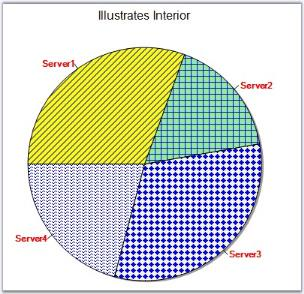 | markdownify }
{:.image }

_Figure_ _155__: Unique PatternStyle for each Slice in Pie Chart_

See Also

Chart Types

### LabelPlacement

Gets or sets the Pyramid chart or Funnel chart data point label placement when ChartAccumulationLabelStyle is set as inside.

_Table_ _47__: Features_

<table>
<tr>
<td colspan = "2">
Features</td><td>
Details</td></tr>
<tr>
<td>
Possible Values</td><td colspan = "2">
* Center – DataPoint labels are aligned to the center of the Pyramid segment.* Top - DataPoint labels are aligned to the top of the Pyramid segment.* Bottom – DataPoint labels are aligned to the bottom of the Pyramid segment.* Left - DataPoint labels are aligned to the Left of the Pyramid segment.* Right - DataPoint labels are aligned to the Right of the Pyramid segment.</td></tr>
<tr>
<td>
 Default Value     </td><td colspan = "2">
Right</td></tr>
<tr>
<td>
2D / 3D Limitations</td><td colspan = "2">
No</td></tr>
<tr>
<td>
Applies to Chart Element</td><td colspan = "2">
Any Series</td></tr>
<tr>
<td>
Applies to Chart Types</td><td colspan = "2">
Funnel and Pyramid Charts</td></tr>
</table>

Here is the code snippet using LabelPlacement in Pyramid Chart.

[C#]

this.chartControl1.Series[0].ConfigItems.PyramidItem.LabelPlacement = ChartAccumulationLabelPlacement.Center;

[VB.NET]

Me.chartControl1.Series(0).ConfigItems.PyramidItem.LabelPlacement = ChartAccumulationLabelPlacement.Center

{  | markdownify }
{:.image }

_Figure_ _156__: ChartAccumulationLabelPlacement as Center_

Here is the code snippet using LabelPlacement in Funnel Chart.

[C#]

this.chartControl1.Series[0].ConfigItems.FunnelItem.LabelPlacement = ChartAccumulationLabelPlacement.Center;

[VB.NET]

Me.chartControl1.Series(0).ConfigItems.FunnelItem.LabelPlacement = ChartAccumulationLabelPlacement.Center

{  | markdownify }
{:.image }

_Figure_ _157__: ChartAccumulationLabelPlacement as Center_

See Also

Pyramid Chart, Funnel Chart

### LabelStyle 

Gets or sets the Pyramid chart or Funnel chart label style. This property dictates the presence and overall positioning of the DataPoint labels.

_Table_ _48__: Features_

<table>
<tr>
<td colspan = "2">
Features</td><td>
Details</td></tr>
<tr>
<td>
Possible Values</td><td colspan = "2">
* Inside - DataPoint label is drawn inside the Pyramid segment.* Outside - DataPoint label is drawn outside and next to the Pyramid segment.* OutsideInColumn - DataPoint is drawn outside the Pyramid segment with all labels aligned.* Disabled - DataPoint labels are disabled.</td></tr>
<tr>
<td>
 Default Value     </td><td colspan = "2">
OutsideInColumn</td></tr>
<tr>
<td>
2D / 3D Limitations</td><td colspan = "2">
No</td></tr>
<tr>
<td>
Applies to Chart Element</td><td colspan = "2">
All Series</td></tr>
<tr>
<td>
Applies to Chart Types</td><td colspan = "2">
Funnel, Pyramid charts</td></tr>
</table>

Here is the code snippet using LabelStyle in Pyramid Chart.

[C#]

this.chartControl1.Series[0].ConfigItems.PyramidItem.LabelStyle = ChartAccumulationLabelStyle.OutsideInColumn;

[VB.NET]

Me.chartControl1.Series(0).ConfigItems.PyramidItem.LabelStyle= ChartAccumulationLabelStyle.OutsideInColumn

{  | markdownify }
{:.image }

_Figure_ _158__: ChartAccumulationLabelStyle as OutsideInColumn_

Here is the code snippet using LabelStyle in Funnel Chart.

[C#]

this.chartControl1.Series[0].ConfigItems.FunnelItem.LabelStyle = ChartAccumulationLabelStyle.OutsideInColumn;

[VB.NET]

Me.chartControl1.Series(0).ConfigItems.FunnelItem.LabelStyle= ChartAccumulationLabelStyle.OutsideInColumn

{  | markdownify }
{:.image }

_Figure_ _159__: ChartAccumulationLabelStyle as OutsideInColumn_

See Also

Pyramid Chart, Funnel Chart

### LegendItem

Refer ChartLegendItem for more information.

### LightAngle

Specifies the light angle in horizontal plane.

_Table_ _49__: Features_

<table>
<tr>
<td colspan = "2">
Features</td><td>
Details</td></tr>
<tr>
<td>
Possible Values</td><td colspan = "2">
Any double value</td></tr>
<tr>
<td>
Default Value     </td><td colspan = "2">
-0.785398163397448</td></tr>
<tr>
<td>
2D / 3D Limitations</td><td colspan = "2">
No</td></tr>
<tr>
<td>
Applies to Chart Element</td><td colspan = "2">
Any Series</td></tr>
<tr>
<td>
Applies to Chart Types</td><td colspan = "2">
Column Charts , Bar Charts, Box and Whisker Chart, Gantt Chart, Histogram Chart, Tornado Chart, Polar and Radar Chart, Candle Chart, Hilo Chart(3D), HiloOpenClose(3D)</td></tr>
</table>

Here is code snippet using LightAngle in Column Chart.

[C#]

// Specifies light angle of both the series

this.chartControl1.Series[0].ConfigItems.ColumnItem.LightAngle = 45;

this.chartControl1.Series[1].ConfigItems.ColumnItem.LightAngle = 45;

[VB.NET]

' Specifies light angle of both the series

Private Me.chartControl1.Series(0).ConfigItems.ColumnItem.LightAngle =45

Private Me.chartControl1.Series(1).ConfigItems.ColumnItem.LightAngle = 45

{  | markdownify }
{:.image }

_Figure_ _160__: Light Angle = 45 with 3D Effect_

{  | markdownify }
{:.image }

_Figure_ _161__: Light Angle = 30 with 3D Effect_

See Also

Column Charts,Bar Charts, Box and Whisker Chart , Gantt Chart , Histogram Chart, Tornado Chart , Polar and Radar Chart, Candle Chart, Hilo Chart(3D), HiloOpenClose(3D)

### LightColor

Specifies the color of light for all shading modes except ChartColumnShadingMode.FlatRectangle.

_Table_ _50__: Features_

<table>
<tr>
<td colspan = "2">
Features</td><td>
Details</td></tr>
<tr>
<td>
Possible Values</td><td colspan = "2">
A Color object</td></tr>
<tr>
<td>
Default Value     </td><td colspan = "2">
Color.White</td></tr>
<tr>
<td>
2D / 3D Limitations</td><td colspan = "2">
No</td></tr>
<tr>
<td>
Applies to Chart Element</td><td colspan = "2">
Any Series</td></tr>
<tr>
<td>
Applies to Chart Types</td><td colspan = "2">
Column Chart, Bar Chart, Box and Whisker Chart, Gantt Chart, Histogram Chart, Tornado Chart, Radar Chart</td></tr>
</table>

Here is sample code snippet using LightColor in Column Chart.

[C#]

this.chartControl1.Series[0].ConfigItems.ColumnItem.LightColor = Color.Blue;

this.chartControl1.Series[1].ConfigItems.ColumnItem.LightColor = Color.Green;

[VB.NET]

Private Me.chartControl1.Series(0).ConfigItems.ColumnItem.LightColor = Color.Blue

Private Me.chartControl1.Series(1).ConfigItems.ColumnItem.LightColor = Color.Green

{  | markdownify }
{:.image }

_Figure_ _162__: LightColor applied to Chart Series_

See Also

Scatter Chart, Column Charts, Bar Charts, Box and Whisker Chart , Gantt Chart , Histogram Chart, Tornado Chart , 

Polar and Radar Chart

### Name

Specifies the name of the Series. This name can also be used to retrieve the series by name from the series collection.

_Table_ _51__: Features_

<table>
<tr>
<td colspan = "2">
Features</td><td>
Details</td></tr>
<tr>
<td>
Possible Values</td><td colspan = "2">
Any user defined string</td></tr>
<tr>
<td>
Default Value     </td><td colspan = "2">
Null</td></tr>
<tr>
<td>
2D / 3D Limitations</td><td colspan = "2">
No</td></tr>
<tr>
<td>
Applies to Chart Element</td><td colspan = "2">
Any Series points</td></tr>
<tr>
<td>
Applies to Chart Types</td><td colspan = "2">
All chart types</td></tr>
</table>

Here is the code snippet using Name in Column Chart.

[C#]

//This Code Snippet gives the name of the series as Product1

ChartSeries s1 = new ChartSeries(); 

s1.Type = Syncfusion.Windows.Forms.Chart.ChartSeriesType.Column;          

s1.Name="Product1";

// Points to be added

this.chartControl1.Series.Add(s1);

//Series retrieved using Name

this.chartControl1.Series["Product1"].Style.Symbol.Shape = ChartSymbolShape.Diamond;

this.chartControl1.Series["Product1"].Style.Symbol.Color = Color.Red;

[VB.NET]

' This Code Snippet gives the name of the series as Product

s1 As New ChartSeries()

s1.Type = Syncfusion.Windows.Forms.Chart.ChartSeriesType.Column

s1.Name="Product1"

' Points to be added

Me.chartControl1.Series.Add(s1) 

'Series retrieved using Name

Me.chartControl1.Series["Product1"].Style.Symbol.Shape = ChartSymbolShape.Diamond 

Me.chartControl1.Series["Product1"].Style.Symbol.Color = Color.Red 

{  | markdownify }
{:.image }

_Figure_ _163__: Chart with Legend for the Series_

See Also

Chart Types

### NumberOfHistogramIntervals

Gets or sets the number of Histogram intervals.

_Table_ _52__: Features_

<table>
<tr>
<td colspan = "2">
Features</td><td>
Details</td></tr>
<tr>
<td>
Possible Values</td><td colspan = "2">
Any numeric value</td></tr>
<tr>
<td>
Default Value     </td><td colspan = "2">
10</td></tr>
<tr>
<td>
2D / 3D Limitations</td><td colspan = "2">
No</td></tr>
<tr>
<td>
Applies to Chart Element</td><td colspan = "2">
All Series Points</td></tr>
<tr>
<td>
Applies to Chart Types</td><td colspan = "2">
HistoGram Chart</td></tr>
</table>

Here is a code sample.

[C#]

// Set the desired number of intervals required for the histogram chart.

series.NumberOfHistogramIntervals = 20;

[VB.NET]

' Set the desired number of intervals required for the histogram chart.

series.NumberOfHistogramIntervals = 20

{  | markdownify }
{:.image }

_Figure_ _164__: Histogram Chart with Interval set to 20_

See Also

Histogram Chart

### OpenCloseDrawMode

Gets or sets the open, close draw mode to the HiloOpenClose chart.

_Table_ _53__: Features_

<table>
<tr>
<td colspan = "2">
Features</td><td>
Details</td></tr>
<tr>
<td>
Possible Values</td><td colspan = "2">
* Open - Points only the opening value of that period.* Close - Points out the closing value of that period.* Both - Points out both the opening and the closing values  of that period.</td></tr>
<tr>
<td>
 Default Value     </td><td colspan = "2">
Both</td></tr>
<tr>
<td>
2D / 3D Limitations</td><td colspan = "2">
No</td></tr>
<tr>
<td>
Applies to Chart Element</td><td colspan = "2">
Any Series points</td></tr>
<tr>
<td>
Applies to Chart Types</td><td colspan = "2">
HiLoOpenClose Chart</td></tr>
</table>

Here is the code snippet using OpenCloseDrawMode.

[C#]

ChartSeries CS1 = new ChartSeries("Series Name",ChartSeriesType.HiLoOpenClose);

CS1.Points.Add(date,456,214,364,386);

CS1.Points.Add(date.AddDays(1),491, 234, 321, 378 );

CS1.Points.Add(date.AddDays(2),482,193,302,352);

CS1.Points.Add(date.AddDays(3),437,243,354,391);

CS1.Points.Add(date.AddDays(4),421,223,317,367);

CS1.Points.Add(date.AddDays(5),434,263,339,385);

this.chartControl1.Series.Add(CS1);

this.chartControl1.Series[0].OpenCloseDrawMode = ChartOpenCloseDrawMode.Open;  

[VB.NET]

Dim CS1 As New ChartSeries("Series Name",ChartSeriesType.HiLoOpenClose)

CS1.Points.Add(date,456,214,364,386)

CS1.Points.Add(date.AddDays(1),491, 234, 321, 378 )

CS1.Points.Add(date.AddDays(2),482,193,302,352)

CS1.Points.Add(date.AddDays(3),437,243,354,391)

CS1.Points.Add(date.AddDays(4),421,223,317,367)

CS1.Points.Add(date.AddDays(5),434,263,339,385)

Me.chartControl1.Series.Add(CS1)

Me.chartControl1.Series(0).OpenCloseDrawMode = ChartOpenCloseDrawMode.Open

{  | markdownify }
{:.image }

_Figure_ _165__: Chart with "Open" Mode_

{  | markdownify }
{:.image }

_Figure_ _166__: Chart with "Close" Mode_

{ 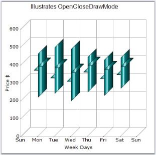 | markdownify }
{:.image }

See Also

Hi Lo Open Close Chart

### OptimizePiePointPositions

Specifies if the data points with smaller values are grouped together and ordered. By default, they are ordered in the order in which the points are added to the series.

_Table_ _54__: Features_

<table>
<tr>
<td colspan = "2">
Features</td><td>
Details</td></tr>
<tr>
<td>
Possible Values</td><td colspan = "2">
* True  - Enables optimization* False - Disables optimization </td></tr>
<tr>
<td>
Default Value     </td><td colspan = "2">
True</td></tr>
<tr>
<td>
2D / 3D Limitations</td><td colspan = "2">
No.</td></tr>
<tr>
<td>
Applies to Chart Element</td><td colspan = "2">
Any Series.</td></tr>
<tr>
<td>
Applies to Chart Types</td><td colspan = "2">
Pie Chart.</td></tr>
</table>

Here is the code snippet using OptimizePiePointPositions.

[C#]

ChartSeries series = new ChartSeries("Series Name", ChartSeriesType.Pie);

series.Points.Add(0, 20);

series.Points.Add(1, 28);

series.Points.Add(2, 23);

series.Points.Add(3, 10);

series.Points.Add(4, 12);

series.Points.Add(5, 3);

series.Points.Add(6, 2);

series.ExplodedIndex = 2;

series.OptimizePiePointPositions = false;

this.chartControl1.Series.Add(series);

[VB.NET]

Dim series As New ChartSeries("Series Name",ChartSeriesType.Pie)

series.Points.Add(0, 20)

series.Points.Add(1, 28)

series.Points.Add(2, 23)

series.Points.Add(3, 10)

series.Points.Add(4, 12)

series.Points.Add(5, 3)

series.Points.Add(6, 2)

series.ExplodedIndex = 2

series.OptimizePiePointPositions = False

Me.chartControl1.Series.Add(series)

{ 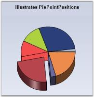 | markdownify }
{:.image }

_Figure_ _168__: OptimizePiePointPositions set to True_

{  | markdownify }
{:.image }

_Figure_ _169__: OptimizePiePointPositions set to False_

See Also

Pie Chart

### PhongAlpha

Specifies the Phong's alpha co-efficient used for calculating specular lighting.

_Table_ _55__: Features_

<table>
<tr>
<td colspan = "2">
Features </td><td>
Details</td></tr>
<tr>
<td>
Possible Values</td><td colspan = "2">
Any double value</td></tr>
<tr>
<td>
Default Value     </td><td colspan = "2">
20</td></tr>
<tr>
<td>
2D / 3D Limitations</td><td colspan = "2">
No</td></tr>
<tr>
<td>
Applies to Chart Element</td><td colspan = "2">
Any Series</td></tr>
<tr>
<td>
Applies to Chart Types</td><td colspan = "2">
Column Chart, Bar Chart, Box and Whisker Chart, Gantt Chart, Histogram Chart, Tornado Chart, Polar and Radar Chart, HiLo Chart, HiLoOpenClose Chart, Candle Chart, Scatter Chart</td></tr>
</table>

Here is code snippet using PhongAlpha in Column Chart.

[C#]

this.chartControl1.Series[0].ConfigItems.ColumnItem.PhongAlpha = 2.0;

[VB.NET]

Private Me.chartControl1.Series(0).ConfigItems.ColumnItem.PhongAlpha = 2.0

{  | markdownify }
{:.image }

_Figure_ _170__: Normal Column Chart_

{  | markdownify }
{:.image }

_Figure_ _171__: Column Chart with Phong Alpha Set_

See Also

Bar Charts , Box and Whisker , Column Charts , Candle Chart , Gantt Chart , HiLo Chart , HiLoOpenClose Chart ,  Histogram Chart , Tornado Chart, Radar Chart, Scatter Chart, 

### PieType

Sets pre-defined types for pie charts.

_Table_ _56__: Features_

<table>
<tr>
<td colspan = "2">
Features</td><td>
Details</td></tr>
<tr>
<td>
Possible Values</td><td colspan = "2">
* None - It has no specific type.* OutSide - Specifies outside pie type.* InSide - Specifies inside pie type.* Round - Specifies Round pie type.* Bevel - Specifies Bevel pie type.* Custom - Specifies custom pie type.</td></tr>
<tr>
<td>
 Default Value     </td><td colspan = "2">
None</td></tr>
<tr>
<td>
2D / 3D Limitations</td><td colspan = "2">
No</td></tr>
<tr>
<td>
Applies to Chart Element</td><td colspan = "2">
Any Pie Series</td></tr>
<tr>
<td>
Applies to Chart Types</td><td colspan = "2">
PieChart</td></tr>
</table>

[C#]

this.chartControl1.Series[0].ConfigItems.PieItem.PieType=ChartPieType.Bevel;

[VB.NET]

Me.chartControl1.Series(0).ConfigItems.PieItem.PieType = ChartPieType.Bevel

The following screen shots depict these types.

{  | markdownify }
{:.image }

_Figure_ _172__: Pie Chart_

{  | markdownify }
{:.image }

_Figure_ _173__: Pie Bevel Chart_

{ 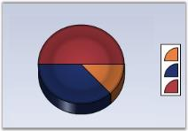 | markdownify }
{:.image }

_Figure_ _174__: Pie Inside Chart_

{  | markdownify }
{:.image }

_Figure_ _175__: Pie Outside Chart_

{  | markdownify }
{:.image }

_Figure_ _176__: Pie Round Chart_

See Also

PieChart

### PieWithSameRadius

Gets or sets whether the pie chart is rendered in the same radius when the LabelStyle is set to Outside or OutsideInColumn.

_Table_ _57__: Features_

<table>
<tr>
<td colspan = "2">
Features</td><td>
Details</td></tr>
<tr>
<td>
Possible Values</td><td colspan = "2">
True or False</td></tr>
<tr>
<td>
Default Value     </td><td colspan = "2">
False</td></tr>
<tr>
<td>
2D / 3D Limitations</td><td colspan = "2">
No</td></tr>
<tr>
<td>
Applies to Chart Element</td><td colspan = "2">
Any Pie Series</td></tr>
<tr>
<td>
Applies to Chart Types</td><td colspan = "2">
PieChart and Doughnut chart</td></tr>
</table>

[C#]

this.chartControl1.Series[0].ConfigItems.PieItem.PieWithSameRadius=true;

[VB.NET]

Me.chartControl1.Series(0).ConfigItems.PieItem.PieType = True

Setting this property to true will let you display Pie Chart with same size in the divided area.

### PointsToolTipFormat

Check Tooltips topic for more info on this setting.

See Also

Chart Types

### PointWidth

Sets the width of this point relative to the total width available. It is very useful to render series that overlap.

_Table_ _58__: Features_

<table>
<tr>
<td colspan = "2">
Features</td><td>
Details</td></tr>
<tr>
<td>
Possible Values</td><td colspan = "2">
0.0F to 1.0F</td></tr>
<tr>
<td>
Default Value     </td><td colspan = "2">
1.0F</td></tr>
<tr>
<td>
2D / 3D Limitations</td><td colspan = "2">
No</td></tr>
<tr>
<td>
Applies to Chart Element</td><td colspan = "2">
Any Series</td></tr>
<tr>
<td>
Applies to Chart Types</td><td colspan = "2">
Gantt Chart</td></tr>
</table>

Here is a code snippet using PointWidth in Gantt Chart.

Series Wide Setting

[C#]

ganttSeries.Style.PointWidth = 0.25f;

[VB.NET]

Private ganttSeries.Style.PointWidth = 0.25f

{  | markdownify }
{:.image }

_Figure_ _177__: Chart with default PointWidth_

{  | markdownify }
{:.image }

_Figure_ _178__: Chart with PointWidth= 0.25f_

Specific Data Point Setting

You can also set the PointWidth for specific points using Series.Styles[0].PointWidth for the first data point, Series.Styles[1].PointWidth for the second data point and so on.

[C#]

ganttSeries.Styles[0].PointWidth = 0.25f;

ganttSeries.Styles[1].PointWidth = 0.5f;

[VB.NET]

Private ganttSeries.Styles(0).PointWidth = 0.25f

Private ganttSeries.Styles(1).PointWidth = 0.5f

See Also

Gantt Chart

### PriceDownColor

Specifies a color for the financial item whose price is down.

_Table_ _59__: Features_

<table>
<tr>
<td colspan = "2">
Features</td><td>
Details</td></tr>
<tr>
<td>
Possible Values</td><td colspan = "2">
Any valid color</td></tr>
<tr>
<td>
Default Value     </td><td colspan = "2">
Color.Red</td></tr>
<tr>
<td>
2D / 3D Limitations</td><td colspan = "2">
No</td></tr>
<tr>
<td>
Applies to Chart Element</td><td colspan = "2">
Any series</td></tr>
<tr>
<td>
Applies to Chart Types</td><td colspan = "2">
Kagi Chart, Point and Figure Chart, Renko Chart, Three Line Break Chart</td></tr>
</table>

Here is code snippet using PriceDownColor in PointandFigure Chart.

[C#]

series7.PriceDownColor = Color.Magenta;

series7.PriceUpColor= Color.Orange;

[VB.NET]

series7.PriceDownColor = Color.Magenta

series7.PriceUpColor = Color.Orange

{  | markdownify }
{:.image }

_Figure_ _179__: PriceDownColor = "Magenta"_

See Also

Kagi Chart, Point and Figure Chart, Three Line Break Chart, Renko Chart

### PriceUpColor

Specifies a color for the financial item whose price is up.

_Table_ _60__: Features_

<table>
<tr>
<td colspan = "2">
Features</td><td>
Details</td></tr>
<tr>
<td>
Possible Values</td><td colspan = "2">
Any valid color</td></tr>
<tr>
<td>
Default Value     </td><td colspan = "2">
Color.Green</td></tr>
<tr>
<td>
2D / 3D Limitations</td><td colspan = "2">
No</td></tr>
<tr>
<td>
Applies to Chart Element</td><td colspan = "2">
Any series</td></tr>
<tr>
<td>
Applies to Chart Types</td><td colspan = "2">
Kagi Chart, PointandFigure Chart, Renko Chart, Three Line Break Chart</td></tr>
</table>

Here is sample code snippet using PriceUpColor in Kagi Chart.

[C#]

series.PriceUpColor = Color.Red;

series.PriceDownColor = Color.Green;

[VB.NET]

series.PriceUpColor = Color.Red

series.PriceDownColor = Color.Green

{  | markdownify }
{:.image }

_Figure_ _180__: PriceUpColor = "Red"_

See Also

Kagi Chart, Point and Figure Chart, Three Line Break Chart, Renko Chart

### PyramidMode

Specifies the mode in which the y values should be interpreted. In Linear mode the y values are proportional to the length of the sides of the Pyramid. In Surface Mode the y values are proportional to the surface area of the corresponding blocks.

_Table_ _61__: Features_

<table>
<tr>
<td colspan = "2">
Features</td><td>
Details</td></tr>
<tr>
<td>
Possible Values</td><td colspan = "2">
* Linear -  Draw pyramid chart in linear mode* Surface - Draw pyramid chart in surface mode</td></tr>
<tr>
<td>
 Default Value     </td><td colspan = "2">
Linear</td></tr>
<tr>
<td>
2D / 3D Limitations</td><td colspan = "2">
No</td></tr>
<tr>
<td>
Applies to Chart Element</td><td colspan = "2">
Any Series</td></tr>
<tr>
<td>
Applies to Chart Types</td><td colspan = "2">
Pyramid</td></tr>
</table>

Here is some sample code.

[C#]

this.chartControl1.Series[0].ConfigItems.PyramidItem.PyramidMode=ChartPyramidMode.Surface;

[VB.NET]

Private Me.chartControl1.Series(0).ConfigItems.PyramidItem.PyramidMode=ChartPyramidMode.Surface

{  | markdownify }
{:.image }

_Figure_ _181__: Surface Mode Pyramid Chart_

See Also

Pyramid Chart

### Radar Type

Indicates the type of radar chart to be rendered. 

_Table_ _62__: Features_

<table>
<tr>
<td colspan = "2">
Features</td><td>
Details</td></tr>
<tr>
<td>
Possible Values</td><td colspan = "2">
* Area - Renders the radar chart such that the points are connected and the enclosed region is not filled.* Line - Renders the radar chart such that the points are connected but the enclosed region is not filled.* Symbol - Points are rendered with the associated symbols</td></tr>
<tr>
<td>
 Default Value     </td><td colspan = "2">
Area</td></tr>
<tr>
<td>
2D / 3D Limitations</td><td colspan = "2">
No</td></tr>
<tr>
<td>
Applies to Chart Element</td><td colspan = "2">
Any series</td></tr>
<tr>
<td>
Applies to Chart Types</td><td colspan = "2">
Polar and Radar Chart</td></tr>
</table>

Here is code snippet using RadarType.

[C#]

this.chartControl1.Series[0].ConfigItems.RadarItem.Type = ChartRadarDrawType.Symbol;

this.chartControl1.Series[1].ConfigItems.RadarItem.Type = ChartRadarDrawType.Symbol;

this.chartControl1.Series[0].Style.Symbol.Shape = ChartSymbolShape.Star;

this.chartControl1.Series[1].Style.Symbol.Shape = ChartSymbolShape.Star;

this.chartControl1.Series[0].Style.Symbol.Color = Color.Blue;

this.chartControl1.Series[1].Style.Symbol.Color = Color.Green;

[VB.NET]

Private Me.chartControl1.Series(0).ConfigItems.RadarItem.Type = ChartRadarDrawType.Symbol

Private Me.chartControl1.Series(1).ConfigItems.RadarItem.Type = ChartRadarDrawType.Symbol

Private Me.chartControl1.Series(0).Style.Symbol.Shape = ChartSymbolShape.Star

Private Me.chartControl1.Series(1).Style.Symbol.Shape = ChartSymbolShape.Star

Private Me.chartControl1.Series(0).Style.Symbol.Color = Color.Blue

Private Me.chartControl1.Series(1).Style.Symbol.Color = Color.Green

{  | markdownify }
{:.image }

_Figure_ _182__: Radar Chart_

See Also

Polar and Radar Charts

### RadarStyle

Indicates the style of the radar chart axes.

_Table_ _63__: Features_

<table>
<tr>
<td colspan = "2">
Features</td><td>
Details</td></tr>
<tr>
<td>
Possible Values</td><td colspan = "2">
* Polygon - Axes are renders as polygon.* Circle - Axes are renders as Circle.</td></tr>
<tr>
<td>
 Default Value     </td><td colspan = "2">
Polygon</td></tr>
<tr>
<td>
2D / 3D Limitations</td><td colspan = "2">
No</td></tr>
<tr>
<td>
Applies to Chart Element</td><td colspan = "2">
Any series</td></tr>
<tr>
<td>
Applies to Chart Types</td><td colspan = "2">
Radar Chart</td></tr>
</table>

Here is code snippet using RadarType.

[C#]

this.chartControl1.RadarStyle = ChartRadarAxisStyle.Circle;

[VB.NET]

Me.chartControl1.RadarStyle = ChartRadarAxisStyle.Circle

{  | markdownify }
{:.image }

_Figure_ _183__: Radar Chart with Circle RadarStyle_

{  | markdownify }
{:.image }

_Figure_ _184__: Radar Chart with Polygon RadarStyle_

See Also

Radar Charts

### RelatedPoints

Lets you specific the relationship between two points in the Gantt chart type. This will render a line connecting the specified points.

_Table_ _64__: Features_

<table>
<tr>
<td colspan = "2">
Features</td><td>
Details</td></tr>
<tr>
<td>
Possible Values</td><td colspan = "2">
A ChartRelatedPointInfo object, which has the following properties:* Color - Any Color Object* Alignment - Any PenAlignment Property* Points - Integer Array containing the points which are to be connected.* Count - Specifies the Number of points* DashStyle - Any System.Drawing.Drawing2D.DashStyle* DashPattern - A Float array with two values* Width - Any Float value</td></tr>
<tr>
<td>
 Default Value     </td><td colspan = "2">
* Color - Control Text Color* Alignment - Center* Points - Null* Count - 0 * DashStyle - Solid* DashPattern - Null* Width - 5.0f</td></tr>
<tr>
<td>
 2D / 3D Limitations</td><td colspan = "2">
No</td></tr>
<tr>
<td>
Applies to Chart Element</td><td colspan = "2">
Any Series and Points</td></tr>
<tr>
<td>
Applies to Chart Types</td><td colspan = "2">
Gantt Chart</td></tr>
</table>

Here is sample code snippet using RelatedPoints.

[C#]

// Related Points for first series

int[] ptIndices = new int[] {2,4}; 

this.chartControl1.Series[0].Styles[3].RelatedPoints.Points = ptIndices;

this.chartControl1.Series[0].Styles[3].RelatedPoints.Color = Color.Red;

this.chartControl1.Series[0].Styles[3].RelatedPoints.Alignment = System.Drawing.Drawing2D.PenAlignment.Right;

this.chartControl1.Series[0].Styles[3].RelatedPoints.DashStyle = System.Drawing.Drawing2D.DashStyle.Custom;

this.chartControl1.Series[0].Styles[3].RelatedPoints.Width = 3f;

float[] dash = new float[] { 1.5f, 2.4f };

this.chartControl1.Series[0].Styles[3].RelatedPoints.DashPattern = dash;

// Related Points for second series

int[] ptIndices = new int[] { 1 };

this.chartControl1.Series[1].Styles[5].RelatedPoints.Points = ptIndices;

this.chartControl1.Series[1].Styles[5].RelatedPoints.Color = Color.Green;

this.chartControl1.Series[1].Styles[5].RelatedPoints.Alignment = System.Drawing.Drawing2D.PenAlignment.Center;

this.chartControl1.Series[1].Styles[5].RelatedPoints.DashStyle = System.Drawing.Drawing2D.DashStyle.Solid;

this.chartControl1.Series[1].Styles[5].RelatedPoints.Width = 3f;

[VB.NET]

' Related Points for first series

Dim ptIndices As Integer() = New Integer() {2,4}

Me.chartControl1.Series(0).Styles(3).RelatedPoints.Points = ptIndices

Me.chartControl1.Series(0).Styles(3).RelatedPoints.Color = Color.Red

Me.chartControl1.Series(0).Styles(3).RelatedPoints.Alignment = System.Drawing.Drawing2D.PenAlignment.Right

Me.chartControl1.Series(0).Styles(3).RelatedPoints.DashStyle = System.Drawing.Drawing2D.DashStyle.Custom

Me.chartControl1.Series(0).Styles(3).RelatedPoints.Width = 3f

Dim dash As Single() = New Single() { 1.5f, 2.4f }

Me.chartControl1.Series(0).Styles(3).RelatedPoints.DashPattern = dash

' Related Points for second series

Dim ptIndices As Integer() = New Integer() { 1 }

Me.chartControl1.Series(1).Styles(5).RelatedPoints.Points = ptIndices

Me.chartControl1.Series(1).Styles(5).RelatedPoints.Color = Color.Green

Me.chartControl1.Series(1).Styles(5).RelatedPoints.Alignment = System.Drawing.Drawing2D.PenAlignment.Center

Me.chartControl1.Series(1).Styles(5).RelatedPoints.DashStyle = System.Drawing.Drawing2D.DashStyle.Solid

Me.chartControl1.Series(1).Styles(5).RelatedPoints.Width = 3f

{  | markdownify }
{:.image }

_Figure_ _185__: Gantt Chart with RelatedPoints specified for certain Data Points_

See Also

Gantt Chart

### ReversalAmount

Gets or sets the reversal amount for financial charts.

_Table_ _65__: Features_

<table>
<tr>
<td colspan = "2">
Features</td><td>
Details</td></tr>
<tr>
<td>
Possible Values</td><td colspan = "2">
Any numeric value</td></tr>
<tr>
<td>
Default Value     </td><td colspan = "2">
1</td></tr>
<tr>
<td>
2D / 3D Limitations</td><td colspan = "2">
No</td></tr>
<tr>
<td>
Applies to Chart Element</td><td colspan = "2">
Any Series</td></tr>
<tr>
<td>
Applies to Chart Types</td><td colspan = "2">
Kagi Chart, Three Line Break Chart, Point and Figure Chart, Renko Chart</td></tr>
</table>

Here is code snippet using ReversalAmount in Renko Chart.

{  | markdownify }
{:.image }

_Figure_ _186__: Renko Chart with default ReversalAmount = "1"_

[C#]

series.ReversalAmount = 3;

[VB.NET]

Private series.ReversalAmount = 3

{  | markdownify }
{:.image }

_Figure_ _187__: Renko Chart with ReversalAmount = "3"_

See Also

Kagi Chart, Point and Figure Chart, Three Line Break Chart, Renko Chart

### Rotate

Indicates whether the x and y axis should be rotated for this series.

_Table_ _66__: Features_

<table>
<tr>
<td colspan = "2">
Features</td><td>
Details</td></tr>
<tr>
<td>
Possible Values</td><td colspan = "2">
True -  Enable the Rotate property False - Disable the Rotate property</td></tr>
<tr>
<td>
Default Value     </td><td colspan = "2">
False</td></tr>
<tr>
<td>
2D / 3D Limitations</td><td colspan = "2">
No</td></tr>
<tr>
<td>
Applies to Chart Element</td><td colspan = "2">
Any Series</td></tr>
<tr>
<td>
Applies to Chart Types</td><td colspan = "2">
Column Charts, Bar Charts, Area charts, Line Chart, Spline Chart, Stepline Chart, BoxandWhisker chart, Histogram chart, Polar and Radar Chart, Bubble And Scatter Chart</td></tr>
</table>

Here is sample code snippet using Rotate in Column Chart.

[C#]

this.chartControl1.Series[0].Rotate = true;

[VB.NET]

Private Me.chartControl1.Series(0).Rotate = True

{  | markdownify }
{:.image }

_Figure_ _188__: Column Chart_

{  | markdownify }
{:.image }

_Figure_ _189__: Rotated Column Chart_

See Also

Column Charts, Bar Charts, Area charts, Line Chart, Spline Chart, Stepline Chart, Kagi Chart, BoxandWhisker chart, Histogram chart, Polar and Radar Chart, Bubble And Scatter Chart

### ScatterConnectType

Specifies the connection type of the Scatter Charts.

_Table_ _67__: Features_

<table>
<tr>
<td colspan = "2">
Features</td><td>
Details</td></tr>
<tr>
<td>
Possible Values</td><td colspan = "2">
None - Scatter Connect Type will be none.Line - Scatter Connect Type will be Line.Spline - Scatter Connect Type will be spline.</td></tr>
<tr>
<td>
Default Value     </td><td colspan = "2">
None</td></tr>
<tr>
<td>
2D / 3D Limitations</td><td colspan = "2">
No</td></tr>
<tr>
<td>
Applies to Chart Element</td><td colspan = "2">
All series</td></tr>
<tr>
<td>
Applies to Chart Types</td><td colspan = "2">
Scatter Chart</td></tr>
</table>

Scatter Line Chart

Optionally, you can connect the points in the series through straight lines using the ScatterConnectType property as shown below.

[C#]

series.ScatterConnectType = ScatterConnectType.Line;

[VB.NET]

series.ScatterConnectType = ScatterConnectType.Line

{  | markdownify }
{:.image }

_Figure_ _190__: Scatter Line Chart_

Scatter Spline Chart

Alternatively, you can connect the points in the series through splines using the ScatterConnectType property as shown below.

[C#]

series.ScatterConnectType = ScatterConnectType.Spline;

series.ScatterSplineTension = 1; // Default is 0

[VB.NET]

series.ScatterConnectType = ScatterConnectType.Spline

series.ScatterSplineTension = 1 ' Default is 0

{  | markdownify }
{:.image }

_Figure_ _191__: Scatter Spline Chart_

See Also

Scatter Chart

### ScatterSplineTension

Sets the tension required for the Scatter Spline Chart.

_Table_ _68__: Features_

<table>
<tr>
<td colspan = "2">
Features</td><td>
Details</td></tr>
<tr>
<td>
Possible Values</td><td colspan = "2">
Any Possible Numeric Values</td></tr>
<tr>
<td>
Default Value     </td><td colspan = "2">
0.5</td></tr>
<tr>
<td>
2D / 3D Limitations</td><td colspan = "2">
No</td></tr>
<tr>
<td>
Applies to Chart Element</td><td colspan = "2">
All Series</td></tr>
<tr>
<td>
Applies to Chart Types</td><td colspan = "2">
ScatterSplineChart</td></tr>
</table>
Here is some sample code.

[C#]

this.chartControl1.Series[i].ScatterConnectType  = ScatterConnectType.Spline;

this.chartControl1.Series[i].ScatterSplineTension =3;

[VB.NET]

Private Me.chartControl1.Series(i).ScatterConnectType = ScatterConnectType.Spline

Private Me.chartControl1.Series(i).ScatterSplineTension =3

{  | markdownify }
{:.image }

_Figure_ _192__: Scatter Chart with ScatterSplineTension = "3"_

See Also

Scatter Chart

### SeriesToolTipFormat

Specifies the format for tooltip display in series.

_Table_ _69__: Features_

<table>
<tr>
<td colspan = "2">
Features</td><td>
Details</td></tr>
<tr>
<td>
Possible Values</td><td colspan = "2">
* {0}  -  Series Name* {1}  -  Series Style tooltip</td></tr>
<tr>
<td>
 Default Value     </td><td colspan = "2">
{0}</td></tr>
<tr>
<td>
2D / 3D Limitations</td><td colspan = "2">
No</td></tr>
<tr>
<td>
Applies to Chart Element</td><td colspan = "2">
Any Series</td></tr>
<tr>
<td>
Applies to Chart Types</td><td colspan = "2">
Area Charts, Radar Chart, Polar Chart, ThreeLineBreak Chart,PointAndFigure Chart, StepLine Chart, Spline Chart, HiloOpenClose(3D), RotatedSpline, Kagi Chart</td></tr>
</table>

Here is some sample code.

[C#]

this.chartControl1.Series[1].SeriesToolTipFormat="{0}";

[VB.NET]

Private Me.chartControl1.Series(1).SeriesToolTipFormat="{0}"

{  | markdownify }
{:.image }

_Figure_ _193__: SeriesToolTipFormat set = "{0}"_

See Also

Area Charts, Radar Chart, Polar Chart, ThreeLineBreak Chart,PointAndFigure Chart, StepLine Chart, Spline Chart, HiloOpenClose(3D), RotatedSpline, Kagi Chart

### ShadingMode

Specifies the appearance of the chart series.

_Table_ _70__: Features_

<table>
<tr>
<td colspan = "2">
Features</td><td>
Details</td></tr>
<tr>
<td>
Possible Values</td><td colspan = "2">
* FlatRectangle - Displays in a flat rectangular format.* PhongCylinder - Displays in a cylindrical format.</td></tr>
<tr>
<td>
 Default Value     </td><td colspan = "2">
PhongCylinder</td></tr>
<tr>
<td>
2D / 3D Limitations</td><td colspan = "2">
No</td></tr>
<tr>
<td>
Applies to Chart Element</td><td colspan = "2">
All Series</td></tr>
<tr>
<td>
Applies to Chart Types</td><td colspan = "2">
Column Chart, BarCharts, Candle Chart, HiLO Chart, HiLoOpenClose Chart, Tornado chart, BoxandWhisker chart, Gantt Chart, Histogram Chart, Polar and Radar Chart</td></tr>
</table>

Here is sample code snippet using ShadingMode.

[C#]

this.chartControl1.Series[0].ConfigItems.ColumnItem.ShadingMode = ChartColumnShadingMode.FlatRectangle;

[VB.NET]

Private Me.chartControl1.Series(0).ConfigItems.ColumnItem.ShadingMode = ChartColumnShadingMode.FlatRectangle

{  | markdownify }
{:.image }

_Figure_ _194__: Normal Column Chart (3D View)_

{  | markdownify }
{:.image }

_Figure_ _195__: Column Chart with ShadingMode = "FlatRectangle"_

See Also

Column Charts, BarCharts, Candle Chart, HiLO Chart, HiLoOpenClose Chart, Tornado chart, BoxandWhisker chart, Gantt Chart, Histogram Chart, Polar and Radar Chart

### ShadowInterior

Specifies the interior color of the shadow.

_Table_ _71__: Features_

<table>
<tr>
<td colspan = "2">
Features</td><td>
Details</td></tr>
<tr>
<td>
Possible Values</td><td colspan = "2">
Any valid Color format</td></tr>
<tr>
<td>
Default Value     </td><td colspan = "2">
Black</td></tr>
<tr>
<td>
2D / 3D Limitations</td><td colspan = "2">
2D only</td></tr>
<tr>
<td>
Applies to Chart Element</td><td colspan = "2">
Any Series</td></tr>
<tr>
<td>
Applies to Chart Types</td><td colspan = "2">
Column Charts, Bubble Chart, Line Charts, BarCharts, Candle Chart, Kagi Chart, Point and Figure Chart, Renko Chart, Three Line Break Chart, Box and Whisker Chart, Gantt Chart, Histogram Chart, Tornado Chart, Pie Chart, Polar and Radar Chart, Area Chart, Step Area Chart</td></tr>
</table>

Here is sample code snippet using ShadowInterior in Column Chart.

Series Wide Setting

[C#]

// Specifying Shadow Interior for 2 series

this.chartControl1.Series[0].Style.DisplayShadow = true;

this.chartControl1.Series[0].Style.ShadowInterior = new BrushInfo(GradientStyle.None, Color.SteelBlue,Color.SteelBlue);

[VB.NET]

' Specifying Shadow Interior for 2 series

Private Me.chartControl1.Series(0).Style.DisplayShadow = True

Private Me.chartControl1.Series(0).Style.ShadowInterior = New BrushInfo(GradientStyle.None, Color.SteelBlue,Color.SteelBlue)

{ 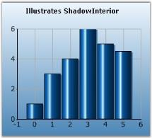 | markdownify }
{:.image }

_Figure_ _196__: ColumnChart with SkyBlue Shadow_

Specific Data Point Setting

To specify different shadow colors for individual points, use Series.Styles[0].ShadowInterior property.

[C#]

this.chartControl1.Series[0].Styles[0].ShadowInterior = new BrushInfo(GradientStyle.None, Color.SteelBlue,Color.SteelBlue);

this.chartControl1.Series[0].Styles[0].ShadowInterior = new BrushInfo(GradientStyle.None, Color.Gray,Color.Gray);

[VB.NET]

Private Me.chartControl1.Series(0).Style.ShadowInterior = New BrushInfo(GradientStyle.None, Color.SteelBlue,Color.SteelBlue)

Private Me.chartControl1.Series(0).Style.ShadowInterior = New BrushInfo(GradientStyle.None, Color.Gray,Color.Gray)

See Also

Column Charts, Bar Charts, Line Charts, Candle Chart, Kagi Chart, BoxandWhisker chart, Histogram chart, Polar and Radar Chart,Point and Figure Chart, Renko Chart, Three Line Break Chart, Gantt Chart, Tornado Chart, Pie Chart, Area Chart, Step Area Chart

### ShadowOffset

Specifies the width of the shadow of the series. 

_Table_ _72__: Features_

<table>
<tr>
<td colspan = "2">
Features</td><td>
Details</td></tr>
<tr>
<td>
Possible Values</td><td colspan = "2">
Any possible numeric values for x, y</td></tr>
<tr>
<td>
Default Value     </td><td colspan = "2">
3, 2</td></tr>
<tr>
<td>
2D / 3D Limitations</td><td colspan = "2">
2D only</td></tr>
<tr>
<td>
Applies to Chart Element</td><td colspan = "2">
Any Series</td></tr>
<tr>
<td>
Applies to Chart Types</td><td colspan = "2">
Column Charts, Bubble Chart, Line Charts, BarCharts, Candle Chart, Kagi Chart, Point and Figure Chart, Renko Chart, Three Line Break Chart, Box and Whisker Chart, Gantt Chart, Histogram Chart, Tornado Chart, Pie Chart, Polar and Radar Chart, Area Chart, Step Area Chart</td></tr>
</table>

Here is sample code snippet using ShadowOffset in Column Chart.

Series Wide Setting

[C#]

series.Style.DisplayShadow = true;

series.Style.ShadowOffset = new Size(7, 7);

//For specific points

series.Styles[0].ShadowOffset = new Size(7, 7);

series.Styles[1].ShadowOffset = new Size(8, 8);

series.Styles[2].ShadowOffset = new Size(6, 6);

[VB.NET]

Private series.Style.DisplayShadow = True

Private series.Style.ShadowOffset = New Size(7, 7)

'For specific points

Private series.Styles(0).ShadowOffset = New Size(7, 7)

Private series.Styles(1).ShadowOffset = New Size(8, 8)

Private series.Styles(2).ShadowOffset = New Size(6, 6)

{  | markdownify }
{:.image }

_Figure_ _197__: ColumnChart with ShadowOffset (7,7)_

Specific Data Point Setting

[C#]

//For specific points

series.Styles[0].ShadowOffset = new Size(7, 7);

series.Styles[1].ShadowOffset = new Size(8, 8);

series.Styles[2].ShadowOffset = new Size(6, 6);

[VB.NET]

'For specific points

Private series.Styles(0).ShadowOffset = New Size(7, 7)

Private series.Styles(1).ShadowOffset = New Size(8, 8)

Private series.Styles(2).ShadowOffset = New Size(6, 6)

See Also

Column Charts, Bar Charts, Line Charts, Candle Chart, Kagi Chart, BoxandWhisker chart, Histogram chart, Polar and Radar Chart,Point and Figure Chart, Renko Chart, Three Line Break Chart, Gantt Chart, Tornado Chart, Pie Chart, Area Chart, Step Area Chart

### ShowDataBindLabels

Indicates whether data bound labels are displayed in the chart.

_Table_ _73__: Features_

<table>
<tr>
<td colspan = "2">
Features</td><td>
Details</td></tr>
<tr>
<td>
Possible Values</td><td colspan = "2">
* True - Displays the databind labels.* False - Hides the databind labels.</td></tr>
<tr>
<td>
 Default Value     </td><td colspan = "2">
False</td></tr>
<tr>
<td>
2D / 3D Limitations</td><td colspan = "2">
No</td></tr>
<tr>
<td>
Applies to Chart Element</td><td colspan = "2">
All Series </td></tr>
<tr>
<td>
Applies to Chart Types</td><td colspan = "2">
Pie Chart, Doughnut Chart, Funnel Chart and Pyramid chart.</td></tr>
</table>

Here is sample code snippet using ShowDataPointLabels.

[C#]

//For Pie Chart

this.chartControl.Series[0].ConfigItems.PieItem.ShowDataBindLabels = true;

//For Funnel Chart

this.chartControl.Series[0].ConfigItems.FunnelItem.ShowDataBindLabels = true;

//For Pyramid Chart

this.chartControl.Series[0].ConfigItems.PyramidItem.ShowDataBindLabels = true;

[VB.NET]

'For Pie Chart

Me.chartControl.Series(0).ConfigItems.PieItem.ShowDataBindLabels = True

'For Funnel Chart

Me.chartControl.Series(0).ConfigItems.FunnelItem.ShowDataBindLabels = True

'For Pyramid Chart

Me.chartControl.Series(0).ConfigItems.PyramidItem.ShowDataBindLabels = True

{  | markdownify }
{:.image }

_Figure_ _198__: Doughnut Chart with Data-Bound Labels_

{  | markdownify }
{:.image }

_Figure_ _199__: Funnel Chart with Data-Bound Labels_

{  | markdownify }
{:.image }

_Figure_ _200__: Pyramid Chart with Data-Bound Labels_

See Also

Pie Chart, Doughnut Chart, Funnel Chart, Pyramid Chart

### ShowHistogramDataPoints

Indicates if the histogram data points should be shown.

_Table_ _74__: Features_

<table>
<tr>
<td colspan = "2">
Features</td><td>
Details</td></tr>
<tr>
<td>
Possible Values</td><td colspan = "2">
* True - Displays the datapoints.* False - Hides the datapoints.</td></tr>
<tr>
<td>
 Default Value     </td><td colspan = "2">
True</td></tr>
<tr>
<td>
2D / 3D Limitations</td><td colspan = "2">
No</td></tr>
<tr>
<td>
Applies to Chart Element</td><td colspan = "2">
Any Series</td></tr>
<tr>
<td>
Applies to Chart Types</td><td colspan = "2">
Histogram Chart</td></tr>
</table>

Here is sample code snippet using ShowHistogramDataPoints.

[C#]

this.chartControl1.Series[0].ShowHistogramDataPoints =true;

[VB.NET]

Private Me.chartControl1.Series(0).ShowHistogramDataPoints =True

{  | markdownify }
{:.image }

_Figure_ _201__: ShowHistogramDataPoints set to True_

{  | markdownify }
{:.image }

_Figure_ _202__: ShowHistogramDataPoints set to False_

See Also

Histogram Chart

### ShowTicks

Indicates whether ticks should be shown or not.

_Table_ _75__: Features_

<table>
<tr>
<td colspan = "2">
Features</td><td>
Details</td></tr>
<tr>
<td>
Possible Values</td><td colspan = "2">
* True - Displays ticks* False - Hides ticks</td></tr>
<tr>
<td>
 Default Value     </td><td colspan = "2">
True</td></tr>
<tr>
<td>
2D / 3D Limitations</td><td colspan = "2">
No</td></tr>
<tr>
<td>
Applies to Chart Element</td><td colspan = "2">
Any Series</td></tr>
<tr>
<td>
Applies to Chart Types</td><td colspan = "2">
Pie Chart</td></tr>
</table>

Here is a sample code snippet using ShowTicks.

[C#]

// Enables Ticks

this.chartControl1.Series[0].ShowTicks = true;

[VB.NET]

' Enables Ticks

Private Me.chartControl1.Series(0).ShowTicks = True

{  | markdownify }
{:.image }

_Figure_ _203__: ShowTicks = "True"_

{  | markdownify }
{:.image }

_Figure_ _204__: ShowTicks = "False"_

See Also

Pie Chart

### SmartLabels

Specifies the behavior of the labels. If set to true, the labels will be rendered to avoid overlap with other labels.

_Table_ _76__: Features_

<table>
<tr>
<td colspan = "2">
Features</td><td>
Details</td></tr>
<tr>
<td>
Possible Values</td><td colspan = "2">
* True  -  Enables smart labels* False -  Disables smart labels</td></tr>
<tr>
<td>
 Default Value     </td><td colspan = "2">
False</td></tr>
<tr>
<td>
2D / 3D Limitations</td><td colspan = "2">
No</td></tr>
<tr>
<td>
Applies to Chart Element</td><td colspan = "2">
Any Series</td></tr>
<tr>
<td>
Applies to Chart Types</td><td colspan = "2">
All chart types</td></tr>
</table>

Here is sample code snippet using Smart Labels in ColumnChart.

[C#]

this.chartControl1.Series[0].Style.DisplayText = true;

series.Styles[0].Text = series.Name;

this.chartControl1.Series[0].SmartLabels = true;

[VB.NET]

Me.chartControl1.Series(0).Style.DisplayText = True

series.Styles(0).Text = series.Name

Private Me.chartControl1.Series(0).SmartLabels = True

{  | markdownify }
{:.image }

_Figure_ _205__: Chart without enabling SmartLabels_

{  | markdownify }
{:.image }

_Figure_ _206__: Smart Label Enabled Column Chart_

Custom borders for smart Labels

Smart labels can be made smarter by displaying with customized borders. The color and the width of the border can be changed using the appearance properties available. SmartLabelsBorderColor property is used to set color for the border and SmartLabelsBorderWidth property is used to set the width of the border.

[C#]

this.chartControl1.Series[0].SmartLabelsBorderColor = Color.Yellow;

this.chartControl1.Series[0].SmartLabelsBorderWidth = 2

[VB.NET]

Me.chartControl1.Series(0).SmartLabelsBorderColor = Color.Yellow

Me.chartControl1.Series(0).SmartLabelsBorderWidth = 2

See Also

Chart Types

### Spacing

Spacing between data points

This specifies the space/width between data points in the x axis. This value is specified in percentage (%) of interval width. So, for example, if the value of the property is 20%, then only 80% of the interval width is used for rendering the data point(s). If there are multiple series then the available width is divided between the data points in the different series. This of course is used only for appropriate chart types like the column chart which has a width component.

This property will not be used when ChartColumnWidth is set to FixedWidthMode.

_Table_ _77__: Features_

<table>
<tr>
<td colspan = "2">
Features</td><td>
Details</td></tr>
<tr>
<td>
Possible Values</td><td colspan = "2">
A double value (10 to 99)</td></tr>
<tr>
<td>
Default Value     </td><td colspan = "2">
30</td></tr>
<tr>
<td>
2D / 3D Limitations</td><td colspan = "2">
No</td></tr>
<tr>
<td>
Applies to Chart Element</td><td colspan = "2">
Any Series and points</td></tr>
<tr>
<td>
Applies to Chart Types</td><td colspan = "2">
Column Charts, BarCharts, Box and Whisker Chart, Gantt Chart, Tornado Chart, Candle Chart, Hilo Chart, Hilo Open Close Chart</td></tr>
</table>

[C#]

//Indicates the spacing width in percentage that is to be applied between the datapoints of the column chart.

this.chartControl1.Spacing = 50;

[VB.NET]

'Indicates the spacing width in percentage that is to be applied between the data points of the column chart.

Me.chartControl1.Spacing = 50

{  | markdownify }
{:.image }

_Figure_ _207__: Series rendered with 50 percent Spacing_

See Also

Column Charts, BarCharts, Box and Whisker Chart, Gantt Chart, Tornado Chart, Candle Chart, Hilo Chart, Hilo Open Close Chart

### SpacingBetweenSeries

EssentialChart provides support to control the spacing between series using SpacingBetweenSeries property.

_Table_ _78__: Features_

<table>
<tr>
<td colspan = "2">
Features</td><td>
Details</td></tr>
<tr>
<td>
Possible Values</td><td colspan = "2">
A double value (10 to 100)</td></tr>
<tr>
<td>
Default Value     </td><td colspan = "2">
10</td></tr>
<tr>
<td>
2D / 3D Limitations</td><td colspan = "2">
No</td></tr>
<tr>
<td>
Applies to Chart Element</td><td colspan = "2">
Any Series</td></tr>
<tr>
<td>
Applies to Chart Types</td><td colspan = "2">
Area Charts, BarCharts, Line Charts, Bubble Chart, Financial Charts, Gantt Chart, Histogram chart, Tornado Chart, Combination Chart, Box and Whisker Chart</td></tr>
</table>

[C#]

//Specifies the spacing between individual series.

this.chartControl1.SpacingBetweenSeries = 20;

[VB.NET]

'Specifies the spacing between individual series.

Me.chartControl1.SpacingBetweenSeries = 20

{  | markdownify }
{:.image }

_Figure_ _208__: Chart with default Spacing between Series_

{  | markdownify }
{:.image }

_Figure_ _209__: Chart with SpacingBetweenSeries = "80"_

See Also

Area Charts, BarCharts, Line Charts, Column Charts, Bubble Chart, Financial Charts, Gantt Chart, Histogram chart, Tornado Chart, Combination Chart, Box and Whisker Chart

### SpacingBetweenPoints

EssentialChart provides support to control the spacing between points using SpacingBetweenPoints property.

_Table_ _79__: Features_

<table>
<tr>
<td colspan = "2">
Features</td><td>
Details</td></tr>
<tr>
<td>
Possible Values</td><td colspan = "2">
A double value (0 to 99)</td></tr>
<tr>
<td>
Default Value     </td><td colspan = "2">
0</td></tr>
<tr>
<td>
2D / 3D Limitations</td><td colspan = "2">
2D only</td></tr>
<tr>
<td>
Applies to Chart Element</td><td colspan = "2">
Series points</td></tr>
<tr>
<td>
Applies to Chart Types</td><td colspan = "2">
Column Chart, Bar Chart, HiLo Chart, HiLo Open Close Chart, Candle Chart, Tornado Chart, Boxes and Whisker Chart</td></tr>
</table>

[C#]

this.chartControl1.SpacingBetweenPoints = 70;

[VB.NET]

Me.chartControl1.SpacingBetweenSeries = 70

See Also

Column Chart, Bar Chart, HiLo Chart, HiLo Open Close Chart, Candle Chart, Tornado Chart, Box and Whisker Chart

### Stacking Group

This section illustrates how to group the stacking series with another stacking series. 

1. In order to group the stacking series with another stacking series in chart control, you need to set a StackingGroup property of the chart series with the desired group name.

The below example demonstrates the code on setting the StackingGroup for the series in the Chart control.

[C#]

ChartSeries ser1 = new ChartSeries("Series 1");

ser1.Type = ChartSeriesType.StackingColumn;

// specifing group name .

ser1.StackingGroup = "FirstGroup";

ChartSeries ser2 = new ChartSeries("Series 2");

ser2.Type = ChartSeriesType.StackingColumn;

// specifing group name .

ser2.StackingGroup = "SecondGroup";

ChartSeries ser3 = new ChartSeries("Series 3");

ser3.Type = ChartSeriesType.StackingColumn;

// specifing group name .

ser3.StackingGroup = "FirstGroup";

[VB]

Dim ser1 As New ChartSeries("Series 1")

ser1.Type = ChartSeriesType.StackingColumn

' specifing group name .

ser1.StackingGroup = "FirstGroup"

Dim ser2 As New ChartSeries("Series 2")

ser2.Type = ChartSeriesType.StackingColumn

' specifing group name .

ser2.StackingGroup = "SecondGroup"

Dim ser3 As New ChartSeries("Series 3")

ser3.Type = ChartSeriesType.StackingColumn

' specifing group name .

ser3.StackingGroup = "FirstGroup"

{  | markdownify }
{:.image }

_Figure_ _210__: Column chart with stacking group._

{  | markdownify }
{:.image }

_Figure_ _211__: Bar chart with Stacking group._

### StepItem.Inverted

Specifies if the particular stepline is inverted or not in the StepAreaChart.

_Table_ _80__: Features_

<table>
<tr>
<td colspan = "2">
Features</td><td>
Details</td></tr>
<tr>
<td>
Possible Values</td><td colspan = "2">
* True - Indicates that the stepline is inverted.* False - Indicates that the stepline is not inverted.</td></tr>
<tr>
<td>
 Default Value     </td><td colspan = "2">
True</td></tr>
<tr>
<td>
2D / 3D Limitations</td><td colspan = "2">
No</td></tr>
<tr>
<td>
Applies to Chart Element</td><td colspan = "2">
Any Series</td></tr>
<tr>
<td>
Applies to Chart Types</td><td colspan = "2">
StepAreaChart, StepLine Chart</td></tr>
</table>

Here is sample code snippet using Inverted Step.

[C#]

this.chartControl1.Series[0].ConfigItems.StepItem.Inverted=true;

[VB.NET]

Private Me.chartControl1.Series(0).ConfigItems.StepItem.Inverted=True

{  | markdownify }
{:.image }

_Figure_ _212__: Inverted = "False"_

{  | markdownify }
{:.image }

_Figure_ _213__: Inverted = "True"_

See Also

StepAreaChart, StepLine Chart

### Summary

Provides access to summary information such as minimum/maximum values contained in this series at any given moment.

_Table_ _81__: Features_

<table>
<tr>
<td colspan = "2">
Features</td><td>
Details</td></tr>
<tr>
<td>
Possible Values</td><td colspan = "2">
* MaxX - Returns the maximum X value. * MaxY - Returns the minimum Y value. * MinX - Returns the minimum X value. * MinY - Returns the minimum Y value. * ModelImpl - Returns the model implemented.* GetYPercentage - This method returns percentage value of series point in a Pie chart.</td></tr>
<tr>
<td>
 Default Value     </td><td colspan = "2">
* MaxX   - 0* MaxY   - 0* MinY    - 0* MinX    - 0* ModelImpl - Nil</td></tr>
<tr>
<td>
 2D / 3D Limitations</td><td colspan = "2">
No</td></tr>
<tr>
<td>
Applies to Chart Element</td><td colspan = "2">
Any Series</td></tr>
<tr>
<td>
Applies to Chart Types</td><td colspan = "2">
All chart types</td></tr>
</table>

Here is a sample code snippet using Radar chart.

[C#]

string str = this.chartControl1.Series[0].Summary.MaxY.ToString();

string str1 = this.chartControl1.Series[0].Summary.MinY.ToString();

label1.Text = "Summary" + "\n" + " MaxY Value : " + str + "\n" + "MinY Value : " + str1;

//To get percentage value of series point in Pie chart

this.chartControl1.Series[0].Summary.GetYPercentage(1);

this.chartControl1.Series[0].Summary.GetYPercentage(1, 0);

[VB.NET]

Dim str As String = Me.chartControl1.Series(0).Summary.MaxY.ToString() 

Dim str1 As String = Me.chartControl1.Series(0).Summary.MinY.ToString() 

label1.Text = "Summary" + "" & Chr(10) & "" + " MaxY Value : " + str + "" & Chr(10) & "" + "MinY Value : " + str1

'To get percentage value of series point in Pie chart

this.chartControl1.Series[0].Summary.GetYPercentage(1)

this.chartControl1.Series[0].Summary.GetYPercentage(1, 0)

{  | markdownify }
{:.image }

_Figure_ _214__: Summary values displayed in Labels_

See Also

Chart Types, How to find value, maximum value and minimum value among the data points

### Symbol

Sets the attributes of the symbol that is to be displayed at this point.

_Table_ _82__: Features_

<table>
<tr>
<td colspan = "2">
Features</td><td>
Details</td></tr>
<tr>
<td>
Possible Values</td><td colspan = "2">
* Size - Specifies the size of the symbol.* Color - Specifies the color of the symbol.* Shape - Specifies the shape of the symbol.* Offset - Specifies the offset of the symbol.</td></tr>
<tr>
<td>
 Default Value</td><td colspan = "2">
* Size - 10,10* Color - HighLightText Color* Shape - None* Offset - 0,0</td></tr>
<tr>
<td>
 2D / 3D Limitations</td><td colspan = "2">
No</td></tr>
<tr>
<td>
Applies to Chart Element</td><td colspan = "2">
Any Series</td></tr>
<tr>
<td>
Applies to Chart Types</td><td colspan = "2">
Column Chart, Bar Chart, Bubble Chart, Financial Chart, Line Chart, BoxandWhisker Chart, Gantt chart, Tornado chart, Radar Chart, Polar Chart, Area Charts, Scatter Chart</td></tr>
</table>

Here is sample code snippet using Symbol in Column Chart.

Series Wide Setting

[C#]

this.chartControl1.Series[0].Style.Symbol.Shape = ChartSymbolShape.Diamond;

this.chartControl1.Series[0].Style.Symbol.Color=Color.Green;

this.chartControl1.Series[0].Style.Symbol.Size = new Size(10, 10);

this.chartControl1.Series[0].Style.Symbol.Offset = new Size(1, 20);

//Sets the Color of the Symbol border.

this.chartControl1.Series[0].Style.Symbol.Border.Color = Color.Blue; 

//Sets the Width of the Symbol border.

this.chartControl1.Series[0].Style.Symbol.Border.Width = 1; 

//Sets the Alignment of the Symbol border.

this.chartControl1.Series[0].Style.Symbol.Border.Alignment = PenAlignment.Outset;

//Sets the Dash style of the Symbol Border.

this.chartControl1.Series[0].Style.Symbol.Border.DashStyle = DashStyle.Solid; 

[VB.NET]

Private Me.chartControl1.Series(0).Style.Symbol.Shape = ChartSymbolShape.Diamond

Private Me.chartControl1.Series(0).Style.Symbol.Color=Color.Green

Private Me.chartControl1.Series(0).Style.Symbol.Size = New Size(10, 10)

Private Me.chartControl1.Series(0).Style.Symbol.Offset = New Size(1, 20)

'Used to set the Color of the Symbol border.

Private Me.chartControl1.Series(0).Style.Symbol.Border.Color = Color.Blue

'Used to set the Width of the Symbol border.

Private Me.chartControl1.Series(0).Style.Symbol.Border.Width = 1

'Used to set the Alignment of the Symbol border.

Private Me.chartControl1.Series(0).Style.Symbol.Border.Alignment = PenAlignment.Outset

'Used to set the Dash style of the Symbol Border.

Private Me.chartControl1.Series0).Style.Symbol.Border.DashStyle = DashStyle.Solid

{  | markdownify }
{:.image }

_Figure_ _215__: Blue Color Diamond symbol in a Column Chart with vertical offset of 20_

Specific Data Point Setting

To specify customized symbols for individual datapoints, use Series.Styles[i].Symbol property, where i ranges from 0 to n representing the data points.

[C#]

this.chartControl1.Series[0].Styles[0].Symbol.Shape = ChartSymbolShape.Diamond;

this.chartControl1.Series[0].Styles[0].Symbol.Color=Color.Green;

this.chartControl1.Series[0].Styles[0].Symbol.Size = new Size(10, 10);

this.chartControl1.Series[0].Styles[0].Symbol.Offset = new Size(1, 20);

this.chartControl1.Series[0].Styles[1].Symbol.Shape = ChartSymbolShape.Hexagon;

this.chartControl1.Series[0].Styles[1].Symbol.Color=Color.Yellow;

this.chartControl1.Series[0].Styles[1].Symbol.Size = new Size(9, 9);

this.chartControl1.Series[0].Styles[1].Symbol.Offset = new Size(1, 20);

//Used to set the Color of the Symbol border.

this.chartControl1.Series[0].Styles[0].Symbol.Border.Color = Color.Blue; 

//Used to set the Width of the Symbol border.

this.chartControl1.Series[0].Styles[0].Symbol.Border.Width = 3; 

//Used to set the Alignment of the Symbol border.

this.chartControl1.Series[0].Styles[0].Symbol.Border.Alignment = PenAlignment.Outset;

//Used to set the Dash style of the Symbol Border.

this.chartControl1.Series[0].Styles[0].Symbol.Border.DashStyle = DashStyle.Solid; 

[VB.NET]

Private Me.chartControl1.Series(0).Styles(0).Symbol.Shape = ChartSymbolShape.Diamond

Private Me.chartControl1.Series(0).Styles(0).Symbol.Color=Color.Green

Private Me.chartControl1.Series(0).Styles(0).Symbol.Size = New Size(10, 10)

Private Me.chartControl1.Series(0).Styles(0).Symbol.Offset = New Size(1, 20)

Private Me.chartControl1.Series(0).Styles(1).Symbol.Shape = ChartSymbolShape.Hexagon

Private Me.chartControl1.Series(0).Styles(1).Symbol.Color=Color.Yellow

Private Me.chartControl1.Series(0).Styles(1).Symbol.Size = New Size(9, 9)

Private Me.chartControl1.Series(0).Styles(1).Symbol.Offset = New Size(1, 20)

'Used to set the Color of the Symbol border.

Private Me.chartControl1.Series(0).Styles[0].Symbol.Border.Color = Color.Blue

'Used to set the Width of the Symbol border.

Private Me.chartControl1.Series(0).Styles[0].Symbol.Border.Width = 3

'Used to set the Alignment of the Symbol border.

Private Me.chartControl1.Series(0).Styles[0].Symbol.Border.Alignment = PenAlignment.Outset

'Used to set the Dash style of the Symbol Border.

Private Me.chartControl1.Series0).Styles[0].Symbol.Border.DashStyle = DashStyle.Solid

See Also

Column Charts, Bar Charts, Bubble Chart, Financial Chart, Line Charts, BoxandWhisker Chart, Gantt chart, Tornado chart, Radar Chart, Polar Chart, Area Charts, Scatter Chart

### Text (Series)

It specifies the chart series text. This will be displayed at run-time in the legend.

_Table_ _83__: Features_

<table>
<tr>
<td colspan = "2">
Features</td><td>
Details</td></tr>
<tr>
<td>
Possible Values</td><td colspan = "2">
Any string value</td></tr>
<tr>
<td>
Default Value     </td><td colspan = "2">
Name of the series</td></tr>
<tr>
<td>
2D / 3D Limitations</td><td colspan = "2">
No</td></tr>
<tr>
<td>
Applies to Chart Element</td><td colspan = "2">
Any Series</td></tr>
<tr>
<td>
Applies to Chart Types</td><td colspan = "2">
All Chart Types</td></tr>
</table>

Text can be set directly by using Series object.

Here is sample code snippet.

[C#]

// Here the series text will be taken from series name

ChartSeries series1 = new ChartSeries("August",ChartSeriesType.Column);

// Add points to series1.

//....

//....

// Here, the text is given explicitly.

ChartSeries series2 = new ChartSeries("June",ChartSeriesType.Column);

series2.Text = "JuneSales";

[VB.NET]

' Here the series text will be taken from series name

Dim series1 As New ChartSeries("August",ChartSeriesType.Column)

' Add points to series1.

'....

' Here, the text is given explicitly.

Dim series2 As New ChartSeries("June",ChartSeriesType.Column)

series2.Text = "JuneSales"

{  | markdownify }
{:.image }

_Figure_ _216__: Text set for the Series_

See Also

Chart Types

### Text (Style)

Series Wide Setting

Datapoint labels for a series can be specified using Series.Style.Text property.

[C#]

//labels for the series

chartControl1.Series[0].Style.DisplayText = true;

chartControl1.Series[0].Style.Text = "Series1 Point";

[VB.NET]

'labels for the series

chartControl1.Series[0].Style.DisplayText = True

chartControl1.Series(0).Style.Text = "Series1 Point"

{ 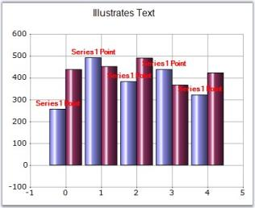 | markdownify }
{:.image }

_Figure_ _217__: DataPoint Labels displayed for the Series_

Specific Data Point Setting

Labels for specific data points can be specified through Series.Styles[0].Text property.

[C#]

//labels for the individual datapoints in the series

chartControl1.Series[0].Style.DisplayText = true;

chartControl1.Series[0].Styles[0].Text = "First Point";

chartControl1.Series[0].Styles[1].Text = "Second Point";

chartControl1.Series[0].Styles[2].Text = "Third Point";

[VB.NET]

'labels for the individual datapoints in the series

chartControl1.Series[0].Style.DisplayText = True

chartControl1.Series(0).Styles(0).Text = "First Point"

chartControl1.Series(0).Styles(1).Text = "Second Point"

chartControl1.Series(0).Styles(2).Text = "Third Point"

{  | markdownify }
{:.image }

_Figure_ _218__: Using Series.Styles[0].Text in Column Chart_

{  | markdownify }
{:.image }

_Figure_ _219__: Using Series.Styles[0].Text in Pie Chart_

See Also

Chart Types

### TextColor

It is used to set the color of the display text of the series.

_Table_ _84__: Features_

<table>
<tr>
<td colspan = "2">
Features</td><td>
Details</td></tr>
<tr>
<td>
Possible Values</td><td colspan = "2">
All predefined colors</td></tr>
<tr>
<td>
Default Value     </td><td colspan = "2">
Black</td></tr>
<tr>
<td>
2D / 3D Limitations</td><td colspan = "2">
No</td></tr>
<tr>
<td>
Applies to Chart Element</td><td colspan = "2">
Series and Points</td></tr>
<tr>
<td>
Applies to Chart Types</td><td colspan = "2">
All Chart Types</td></tr>
</table>

Here is sample code snippet using TextColor in Column Chart.

Series Wide Setting

[C#]

// Set the color of the text in the Series

this.chartControl1.Series[0].Style.TextColor = Color.Blue;

this.chartControl1.Series[1].Style.TextColor = Color.Red;

this.chartControl1.Series[2].Style.TextColor = Color.Green;

[VB.NET]

' Set the color of the text in the Series

Private Me.chartControl1.Series(0).Style.TextColor = Color.Blue

Private Me.chartControl1.Series(1).Style.TextColor = Color.Red

Private Me.chartControl1.Series(2).Style.TextColor = Color.Green

{  | markdownify }
{:.image }

_Figure_ _220__: Customized Series Text Color_

Specific Data Point Setting

We can set TextColor for specific data points in a series by using Series.Styles[0].TextColor property as follows.

[C#]

// Set the text color for the three data points in the Series

this.chartControl1.Series[0].Styles[0].TextColor = Color.Blue;

this.chartControl1.Series[0].Styles[1].TextColor = Color.SteelBlue;

this.chartControl1.Series[0].Styles[2].TextColor = Color.LightBlue;

[VB.NET]

' Set the text color for the three data points in the Series

Private Me.chartControl1.Series(0).Styles(0).TextColor = Color.Blue

Private Me.chartControl1.Series(0).Styles(1).TextColor = Color.SteelBlue

Private Me.chartControl1.Series(0).Styles(2).TextColor = Color.LightBlue

See Also

Chart Types

### TextFormat

Sets the format that is to be applied to values that are displayed as text.

_Table_ _85__: Features_

<table>
<tr>
<td colspan = "2">
Features</td><td>
Details</td></tr>
<tr>
<td>
Possible Values</td><td colspan = "2">
Any string value with '{0}' as place holder for the Y value.</td></tr>
<tr>
<td>
Default Value     </td><td colspan = "2">
Nil</td></tr>
<tr>
<td>
2D / 3D Limitations</td><td colspan = "2">
No</td></tr>
<tr>
<td>
Applies to Chart Element</td><td colspan = "2">
Any Series and Points</td></tr>
<tr>
<td>
Applies to Chart Types</td><td colspan = "2">
All Chart Types</td></tr>
</table>

Here is sample code snippet using TextFormat in Column Chart.

Series wide setting

[C#]

this.chartControl1.Series[0].Style.TextFormat = "T = {0}";

[VB.NET]

Me.chartControl1.Series(0).Style.TextFormat = "T = {0}"

{ 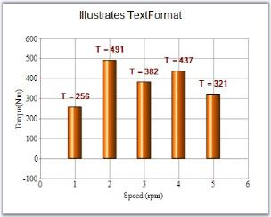 | markdownify }
{:.image }

_Figure_ _221__: TextFormat = "T = {0}"_

Specific Data Point Setting

TextFormats for individual data points are specified using below code.

[C#]

chartControl1.Series[0].Styles[0].TextFormat = "YValue : {0}";

chartControl1.Series[0].Styles[1].TextFormat = "Dollars : {0:C}";

[VB.NET]

chartControl1.Series(0).Styles(0).TextFormat = "YValue : {0}"

chartControl1.Series(0).Styles(1).TextFormat = "Dollars : {0:C}"

See Also

Chart Types

### TextOffset

Sets the Offset of the text from the position of the chart point.

_Table_ _86__: Features_

<table>
<tr>
<td colspan = "2">
Features</td><td>
Details</td></tr>
<tr>
<td>
Possible Values</td><td colspan = "2">
Any float value</td></tr>
<tr>
<td>
Default Value     </td><td colspan = "2">
2.5 </td></tr>
<tr>
<td>
2D / 3D Limitations</td><td colspan = "2">
No</td></tr>
<tr>
<td>
Applies to Chart Element</td><td colspan = "2">
Any Series</td></tr>
<tr>
<td>
Applies to Chart Types</td><td colspan = "2">
All Chart Types</td></tr>
</table>

Here is a sample code snippet using TextOffset in Column Chart.

Series Wide Setting

[C#]

this.chartControl1.Series[0].Style.TextOffset = 10.0F;

[VB.NET]

Me.chartControl1.Series(0).Style.TextOffset = 10.0F

{ 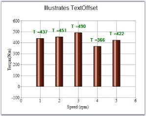 | markdownify }
{:.image }

_Figure_ _222__: Text Offset set to 10.0F_

Specific Data Point Setting

TextOffset for data points can be specified using Series.Styles[0].TextOffset property.

[C#]

this.chartControl1.Series[0].Styles[0].TextOffset = 10.0F;

this.chartControl1.Series[0].Styles[1].TextOffset = 15.0F;

[VB.NET]

Me.chartControl1.Series(0).Styles(0).TextOffset = 10.0F

Me.chartControl1.Series(0).Styles(1).TextOffset = 15.0F

See Also

Chart Types

### TextOrientation

It is used to align the text of the series within the data point region.

_Table_ _87__: Features_

<table>
<tr>
<td colspan = "2">
Features</td><td>
Details</td></tr>
<tr>
<td>
Possible Values</td><td colspan = "2">
* Center - Aligns to the center of the point.* Down - Aligns below the point.* Left - Aligns to the left position to the point.* RegionCenter - Aligns below the region that represents the points.* RegionDown - Aligns below the region that represents the points.* RegionUp - Aligns to the top of the region that represents the points.* Right - Aligns to the right of the point.* Smart - Aligns in a manner that is appropriate to the situation.* SymbolCenter - Text is centered to the symbol that is associated to the point.* Up - Aligns to the top of the point.* UpLeft - Aligns to the top left corner of the point.* UpRight - Aligns to the top right corner of the point.</td></tr>
<tr>
<td>
 Default Value     </td><td colspan = "2">
Up</td></tr>
<tr>
<td>
2D / 3D Limitations</td><td colspan = "2">
No</td></tr>
<tr>
<td>
Applies to Chart Element</td><td colspan = "2">
Any Series</td></tr>
<tr>
<td>
Applies to Chart Types</td><td colspan = "2">
All chart types</td></tr>
</table>

Here is some sample code.

Series Wide Setting

[C#]

// Text Orientation of chart series

this.chartControl1.Series[1].Style.TextOrientation = ChartTextOrientation.RegionDown;

this.chartControl1.Series[0].Style.TextOrientation = ChartTextOrientation.Up;

this.chartControl1.Series[0].Style.TextColor=Color.Blue;

this.chartControl1.Series[1].Style.TextColor=Color.Red;

[VB.NET]

' Text Orientation of chart series

Private Me.chartControl1.Series(1).Style.TextOrientation = ChartTextOrientation.RegionDown

Private Me.chartControl1.Series(0).Style.TextOrientation = ChartTextOrientation.Up

Private Me.chartControl1.Series(0).Style.TextColor=Color.Blue

Private Me.chartControl1.Series(1).Style.TextColor=Color.Red

{  | markdownify }
{:.image }

_Figure_ _223__: Text Orientation set for the Chart Series_

Specific Data Point Setting

Text orientation for specific data points can be set using Series.Style[i].TextOrientation property, where "i" represents the index of data points ranging from 0 to n.

[C#]

this.chartControl1.Series[1].Styles[0].TextOrientation = ChartTextOrientation.RegionDown;

this.chartControl1.Series[0].Styles[0].TextOrientation = ChartTextOrientation.Up;

this.chartControl1.Series[0].Styles[0].TextColor=Color.Blue;

this.chartControl1.Series[1].Styles[0].TextColor=Color.Red;

this.chartControl1.Series[1].Styles[1].TextOrientation = ChartTextOrientation.Smart;

this.chartControl1.Series[0].Styles[1].TextOrientation = ChartTextOrientation.UpRight;

this.chartControl1.Series[0].Styles[1].TextColor=Color.Green;

this.chartControl1.Series[1].Styles[1].TextColor=Color.Yellow;

[VB.NET]

Private Me.chartControl1.Series(1).Styles(0).TextOrientation = ChartTextOrientation.RegionDown

Private Me.chartControl1.Series(0).Styles(0).TextOrientation = ChartTextOrientation.Up

Private Me.chartControl1.Series(0).Styles(0).TextColor=Color.Blue

Private Me.chartControl1.Series(1).Styles(0).TextColor=Color.Red

Private Me.chartControl1.Series(1).Styles(1).TextOrientation = ChartTextOrientation.Smart

Private Me.chartControl1.Series(0).Styles(1).TextOrientation = ChartTextOrientation.UpRight

Private Me.chartControl1.Series(0).Styles(1).TextColor=Color.Green

Private Me.chartControl1.Series(1).Styles(1).TextColor=Color.Yellow

See Also

Chart Types

### ToolTip

Sets the tooltip of the style object associated with the series.

_Table_ _88__: Features_

<table>
<tr>
<td colspan = "2">
Features</td><td>
Details</td></tr>
<tr>
<td>
Possible Values</td><td colspan = "2">
Any string value</td></tr>
<tr>
<td>
Default Value     </td><td colspan = "2">
Nil</td></tr>
<tr>
<td>
2D / 3D Limitations</td><td colspan = "2">
No</td></tr>
<tr>
<td>
Applies to Chart Element</td><td colspan = "2">
Any Series</td></tr>
<tr>
<td>
Applies to Chart Types</td><td colspan = "2">
Scatter Chart, Hilo Open Close Chart(3D),Column Charts, BarCharts, Bubble Chart,Line Charts,  BoxandWhisker Chart, Tornado Chart, Combination Chart, Gantt Chart,Candle Chart, HiLo Chart(3D), PolarAndRadar, PieChart,Accumulation Charts, Area Charts</td></tr>
</table>

_Table_ _89__: Property_

<table>
<tr>
<td>
Property </td><td>
Description </td><td>
Type </td><td>
Data Type </td><td>
Reference links </td></tr>
<tr>
<td>
ShowToolTips </td><td>
Specifies whether tooltip has to be displayed.   </td><td>
Server side </td><td>
Boolean </td><td>
NA </td></tr>
</table>

Here is sample code snippet using ToolTip in the Column Chart.

Series Wide Setting

[C#]

this.chartControl1.ShowToolTips = true;

series1.PointsToolTipFormat = "{1}";

series1.Style.ToolTip = "Tooltip of Series1";

[VB.NET]

Me.chartControl1.ShowToolTips = True

series1.PointsToolTipFormat = "{1}"

series1.Style.ToolTip = "Tooltip of Series1"

{  | markdownify }
{:.image }

_Figure_ _224__: ToolTip set for Chart Series_

Specific Data Point Setting

ToolTip can be applied to individual points of a Series.

[C#]

for (int i = 0; i < series1.Points.Count; i++)

{                

    series1.Styles[i].ToolTip = string.Format("X = {0}, Y = {1}", series1.Points[0].X.ToString(),                          series1.Points[i].YValues[0]);

}

[VB]

Dim i As Integer = 0

Do While i < series1.Points.Count

series1.Styles(i).ToolTip = String.Format("X = {0}, Y = {1}", series1.Points(0).X.ToString(),          series1.Points(i).YValues(0))

  i += 1

Loop

{  | markdownify }
{:.image }

_Figure_ _225__:_ _ToolTip set for Data Point in the Series_ 

See Also

Scatter Chart, Hilo Open Close Chart(3D), Column Charts, BarCharts, Bubble Chart, Line Charts, BoxandWhisker Chart, Tornado Chart, Combination Chart, Gantt Chart, Candle Chart, HiLo Chart(3D), PolarAndRadar chart, PieChart, Accumulation Charts, Area Charts

### ToolTipFormat

Sets the tooltip format of the style object associated with the series.

_Table_ _90__: Features_

<table>
<tr>
<td colspan = "2">
Features</td><td>
Details</td></tr>
<tr>
<td>
Possible Values</td><td colspan = "2">
Any string with '{0}' as the place holder for Y value.</td></tr>
<tr>
<td>
Default Value     </td><td colspan = "2">
Nil</td></tr>
<tr>
<td>
2D / 3D Limitations</td><td colspan = "2">
No</td></tr>
<tr>
<td>
Applies to Chart Element</td><td colspan = "2">
Any Series and Points</td></tr>
<tr>
<td>
Applies to Chart Types</td><td colspan = "2">
Scatter Chart, Hilo Open Close Chart(3D),Column Charts, BarCharts, Bubble Chart,Line Charts,  BoxandWhisker Chart, Tornado Chart, Combination Chart, Gantt Chart,Candle Chart, HiLo Chart(3D), PolarAndRadar, PieChart,Accumulation Charts, Area Charts</td></tr>
</table>

Here is sample code snippet using ToolTipFormat in the Column chart.

Series Wide Setting

[C#]

this.chartControl1.ShowToolTips = true;

this.chartControl1.Series[1].Style.ToolTipFormat = "Y = {0}";

[VB.NET]

Me.chartControl1.ShowToolTips = True 

Me.chartControl1.Series[1].Style.ToolTipFormat = "Y = {0}" 

{  | markdownify }
{:.image }

_Figure_ _226__: ToolTipFormat set for Chart Series_

Specific Data Point Setting

ToolTipformat can be applied for individual points by using Series.Styles[0].ToolTipFormat property settings.

[C#]

for (int i = 0; i < series1.Points.Count; i++)

{                

    series1.Styles[i].ToolTipFormat = "{0}";

}

[VB]

Dim i As Integer = 0

Do While i < series1.Points.Count

series1.Styles(i).ToolTipFormat = "{0}";

  i += 1

Loop

{  | markdownify }
{:.image }

_Figure_ _227__: ToolTip Format set for Data Point in a Series_

See Also

Scatter Chart, Hilo Open Close Chart(3D)

### Visible

It turns on / off the visibility of the series.

_Table_ _91__: Features_

<table>
<tr>
<td>
Features</td><td colspan = "2">
Details</td></tr>
<tr>
<td colspan = "2">
Possible Values</td><td>
* True - Unhides the associated series.* False - Hides the associated series.</td></tr>
<tr>
<td colspan = "2">
 Default Value     </td><td>
True</td></tr>
<tr>
<td colspan = "2">
2D / 3D Limitations</td><td>
No</td></tr>
<tr>
<td colspan = "2">
Applies to Chart Element</td><td>
All series </td></tr>
<tr>
<td colspan = "2">
Applies to Chart Types</td><td>
All chart types</td></tr>
</table>

Here is sample code snippet using Visible property in Bar Chart.

[C#]

// Hides Series[0] and shows Series[1]

this.chartControl1.Series[0].Visible = false;

this.chartControl1.Series[1].Visible = true;

[VB.NET]

' Hides Series[0] and shows Series[1]

Private Me.chartControl1.Series(0).Visible = False

Private Me.chartControl1.Series(1).Visible = True

{  | markdownify }
{:.image }

_Figure_ _228__: Second Series Visible_

{  | markdownify }
{:.image }

_Figure_ _229__: Second Series Hidden_

See Also

Chart Types

### VisibleAllPies

Specifies whether the legend is to be displayed with one legend item for each slice in the pie.

_Table_ _92__: Features_

<table>
<tr>
<td colspan = "2">
Features</td><td>
Details</td></tr>
<tr>
<td>
Possible Values</td><td colspan = "2">
* True - Indicates only one legend item for all slices of pie.* False - Indicates one legend item for each slice of pie.</td></tr>
<tr>
<td>
 Default Value     </td><td colspan = "2">
False</td></tr>
<tr>
<td>
2D / 3D Limitations</td><td colspan = "2">
No</td></tr>
<tr>
<td>
Applies to Chart Element</td><td colspan = "2">
Any Series</td></tr>
<tr>
<td>
Applies to Chart Types</td><td colspan = "2">
Pie Chart</td></tr>
</table>

Here is the sample code snippet using VisibleAllPies in PieChart.

[C#]

this.chartControl1.ChartArea.VisibleAllPies = false;

chartControl1.Legend.RowsCount = 3;

[VB.NET]

Me.chartControl1.ChartArea.VisibleAllPies = False

chartControl1.Legend.RowsCount = 3

{  | markdownify }
{:.image }

_Figure_ _230__: VisibleAllPies set to True_

{ 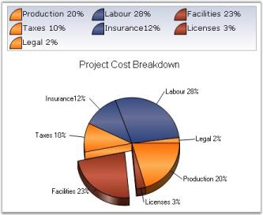 | markdownify }
{:.image }

_Figure_ _231__: VisibleAllPies set to False_

See Also

Pie Chart

### XType

Returns the x value type that is being rendered. It is a read-only property.

_Table_ _93__: Features_

<table>
<tr>
<td colspan = "2">
Features</td><td>
Details</td></tr>
<tr>
<td>
Possible Values</td><td colspan = "2">
* Double - Specifies Double values* DateTime - Specifies Date and Time values* Logarithmic - Specifies Logarithmic values* Custom - Specifies Custom values</td></tr>
<tr>
<td>
 Default Value     </td><td colspan = "2">
Double</td></tr>
<tr>
<td>
2D / 3D Limitations</td><td colspan = "2">
No</td></tr>
<tr>
<td>
Applies to Chart Element</td><td colspan = "2">
Any Series</td></tr>
<tr>
<td>
Applies to Chart Types</td><td colspan = "2">
All Chart Types</td></tr>
</table>

Here is sample code snippet using XType.

[C#]

autoLabel1.Text = this.chartControl1.Series[0].XType.ToString();

[VB.NET]

Private autoLabel1.Text = Me.chartControl1.Series(0).XType.ToString()

{  | markdownify }
{:.image }

_Figure_ _232__: Get the X Value Type that is being Rendered_

See Also

Chart Types

### YType

Returns the y value type that is being rendered. It is a read-only property.

_Table_ _94__: Features_

<table>
<tr>
<td colspan = "2">
Features</td><td>
Details</td></tr>
<tr>
<td>
Possible Values</td><td colspan = "2">
* Double - Specifies Double values* DateTime - Specifies Date and Time values* Logarithmic - Specifies Logarithmic values* Custom  -  Specifies Custom values</td></tr>
<tr>
<td>
 Default Value     </td><td colspan = "2">
Double</td></tr>
<tr>
<td>
2D / 3D Limitations</td><td colspan = "2">
No</td></tr>
<tr>
<td>
Applies to Chart Element</td><td colspan = "2">
Any Series</td></tr>
<tr>
<td>
Applies to Chart Types</td><td colspan = "2">
All Chart Types</td></tr>
</table>

Here is sample code snippet using YType.

[C#]

autoLabel1.Text = this.chartControl1.Series[0].YType.ToString();

[VB.NET]

Private autoLabel1.Text = Me.chartControl1.Series(0).YType.ToString()

{  | markdownify }
{:.image }

_Figure_ _233__: Get the Y Value Type that is being Rendered_

See Also

Chart Types

### ZOrder

Specifies the order in which the objects are arranged and controls the visibility when one is placed over the other.

By default, the ZOrder for series are assigned based on the order in which they are added to the Series collection.

_Table_ _95__: Features_

<table>
<tr>
<td colspan = "2">
Features</td><td>
Details</td></tr>
<tr>
<td>
Possible Values</td><td colspan = "2">
Any integer value</td></tr>
<tr>
<td>
Default Value     </td><td colspan = "2">
The order that we add the series in the chart control.</td></tr>
<tr>
<td>
2D / 3D Limitations</td><td colspan = "2">
No</td></tr>
<tr>
<td>
Applies to Chart Element</td><td colspan = "2">
Any Series</td></tr>
<tr>
<td>
Applies to Chart Types</td><td colspan = "2">
Gantt Chart, Histogram chart, Tornado Chart, Combination Chart, Box and Whisker Chart, Area Charts,Polar And Radar Chart, BarCharts, Column Charts, Bubble Charts, Candle Charts, Hilo Charts, Hilo Open Close Chart</td></tr>
</table>

Here is sample code snippet using ZOrder.

[C#]

this.chartControl1.Series[0].ZOrder = 0;

this.chartControl1.Series[1].ZOrder = 1;

[VB.NET]

Private Me.chartControl1.Series(0).ZOrder = 0

Private Me.chartControl1.Series(1).ZOrder = 1

{ 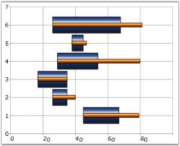 | markdownify }
{:.image }

_Figure_ _234__: Series 1 ZOrder = 0, Series 2 ZOrder = 1_

{  | markdownify }
{:.image }

_Figure_ _235__: Series 1 ZOrder = 1, Series 2 ZOrder = 0_

Rearranging the Series using ZOrder property

The chart series can be rearranged at run-time using ZOrder property as follows. The chart needs to be redrawn in order to reflect ZOrder property changes. We cannot call redrawing for every series ZOrder changes. In order to overcome this, we should change the order of the series in between the begin update and end update statements as follows.

[C#]

this.chartControl1.BeginUpdate();

this.chartControl1.Model.Series[0].ZOrder = 2;

this.chartControl1.Model.Series[1].ZOrder = 1;

this.chartControl1.Model.Series[2].ZOrder = 0;

this.chartControl1.EndUpdate();

[VB.NET]

Me.chartControl1.BeginUpdate()

Me.chartControl1.Model.Series[0].ZOrder = 2

Me.chartControl1.Model.Series[1].ZOrder = 1

Me.chartControl1.Model.Series[2].ZOrder = 0

Me.chartControl1.EndUpdate()

{  | markdownify }
{:.image }

_Figure_ _236__: Chart with Rearranged Series_

See Also

Gantt Chart, Histogram chart, Tornado Chart, Combination Chart, Box and Whisker Chart, Area Charts,Polar And Radar Chart, BarCharts, Column Charts, Bubble Charts, Candle Charts, Hilo Charts, Hilo Open Close Chart

## Data Point Labels, Tooltips and Symbols

Labels

Data Points in a series can be adorned with text labels as well as custom symbols to provide additional information regarding the specific data points.

Text labels can be rendered at the data points using the DisplayText, Text and TextFormat settings. They can further be customized using the TextColor, TextOffset and TextOrientation settings.

{  | markdownify }
{:.image }

_Figure_ _237__: Black Color DataPoint Labels with TextOrientation= "RegionCenter", TextFormat="{0}"_

Tooltips

Refer the Tooltips topic for more information on this.

Symbols

Built-in or custom symbols can be rendered at the data points to emphasize importance of certain data points. See Symbol setting for more information.

{  | markdownify }
{:.image }

_Figure_ _238__: "OrangeRed InvertedTriangle" Symbols in the Series Points_

## Custom Points

EssentialChart supports plotting of points on the Chart Area even if they don't belong to a series. These are stored in the ChartControl.CustomPoints collection. They can be set at custom coordinates of the Chart Area or be made to follow a certain point or percentage coordinates. A custom point displays a text, background, border, symbol and marker, which is a line that connects the CustomPoint with the point on the chart area when it is offset from it.

Through Designer the Custom Points can be set using the CustomPoints property. Clicking this property will popup ChartCustomPoint Collection Editor window where you can add your custom points.

You can set the co-ordinates (XValue and the YValue property), symbols and their customization, using the Symbols property, text, using the Text property, alignment of the text, using the Alignment property and so on.

{  | markdownify }
{:.image }

_Figure_ _239__: CustomPoints Collection Editor during Design Time_

{  | markdownify }
{:.image }

_Figure_ _240__: ChartControl with a Custom Point_

Programmatically

* Creating and Customizing the Custom Point.

[C#]

// Point that follows a series point:

ChartCustomPoint cp = new ChartCustomPoint();

// Gets the series index and point index if the Customtype is Pointfollow.

cp.PointIndex = 1;

cp.SeriesIndex = 0;

// Specifies the text of the custom point.

cp.Text = "Custom Point";

// Specifies the custom type.

chartCustomPoint1.CustomType = Syncfusion.Windows.Forms.Chart.ChartCustomPointType.PointFollow;

// Specifies the shape of the custom point symbol.

cp.Symbol.Shape = ChartSymbolShape.Diamond;

// Specifies the color of the custom point.

chartCustomPoint1.Symbol.Color = Color.Khaki;

//Setting X-value and Y- value

chartCustomPoint1.XValue = 1;

chartCustomPoint1.YValue = 370;

//Setting the font properties

chartCustomPoint1.Color = System.Drawing.SystemColors.ButtonHighlight;

chartCustomPoint1.Font.Bold = true;

chartCustomPoint1.Font.Facename = "Verdana";

chartCustomPoint1.Font.Size = 10F;

[VB.NET]

'Point that follows a series point:

cp As ChartCustomPoint = New ChartCustomPoint()

'Gets the series index and point index if the Customtype is Pointfollow.

cp.PointIndex = 1

cp.SeriesIndex = 0

'Specifies the text of the custom point.

cp.Text = "Custom Point"

'Specifies the custom type.

chartCustomPoint1.CustomType = Syncfusion.Windows.Forms.Chart.ChartCustomPointType.PointFollow

'Specifies the shape of the custom point symbol.

cp.Symbol.Shape = ChartSymbolShape.Diamond

'Specifies the color of the custom point.

cp.Symbol.Color = Color.Khaki

//Setting X-value and Y- value

chartCustomPoint1.XValue = 1

chartCustomPoint1.YValue = 370

'Setting the font properties

chartCustomPoint1.Color = System.Drawing.SystemColors.ButtonHighlight

chartCustomPoint1.Font.Bold = true

chartCustomPoint1.Font.Facename = "Verdana"

chartCustomPoint1.Font.Size = 10F

> {  | markdownify }
{:.image }
_Note: You can also customize a custom point symbol using Symbol property._ 

* Adding Custom Point to the Chart.

[C#]

// Adds the custom point to the collection.

this.chartControl1.CustomPoints.Add(cp);

[VB.NET]

'Adds the custom point to the collection.

Me.chartControl1.CustomPoints.Add(cp)

_Table_ _96__: Custom point types_

<table>
<tr>
<td>
CustomPoint types</td><td>
Description</td></tr>
<tr>
<td>
PointFollow</td><td>
This custom point will follow the regular points of any series, to which it is assigned.</td></tr>
<tr>
<td>
ChartCoordinates</td><td>
This lets you render a point type at any location in the chart.</td></tr>
<tr>
<td>
Percent</td><td>
The coordinates are specified as the percentage of the chart area.</td></tr>
<tr>
<td>
Pixel</td><td>
The coordinates are specified to be in pixels of the chart area.</td></tr>
</table>

{  | markdownify }
{:.image }

_Figure_ _241__: Custom Point Types Illustrated_

The custom point symbols in the above image represents following Custom Types respectively.

1. Yellow “Circle” – PointFollow 
2. Orange “Star” - Pixel 
3. Pink “Pentagon” - Percent 
4. OrangeRed “Diamond” – ChartCoordinates

A sample demonstrating all the custom point types is available in our installation at the following location:

..\My Documents\Syncfusion\EssentialStudio\Version Number\Windows\Chart.Windows\Samples\2.0\Chart Series\Chart Custom Points

### Custom Point in Multiple Axes

The custom points for the Secondary axis can be achieved by assigning the Series Index for the ChartCoordinates type.

The following code snippet illustrates this:

[C#]

ChartCustomPoint cp = new ChartCustomPoint();

cp.CustomType = ChartCustomPointType.ChartCoordinates;

//Set the series index if the Customtype is ChartCoordinates in multiple axis

cp.SeriesIndex = 0;

cp.XValue = 10; 

cp.YValue = 60;

cp.Symbol.Shape = ChartSymbolShape.Circle;

cp.Alignment = ChartTextOrientation.Left;

cp.Color = Color.Black;

cp.Font.Facename = "Verdana";

cp.Font.Size = 8.0F;

cp.Symbol.Color = Color.Yellow;

cp.Text = cp.XValue + "," + cp.YValue;

this.ChartWebControl1.CustomPoints.Add(cp);

[VB]

Dim cp As ChartCustomPoint = New ChartCustomPoint()

cp.CustomType = ChartCustomPointType.ChartCoordinates

'Set the series index if the Customtype is ChartCoordinates in multiple axis

cp.SeriesIndex = 0

cp.XValue = 10

cp.YValue = 60

cp.Symbol.Shape = ChartSymbolShape.Circle

cp.Alignment = ChartTextOrientation.Left

cp.Color = Color.Black

cp.Font.Facename = "Verdana"

cp.Font.Size = 8.0F

cp.Symbol.Color = Color.Yellow

cp.Text = cp.XValue & "," & cp.YValue

Me.ChartWebControl1.CustomPoints.Add(cp)

{  | markdownify }
{:.image }

_Figure_ _242__: Custom Points in Multiple Axes_

## Empty Points

EssentialChart lets you prevent certain points from getting plotted in the resultant chart. Such points are termed Empty Points.

Empty Points can be implemented by setting the IsEmpty property of the ChartPoint class to true.

[C#]

// This sets the specified point as empty point.

this.chartControl1.Series[1].Points[0].IsEmpty = true;

[VB.NET]

' This sets the specified point as empty point.

Me.chartControl1.Series[1].Points[0].IsEmpty = True

The following images illustrate the same. The second image displays after setting Point1 as an empty point.

{  | markdownify }
{:.image }

_Figure_ _243__: Chart without Empty Point_

{  | markdownify }
{:.image }

_Figure_ _244__: Chart with Point1 as Empty Point_

Showing Empty Point without any gap between Data Points

It is possible to set some data point as empty point and still show the chart without any gap between the points. You need to set AllowGapForEmptyPoints property to false to enable this feature. By default it is set to true. 

{  | markdownify }
{:.image }
_Note: You need to set ChartControl.Indexed property to true for the above setting to be effective._

[C#]

this.chartControl1.Series[0].Points[3].IsEmpty = true;

this.chartControl1.Series[0].Points[4].IsEmpty = true;

this.chartControl1.Series[0].Points[5].IsEmpty = true;

[VB.NET]

Me.chartControl1.Series(0).Points(3).IsEmpty = True

Me.chartControl1.Series(0).Points(4).IsEmpty = True

Me.chartControl1.Series(0).Points(5).IsEmpty = True

{  | markdownify }
{:.image }

_Figure_ _245__: 4th, 5th and 6th Data Points set as Empty Points_

[C#]

this.chartControl1.Indexed = true;

this.chartControl1.AllowGapForEmptyPoints = true;

[VB.NET]

Me.chartControl1.Indexed = True

Me.chartControl1.AllowGapForEmptyPoints = True

{ 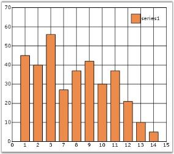 | markdownify }
{:.image }

_Figure_ _246__: 4th, 5th and 6th Data Points set as Empty Points; AllowGapForEmptyPoints = "True"_

