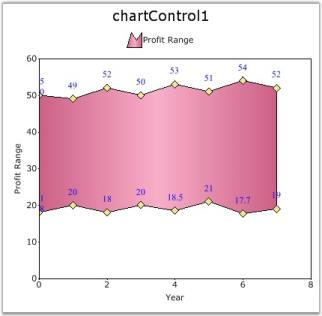
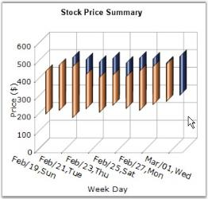
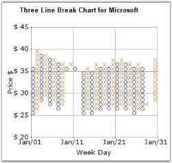
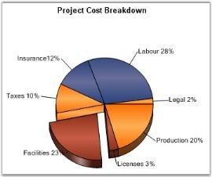

# Chart Types

Essential Chart includes a comprehensive set of more than 35 Chart types for all your business needs. Each one is highly and easily configurable with built-in support for creating stunning visual effects.

Chart types are specified on each ChartSeries through the Type property. All the chart types are required to have at least one X and one Y value. Certain chart types need more than one Y value.

The following table narrates the minimum and maximum number of series and number of Y values required by each type of chart supported by Essential Chart. 

_Table_ _5__: Chart Types_

<table>
<tr>
<td>
Chart Type</td><td>
Minimum Number of Series</td><td>
Maximum Number of Series</td><td>
Number of Y Values Required</td></tr>
<tr>
<td>
Area Charts</td><td>
1</td><td>
Unlimited</td><td>
1</td></tr>
<tr>
<td>
Bar Charts</td><td>
1</td><td>
Unlimited</td><td>
1</td></tr>
<tr>
<td>
Box And Whisker Charts</td><td>
1</td><td>
Unlimited</td><td>
5</td></tr>
<tr>
<td>
Bubble Charts</td><td>
1</td><td>
Unlimited</td><td>
2</td></tr>
<tr>
<td>
Candle Charts</td><td>
1</td><td>
Unlimited</td><td>
4</td></tr>
<tr>
<td>
Column Charts</td><td>
1</td><td>
Unlimited</td><td>
1</td></tr>
<tr>
<td>
Column Range Charts</td><td>
1</td><td>
Unlimited</td><td>
2</td></tr>
<tr>
<td>
Combination Charts</td><td>
2</td><td>
Unlimited</td><td>
1</td></tr>
<tr>
<td>
Funnel Charts</td><td>
1</td><td>
1</td><td>
1</td></tr>
<tr>
<td>
Gantt Charts</td><td>
1</td><td>
Unlimited</td><td>
2</td></tr>
<tr>
<td>
Hi Lo Charts</td><td>
1</td><td>
Unlimited</td><td>
4</td></tr>
<tr>
<td>
Hi Lo Open Close Charts</td><td>
1</td><td>
Unlimited</td><td>
4</td></tr>
<tr>
<td>
Histogram Charts</td><td>
1</td><td>
Unlimited</td><td>
1</td></tr>
<tr>
<td>
Kagi Charts</td><td>
1</td><td>
Unlimited</td><td>
1</td></tr>
<tr>
<td>
Line Charts</td><td>
1</td><td>
Unlimited</td><td>
1</td></tr>
<tr>
<td>
Pie Charts</td><td>
1</td><td>
1</td><td>
1</td></tr>
<tr>
<td>
Point And Figure Charts</td><td>
1</td><td>
Unlimited</td><td>
2</td></tr>
<tr>
<td>
Polar Charts</td><td>
1</td><td>
Unlimited</td><td>
1</td></tr>
<tr>
<td>
Pyramid Charts</td><td>
1</td><td>
1</td><td>
1</td></tr>
<tr>
<td>
Radar Charts</td><td>
1</td><td>
Unlimited</td><td>
1</td></tr>
<tr>
<td>
Renko Charts</td><td>
1</td><td>
Unlimited</td><td>
1</td></tr>
<tr>
<td>
Rotated Spline Charts</td><td>
1</td><td>
Unlimited</td><td>
1</td></tr>
<tr>
<td>
Scatter Charts</td><td>
1</td><td>
Unlimited</td><td>
1</td></tr>
<tr>
<td>
Spline Area Charts</td><td>
1</td><td>
Unlimited</td><td>
1</td></tr>
<tr>
<td>
Spline Charts</td><td>
1</td><td>
Unlimited</td><td>
1</td></tr>
<tr>
<td>
Stacking Area Charts</td><td>
2</td><td>
Unlimited</td><td>
1</td></tr>
<tr>
<td>
Stacking Bar Charts</td><td>
2</td><td>
Unlimited</td><td>
1</td></tr>
<tr>
<td>
Stacking Column Charts</td><td>
2</td><td>
Unlimited</td><td>
1</td></tr>
<tr>
<td>
Step Area Charts</td><td>
1</td><td>
Unlimited</td><td>
1</td></tr>
<tr>
<td>
Step Line Charts</td><td>
1</td><td>
Unlimited</td><td>
1</td></tr>
<tr>
<td>
Three Line Break Charts</td><td>
1</td><td>
Unlimited</td><td>
1</td></tr>
<tr>
<td>
Tornado Charts</td><td>
1</td><td>
Unlimited</td><td>
2</td></tr>
</table>
## Line Charts

Line charts typically use a line to connect the different data points in a series. Such lines are straight, splines or steps. Line charts are simpler and hence also let you visualize multiple series without overlapping like in a bar chart.

Here are the different types of Line Charts.

### Line Chart

Line Charts join points on a plot using straight lines showing trends in data at equal intervals. Line charts treats the input as non-numeric, categorical information, equally spaced along the x-axis. This is appropriate for categorical data, such as text labels, but can produce unexpected results when the X values consist of numbers.

When rendered in 3D, the plot looks like a ribbon and hence such types are also referred to as Ribbon or Strip Charts.

The appearance of the lines and the points can be configured with options such as the colors used, thickness of the lines and the symbols displayed. 

{{ '' | markdownify }}
{:.image }

_Figure_ _50__: Chart displaying Line Series in 3D Mode_

Chart Details

Number of Y values per point – 1.

Number of Series - One or More.

Cannot be Combined with - Pie, Bar, Stacked Bar, Polar, Radar. 

Line series can be added to the chart using the following code. 

[C#]

// Create chart series and add data points into it.

ChartSeries series = new ChartSeries("Series Name",ChartSeriesType.Line);

series.Points.Add(1, new double[] { 20, 8, 8 });

series.Points.Add(2, new double[] { 70, 5, 5 });

series.Points.Add(3, new double[] { 10, 8, 8 });

series.Points.Add(4, new double[] { 40, 10, 10 });

// Add the series to the chart series collection.

this.chartControl1.Series.Add(series);

[VB.NET]

' Create chart series and add data points into it.

Dim series As New ChartSeries("Series Name",ChartSeriesType.Line) 

series.Points.Add(1, new double[] { 20, 8, 8 })

series.Points.Add(2, new double[] { 70, 5, 5 })

series.Points.Add(3, new double[] { 10, 8, 8 })

series.Points.Add(4, new double[] { 40, 10, 10 })

' Add the series to the chart series collection.

Me.chartControl1.Series.Add(series)

### Spline Chart

Spline Chart is similar to a Line Chart except that it connects the different data points using splines instead of straight lines.

When rendered in 3D, the plot looks like a ribbon and hence such types are also referred to as Ribbon or Strip Charts.

The appearance of the lines and the points can be configured with options such as the colors used, thickness of the lines and the symbols displayed. 

{{ '' | markdownify }}
{:.image }

_Figure_ _51__: Chart displaying a Spline Series_

Chart Details

Number of Y values per point – 1.

Number of Series - One or More.

Cannot be Combined with - Pie, Bar, Stacked Bar, Polar, Radar.        

Spline series can be added to the chart using the following code.

[C#]

// Create chart series and add data points into it.

ChartSeries series = new ChartSeries ("Series Name",ChartSeriesType.Spline);

series.Points.Add(0, 2);

series.Points.Add(1, 3);

series.Points.Add(2, 1);

series.Points.Add(3, 1.5);

series.Points.Add(4, 4);

series.Points.Add(5, 1);

// Add the series to the chart series collection.

this.chartControl1.Series.Add (series); 

[VB.NET]

' Create chart series and add data points into it.   

Dim series As New ChartSeries ("Series Name", ChartSeriesType.Spline)

series.Points.Add(0, 2)

series.Points.Add(1, 3)

series.Points.Add(2, 1)

series.Points.Add(3, 1.5)

series.Points.Add(4, 4)

series.Points.Add(5, 1)

' Add the series to the chart series collection.

Me.chartControl1.Series.Add (series)

Customization Options

* DisplayShadow, DisplayText, DrawSeriesNameInDepth, ElementBorders, HighlightInterior, ImageIndex, Images, Rotate
* Spacing Between Series, ShadowInterior, ShadowOffset, FancyToolTip, Font, Interior, LegendItem, Name, PointsToolTipFormat, SmartLabels, 
* Summary, Text, TextColor, TextFormat, TextOffset, TextOrientation, Visible
### Rotated Spline Chart

A Rotated Spline Chart is similar to an ordinary Spline Chart. The only difference is that it would be rotated. It plots one or several series of data, and joins each series by smooth, rotated spline curves instead of straight lines.

The following image shows a sample Rotated Spline Chart.

{{ '' | markdownify }}
{:.image }

_Figure_ _52__: Chart displaying a Rotated Spline Series_

Chart Details

Number of Y values per point – 1.

Number of Series - One or More.

Cannot be Combined with - Pie, Bar, Stacked Bar, Polar, Radar.        

Rotated Spline series can be added to the chart using the following code.

[C#]

// Create chart series and add data points into it.   

ChartSeries series1 = new ChartSeries(" Series 1",ChartSeriesType.RotatedSpline );

series1.Points.Add(1, 326);

series1.Points.Add(2, 491);

series1.Points.Add(3, 382);

series1.Points.Add(4, 482);

// Add the series to the chart series collection.

this.chartControl1.Series.Add(series1);

[VB.NET]

' Create chart series and add data points into it.

Dim series1 As New ChartSeries(" Series 1",ChartSeriesType.RotatedSpline )

series1.Points.Add(1, 326)

series1.Points.Add(2, 491)

series1.Points.Add(3, 382)

series1.Points.Add(4, 482)

' Add the series to the chart series collection.

Me.chartControl1.Series.Add(series1)

Customization Options

* DisplayShadow, DisplayText, DrawSeriesNameInDepth, ElementBorders, HighlightInterior, ImageIndex, Images, Spacing Between Series
* ShadowInterior, ShadowOffset, FancyToolTip, Font, Interior, LegendItem, Name, PointsToolTipFormat, SmartLabels, 
* Summary, Text, TextColor, TextFormat, TextOffset, TextOrientation, Visible
### Step Line Chart

Step Line Charts use horizontal and vertical lines to connect data points resulting in a step like progression.

{{ '' | markdownify }}
{:.image }

_Figure_ _53__: Chart displaying Step Line Series_

Chart Details

Number of Y values per point – 1.

Number of Series - One or More.

Cannot be Combined with - Pie, Bar, Stacked Bar, Polar, Radar.        

Step Line series can be added to the chart using the following code.

[C#]

// Create chart series and add data points into it.

ChartSeries series = new ChartSeries ("Series Name",ChartSeriesType.StepLine);

series.Points.Add (0, 1);

series.Points.Add (1, 3);

series.Points.Add (2, 2);

series.Points.Add (3, 2);

// Add the series to the chart series collection.

this.chartControl1.Series.Add (series);

[VB.NET]

' Create chart series and add data points into it.

Dim series As New ChartSeries ("Series Name", ChartSeriesType.StepLine)

series.Points.Add (0, 1)

series.Points.Add (1, 3)

series.Points.Add (2, 2)

series.Points.Add (3, 2)

' Add the series to the chart series collection.

Me.chartControl1.Series.Add (series)

Customization Options

* DisplayShadow, DisplayText, DrawSeriesNameInDepth, ElementBorders, HighlightInterior, HitTestRadius, ImageIndex, Images, Rotate
* Spacing Between Series, ShadowInterior, ShadowOffset, StepItem.Inverted, FancyToolTip, Font, Interior, LegendItem, Name, PointsToolTipFormat, SmartLabels, 
* Summary, Text, TextColor, TextFormat, TextOffset, TextOrientation, Visible
## Bar Charts

Bar Charts are the simplest and most versatile of statistical diagrams. Displayed in horizontal bars, these charts are used to compare values across categories, for showing the variations in the value of an item over time.

A very similar, more common, chart type is the Column Charts where the bars are rendered vertically.

EssentialChart supports these different types of Bar Charts:

### Bar Chart

Bar Chart is the simplest and most versatile of statistical diagrams. It displays horizontal bars for each point in the series and points from adjacent series are drawn as bars next to each other. It is also available with a 3D visual effect. Bar Charts can be used to compare values across categories, for showing the variations in the value of an item over time or for showing the values of several items at a single point in time.

Another good reason to use bar charts is when you realize that the number of a data series fits better in a horizontal format. If you have long gaps between different values and you also have many items to compare, the bar chart type is the best one to use.  

The following image shows a multi series Bar Chart.

{{ '' | markdownify }}
{:.image }

_Figure_ _54__: Chart displaying Bar Series_

Chart Details

Number of Y values per point – 1.

Number of Series - One or More.

Cannot be Combined with - Any chart type except Bar and Stacked Bar charts.

Bar series can be added to the chart using the following code.

[C#]

// Create chart series and add data points into it.

ChartSeries series = new ChartSeries("Series Name",ChartSeriesType.Bar);

series.Points.Add(0, 1);

series.Points.Add(1, 3);

series.Points.Add(2, 4);

// Add the series to the chart series collection.

this.chartControl1.Series.Add(series);

[VB.NET]

' Create chart series and add data point into it.

Dim series As New ChartSeries("Series Name", ChartSeriesType.Bar)

series.Points.Add(0, 1)

series.Points.Add(1, 3)

series.Points.Add(2, 4)

' Add the series to the chart series collection.

Me.chartControl1.Series.Add(series)

Customization Options

Border, ColumnDrawMode, DisplayShadow, DisplayText, DrawSeriesNameInDepth, ElementBorders, HighlightInterior, ImageIndex, Images

LightAngle, LightColor, PhongAlpha, Rotate, Spacing, Spacing Between Series, ShadingMode, ShadowInterior, ShadowOffset, FancyToolTip, Font, Interior, LegendItem, Name, PointsToolTipFormat, SmartLabels, Summary, Text, TextColor, TextFormat, TextOffset, TextOrientation, Visible

See Also

Column Chart

### Stacking Bar Chart

Stacking Bar Charts are similar to regular bar charts except that the Y values stack on top of each other in the specified series order. This helps visualizing the relationship of parts to the whole.

The following image shows a sample Stacking Bar Chart.

{{ '' | markdownify }}
{:.image }

_Figure_ _55__: Chart displaying Stacking Bar Series_

Chart Details

Number of Y values per point – 1.

Number of Series - Two or More (Single series is rendered just as a bar).

Cannot be Combined with - Any chart type except Bar and Stacked Bar charts.

Stacking bar series can be added to the chart using the following code.

[C#]

// Create chart series and add data point into it.

ChartSeries series = new ChartSeries("Series Name",ChartSeriesType.StackingBar);

series.Points.Add(0, 1);

series.Points.Add(1, 3);

series.Points.Add(2, 4);

ChartSeries series2 = new ChartSeries("Series Name",ChartSeriesType.StackingBar);

series2.Points.Add(0, 2);

series2.Points.Add(1, 1);

series2.Points.Add(2, 1);

// Add the series to the chart series collection.

this.chartControl1.Series.Add(series);

this.chartControl1.Series.Add(series2);

[VB.NET]

' Create chart series and add data points into it.

Dim series As New ChartSeries("Series Name", ChartSeriesType.StackingBar)

series.Points.Add(0, 1)

series.Points.Add(1, 3)

series.Points.Add(2, 4)

Dim series2 As New ChartSeries("Series Name", ChartSeriesType.StackingBar)

series2.Points.Add(0, 2)

series2.Points.Add(1, 1)

series2.Points.Add(2, 1)

' Add the series to the chart series collection.

Me.chartControl1.Series.Add(series)

Me.chartControl1.Series.Add(series2)

Customization Options

* Border, ColumnDrawMode, DisplayText, DrawSeriesNameInDepth, ElementBorders, HighlightInterior, ImageIndex, Images
* LightAngle, LightColor, Rotate, Spacing, Spacing Between Series, ShadingMode, ShadowInterior, ShadowOffset, ZOrder, FancyToolTip, Font, Interior, LegendItem, Name, PointsToolTipFormat, SmartLabels, Summary, Text, TextColor, TextFormat, TextOffset, TextOrientation, Visible

See Also

Stacking Area Chart, Stacking Column Chart

### StackedBar100 Chart

This chart type displays multiple series of data as stacked Bars ensuring that the cumulative proportion of each stacked element always totals 100%. The y-axis will hence always be rendered with the range 0 - 100.

{{ '' | markdownify }}
{:.image }

_Figure_ _56__: A 100% StackedBar Chart_

Chart Details

Number of Y values per point – 1.

Number of Series - Two or More.

SupportMarker - No.

Cannot be Combined with - Any other chart types.

[C#]

ChartSeries series1 = new ChartSeries("chart", ChartSeriesType.StackingBar100);

series1.Points.Add(0, 25.3);

series1.Points.Add(1, 45.7);

series1.Points.Add(2, 97.3);

series1.Points.Add(3, 20.6);

series1.Points.Add(4, 125.8);

series1.Points.Add(5, 216.1);

this.chartControl1.Series.Add(series1);

[VB.NET]

Dim series1 As New ChartSeries("chart", ChartSeriesType.StackingBar100)

series1.Points.Add(0,25.3)

series1.Points.Add(1,45.7)

series1.Points.Add(2,97.3)

series1.Points.Add(3,20.6)

series1.Points.Add(4,125.8)

series1.Points.Add(5,216.1)

Me.chartControl1.Series.Add(series1)

Customization Options

* Border, ColumnDrawMode, DisplayText, DrawSeriesNameInDepth, ElementBorders, HighlightInterior, ImageIndex, Images
* LightAngle, LightColor, Rotate, Spacing, Spacing Between Series, ShadingMode, ShadowInterior, ShadowOffset, ZOrder, FancyToolTip, Font, Interior, LegendItem, Name, PointsToolTipFormat, SmartLabels, Summary, Text, TextColor, TextFormat, TextOffset, TextOrientation, Visible

See Also

StackedArea100 Chart, StackedColumn100 Chart

### Gantt Chart

A Gantt chart is a graphical representation of the duration of tasks against the progression of time. In a Gantt chart, each task takes up one row. The expected time for each task is represented by a horizontal bar whose left end marks the expected beginning of the task and whose right end marks the expected completion of the task. Tasks may run sequentially, in parallel or overlapping. 

You could then use another series to represent the completed portion of the different tasks. This new series will then contain data points with their beginning values coinciding with the beginning values of the data points from the previous series and the ending value based on the fraction of the work that has been completed on the task. This way, one can get a quick reading of a project progress by drawing a vertical line through the chart at the current date. 

{{ '' | markdownify }}
{:.image }

_Figure_ _57__: Chart displaying Gantt Series_

Chart Details

Number of Y values per point – 2 (1st is beginning value and the 2nd is the ending value).

Number of Series - One or More.

Cannot be Combined with - Pie, Bar, Polar, Radar.

Gantt series can be added to the chart using the following code. 

[C#]

// Create chart series and add data points into it.

ChartSeries series = new ChartSeries("Series Name",ChartSeriesType.Gantt);

series.Points.Add(0, 1, 5);

series.Points.Add(1, 3, 7);

series.Points.Add(2, 4, 8);

// Add the series to the chart series collection.

this.chartControl1.Series.Add(series);

[VB.NET]

// Create chart series and add data points into it.

Dim series As New ChartSeries("Series Name", ChartSeriesType.Gantt)

series.Points.Add(0, 1, 5)

series.Points.Add(1, 3, 7)

series.Points.Add(2, 4, 8)

Me.ChartControl1.Series.Add(series)

Customization Options

Border, ColumnDrawMode, DisplayShadow, DisplayText, ElementBorders, GanttDrawMode, HighlightInterior, ImageIndex, Images

LightAngle, LightColor, PhongAlpha, PointWidth, RelatedPoints, Spacing, Spacing Between Series, ShadingMode, ShadowInterior, ShadowOffset

ZOrder, FancyToolTip, Font, Interior, LegendItem, Name, PointsToolTipFormat, SmartLabels, 

Summary, Text, TextColor, TextFormat, TextOffset, TextOrientation, Visible

### Histogram Chart

Histogram is a bar (column) chart of a frequency distribution in which the widths of the bars are proportional to the classes into which the variable has been divided, and the heights of the bars are proportional to the class frequencies. The categories are usually specified as non overlapping intervals of some variable. The categories (bars) must be adjacent. In addition, the chart has the capability to draw a normal distribution curve.

Histograms are useful data summaries that convey the following information:

* The general shape of the frequency distribution. (normal, exponential, etc.) 
* Symmetry of the distribution and whether it is skewed.
* Modality - unimodal, bimodal or multimodal. 

The shape of the distribution conveys important information such as the probability distribution of the data. 

{{ '' | markdownify }}
{:.image }

_Figure_ _58__: Chart displaying a Histogram Series_

Chart Details

Number of Y values per point – 1.

Number of Series - One or more.

Cannot be Combined with - Pie, Bar, Polar, Radar.

[C#]

// Create chart series and add data points into it.

ChartSeries series = new ChartSeries("System 1",ChartSeriesType.Histogram);

series.Text = series.Name;

series.Points.Add( 3, 1020 );

series.Points.Add( 45, 440 );

series.Points.Add( 23, 605 );

.

.

.

.

.

// Add the series to the chart series collection.

this.chartControl1.Series.Add(series);

[VB.NET]

' Create chart series and add data points into it.

Dim series As ChartSeries =  Me.chartControl1.Model.NewSeries("System 1",ChartSeriesType.Histogram) 

series.Text = series.Name

series.Points.Add(3, 1000)

series.Points.Add(45, 1000)

series.Points.Add(23, 1000)

.

.

.

.

.

' Add the series to the chart series collection.

Me.chartControl1.Series.Add(series)

Customization Options

* Border, DisplayShadow, DisplayText, DrawHistogramNormalDistribution, LightAngle, LightColor, NumberOfHistogramIntervals, , PhongAlpha
* Rotate, Spacing Between Series, ShadingMode, ShadowInterior, ShadowOffset, ShowHistogramDataPoints, FancyToolTip, Font, Interior, LegendItem, Name, PointsToolTipFormat, SmartLabels, Summary, Text, TextColor, TextFormat, TextOffset, TextOrientation, Visible
### Tornado Chart

The Tornado chart is a bar chart which shows the variability of an output to several different inputs. Variability is displayed using relative lengths of bars across a range. It is mainly used in sensitivity analysis. It shows how different random factors can influence the prognostic outcome.

{{ '' | markdownify }}
{:.image }

_Figure_ _59__: Chart displaying a Tornado Chart_

Chart Details

Number of Y values per point – 2.

Number of Series - One or more.

Cannot be Combined with - Pie, Bar, Polar, Radar.

The Tornado series can be added to the chart using the following code.

[C#]

// Create chart series and add data points into it.

ChartSeries series = new ChartSeries("Series 0", ChartSeriesType.Tornado);

series.Points.Add(1, 0, 48);

series.Points.Add(2, 0, 42);

series.Points.Add(3, 0, 27);

series.Points.Add(4, 0, 20);

series.Points.Add(5, 0, 9);

// Add the series to the chart series collection.

this.chartControl1.Series.Add(series);

ChartSeries series2 = new ChartSeries("Series 1", ChartSeriesType.Tornado);

series2.Points.Add(1, 0, -45);

series2.Points.Add(2, 0, -39);

series2.Points.Add(3, 0, -31);

series2.Points.Add(4, 0, -20);

series2.Points.Add(5, 0, -11);

this.chartControl1.Series.Add(series2);

[VB.NET]

' Create chart series and add data points into it.

Dim series As New ChartSeries("Series 0",ChartSeriesType.Tornado) 

series.Points.Add(1,0, 48)

series.Points.Add(2, 0, 42)

series.Points.Add(3, 0, 27)

series.Points.Add(4, 0, 20)

series.Points.Add(5, 0, 9)

' Add the series to the chart series collection.

Me.chartControl1.Series.Add(series)

' Create chart series and add data points into it.

Dim series2 As New ChartSeries("Series 0",ChartSeriesType.Tornado) 

series2.Points.Add(1,0, -45)

series2.Points.Add(2, 0, -39)

series2.Points.Add(3, 0, -31)

series2.Points.Add(4, 0, -20)

series2.Points.Add(5, 0, -11)

Me.chartControl1.Series.Add(series2)

Customization Options

* Border, DisplayShadow, DisplayText, ElementBorders, HighlightInterior, ImageIndex, Images, LightAngle, LightColor, PhongAlpha
* Spacing, Spacing Between Series, ShadingMode, ShadowInterior, ShadowOffset, FancyToolTip, Font, Interior, LegendItem, Name, PointsToolTipFormat, SmartLabels, 
* Summary, Text, TextColor, TextFormat, TextOffset, TextOrientation, Visible
## Column Charts

Column Charts are among the most commonly used chart types. Displayed in vertical bars (called columns), they depict the different values of one or more items. Points from adjacent series are drawn as bars next to each other. They are ideal for showing the variations in the value of an item over time.

A very similar bar type is the Bar Charts type where the bars are rendered horizontal.

EssentialChart supports these different Column Charts.

### Column Chart

Column Charts are among the most common chart types that are being used. It uses vertical bars (called columns) to display different values of one or more items. It is similar to a bar chart except that, here the bars are vertical and not horizontal. Points from adjacent series are drawn as bars next to each other.  

It is used for comparing the frequency, count, total or average of data in different categories. It is ideal for showing the variations in the value of an item over time.

The following image shows a multi series Column Chart.

{{ '' | markdownify }}
{:.image }

_Figure_ _60__: Chart displaying Column Series_

Chart Details

Number of Y values per point – 1.

Number of Series - One or More.

Cannot be Combined with - Pie, Bar, Stacked Bar, Polar, Radar.

Column series can be added to the chart using the following code.

[C#]

// Create chart series and add data points into it.

ChartSeries series = new ChartSeries("Series Name",ChartSeriesType.Column);

series.Points.Add(0, 1);

series.Points.Add(1, 3);

series.Points.Add(2, 4);

// Add the series to the chart series collection.

this.chartControl1.Series.Add(series);

[VB.NET]

' Create chart series and add data points into it.

Dim series As New ChartSeries("Series Name", ChartSeriesType.Column)

series.Points.Add(0, 1)

series.Points.Add(1, 3)

series.Points.Add(2, 4)

' Add the series to the chart series collection.

Me.chartControl1.Series.Add(series)

Customization Options

* Border, ColumnDrawMode, ColumnWidthMode, ColumnFixedWidth, DisplayShadow, DisplayText, DrawColumnSeparatingLines, ColumnType, DrawErrorBars
* DrawSeriesNameInDepth, ElementBorders, ErrorBarsSymbolShape, HighlightInterior, ImageIndex, Images, LightAngle, LightColor, PhongAlpha, Rotate
* Spacing, Spacing Between Series, ShadingMode, ShadowInterior, ShadowOffset, FancyToolTip, Font, Interior, LegendItem, Name, PointsToolTipFormat, SmartLabels, 
* Summary, Text, TextColor, TextFormat, TextOffset, TextOrientation, Visible
### Column Range Chart

Column Range Chart is similar to the Column Chart except that each column is rendered over a range. Therefore the user must specify the y-axis starting and Ending values for each point. 

The following figure shows a Column Range Chart.

{{ '' | markdownify }}
{:.image }

_Figure_ _61__: Chart displaying Column Range Series_

Chart Details

Number of Y values per point – 2.

Number of Series - One or More.

Cannot be Combined with - Pie, Bar, Stacked Bar, Polar, Radar.

The following code snippet illustrates this.

[C#]

// Create chart series and add data points into it.

ChartSeries series = new ChartSeries("Series 0",ChartSeriesType.ColumnRange);      

series.Points.Add(0,100,400);

series.Points.Add(2,300,600);

series.Points.Add(4,200,700);

series.Text = series.Name;

// Add the series to the chart series collection.

this.ChartControl1.Series.Add(series);

[VB.NET]

' Create chart series and add data point into it.

Dim series As New ChartSeries("Series 0",ChartSeriesType.ColumnRange)

series.Points.Add(0,100,400)

series.Points.Add(2,300,600)

series.Points.Add(4,200,700)

series.Text = series.Name

' Add the series to the chart series collection.

Me.ChartControl1.Series.Add(series)

Customization Options

* Border, ColumnDrawMode, ColumnWidthMode, ColumnFixedWidth, DisplayText, DrawSeriesNameInDepth, ElementBorders, ImageIndex, Images
* LightAngle, LightColor, Rotate, Spacing, Spacing Between Series, ShadingMode, ShadowInterior, ShadowOffset, FancyToolTip, Font, Interior, LegendItem, Name, PointsToolTipFormat, SmartLabels, Summary, Text, TextColor, TextFormat, TextOffset, TextOrientation, Visible
### Stacking Column Chart

Stacking Column Charts are similar to regular column charts except that the y values stack on top of each other in the specified series order. This helps visualize the relationship of parts to the whole.

The following image shows a sample Stacking Column Chart.

{{ '' | markdownify }}
{:.image }

_Figure_ _62__: Chart displaying Stacking Column Series_

Chart Details

Number of Y values per point – 1.

Number of Series - Two or More (A single series will render just like a bar chart).

Cannot be Combined with - Pie, Bar, Stacked Bar, Polar, Radar.

Stacking column series can be added to the chart using the following code. 

[C#]

 // Create chart series and add data points into it.

ChartSeries series = new ChartSeries("Series Name",ChartSeriesType.StackingColumn);

series.Points.Add(0, 1);

series.Points.Add(1, 3);

series.Points.Add(2, 4);

ChartSeries series2 = new ChartSeries("Series Name",ChartSeriesType.StackingColumn);

series2.Points.Add(0, 2);

series2.Points.Add(1, 1);

series2.Points.Add(2, 1);

// Add the series to the chart series collection.

this.chartControl1.Series.Add(series);

this.chartControl1.Series.Add(series2);

[VB.NET]

'Create chart series and add data points into it.

Dim series As New ChartSeries("Series Name", ChartSeriesType.StackingColumn)

series.Points.Add(0, 1)

series.Points.Add(1, 3)

series.Points.Add(2, 4)

Dim series2 As New ChartSeries("Series Name", ChartSeriesType.StackingColumn)

series2.Points.Add(0, 2)

series2.Points.Add(1, 1)

series2.Points.Add(2, 1)

'Add the series to the chart series collection.

Me.chartControl1.Series.Add(series)

Me.chartControl1.Series.Add(series2)

Customization Options

* Border, ColumnWidthMode, ColumnFixedWidth, DisplayShadow, DisplayText, DrawSeriesNameInDepth, ElementBorders, ImageIndex, Images
* LightAngle, LightColor, Rotate, Spacing, Spacing Between Series, ShadingMode, ShadowInterior, ShadowOffset, ZOrder, FancyToolTip, Font, Interior, LegendItem, Name, PointsToolTipFormat, SmartLabels, Summary, Text, TextColor, TextFormat, TextOffset, TextOrientation, Visible

See Also

Stacking Area Chart, Stacking Bar Chart

### Stacked Column100 Chart

This chart type displays multiple series of data as stacked Columns ensuring that the cumulative proportion of each stacked element always totals 100 percent. The y-axis will hence always be rendered with the range 0 - 100.

{{ '' | markdownify }}
{:.image }

_Figure_ _63__: A 100 percent StackedColumn Chart_

Chart Details

Number of Y values per point – 1.

Number of Series - Two or More.

SupportMarker – No.

Cannot be Combined with - Doughnut, Pie, Bar, Stacked Bar charts, Polar, Radar, Pyramid, or Funnel.

[C#]

ChartSeries series1 = new ChartSeries("Series 1", ChartSeriesType.StackingColumn100);

series1.Points.Add(0, 25.3);

series1.Points.Add(1, 45.7);

series1.Points.Add(2, 97.3);

series1.Points.Add(3, 20.6);

series1.Points.Add(4, 125.8);

series1.Points.Add(5, 216.1);

this.chartControl1.Series.Add(series1);

[VB.NET]

Dim series1 As New ChartSeries(" Series", ChartSeriesType.StackingColumn100)

series1.Points.Add(0,25.3)

series1.Points.Add(1,45.7)

series1.Points.Add(2,97.3)

series1.Points.Add(3,20.6)

series1.Points.Add(4,125.8)

series1.Points.Add(5,216.1)

Me.chartControl1.Series.Add(series1)

Customization Options

* Border, ColumnWidthMode, ColumnFixedWidth, DisplayShadow, DisplayText, DrawSeriesNameInDepth, ElementBorders, ImageIndex, Images
* LightAngle, LightColor, Rotate, Spacing, Spacing Between Series, ShadingMode, ShadowInterior, ShadowOffset, ZOrder, FancyToolTip, Font, Interior, LegendItem, Name, PointsToolTipFormat, SmartLabels, Summary, Text, TextColor, TextFormat, TextOffset, TextOrientation, Visible

See Also

StackedArea100 Chart, StackedBar100 Chart

## Area Charts

Area Charts emphasize the degree of change of the values over a period of time. Instead of rendering data as discreet bars or columns, an Area Chart renders them in a continuous ebb and flow pattern as defined against the y-axis. 

There is support for alpha-blending multiple series areas. The look and feel is also easily customizable by the user.

EssentialChart supports these various types of Area Charts:

### Area Chart

The Area Chart connects the y points using straight lines and forms an area covered by the above lines and x-axis. This area is then shaded with a specified color or gradient. 

Multiple series can be plotted on the same chart and alpha-blended interior color can be used on the exterior chart to make the interior chart show through.

The following image shows a multi series Area Chart.

{{ '' | markdownify }}
{:.image }

_Figure_ _64__: Chart displaying Area Series in 3D View_

Chart Details

Number of Y values per point – 1.

Number of Series - One or More.

Cannot be Combined with - Pie, Bar, Polar, Radar, Gantt, Stacked Bar.

An Area series can be added to the chart using the following code.

[C#]

// Create a chart series and add data points into it.

ChartSeries series = new ChartSeries("Series Name",ChartSeriesType.Area);

series.Points.Add(0, 4.5);

series.Points.Add(1, 3);

series.Points.Add(2, 4);

series.Points.Add(3, 3);

// Add the series to the chart series collection.

this.chartControl1.Series.Add(series);

[VB.NET]

' Create a chart series and add data points into it.

Dim series As New ChartSeries("Series Name", ChartSeriesType.Area)

ChartSeries series = new ChartSeries("Series Name",ChartSeriesType.Area);

series.Points.Add(0, 4.5)

series.Points.Add(1, 3)

series.Points.Add(2, 4)

series.Points.Add(3, 3)

' Add the series to the chart series collection.

Me.chartControl1.Series.Add(series)

Customization Options

* Border, DisplayShadow, DisplayText, DrawSeriesNameInDepth, ElementBorders, HighlightInterior, ImageIndex, Rotate, SeriesToolTipFormat
* Spacing Between Series, FancyToolTip, Font, Interior, LegendItem, Name, PointsToolTipFormat, SmartLabels, 
* Summary, Text, TextColor, TextFormat, TextOffset, TextOrientation, Visible
### Spline Area Chart

Spline Area Chart is similar to an Area Chart with the only difference being the way in which the points of a series are connected. It connects each series of points by a smooth spline curve. The area enclosed by the chart is filled with specified interior brush. 

Multiple series can be plotted on the same chart and alpha-blended interior color can be used on the exterior chart to make the interior chart(s) show through.

The following image shows a multi series Spline Area Chart. 

{{ '' | markdownify }}
{:.image }

_Figure_ _65__: Chart displaying Spline Area Series in 3D Mode_

Chart Details

Number of Y values per point – 1.

Number of Series - One or More.

Cannot be Combined with - Pie, Bar, Polar, Radar, Stacked Bar.

Spline area series can be added to the chart using the following code.

[C#]

// Create a chart series and add data points into it.

ChartSeries series = new ChartSeries("Series Name",ChartSeriesType.SplineArea);

ChartSeries series = new ChartSeries("Series Name",ChartSeriesType.Area);

series.Points.Add(0, 4.5);

series.Points.Add(1, 3);

series.Points.Add(2, 4);

series.Points.Add(3, 3);

// Add the series to the chart series collection.

this.chartControl1.Series.Add(series);

[VB.NET]

' Create a chart series and add data points into it.

Dim series As New ChartSeries("Series Name", ChartSeriesType.SplineArea)

ChartSeries series = new ChartSeries("Series Name",ChartSeriesType.Area);

series.Points.Add(0, 4.5)

series.Points.Add(1, 3)

series.Points.Add(2, 4)

series.Points.Add(3, 3)

' Add the series to the chart series collection.

Me.chartControl1.Series.Add(series)

Customization Options

Border, DisplayText, DrawSeriesNameInDepth, ElementBorders, ImageIndex, Rotate, SeriesToolTipFormat, Spacing Between Series, FancyToolTip, Font, Interior, LegendItem, Name, PointsToolTipFormat, SmartLabels, Summary, Text, TextColor, TextFormat, TextOffset, TextOrientation, Visible

### Stacking Area Chart

Stacking Area Charts are similar to regular area charts except that the y values stack on top of each other in the specified series order. This helps visualize the relationship of parts to the whole.

The following image shows a sample Stacking Area Chart.

{{ '' | markdownify }}
{:.image }

_Figure_ _66__: Chart displaying Stacking Area Series in 3D_

Chart Details

Number of Y values per point – 1.

Number of Series - One or More.

Cannot be Combined with - Pie, Bar, Polar, Radar, Stacked Bar.

Stacking area series can be added to the chart using the following code.

[C#]

// Create chart series and add data points into it.

ChartSeries series = new ChartSeries("Series Name",ChartSeriesType.StackingArea);

series.Points.Add(0, 1);

series.Points.Add(1, 3);

series.Points.Add(2, 4);

ChartSeries series2 = new ChartSeries("Series Name",ChartSeriesType.StackingArea);

series2.Points.Add(0, 2);

series2.Points.Add(1, 1);

series2.Points.Add(2, 1);

// Add the series to the chart series collection.

this.chartControl1.Series.Add(series);

this.chartControl1.Series.Add(series2);

[VB.NET]

' Create chart series and add data points into it.

Dim series As New ChartSeries("Series Name", ChartSeriesType.StackingArea)

series.Points.Add(0, 1)

series.Points.Add(1, 3)

series.Points.Add(2, 4)

Dim series2 As New ChartSeries("Series Name", ChartSeriesType.StackingArea)

series2.Points.Add(0, 2)

series2.Points.Add(1, 1)

series2.Points.Add(2, 1)

' Add the series to the chart series collection.

Me.chartControl1.Series.Add(series)

Me.chartControl1.Series.Add(series2)

Customization Options

Border, DisplayText, DrawSeriesNameInDepth, ElementBorders, HighlightInterior, ImageIndex, Rotate, SeriesToolTipFormat, Spacing Between Series,

ZOrder, FancyToolTip, Font, Interior, LegendItem, Name, PointsToolTipFormat, SmartLabels, 

Summary, Text, TextColor, TextFormat, TextOffset, TextOrientation, Visible

See Also

Stacking Bar Chart, Stacking Column Chart

### StackedArea100 Chart

This chart type displays multiple series of data as stacked areas ensuring that the cumulative proportion of each stacked element always totals 100 percent. The y axis will hence always be rendered with the range 0 - 100.

{{ '' | markdownify }}
{:.image }

_Figure_ _67__: A 100 percent StackedArea Chart_

Chart Details

Number of Y values per point – 1.

Number of Series – One.

SupportMarker – No.

Cannot be Combined with - Any other chart types.

[C#]

ChartSeries series1=chartControl1.Model.NewSeries("Series1",ChartSeriesType.StackingArea100);

series1.Points.Add(1,20);

series1.Points.Add(2,30);

series1.Points.Add(3,10);

series1.Points.Add(4,15);

series1.Points.Add(5,25);

this.chartControl1.Series.Add(series1);

ChartSeries series2=chartControl1.Model.NewSeries("Series2",ChartSeriesType.StackingArea100);

series2.Points.Add(1,20);

series2.Points.Add(2,10);

series2.Points.Add(3,50);

series2.Points.Add(4,15);

series2.Points.Add(5,5);

this.chartControl1.Series.Add(series2);

ChartSeries series3=chartControl1.Model.NewSeries("Series3",ChartSeriesType.StackingArea100);

series3.Points.Add(1,20);

series3.Points.Add(2,40);

series3.Points.Add(3,10);

series3.Points.Add(4,5);

series3.Points.Add(5,20);

this.chartControl1.Series.Add(series3);

[VB.NET]

Dim series1 As ChartSeries = chartControl1.Model.NewSeries("Series1", ChartSeriesType.StackingArea100)

series1.Points.Add(0, 20)

series1.Points.Add(1, 30)

series1.Points.Add(2, 10)

series1.Points.Add(3, 15)

series1.Points.Add(4, 25)

Me.chartControl1.Series.Add(series1)

Dim series2 As ChartSeries = chartControl1.Model.NewSeries("Series2", ChartSeriesType.StackingArea100)

series2.Points.Add(0, 20)

series2.Points.Add(1, 10)

series2.Points.Add(2, 50)

series2.Points.Add(3, 15)

series2.Points.Add(4, 5)

Me.chartControl1.Series.Add(series2)

Dim series3 As ChartSeries = chartControl1.Model.NewSeries("Series3", ChartSeriesType.StackingArea100)

series3.Points.Add(0, 20)

series3.Points.Add(1, 40)

series3.Points.Add(2, 10)

series3.Points.Add(3, 5)

series3.Points.Add(4, 20)

Me.chartControl1.Series.Add(series3)

Customization Options

Border, DisplayText, DrawSeriesNameInDepth, ElementBorders, HighlightInterior, ImageIndex, Rotate, SeriesToolTipFormat, Spacing Between Series

, ZOrder, FancyToolTip, Font, Interior, LegendItem, Name, PointsToolTipFormat, SmartLabels, 

Summary, Text, TextColor, TextFormat, TextOffset, TextOrientation, Visible

See Also

StackedBar100 Chart, StackedColumn100Chart

### Step Area Chart

Step Area Charts are similar to regular area chart except that instead of a straight line tracing the shortest path between points, the values are connected by continuous vertical and horizontal lines forming a step like progression.

The following image shows a sample Step Area Chart.

{{ '' | markdownify }}
{:.image }

_Figure_ _68__: Chart displaying Step Area Series_

Chart Details

Number of Y values per point – 1.

Number of Series - One or More.

Cannot be Combined with - Pie, Bar, Polar, Radar, Stacked Bar.

Step Area series can be added to the chart using the following code.

[C#]

// Create chart series and add data points into it.

ChartSeries series = new ChartSeries ("Series Name",ChartSeriesType.StepArea);

series.Points.Add(0, 1);

series.Points.Add(1, 3);

series.Points.Add(2, 4);

series.Points.Add(3, 2);

series.Points.Add(4, 3);

// Add the series to the chart series collection.

this.chartControl1.Series.Add (series);

[VB.NET]

' Create chart series and add data points into it.

Dim series As New ChartSeries ("Series Name", ChartSeriesType.StepArea)

series.Points.Add(0, 1)

series.Points.Add(1, 3)

series.Points.Add(2, 4)

series.Points.Add(3, 2)

series.Points.Add(4, 3)

' Add the series to the chart series collection.

Me.chartControl1.Series.Add (series)

Customization Options

Border, DisplayText, DrawSeriesNameInDepth, ElementBorders, ImageIndex, Rotate, SeriesToolTipFormat, Spacing Between Series, StepItem.Inverted, FancyToolTip, Font, Interior, LegendItem, Name, PointsToolTipFormat, SmartLabels, Summary, Text, TextColor, TextFormat, TextOffset, TextOrientation, Visible

### Range Area Chart

RangeArea chart is similar to the Area charts; the only difference is, we need to give two y values (Start & End). RangeArea chart will be rendered from the start value of the x axis(Lower bounds), to end value of the y axis(upper bounds) above, on the corresponding x axis values. 

This chart type gives a clear look and it may be used in cases, where we have to display range of values, per single x point. For ex: if we have to display the range of temperature per day in a chart, RangeArea Chart will be the most convenient type of chart.

{{ '' | markdownify }}
{:.image }

_Figure_ _69__: RangeArea Chart_

Chart Details

Number of Y values per point – 2.

Maximum Number of Series – Unlimited.

Minimum Number of Series – 1.

Step Area series can be added to the chart using the following code.

[C#]

ChartSeries series1 = new ChartSeries("Profit Range", ChartSeriesType.RangeArea);

series1.Points.Add(0, 18, 50);

series1.Points.Add(1,20,49);

series1.Points.Add(2,18 , 52);

series1.Points.Add(3,20, 50);

series1.Points.Add(4, 18.5,53);

series1.Points.Add(5, 21, 51);

series1.Points.Add(6, 17.7, 54);

series1.Points.Add(7, 19, 52);

this.chartControl1.Series.Add(series1); 

[VB.NET]

Dim series1 As New ChartSeries ("Profit Range", ChartSeriesType.RangeArea)

series1.Points.Add(0, 18, 50)

series1.Points.Add(1,20,49)

series1.Points.Add(2,18 , 52)

series1.Points.Add(3,20, 50)

series1.Points.Add(4, 18.5,53)

series1.Points.Add(5, 21, 51)

series1.Points.Add(6, 17.7, 54)

series1.Points.Add(7, 19, 52)

Me.chartControl1.Series.Add (series1)

Customization Options

Border, DisplayShadow, DisplayText, DrawSeriesNameInDepth, ElementBorders, HighlightInterior, ImageIndex, Rotate, SeriesToolTipFormat

Spacing Between Series, FancyToolTip, Font, Interior, LegendItem, Name, PointsToolTipFormat, SmartLabels, 

Summary, Text, TextColor, TextFormat, TextOffset, TextOrientation, Visible

## Accumulation Charts

Accumulation charts are typically single series charts representing the data as portions of 100% and do not use any axes. Essential Chart offers the two types of Accumulation charts.

### Funnel Chart

The Funnel chart is a single series chart representing the data as portions of 100%, and this chart does not use any axes. Funnel chart can be viewed in 2D or 3D mode.

Funnel charts are often used to represent stages in a sales process and show the amount of potential revenue for each stage. This type of chart can be useful also in identifying potential problem areas in an organization's sales processes. A funnel chart is similar to a stacked percent bar chart.

The following images are some sample Funnel Charts.

{{ '' | markdownify }}
{:.image }

_Figure_ _70__: 2DFunnelChart_

{{ '' | markdownify }}
{:.image }

_Figure_ _71__: 3D Funnel-FigureBase-Circle Chart_

{{ '' | markdownify }}
{:.image }

_Figure_ _72__: 3D Funnel-FigureBase-Square Chart_

{{ '' | markdownify }}
{:.image }

_Figure_ _73__: 3D Funnel Chart with Gap ratio 0.1_

Chart Details

Number of Y values per point – 1.

Number of Series - One.

Cannot be Combined with - Any other chart types.

 [C#]

ChartSeries series1 = new ChartSeries("Funnel chart", ChartSeriesType.Funnel);

series1.Points.Add(0, 25.3);

series1.Points.Add(1, 45.7);

series1.Points.Add(2, 97.3);

series1.Points.Add(3, 20.6);

series1.Points.Add(4, 125.8);

series1.Points.Add(5, 216.1);

this.chartControl1.Series.Add(series1);

[VB.NET]

Dim series1 As New ChartSeries("Funnel chart", ChartSeriesType.Funnel)

series1.Points.Add(0,25.3)

series1.Points.Add(1,45.7)

series1.Points.Add(2,97.3)

series1.Points.Add(3,20.6)

series1.Points.Add(4,125.8)

series1.Points.Add(5,216.1)

Me.chartControl1.Series.Add(series1)

Customization Options

Border, DisplayText, DrawSeriesNameInDepth, FigureBase, FunnelMode, GapRatio, HighlightInterior, LabelPlacement, LabelStyle, FancyToolTip, Font, Interior, LegendItem, Name, PointsToolTipFormat, SmartLabels, Summary, Text, TextColor, TextFormat, TextOffset, TextOrientation, Visible, ShowDataBindLabels

### Pyramid Chart

Pyramid chart is similar to the funnel chart. It's often used for geographical purposes. The Pyramid Chart type displays the data, which when totalled will be 100%. This type of chart is a single series chart representing the data as portions of 100%, and this chart does not use any axes. Pyramid chart can be viewed as 2D or 3D.

The following images are some sample Pyramid Charts.

{{ '' | markdownify }}
{:.image }

_Figure_ _74__: 2DPyramid Chart_

{{ '' | markdownify }}
{:.image }

_Figure_ _75__: 3D Pyramid-FigureBase-Circle Chart_

{{ '' | markdownify }}
{:.image }

_Figure_ _76__: 3D Pyramid-FigureBase-Square Chart_

{{ '' | markdownify }}
{:.image }

_Figure_ _77__: 3D Pyramid Chart with Gap ratio 0.1_

Chart Details

Number of Y values per point – 1.

Number of Series - One.

Cannot be Combined with - Any other chart types.

[C#]

ChartSeries series1 = new ChartSeries("Pyramid chart", ChartSeriesType.Pyramid);

series1.Points.Add(0, 25.3);

series1.Points.Add(1, 45.7);

series1.Points.Add(2, 97.3);

series1.Points.Add(3, 20.6);

series1.Points.Add(4, 125.8);

series1.Points.Add(5, 216.1);

this.chartControl1.Series.Add(series1);

[VB.NET]

Dim series1 As New ChartSeries("Pyramid chart", ChartSeriesType.Pyramid)

series1.Points.Add(0,25.3)

series1.Points.Add(1,45.7)

series1.Points.Add(2,97.3)

series1.Points.Add(3,20.6)

series1.Points.Add(4,125.8)

series1.Points.Add(5,216.1)

Me.chartControl1.Series.Add(series1)

Customization Options

Border, DisplayText, DrawSeriesNameInDepth, FigureBase, GapRatio, HighlightInterior, LabelPlacement, LabelStyle, PyramidMode, FancyToolTip, Font, Interior, LegendItem, Name, PointsToolTipFormat, SmartLabels, Summary, Text, TextColor, TextFormat, TextOffset, TextOrientation, Visible, ShowDataBindLabels

## XY Charts (Bubble and Scatter) 

Also known as XY Charts, these charts are used to visualize the relationship between two variables that relate to the same event. 

More details on the corresponding chart types:

### Scatter Chart

Scatter Charts, also known as XY Charts, are a plot of y values and x values along the two axes. The points are not joined together and can be customized using shapes or images to make them easily identifiable, usually independent of time.

The scatter graph lets you plot data points based on two independent variables. The variable that we seek to predict is called the dependent variable or y-variable. The variable on which it depends is called the independent variable or the x-variable. Scatter graphs can chart multiple data sets, each represented by a different symbol and each having any number of data points.

It is used to display numerical data, either discrete or continuous. Scatter charts are commonly used for visualizing scientific data. 

The following image shows a multi series Scatter Chart.

{{ '' | markdownify }}
{:.image }

_Figure_ _78__: Chart Displaying Scatter Series_

Chart Details

Number of Y values per point – 1.

Number of Series - One or More.

Cannot be Combined with - Pie, Bar, Polar, Radar, Stacked Bar.

Scatter series can be added to the chart using the following code.

[C#]

// Create chart series and add data points into it.

ChartSeries series = new ChartSeries ("Series Name",ChartSeriesType.Scatter);

series.Points.Add (0, 1);

series.Points.Add (1, 3);

series.Points.Add (2, 4);

// Add the series to the chart series collection.

this.chartControl1.Series.Add (series);

[VB.NET]

' Create chart series and add data points into it.

Dim series As New ChartSeries ("Series Name", ChartSeriesType.Scatter)

series.Points.Add (0, 1)

series.Points.Add (1, 3)

series.Points.Add (2, 4)

' Add the series to the chart series collection.

Me.chartControl1.Series.Add (series)

The symbols can be configured using the ChartSeries.Styles[i].Symbol property as in the following example.

[C#]

// Specify the symbol info required for the Scatter chart.

series.Styles [0].Symbol = new ChartSymbolInfo();

series.Styles [0].Symbol.Color = Color.Red;

series.Styles [0].Symbol.Shape = ChartSymbolShape.InvertedTriangle;

series.Styles [1].Symbol = new ChartSymbolInfo();

series.Styles [1].Symbol.Color = Color.Green;

series.Styles [1].Symbol.Shape = ChartSymbolShape.Hexagon;

series.Styles [2].Symbol = new ChartSymbolInfo();

series.Styles [2].Symbol.Color = Color.Blue;

series.Styles [2].Symbol.Shape = ChartSymbolShape.Cross;

[VB.NET]

' Specify the symbol info required for the Scatter chart.

series.Styles (0).Symbol = New ChartSymbolInfo()

series.Styles (0).Symbol.Color = Color.Red

series.Styles (0).Symbol.Shape = ChartSymbolShape.InvertedTriangle

series.Styles (1).Symbol = New ChartSymbolInfo()

series.Styles (1).Symbol.Color = Color.Green

series.Styles (1).Symbol.Shape = ChartSymbolShape.Hexagon

series.Styles (2).Symbol = New ChartSymbolInfo()

series.Styles (2).Symbol.Color = Color.Blue

series.Styles (2).Symbol.Shape = ChartSymbolShape.Cross 

Customization Options

DisplayText, DrawSeriesNameInDepth, LightAngle, LightColor, PhongAlpha, ScatterConnectType, ScatterSplineTension, ToolTip, ToolTipFormat, FancyToolTip, Font, Interior, LegendItem, Name, PointsToolTipFormat, SmartLabels, Summary, Text, TextColor, TextFormat, TextOffset, TextOrientation, Visible

See Also

Bubble Chart

### Bubble Chart

Bubble Chart is an extension of the Scatter Chart (or XY-chart) where each data marker is represented by a circle whose dimension forms a third variable. Consequently, bubble charts allow three-variable comparisons allowing for easy visualization of complex interdependencies that are not apparent in two-variable charts. Bubble charts are frequently used in market and product comparison studies.

Though it's called a bubble chart, the data marker can be rendered as either a circle, image or square using the BubbleType property.

The following image shows a multi series Bubble Chart.

{{ '' | markdownify }}
{:.image }

_Figure_ _79__: Chart Displaying 3 Bubble Series_

Chart Details

Number of Y values per point – 2 (optional second value defines the size of the shape).

Number of Series - One or More.

Cannot be Combined with - Pie, Bar, Polar, Radar, Stacked Bar.

Bubble series can be added to the chart using the following code.

[C#]

// Create chart series and add data points into it.

ChartSeries series = new ChartSeries("Series Name",ChartSeriesType.Bubble);

// The 2nd Y value represents the size of the shape

series.Points.Add (0, 1, 7);

series.Points.Add (1, 3, 5);

series.Points.Add (2, 4, 9);

// Add the series to the chart series collection.

this.chartControl1.Series.Add (series);

[VB.NET]

' Create chart series and add data point into it.

Dim series As New ChartSeries("Series Name", ChartSeriesType.Bubble)

' The 2nd Y value represents the size of the shape.

series.Points.Add (0, 1, 7)

series.Points.Add (1, 3, 5)

series.Points.Add (2, 4, 9)

' Add the series to the chart series collection.

Me.chartControl1.Series.Add (series) 

Customization Options

Border, BubbleType, DisplayShadow, DisplayText, DrawSeriesNameInDepth, ElementBorders, EnablePhongStyle, HighlightInterior, ImageIndex

Images, Spacing Between Series, FancyToolTip, Font, Interior, LegendItem, Name, PointsToolTipFormat, SmartLabels, 

Summary, Text, TextColor, TextFormat, TextOffset, TextOrientation, Visible

See Also

Scatter Chart

## Financial Charts

The following charts are a staple of analytical reports in the financial world. Financial data usually has more than one y value. For example, stock price charts should include high, low, open and close prices for a day. Such data needs to be appropriately rendered in the context of "stock market data". Also, besides actual values, trends in price movement need to be depicted visually.

The following charts cater to the above requirements and provide an easy-to-decipher picture of price action.

Financial Chart types are supported in EssentialChart.

### Candle Chart

A Candle chart displays stock information using the High, Low, Open and Close values. The Hi and Lo values are represented by the wick of a candle. The candle represents open and close values.

The following image shows a CandleChart displaying a single series. 

{{ '' | markdownify }}
{:.image }

_Figure_ _80__: Chart displaying Candle Series_

Chart Details

Number of Y values per point – 4 (High, Low, Open and Close respectively).

Number of Series - One or More.

Cannot be Combined with - Pie, Bar, Polar, Radar, Stacked Bar.

Candle series can be added to the chart using the following code.

[C#]

// Create chart series and add data point into it.

ChartSeries series = new ChartSeries("Series Name",ChartSeriesType.Candle);

// Arguments: X value, High, Low, Open, Close

series.Points.Add(0, 5, 1, 3, 4);

series.Points.Add(1, 8, 7, 4, 7);

series.Points.Add(2, 8, 4, 5, 6);

// Add the series to the chart series collection.

this.chartControl1.Series.Add(series);

[VB.NET]

' Create chart series and add data point into it.

Dim series As New ChartSeries("Series Name", ChartSeriesType.Candle)

' Arguments: X value, High, Low, Open, Close

series.Points.Add(0, 5, 1, 3, 4)

series.Points.Add(1, 8, 7, 4, 7)

series.Points.Add(2, 8, 4, 5, 6)

' Add the series to the chart series collection.

Me.chartControl1.Series.Add(series)

Customization Options

Border, DisplayShadow, DisplayText, DrawSeriesNameInDepth, ImageIndex, Images, PhongAlpha, Rotate, Spacing Between Series

ShadingMode, ShadowInterior, ShadowOffset, FancyToolTip, Font, Interior, LegendItem, Name, PointsToolTipFormat, SmartLabels, 

Summary, Text, TextColor, TextFormat, TextOffset, TextOrientation, Visible

### Hi Lo Chart

Hi Lo Chart is a special kind of chart that is normally used in stock analysis. They are typically used to display error bars or the trading range of a stock for each period. 

The Hi Lo Chart expects two y values to be specified in the series. One value should represent the high and the other value should represent the low stock price for the period. This can be specified in any order.

{{ '' | markdownify }}
{:.image }

_Figure_ _81__: Chart displaying Hi Lo Series_

Chart Details

Number of Y values per point – 2.

Number of Series - One or More.

Cannot be Combined with - Pie, Bar, Polar, Radar, Stacked Bar.

Hi Lo series can be added to the chart using the following code.

[C#]

// Create chart series and add data points into it.

ChartSeries series = new ChartSeries("Series Name",ChartSeriesType.HiLo);

series.Points.Add(0, 1, 3);

series.Points.Add(1, 3, 4);

series.Points.Add(2, 4, 8);

// Add the series to the chart series collection.

this.chartControl1.Series.Add(series);

[VB.NET]

' Create chart series and add data points into it.

Dim series As New ChartSeries("Series Name", ChartSeriesType.HiLo)

series.Points.Add(0, 1, 3)

series.Points.Add(1, 3, 4)

series.Points.Add(2, 4, 8)

' Add the series to the chart series collection.

Me.chartControl1.Series.Add(series)

Customization Options

DisplayText, DrawErrorBars, DrawSeriesNameInDepth, ErrorBarsSymbolShape, PhongAlpha, Rotate, Spacing Between Series, ShadingMode, FancyToolTip, Font, Interior, LegendItem, Name, PointsToolTipFormat, SmartLabels, Summary, Text, TextColor, TextFormat, TextOffset, TextOrientation, Visible

### Hi Lo Open Close Chart

Hi Lo Open Close Chart is a special kind of chart that is normally used in stock analysis. This chart type expects four y values for every point in the series. Those values should represent the High, Low, Open and Close values of the stock, in that order, for that period.

{{ '' | markdownify }}
{:.image }

_Figure_ _82__: Chart displaying Hi Lo Open Close Series_

Chart Details

Number of Y values per point – 4.

Number of Series - One or More.

Cannot be Combined with - Pie, Bar, Polar, Radar, Stacked Bar.

Hi Lo Open Close series can be added to the chart using the following code. 

[C#]

// Create chart series and add data point into it.

ChartSeries series = new ChartSeries("Series Name",ChartSeriesType.HiLoOpenClose);

// Arguments: X value, High, Low, Open, Close

series.Points.Add(0, 5, 1, 3, 4);

series.Points.Add(1, 8, 7, 4, 7);

series.Points.Add(2, 8, 4, 5, 6);

// Add the series to the chart series collection.

this.chartControl1.Series.Add(series);

[VB.NET]

' Create chart series and add data point into it.

Dim series As New ChartSeries("Series Name", ChartSeriesType.HiLoOpenClose)

' Arguments: X value, High, Low, Open, Close

series.Points.Add(0, 5, 1, 3, 4)

series.Points.Add(1, 8, 7, 4, 7)

series.Points.Add(2, 8, 4, 5, 6)

' Add the series to the chart series collection.

Me.chartControl1.Series.Add(series)

Customization Options

DisplayText, DrawSeriesNameInDepth, OpenCloseDrawMode, PhongAlpha, Rotate, Spacing Between Series, ShadingMode, FancyToolTip, Font, Interior, LegendItem, Name, PointsToolTipFormat, SmartLabels, Summary, Text, TextColor, TextFormat, TextOffset, TextOrientation, Visible

### Kagi Chart

Kagi Charts are a Japanese invention and date since the late 1870's, but were popularized in the western world by Steven Nison. They contain a series of connecting vertical lines where the thickness and direction of those lines depend on price. If closing prices continue to move in the direction of the prior vertical Kagi line, then that line is extended. However, if the closing price reverses by a pre-determined "reversal" amount, a new Kagi line is drawn in the next column in the opposite direction.

The penetration of a prior column's high or low, by the latest closing price, alters the colors of the lines. These colors depict either a bullish or bearish pattern. Use the PriceUpColor and PriceDownColor properties to specify the colors for these two patterns. The wider the columns, the stronger the patterns are.

{{ '' | markdownify }}
{:.image }

_Figure_ _83__: Chart displaying Kagi Series_

Chart Details

Number of Y values per point – 1.

Number of Series - One.

Cannot be Combined with - Pie, Bar.

Kagi series can be added to the chart using the following code. 

[C#]

// Create chart series and add data points into it.   

ChartSeries series = new ChartSeries ("Series Name", ChartSeriesType.Kagi);

// Arguments: X value, closing price.

series.Points.Add(0, 23);

series.Points.Add(1, 27);

series.Points.Add(2, 24.7);

series.Points.Add(3, 23);

series.Points.Add(4, 21);

series.Points.Add(5, 20);

series.Points.Add(6, 22);

series.Points.Add(7, 24);

series.Points.Add(8, 26);

series.Text = series.Name;

series.ReversalAmount = 1.0;

series.PriceUpColor = Color.Green;

series.PriceDownColor = Color.Red;

// Add the series to the chart series collection.

this.chartControl1.Series.Add (series);

[VB.NET]

' Create chart series and add data points into it.

Dim series As New ChartSeries ("Series Name", ChartSeriesType.Kagi)

' Arguments: X value, closing price.

series.Points.Add(0, 23)

series.Points.Add(1, 27)

series.Points.Add(2, 24.7)

series.Points.Add(3, 23)

series.Points.Add(4, 21)

series.Points.Add(5, 20)

series.Points.Add(6, 22)

series.Points.Add(7, 24)

series.Points.Add(8, 26)

series.Text = series.Name

series.ReversalAmount = 1.0

series.PriceUpColor = Color.Green

series.PriceDownColor = Color.Red

' Add the series to the chart series collection.

Me.chartControl1.Series.Add (series)

If the ReversalAmount is 0.0 instead of 1.0 which is the default value, then the Kagi chart will look like the below image.

{{ '' | markdownify }}
{:.image }

_Figure_ _84__: Kagi Chart with ReversalAmount set to 0.0_

Customization Options

* DisplayShadow, DisplayText, DrawSeriesNameInDepth, PriceDownColor, PriceUpColor, ReversalAmount, Rotate, Spacing Between Series
* ShadowInterior, ShadowOffset, FancyToolTip, Font, Interior, LegendItem, Name, PointsToolTipFormat, SmartLabels, 
* Summary, Text, TextColor, TextFormat, TextOffset, TextOrientation, Visible
### Point and Figure Chart

Point and Figure Chart is used to identify support levels, resistance levels and chart patterns. The chart ignores the time factor and concentrates solely on movements in price - a column of Xs or Os may take one day or several weeks to complete. By convention, the first X in a column is plotted one box above the last O in the previous column (and the first O in a column is plotted one box below the highest X).  

This is a chart that plots the day-to-day increment and decrement in price. It uses a series of Xs and Os to determine price trends where the Xs represent an upward trend and the Os represent a downward trend. The default value of ReversalAmount is 1. Use the PriceUpColor to specify the color for the Xs and PriceDownColor to specify the color for the Os. 

This chart requires two y values, the high value and the low value for the specified period.

{{ '' | markdownify }}
{:.image }

_Figure_ _85__: Chart displaying Point And Figure Series_

Chart Details

Number of Y values per point – 2.

Number of Series - One.

Cannot be Combined with - Pie, Bar.

Point and Figure series can be added to the chart using the following code.

[C#]

// Create chart series and add data points into it.

ChartSeries series = new ChartSeries ("Series Name",ChartSeriesType.PointAndFigure);

// Arguments: X value, low value, high value

series.Points.Add (0, 1, 5);

series.Points.Add (1, 3, 7);

series.Points.Add (2, 4, 8);             

series.ReversalAmount = 1.0;

// Add the series to the chart series collection.

this.chartControl1.Series.Add (series);

[VB.NET]

' Create chart series and add data points into it.   

Dim series As New ChartSeries ("Series Name",ChartSeriesType.PointAndFigure) 

' Arguments: X value, low value, high value

series.Points.Add (0, 1, 5)

series.Points.Add (1, 3, 7)

series.Points.Add (2, 4, 8)        

series.ReversalAmount = 1.0 

' Add the series to the chart series collection.

Me.chartControl1.Series.Add (series)

Customization Options

* DisplayShadow, DisplayText, DrawSeriesNameInDepth, HeightBox, PriceDownColor, PriceUpColor, ReversalAmount, Spacing Between Series
* ShadowInterior, ShadowOffset, FancyToolTip, Font, Interior, LegendItem, Name, PointsToolTipFormat, SmartLabels, 
* Summary, Text, TextColor, TextFormat, TextOffset, TextOrientation, Visible
### Renko Chart

Renko charting method is thought to have acquired its name from "renga" which is the Japanese word for bricks. Renko Charts were introduced by Steve Nison. Renko (Bricks) are drawn equal in size for a determined amount. A brick is drawn in the direction of the prior move only if prices move by a minimum amount. If prices change by the determined amount or more, a new brick is drawn. If prices change by less than the determined amount (specified by ReversalAmount), the new price is ignored. The default value of ReversalAmount is 1.

If the new closing price penetrates the previous bricks closing price in the opposite direction a trend reversal highlighted by the change in color of the bricks happens. Use the PriceUpColor to indicate bullish trend and PriceDownColor to indicate bearish trend.

Since a Renko chart isolates the underlying trends by filtering out the minor ups and downs, Renko charts are excellent in determining support and resistance levels.  

{{ '' | markdownify }}
{:.image }

_Figure_ _86__: Chart displaying Renko Series_

Chart Details

Number of Y values per point – 1.

Number of Series - One.

Cannot be Combined with - Pie, Bar.

Renko series can be added to the chart using the following code.

[C#]

// Create chart series and add data points into it.   

ChartSeries series = new ChartSeries ("Series Name",ChartSeriesType.Renko);

series.Points.Add (0, 1);

series.Points.Add (1, 3);

series.Points.Add (2, 4);

series.ReversalAmount = 1.0;

// Add the series to the chart series collection.

this.chartControl1.Series.Add (series);

[VB.NET]

' Create chart series and add data points into it.

Dim series As New ChartSeries ("Series Name",ChartSeriesType.Renko) 

series.Points.Add (0, 1)

series.Points.Add (1, 3)

series.Points.Add (2, 4)

series.ReversalAmount = 1.0

' Add the series to the chart series collection.

Me.chartControl1.Series.Add (series)

Customization Options

* Border, ColorsMode, DarkLightPower, DisplayShadow, DisplayText, DrawSeriesNameInDepth, ElementBorders, ImageIndex, Images, PriceDownColor
* PriceUpColor, ReversalAmount, Spacing Between Series, ShadowInterior, ShadowOffset, ShadowOffset, FancyToolTip, Font, Interior, LegendItem, Name, PointsToolTipFormatSmartLabels, Summary, Text, TextColor, TextFormat, TextOffset, TextOrientation, Visible
### Three Line Break Chart

Three Line Break Chart is similar in concept to point and figure charts. The Three Line Break charting method is so-named because of the number of lines typically used. It displays a series of vertical boxes ("lines") that are based on changes in prices. It ignores the passage of time.

The three-line break chart looks like a series of rising and falling lines of varying heights. Each new line, like the X's and O's of a point and figure chart, occupies a new column. Based on closing prices (or highs and lows), a new rising line is drawn if the previous high is exceeded and a new falling line is drawn if the price hits a new low. Change in price trends are highlighted by changing colors. Use the PriceUpColor to indicate bullish trend and PriceDownColor to indicate bearish trend.

The ReversalAmount specifies the threshold amount by which the price should change to begin rendering a new vertical box in the appropriate direction.

{{ '' | markdownify }}
{:.image }

_Figure_ _87__: Chart displaying Three Line Break Series_

Chart Details

Number of Y values per point – 1.

Number of Series - One.

Cannot be Combined with - Pie, Bar.

Three Line Break series can be added to the chart using the following code.

[C#]

// Create chart series and add data points into it.   

ChartSeries series = new ChartSeries ("Series Name",ChartSeriesType.ThreeLineBreak);

series.Points.Add (0, 1);

series.Points.Add (1, 3);

series.Points.Add (2, 4);

// Add series to the chart series collection.

this.chartControl1.Series.Add (series);

[VB.NET]

' Create chart series and add data points into it.   

Dim series As New ChartSeries ("Series Name", ChartSeriesType.ThreeLineBreak)

series.Points.Add (0, 1)

series.Points.Add (1, 3)

series.Points.Add (2, 4)

' Add series to the chart series collection.

Me.chartControl1.Series.Add (series)

Customization Options

* DisplayShadow, DisplayText, DrawSeriesNameInDepth, ElementBorders, ImageIndex, Images, PriceDownColor, PriceUpColor, Spacing Between Series
* ShadowInterior, ShadowOffset, FancyToolTip, Font, Interior, LegendItem, Name, PointsToolTipFormat, SmartLabels, 
* Summary, Text, TextColor, TextFormat, TextOffset, TextOrientation, Visible
### Box And Whisker Chart

In 1977, John Tukey published an efficient method for displaying a five-number data summary. The graph is called a Box and Whisker plot (also known as BoxPlot) and summarizes the following statistical measures.

* median
* upper and lower quartiles (75 percentile to 25 percentile)
* minimum and maximum data values

The following is an example of a Box and Whisker plot.

{{ '' | markdownify }}
{:.image }

_Figure_ _88__: BoxAndWhisker Chart_

The Box and Whisker plot is interpreted as follows.

* The box itself contains the middle 50% of the data. The upper edge (hinge) of the box indicates the 75th percentile of the data set and the lower hinge indicates the 25th percentile. The range of the middle two quartiles is known as the inter-quartile range.
* The line in the box indicates the median value of the data. 
* Box and Whisker chart has two modes, Normal mode and Percentile mode. 
* In Normal Mode, if the median line within the box is not equi-distant from the hinges, then the data is skewed. The ends of the vertical lines or "whiskers" indicate the minimum and maximum data values, unless outliers are present, in which case the whiskers extend to a maximum of 1.5 times the inter-quartile range.
* In Percentile Mode: [Set Series1.ConfigItems.BoxAndWhiskerItem.PercentileMode property to _true_], the ends of the vertical lines or "whiskers" will be decided by the Series1.ConfigItems.BoxAndWhiskerItem.Percentile property value. For example, if the 'Percentile' value is 0.15, then the minimum value will be the 15th percentile of the overall data set and the maximum value will be 85th percentile of the overall data set.

> {{ '' | markdownify }}
{:.image }
_Note:_ 

> _1. The percentile value should lie between 0.0 and 0.25._  

> _2. It is not possible to set upper Percentile value. It is calculated automatically based on the Percentile value._

>  _For example: Percentile = 0.15_

> _Upper Percentile = 1 - Percentile = 0.85._

> _In Normal mode, Outliers are present in which case the whiskers extend to a maximum of 1.5 times the inter-quartile range. But in Percentile mode, Outliers will be calculated based on the Percentile value._

> _For example: Percentile = 0.15_

> _Outliers are present in which case the whiskers extend to minimum and maximum of 15th and 85th percentile of overall data set, respectively. If 'Percentile' value is Zero, then, there is no outliers in the Chart._

> _3. The width of the Outliers can be adjusted by using this 'Series1.ConfigItems.BoxAndWhiskerItem.OutLierWidth' property. If it is zero, the width of the outlier will be calculated based on the data points range._

Chart Details

Number of Y values per point – 5 (minimum, lower quartile, median, upper quartile, maximum).

Number of Series - One or More.

Cannot be Combined with - Pie, Bar, Polar, Radar.

Box and Whisker series can be added to the chart using the following code.

[C#]

// Create chart series and add data points into it.

ChartSeries series1 = new ChartSeries("Series 1",ChartSeriesType.BoxAndWhisker );

series1.Points.Add(1, 5, 8 ,12, 15, 18);

series1.Points.Add(2, 4, 6, 10, 12, 14);

series1.Points.Add(3, 2, 4, 7, 14, 18);

ChartSeries series2 = new ChartSeries("Series 2",ChartSeriesType.BoxAndWhisker );

series2.Points.Add(1, 6, 9, 15, 18, 20);

series2.Points.Add(2, 7, 9, 13, 15, 16);

series2.Points.Add(3, 6, 8, 10, 15, 19);

// Add the series to the chart series collection.

this.chartControl1.Series.Add(series1);

this.chartControl1.Series.Add(series2);

[VB.NET]

' Create chart series and add data points into it.

Dim series1 As New ChartSeries("Series 1",ChartSeriesType.BoxAndWhisker)

series1.Points.Add(1, 5, 8 ,12, 15, 18)

series1.Points.Add(2, 4, 6, 10, 12, 14)

series1.Points.Add(3, 2, 4, 7, 14, 18)

Dim series2 As New ChartSeries("Series 2",ChartSeriesType.BoxAndWhisker)

series2.Points.Add(1, 6, 9, 15, 18, 20)

series2.Points.Add(2, 7, 9, 13, 15, 16)

series2.Points.Add(3, 6, 8, 10, 15, 19)

' Add the series to the chart series collection.

Me.chartControl1.Series.Add(series1)

Me.chartControl1.Series.Add(series2)

Customization Options

Border, ColumnDrawMode, DisplayShadow, DisplayText, ElementBorders, HighlightInterior, ImageIndex, Images, LightAngle, LightColor, PhongAlpha, Rotate, Spacing, Spacing Between Series, ShadingMode, ShadowInterior, ShadowOffset, FancyToolTip, Font, Interior, LegendItem, Name, PointsToolTipFormat, SmartLabels, 

Summary, Text, TextColor, TextFormat, TextOffset, TextOrientation, Visible

## Pie Chart

A Pie Chart renders y values as slices in a pie. These slices are rendered in proportion to the whole, which is simply the sum of all the y values in the series. Consequently, Pie Charts are used to visualize the proportional contribution (in terms of percentage or fraction) of categories of data to the whole data set. The x values in the data series will only be treated as nominal (categorical, qualitative) data. The Pie Chart can display only one Data Series at a time.

{{ '' | markdownify }}
{:.image }

_Figure_ _89__: Chart displaying Pie Series_

Chart Details

Number of Y values per point – 1.

Number of Series - One.

Cannot be Combined with - Any other chart types.

Pie series can be added to the chart using the following code.

[C#]

// Create chart series and add data points into it.

ChartSeries series = new ChartSeries("Series Name",ChartSeriesType.Pie);

series.Points.Add(0, 1);

series.Points.Add(1, 3);

series.Points.Add(2, 4);

// Add the series to the chart series collection.

this.chartControl1.Series.Add(series);

[VB.NET]

' Create chart series and add data points into it.

Dim series As New ChartSeries("Series Name", ChartSeriesType.Pie)

series.Points.Add(0, 1)

series.Points.Add(1, 3)

series.Points.Add(2, 4)

// Add the series to the chart series collection.

Me.chartControl1.Series.Add(series)

Customization Options

* AngleOffset, Border, DisplayShadow, DisplayText, DoughnutCoeficient, DrawSeriesNameInDepth, ElementBorders, ExplodedAll, ExplodedIndex, ExplosionOffset
* FillMode, Gradient, HeightByAreaDepth, HeightCoeficient, HighlightInterior, InSideRadius, OptimizePiePointPositions, PieType, ShadowInterior, ShadowOffset
* ShowTicks, VisibleAllPies, FancyToolTip, Font, Interior, LegendItem, Name, PointsToolTipFormat, SmartLabels, 
* Summary, Text, TextColor, TextFormat, TextOffset, TextOrientation, Visible, ShowDataBindLabels
### Doughnut Chart

DoughnutCoeficient

PieCharts specified with a DoughnutCoeficient will be rendered as the Doughnut chart. By default, this value is set to 0.0 and hence the chart will be rendered as a full pie. The DoughnutCoeficient property specifies the fraction of radius occupied by the doughnut whole. Hence the value can range from 0.0 to 0.9.

[C#]

this.chartControl1.Series(0).ConfigItems.PieItem.DoughnutCoeficient=0.5f;

[VB.NET]

Me.chartControl1.Series(0).ConfigItems.PieItem.DoughnutCoeficient=0.5f

{{ '' | markdownify }}
{:.image }

_Figure_ _90__: Pie Chart with DoughnutCoeficient Property Set_

HeightCoeficient

When in 3D mode, the relative height of the pie chart can be specified via the HeightCoeficient property. Note that the HeightByAreaDepth property should be set as false for this to take effect. The valid values are 0.1f to 0.5f. This property is set to 0.2f by default.

[C#]

this.chartControl1.Series[0].ConfigItems.PieItem.HeightByAreaDepth = false;

this.chartControl1.Series[0].ConfigItems.PieItem.HeightCoeficient = 0.1f;

[VB.NET]

Me.chartControl1.Series(0).ConfigItems.PieItem.HeightByAreaDepth = False

Me.chartControl1.Series(0).ConfigItems.PieItem.HeightCoeficient=0.1f

{{ '' | markdownify }}
{:.image }

_Figure_ _91__: Pie Chart with HeightCoeficient Property Set_

Customization Options

AngleOffset, Border, DisplayShadow, DisplayText, DoughnutCoeficient, DrawSeriesNameInDepth, ElementBorders, ExplodedAll, ExplodedIndex, ExplosionOffset

FillMode, Gradient, HeightByAreaDepth, HeightCoeficient, HighlightInterior, InSideRadius, OptimizePiePointPositions, PieType, ShadowInterior, ShadowOffset

ShowTicks, VisibleAllPies, FancyToolTip, Font, Interior, LegendItem, Name, PointsToolTipFormat, SmartLabels, 

Summary, Text, TextColor, TextFormat, TextOffset, TextOrientation, Visible, ShowDataBindLabels

## Polar And Radar Chart

Essentialchart supports the implementation of Polar and Radar charts in the chart control. These charts can be used to display different values and angles in the form of a graph.

### Polar Chart

APolar Chart is a circular graph on which data is displayed, in terms of values and angles. The x values define the angles at which the data points will be plotted. The y value defines the distance of the data points from the center of the graph, with the center of the graph usually starting at 0.

It is a form of graph that allows a visual comparison between several quantitative or qualitative aspects of a situation and also allows a visual comparison between several situations that are drawn using the same axes (poles).

Polar charts supports plotting the axis values in the reverse direction / clockwise direction also, by setting the Inversed property of axis to _true_.

{{ '' | markdownify }}
{:.image }

_Figure_ _92__: Chart displaying Polar Series_

Chart Details

Number of Y values per point – 1.

Number of Series - One.

Cannot be Combined with - Any other chart types.Polar series can be added to the chart using the following code.

[C#]

// Create chart series and add data points into it.

ChartSeries series = new ChartSeries ("Series Name",ChartSeriesType.Polar);

series.Points.Add (0, 1);

series.Points.Add (1, 3);

series.Points.Add (2, 4); 

// Add the series to the chart series collection.

this.chartControl1.Series.Add (series);

[VB.NET]

' Create chart series and add data points into it.

Dim series As New ChartSeries ("Series Name",ChartSeriesType.Polar) 

series.Points.Add (0, 1)

series.Points.Add (1, 3)

series.Points.Add (2, 4)

' Add the series to the chart series collection.

Me.chartControl1.Series.Add (series)

Customization Options

Border, DisplayText, DrawSeriesNameInDepth, ElementBorders, ImageIndex, Images, LightAngle, LightColor, Radar Type, Rotate

ShadingMode, ShadowInterior, ShadowOffset, FancyToolTip, Font, Interior, LegendItem, Name, PointsToolTipFormat, SmartLabels, 

Summary, Text, TextColor, TextFormat, TextOffset, TextOrientation, Visible

### Radar Chart

Radar Chart is the clock face form of a line chart. It represents each data series as a line around a central point. The category (x) variable is plotted at equally spaced points around the clock. The y variable is plotted as a radius, so each category has its own y-axis radiating from the center. 

Some scenarios where this chart type could be used

* When you want to compare the aggregate values of a number of data series.
* Graphically display the differences between actual and ideal performance, thereby using this chart to define performance and identifying strengths and weaknesses. 
* This is also an ideal chart to use when the categories have a natural cyclic order, for example, seasons of the year. 
* Radar charts supports plotting the axis values in the reverse direction / clockwise direction also, by setting the Inversed property of axis to _true_.

{{ '' | markdownify }}
{:.image }

_Figure_ _93__: Chart displaying Radar Series_

Chart Details

Number of Y values per point – 1.

Number of Series - One.

Cannot be Combined with - Any other chart types.

Radar series can be added to the chart using the following code.

[C#]

// Create chart series and add data points into it.

ChartSeries series = new ChartSeries ("Series Name",ChartSeriesType.Radar);

series.Points.Add(1, 83);

series.Points.Add(2, 79);

series.Points.Add(3, 48);

series.Points.Add(4, 46);

series.Points.Add(5, 42);

// Add the series to the chart series collection.

this.chartControl1.Series.Add (series);

[VB.NET]

' Create chart series and add data points into it.

Dim series As New ChartSeries ("Series Name",ChartSeriesType.Radar) 

series.Points.Add(1, 83)

series.Points.Add(2, 79)

series.Points.Add(3, 48)

series.Points.Add(4, 46)

series.Points.Add(5, 42)

' Add the series to the chart series collection.

Me.chartControl1.Series.Add (series)

Customization Options

Border, DisplayText, DrawSeriesNameInDepth, ElementBorders, ImageIndex, Images, LightAngle, LightColor, PhongAlpha, Radar Type, RadarStyle

Rotate, ShadingMode, ShadowInterior, ShadowOffset, FancyToolTip, Font, Interior, LegendItem, Name, PointsToolTipFormat, SmartLabels, 

Summary, Text, TextColor, TextFormat, TextOffset, TextOrientation, Visible

## Combination Chart

Combination Charts refers to the ability to display multiple data series in the same chart with each series visualized using different chart types. In Essential Chart, Chart types that are compatible with each other may be combined in the same Chart Area.

Typically it is a combination of a Line chart and a Column chart, sharing a common x-axis but with separate y-axes, one on either side of the chart. 

One can change an existing chart to a combination chart by selecting the data series you want to change and then changing the chart type for that series.

{{ '' | markdownify }}
{:.image }

_Figure_ _94__: Chart displaying Line and Column Chart_

Chart Details

Number of Series - One or More.

Cannot be Combined with - Pie, Bar, Polar, Radar.

Combination series can be added to the chart using the following code.

[C#]

ChartSeries series = new ChartSeries ("Series Name",ChartSeriesType.Line);

series.Points.Add (0, 2);

series.Points.Add (1, 1);

series.Points.Add (2, 1);

// Create chart series and add data points into it.

ChartSeries series2 = new ChartSeries ("Series Name",ChartSeriesType.Column);

series2.Points.Add (0, 1);

series2.Points.Add (1, 3);

series2.Points.Add (2, 4);

// Add the series to the chart series collection.

this.chartControl1.Series.Add (series);

this.chartControl1.Series.Add (series2);

[VB.NET]

Dim series As New ChartSeries ("Series Name", ChartSeriesType.Line)

series.Points.Add (0, 2)

series.Points.Add (1, 1)

series.Points.Add (2, 1)

' Create chart series and add data points into it.

Dim series2 As New ChartSeries ("Series Name", ChartSeriesType.Column)

series2.Points.Add (0, 1)

series2.Points.Add (1, 3)

series2.Points.Add (2, 4)

' Add the series to the chart series collection.

Me.chartControl1.Series.Add (series)

Me.chartControl1.Series.Add (series2) 

Customization Options

Border, DisplayShadow, DisplayText, DrawColumnSeparatingLines, ElementBorders, ImageIndex, Images, LightAngle, LightColor, PhongAlpha, Spacing Between Series, ShadowInterior ShadowOffset, FancyToolTip, Font, Interior, LegendItem, Name, PointsToolTipFormat, SmartLabels, Summary, Text, TextColor, TextFormat, TextOffset, TextOrientation, Visible

## Heat Map Charts

A heat map chart is a graphical representation of data where the values taken by a variable in two-dimensional map are represented as colors.

{{ '' | markdownify }}
{:.image }

_Figure_ _95__: Chart displaying Heat Map Series_

Chart Details

Number of Y values per point – 2. 

Number of Series – One.

Cannot be Combined with - Any other chart types.

Combination series can be added to the chart using the following code.

[C#]

ChartSeries Stocks = new ChartSeries("Stocks", ChartSeriesType.HeatMap);

Stocks.Points.Add(7,4, 10000);

Stocks.Points.Add(6,3, 5541);

Stocks.Points.Add(5,2, 6007);

Stocks.Points.Add(4,2, 5022);

Stocks.Points.Add(3,2.5, 6882);

Stocks.Points.Add(2,1.5, 6584);

Stocks.Points.Add(1,1, 2799);

this.chartControl1.Series.Add(Stocks);

[VB.NET]

Dim Stocks As New ChartSeries ("Stocks", ChartSeriesType.Line)

Stocks.Points.Add(7,4, 10000)

Stocks.Points.Add(6,3, 5541)

Stocks.Points.Add(5,2, 6007)

Stocks.Points.Add(4,2, 5022)

Stocks.Points.Add(3,2.5, 6882)

Stocks.Points.Add(2,1.5, 6584)

Stocks.Points.Add(1,1, 2799)

' Add the series to the chart series collection.

Me.chartControl1.Series.Add (Stocks)

Features

The following table lists the properties of heat map chart with descriptions.

_Table_ _6__: Features_

<table>
<tr>
<td>
Property</td><td>
Description</td></tr>
<tr>
<td>
HeatMapStyle</td><td>
Specifies styles of heat maps. The types are Rectangular, Vertical and Horizontal styles.</td></tr>
<tr>
<td>
DisplayColorSwatch</td><td>
Enables the color swatch of the heat map.</td></tr>
<tr>
<td>
DisplayTitle</td><td>
Enables or disables the series title in the left corner of the swatch.</td></tr>
<tr>
<td>
StartText</td><td>
Sets the text for the left label in the color swatch.</td></tr>
<tr>
<td>
EndText</td><td>
Sets the text for the right label in the color swatch.</td></tr>
<tr>
<td>
LowestValueColor</td><td>
Sets the lowest value color of the heat map chart.</td></tr>
<tr>
<td>
HighestValueColor</td><td>
Sets the highest value color of the heat map chart.</td></tr>
<tr>
<td>
MiddleValueColor</td><td>
Sets the middle value color of the heat map chart.</td></tr>
<tr>
<td>
LabelMargin</td><td>
Sets the margin for the left and right side labels.</td></tr>
</table>

[C#]

//Sets the Heat map style.

this.chartControl1.Series[0].ConfigItems.HeatMapItem.HeatMapStyle = ChartHeatMapLayoutStyle.Rectangular;

//Display color swatch.

this.chartControl1.Series[0].ConfigItems.HeatMapItem.DisplayColorSwatch = true;

//Sets the Series Title.

this.chartControl1.Series[0].ConfigItems.HeatMapItem.DisplayTitle = true;

//Sets the left and right label text.

this.chartControl1.Series[0].ConfigItems.HeatMapItem.StartText = "US";

this.chartControl1.Series[0].ConfigItems.HeatMapItem.EndText = "Utah";

//Sets the lowest, highest and middle value color.

this.chartControl1.Series[0].ConfigItems.HeatMapItem.LowestValueColor = Color.Red;

this.chartControl1.Series[0].ConfigItems.HeatMapItem.HighestValueColor = Color.Blue;

this.chartControl1.Series[0].ConfigItems.HeatMapItem.MiddleValueColor = Color.Yellow;

//Sets the value for label margin.

this.chartControl1.Series[0].ConfigItems.HeatMapItem.LabelMargins = 15;

[VB.NET]

'Sets the Heat map style.

Me.chartControl1.Series(0).ConfigItems.HeatMapItem.HeatMapStyle =ChartHeatMapLayoutStyle.Rectangular

'Display color swatch.

Me.chartControl1.Series(0).ConfigItems.HeatMapItem.DisplayColorSwatch = True

'Sets the display title.

Me.chartControl1.Series(0).ConfigItems.HeatMapItem.DisplayTitle = True

'Sets the start and end text.

series.ConfigItems.HeatMapItem.StartText = "US"            

series.ConfigItems.HeatMapItem.EndText = "Utah"

'Sets the lowest, highest and middle value color.

series.ConfigItems.HeatMapItem.LowestValueColor = Color.FromArgb(255, 23, 0)

series.ConfigItems.HeatMapItem.HighestValueColor = Color.FromArgb(81, 168, 0)

series.ConfigItems.HeatMapItem.MiddleValueColor = Color.Gold

'Sets the margin for the left and right labels.

series.ConfigItems.HeatMapItem.LabelMargins = 15

## Stacking Charts

Stacking Charts are similar to regular charts except that the y values stack on top of each other in the specified series order. Stacking charts help visualize data that is a sum of parts, each of which is in a series.

There are different types of stacking charts:

* Stacking Area Chart
* Stacking Bar Chart
* Stacking Column Chart
* StackedArea100 Chart
* StackedBar100 Chart
* StackedColumn100 Chart
## Step Charts

Step Charts are similar to regular charts except that the values are drawn continuously, step-by-step without any gaps in-between. 

There are two types of step charts.

* Step Area Chart
* Step Line Chart
