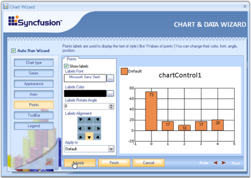
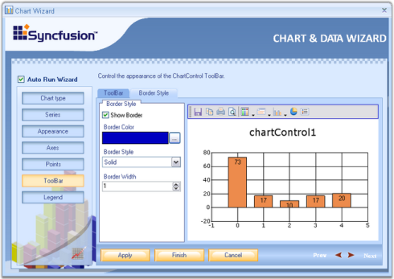

# Chart Wizard

The Chart Wizard is a very convenient tool to setup the Chart during design-time.

The Wizard neatly categorizes the different portions of the Chart, and lets you customize the most common properties of these different portions easily.

### Key features of the Chart wizard

1. Can create various types of chart.
2. Add series dynamically when the application is running.
3. Change the appearance of the chart with the various options that are provided to change the color palette, back color and title of the chart.
4. Customize the axes of the chart such as changing the range and labels.
5. Provides support for customization of the chart legend.
6. Customize the chart control's toolbar.
7. Lets you customize the point labels.

This section describes about the functionality of the chart wizard. 

### Design Time

To display the chart wizard at design-time, follow the below steps.

1. Add a ChartControl to your form.
2. Right-click anywhere in the chart to see a context menu.
3. Select the chart wizard item from the context menu.

### At Run Time

Optionally, you can also let your users to invoke this Wizard during run-time to let them customize the Chart's look and feel. To invoke the Chart wizard at runtime, use the below code.





this.chartControl1.DisplayWizard();





Me.chartControl1.DisplayWizard()





The wizard provides six different categories whose settings can be customized.

1. [Chart type](#chart-type) to let you visualize and select the type of chart to display.
2. [Series](#series) to let you add custom series to the chart and also setup data binding.
3. [Appearance](#appearance) to customize the color, font etc. of the ChartControl and ChartArea.
4. [Axes](#axes) to change the chart control's axes settings.
5. Points] to customize the point labels.
6. [Legend](#legend) to set the properties of the legend area.
7. [Toolbar](#toolbar) to customize the various properties of the toolbar.

There is a preview panel where a Chart is rendered with the latest settings. The sub topics of this section will guide you through these settings.

After making necessary changes, click the Apply to apply those settings in the chart and finally, click the Finish to close the Wizard.

## Chart Type

In this view, you can visually see the different chart types that could be used to render your data points. Simply click on the image of the chart type to pick the type you are interested in.

3D Style - The chart will be rendered in 3D mode. Corresponds to the Series3D property.



[Chart Types](/windowsforms/chart/chart-types)



## Series

A Chart can display multiple series. Properties such as Name, Data source, Series Data can be set or changed for any of the series, easily, through this wizard.

Below are the three tabs in the Wizard for Series.

1. Add points to series 
2. Click Add button to add a new series. 
3. Select the series to which you need to add points. 
4. This tab provides options to select any chart type using the Type combobox and series name using Series Name textbox.
5. Clicking the Edit points button, opens the ChartPoint Collection Editor.

  

6. Click Add to add points to the series. Give X and Y values. Click OK.

Data source - The data source to connect with, can be selected using the data source page. Once the data source is selected, it will guide you through the connectivity steps. Refer [Data Binding in Chart Through Chart Wizard](http://help.syncfusion.com/windowsforms/chart/chart-data#data-binding-in-chart-through-chart-wizard) topic for detailed information. This topic describes data binding techniques at the design-time through Chart Wizard tools.

Series Data - Using this tab, we can change the type of the chart. Whenever an external data source is selected using the Data Source tab, XValue and YValue ComboBox will be supplied with all the column names of the external data source.

Select one column for XValue and another for YValue, between which you wanted to draw the chart. Refer [Data Binding in Chart Through Chart Wizard](http://help.syncfusion.com/windowsforms/chart/chart-data#data-binding-in-chart-through-chart-wizard) topic for detailed information.



[Chart Series](http://help.syncfusion.com/windowsforms/chart/chart-series)



## Appearance

Customize the appearance of the ChartControl easily through the Chart Wizard. Here the appearance of the chart control and chart area such as color, font etc. can be set.

There are three tabs available in the wizard, for appearance settings.

* Color Palette -Essential Chart comes with a variety of built-in palettes. You can pick one of the palettes from the list and also get a preview of how the chart would look like. Note that you can also add a custom palette to the chart, but that has to be done in code.
* Border and Back Color - Under this tab, the back color for the chart control as well as for the chart area can be set. The user can also set the Border color and Border style for the chart area. 
* Title - This gives options to set the title for the chart control. Also the position, alignment and color of the title can be set.

 

[Appearance Settings](http://help.syncfusion.com/windowsforms/chart/chart-appearance)

 

## Axes

Various settings like grid line, axis title, value type, formats and other axes settings can be done using the wizard.

The below properties can be set separately for x-axis and y-axis. 

* Grid Lines - Lets you show/hide the grid lines for this axis.
* Axis Title - The title text for the axis can be specified here.
* Inversed, Opposed - Specifies whether the axes are inversed, opposed.
* Value Type - If you know the type of data points you will be adding to this axis, specify it using the combo box. Possible value types are double, datetime, custom and logarithmic.
* Format - Specifies the label format.
* Edit Labels - The labels at the axes can be varied by entering the values in the Collection Editor Dialog box, which pops up when the Edit Labels button is clicked.

* Collection Editor Dialog - Click the Add button to add a label to the collection. Select the added label to view its properties on its right side. The color of the label, font, value type and so on can be changed using the properties window. If any label needs to be removed from the collection editor, select the label and click the Remove button. After adding all the values to the collection and making the necessary changes in the properties, click OK. In a similar way the labels can be edited for y-axis also.



[Chart Axes](http://help.syncfusion.com/windowsforms/chart/chart-axes)



## Points

This particular section in the wizard comes with the below options. It lets you display labels for the data points by simply checking Show labels option. 

* Labels Font - Sets font style for the labels.
* Labels Color - Sets color for the labels.
* Labels Rotate Angle - Sets the angle of rotation of the labels.
* Label Alignment - Sets the alignment of the labels on the series points.
* Apply To - Specifies the series name to which the above settings should be applied.

## Toolbar

The final option in the Chart Wizard is the ChartControl ToolBar. It has two tabs.

* ToolBar

Under this tab, the user can customize the toolbar's back color, button style as well as set width and Height for the buttons through the respective options.

* Edit Item

Clicking the Edit Items button will invoke the below editor. It provides options to change the image, name and tooltip for individual items.

* Border Style

Toolbar's border, border style, border width and border color can be set through this tab.



[Chart Toolbar](http://help.syncfusion.com/windowsforms/chart/runtime-features#toolbars)



## Legend

The various properties of the chart legend such as position, alignment, orientation etc., can be changed easily using this wizard. It has two tabs.

* Legend - In this window, the user can customize the legend's visibility, set it's position and alignment using Position and Alignment combo boxes provided. You can also set back interior color using Back Interior combo box.

* Border Style - Here the user can set custom borders to the legend. The visibility of the border, border color, its Dash style as well as the Border Width can be set easily by selecting the appropriate options.



[Chart Legend](http://help.syncfusion.com/windowsforms/chart/chart-legend-and-legend-items)

