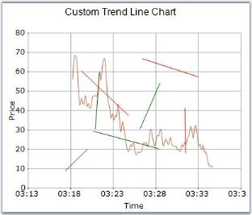

# How to add custom TrendLine in Chart

TrendLines are used to draw lines in the ChartArea. They can be added to the chart using the TrendLineAdder class. 

TrendLines can also be drawn using the Mouse Events. In this case, you will have to make use of the Utility class to listen to mouse events and convert them into trendlines. You can draw any number of trendlines, and can set different colors to differentiate them.

 

// Creating Custom Points

ChartPoint ptStart = this.chart.ChartArea.GetValueByPoint(start);

ChartPoint ptEnd = this.chart.ChartArea.GetValueByPoint(end);

ChartSeries tseries = this.chart.Model.NewSeries("TrendLine", ChartSeriesType.Line);

tseries.Points.Add(ptStart);

tseries.Points.Add(ptEnd);

this.chart.Series.Add(tseries);

tseries.LegendItem.Visible = false;

// Specify the color for the lines.

tseries.Style.Interior = new Syncfusion.Drawing.BrushInfo(ptStart.YValues[0] < ptEnd.YValues[0] ? Color.DarkGreen : Color.Red); 





' Creating Custom Points

Dim tlineAdder As TrendLineAdder

Dim ptStart As ChartPoint = Me.chart.ChartArea.GetValueByPoint(start)

Dim ptEnd As ChartPoint = Me.chart.ChartArea.GetValueByPoint(end_Renamed)

Dim tseries As ChartSeries = Me.chart.Model.NewSeries("TrendLine", ChartSeriesType.Line)

tseries.Points.Add(ptStart)

tseries.Points.Add(ptEnd)

Me.chart.Series.Add(tseries)

tseries.LegendItem.Visible = False

' Specify the color for the lines.

If ptStart.YValues(0) < ptEnd.YValues(0) Then

tseries.Style.Interior = New Syncfusion.Drawing.BrushInfo(Color.DarkGreen)

Else

tseries.Style.Interior = New Syncfusion.Drawing.BrushInfo(Color.Red)

End If



