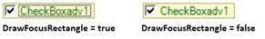

# Appearance and Behavior Settings in Windows Forms CheckBox

This section discusses the appearance and behavior settings of the [CheckBoxAdv](https://help.syncfusion.com/cr/windowsforms/Syncfusion.Windows.Forms.Tools.CheckBoxAdv.html) control.

## Appearance Settings

### DrawFocusRectangle

You can show or hide the focus rectangle of [CheckBoxAdv](https://help.syncfusion.com/cr/windowsforms/Syncfusion.Windows.Forms.Tools.CheckBoxAdv.html) control using  [DrawFocusRectangle](https://help.syncfusion.com/cr/windowsforms/Syncfusion.Windows.Forms.Tools.CheckRadioBase.html#Syncfusion_Windows_Forms_Tools_CheckRadioBase_DrawFocusRectangle) property.

<table>
<tr>
<th>
CheckBoxAdv Property</th><th>
Description</th></tr>
<tr>
<td>
DrawFocusRectangle</td><td>
Determines if the focus rectangle is visible when it gets the focus. The default value is set to 'True'.</td></tr>
</table>




this.checkBoxAdv1.DrawFocusRectangle = true;





Me.checkBoxAdv1.DrawFocusRectangle = True




## Behavior Settings

The behavior of the [CheckBoxAdv](https://help.syncfusion.com/cr/windowsforms/Syncfusion.Windows.Forms.Tools.CheckBoxAdv.html) control can be customized using [AutoHeight](https://help.syncfusion.com/cr/windowsforms/Syncfusion.Windows.Forms.Tools.CheckRadioBase.html#Syncfusion_Windows_Forms_Tools_CheckRadioBase_AutoHeight), [ReadOnlyMode](https://help.syncfusion.com/cr/windowsforms/Syncfusion.Windows.Forms.Tools.CheckBoxAdv.html#Syncfusion_Windows_Forms_Tools_CheckBoxAdv_ReadOnlyMode) and [TriState](https://help.syncfusion.com/cr/windowsforms/Syncfusion.Windows.Forms.Tools.CheckBoxAdv.html#Syncfusion_Windows_Forms_Tools_CheckBoxAdv_Tristate) properties.

<table>
<tr>
<th>
CheckBoxAdv Properties</th><th>
Description</th></tr>
<tr>
<td>
AutoHeight</td><td>
Determines if the CheckBoxAdv will automatically calculate its height.</td></tr>
<tr>
<td>
ReadOnlyMode</td><td>
Specifies the Read Only Mode of the CheckBoxAdv.</td></tr>
<tr>
<td>
Tristate</td><td>
Specifies whether the indeterminate state can be accessed through clicking.</td></tr>
</table>




this.checkBoxAdv1.AutoHeight = true;
this.checkBoxAdv1.ReadOnlyMode = true;
this.checkBoxAdv1.Tristate= false;





Me.checkBoxAdv1.AutoHeight = True
Me.checkBoxAdv1.ReadOnlyMode = True
Me.checkBoxAdv1.Tristate= False




