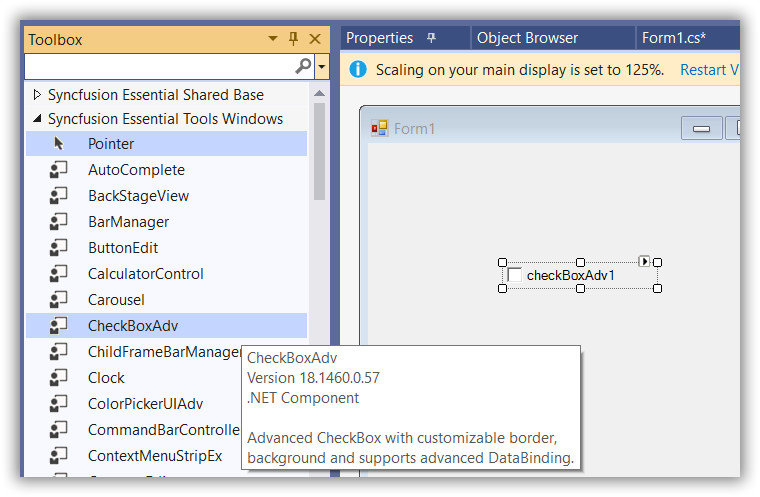

# Getting Started with WinForms CheckBox

This section gives a detailed description of getting started with the [WinForms CheckBox](https://help.syncfusion.com/cr/windowsforms/Syncfusion.Windows.Forms.Tools.CheckBoxAdv.html) control.

## Assembly Deployment

Refer to the [Control Dependencies](https://help.syncfusion.com/windowsforms/control-dependencies#checkboxadv) section to get the list of assemblies or details of the NuGet package that needs to be added as a reference to use the control in any application.

Refer to [NuGet Packages](https://help.syncfusion.com/windowsforms/installation/install-nuget-packages) to learn how to install NuGet packages in a Windows Forms application.

## Adding WinForms CheckBox control via designer

The following steps explain how to create the WinForms CheckBox control via the designer.

1. Create a new Windows Forms project in Visual Studio.

2. Drag and drop the [WinForms CheckBox](https://help.syncfusion.com/cr/windowsforms/Syncfusion.Windows.Forms.Tools.CheckBoxAdv.html) from the toolbox to the Form designer window.

3. The [dependent assemblies](https://help.syncfusion.com/windowsforms/control-dependencies#checkboxadv) will be added automatically.

## Adding WinForms CheckBox control via code

In order to add the [WinForms CheckBox](https://help.syncfusion.com/cr/windowsforms/Syncfusion.Windows.Forms.Tools.CheckBoxAdv.html) control manually, follow the steps below.

1. Add the required [assembly references](https://help.syncfusion.com/windowsforms/control-dependencies#checkboxadv) to the project.

2. Include the required namespace `Syncfusion.Windows.Forms.Tools`.

3. Create the [WinForms CheckBox](https://help.syncfusion.com/cr/windowsforms/Syncfusion.Windows.Forms.Tools.CheckBoxAdv.html) control instance and add it to the form.





using Syncfusion.Windows.Forms.Tools;





Imports Syncfusion.Windows.Forms.Tools




{{ codesnippet1 | OrderList_Indent_Level_1 }}





CheckBoxAdv checkBoxAdv = new CheckBoxAdv() {Text="CheckBoxAdv", Height = 25, Width = 200 };
this.Controls.Add(checkBoxAdv);





Dim checkBoxAdv As CheckBoxAdv = New CheckBoxAdv() With {.Text="CheckBoxAdv", .Height = 25, .Width = 200}
Me.Controls.Add(checkBoxAdv)




{{ codesnippet2 | OrderList_Indent_Level_1 }}

## WinForms CheckBox State

You can get or set the current checked status of the [WinForms CheckBox](https://help.syncfusion.com/cr/windowsforms/Syncfusion.Windows.Forms.Tools.CheckBoxAdv.html) using the [Checked](https://help.syncfusion.com/cr/windowsforms/Syncfusion.Windows.Forms.Tools.CheckBoxAdv.html#Syncfusion_Windows_Forms_Tools_CheckBoxAdv_Checked) or [CheckState](https://help.syncfusion.com/cr/windowsforms/Syncfusion.Windows.Forms.Tools.CheckBoxAdv.html#Syncfusion_Windows_Forms_Tools_CheckBoxAdv_CheckState) property. The default value of the `Checked` property is `false` and the `CheckState` property is `Unchecked`.




this.checkBoxAdv1.Checked = true;
this.checkBoxAdv1.CheckState = System.Windows.Forms.CheckState.Checked;




Me.checkBoxAdv1.Checked = True
Me.checkBoxAdv1.CheckState = System.Windows.Forms.CheckState.Checked




>**NOTE**: To learn more about the WinForms CheckBox states, refer to [CheckBoxAdv Settings](https://help.syncfusion.com/windowsforms/checkbox/checkboxadv-settings).
