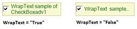

# Text Settings in WinForms CheckBox

This section discusses the text settings of the [WinForms CheckBox](https://help.syncfusion.com/cr/windowsforms/Syncfusion.Windows.Forms.Tools.CheckBoxAdv.html).

Text in the WinForms CheckBox can be shadowed and wrapped by using the [TextShadow](https://help.syncfusion.com/cr/windowsforms/Syncfusion.Windows.Forms.Tools.CheckRadioBase.html#Syncfusion_Windows_Forms_Tools_CheckRadioBase_TextShadow), [ShadowColor](https://help.syncfusion.com/cr/windowsforms/Syncfusion.Windows.Forms.Tools.CheckRadioBase.html#Syncfusion_Windows_Forms_Tools_CheckRadioBase_ShadowColor), [ShadowOffset](https://help.syncfusion.com/cr/windowsforms/Syncfusion.Windows.Forms.Tools.CheckRadioBase.html#Syncfusion_Windows_Forms_Tools_CheckRadioBase_ShadowOffset), and [WrapText](https://help.syncfusion.com/cr/windowsforms/Syncfusion.Windows.Forms.Tools.CheckRadioBase.html#Syncfusion_Windows_Forms_Tools_CheckRadioBase_WrapText) properties.

<table>
<tr>
<th>
WinForms CheckBox Properties</th><th>
Description</th></tr>
<tr>
<td>
TextShadow</td><td>
Determines if the text shadow is visible.</td></tr>
<tr>
<td>
ShadowColor</td><td>
The color of the text shadow.</td></tr>
<tr>
<td>
ShadowOffset</td><td>
The offset of the text shadow.</td></tr>
<tr>
<td>
WrapText</td><td>
Determines if the text in the WinForms CheckBox is wrapped.</td></tr>
</table>




this.checkBoxAdv1.TextShadow = true;
this.checkBoxAdv1.ShadowColor = System.Drawing.Color.BurlyWood;
this.checkBoxAdv1.ShadowOffset = new System.Drawing.Point(8, 8);
this.checkBoxAdv1.WrapText = true;





Me.checkBoxAdv1.TextShadow = True
Me.checkBoxAdv1.ShadowColor = System.Drawing.Color.BurlyWood
Me.checkBoxAdv1.ShadowOffset = New System.Drawing.Point(8, 8)
Me.checkBoxAdv1.WrapText = True






[Alignment Settings](https://help.syncfusion.com/windowsforms/checkbox/alignment-settings)



