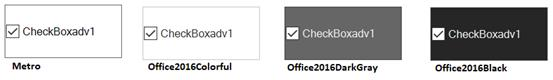

# Themes and Visual Styles

This section discusses the themes and visual style settings supported by the [CheckBoxAdv](https://help.syncfusion.com/cr/windowsforms/Syncfusion.Tools.Windows~Syncfusion.Windows.Forms.Tools.CheckBoxAdv.html) control.

## Themes

Themes can be applied to [CheckBoxAdv](https://help.syncfusion.com/cr/windowsforms/Syncfusion.Tools.Windows~Syncfusion.Windows.Forms.Tools.CheckBoxAdv.html) control by enabling the [ThemesEnabled](https://help.syncfusion.com/cr/cref_files/windowsforms/Syncfusion.Shared.Base~Syncfusion.Windows.Forms.ThemedControl~ThemesEnabled.html) property.

<table>
<tr>
<th>
CheckBoxAdv Property</th><th>
Description</th></tr>
<tr>
<td>
ThemesEnabled</td><td>
Specifies whether themes are enabled for CheckBoxAdv.</td></tr>
</table>




this.checkBoxAdv1.ThemesEnabled = true;





Me.checkBoxAdv1.ThemesEnabled = True




## Visual Styles

The appearance of the [CheckBoxAdv](https://help.syncfusion.com/cr/windowsforms/Syncfusion.Tools.Windows~Syncfusion.Windows.Forms.Tools.CheckBoxAdv.html) control can be customized using the [Style](https://help.syncfusion.com/cr/cref_files/windowsforms/Syncfusion.Tools.Windows~Syncfusion.Windows.Forms.Tools.CheckBoxAdv~Style.html), [Office2007ColorScheme](https://help.syncfusion.com/cr/cref_files/windowsforms/Syncfusion.Tools.Windows~Syncfusion.Windows.Forms.Tools.CheckBoxAdv~Office2007ColorScheme.html) and [Office2010ColorScheme](https://help.syncfusion.com/cr/cref_files/windowsforms/Syncfusion.Tools.Windows~Syncfusion.Windows.Forms.Tools.CheckBoxAdv~Office2010ColorScheme.html) properties.

<table>
<tr>
<th>
CheckBoxAdv Properties</th><th>
Description</th></tr>
<tr>
<td>
Style</td><td>
Gets or sets an advanced appearance for the CheckBoxAdv.The options included are as follows, Default, Office2007, Metro, Office2016Colorful, Office2016White, Office2016Black, Office2016DarkGray

</td></tr>
<tr>
<td>
Office2007ColorScheme</td><td>
Gets or sets Office 2007 color scheme.The options included are as follows, Managed, Blue, Silver and Black. The Style property should be set to "Office2007".</td></tr>
<tr>
<td>
Office2010ColorScheme</td><td>
Gets or sets Office 2010 color scheme.The options included are as follows, Managed, Blue, Silver and Black. The Style property should be set to "Office2010".</td></tr>
</table>




this.checkBoxAdv1.Style = Syncfusion.Windows.Forms.Tools.CheckBoxAdvStyle.Office2016Colorful;





Me.checkBoxAdv1.Style = Syncfusion.Windows.Forms.Tools.CheckBoxAdvStyle.Office2016Colorful




 

When the Office2007ColorScheme property is set to 'Managed', the CheckBox in the CheckBoxAdv can be displayed using custom colors supported by the control.




checkBoxAdv1.Style = Syncfusion.Windows.Forms.Tools.CheckBoxAdvStyle.Office2007;
checkBoxAdv1.Office2007ColorScheme = Syncfusion.Windows.Forms.Office2007Theme.Managed;
Office2007Colors.ApplyManagedColors(this, Color.Red);





checkBoxAdv1.Style = Syncfusion.Windows.Forms.Tools.CheckBoxAdvStyle.Office2007
checkBoxAdv1.Office2007ColorScheme = Syncfusion.Windows.Forms.Office2007Theme.Managed
Office2007Colors.ApplyManagedColors(Me, Color.Red)



