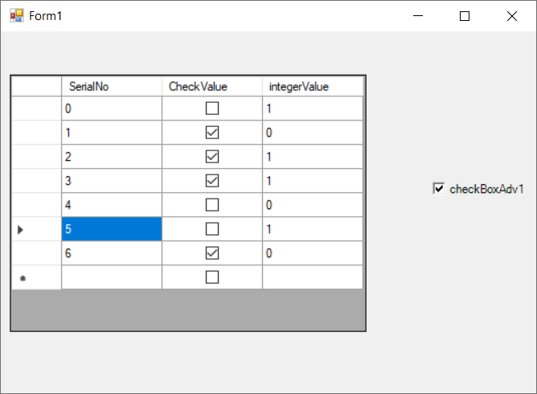

# How to Databind a CheckBoxAdv to Interger Field in SQL Database

The [CheckBoxAdv's]([CheckBoxAdv](https://help.syncfusion.com/cr/windowsforms/Syncfusion.Tools.Windows~Syncfusion.Windows.Forms.Tools.CheckBoxAdv.html)) [BoolValue](https://help.syncfusion.com/cr/cref_files/windowsforms/Syncfusion.Tools.Windows~Syncfusion.Windows.Forms.Tools.CheckBoxAdv~BoolValue.html) property can be used to data bind integer values as illustrated below.




public partial class Form1 : Form
{
    public const string connectString = @"Data Source=(LocalDB)\MSSQLLocalDB;AttachDbFilename=C:\Users\NiranjanKumarGopalan\source\repos\CheckBoxAdv_DataBinding_Boolean\Database1.mdf;Integrated Security=True";
    public Form1()
    {
        InitializeComponent();

        using (SqlConnection sqlConnection = new SqlConnection(connectString))
        {
            sqlConnection.Open();

            SqlDataAdapter dataAdapter = new SqlDataAdapter("SELECT * FROM [Table]", sqlConnection);

            DataTable dataTable = new DataTable("Table");
            dataAdapter.Fill(dataTable);

            dataGridView1.DataSource = dataTable;
            this.checkBoxAdv1.DataBindings.Add("IntValue", dataTable, "integerValue");
        }
    }
}





Public Partial Class Form1
    Inherits Form

    Public Const connectString As String = "Data Source=(LocalDB)\MSSQLLocalDB;AttachDbFilename=C:\Users\NiranjanKumarGopalan\source\repos\CheckBoxAdv_DataBinding_Boolean\Database1.mdf;Integrated Security=True"

    Public Sub New()
        InitializeComponent()

        Using sqlConnection As SqlConnection = New SqlConnection(connectString)
            sqlConnection.Open()
            Dim dataAdapter As SqlDataAdapter = New SqlDataAdapter("SELECT * FROM [Table]", sqlConnection)
            Dim dataTable As DataTable = New DataTable("Table")
            dataAdapter.Fill(dataTable)
            dataGridView1.DataSource = dataTable
            Me.checkBoxAdv1.DataBindings.Add("IntValue", dataTable, "integerValue")
        End Using
    End Sub
End Class




