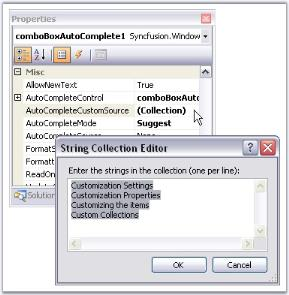

# Getting Started with Windows Forms ComboBoxAutoComplete(Classic)

Implementing a simple ComboBoxAutoComplete can be done in the following ways.

## Through Designer	

 This tutorial illustrates the usage of the ComboBoxAutoComplete control without any external datasource.

N> This is applicable only for VS2005.

1. Drag-and-drop a ComboBoxAutoComplete control from the toolbox onto the form.

    

2. Add items to ComboBoxAutoComplete using AutoCompleteCustomSource collection editor as shown below.

   

3. Specify the text completion behavior of the control using ComboBoxAutoComplete.AutoCompleteMode. The value of AutoCompleteMode should not be none in this case. See [Source for AutoComplete Control](/windowsforms/autocomplete/datasource#source-for-autocomplete-control) to know the different AutoCompleteModes. 
4. Set AutoCompleteSource to CustomSource as shown below. See  [Source for AutoComplete Control](/windowsforms/autocomplete/datasource#source-for-autocomplete-control) to know the different AutoComplete sources.

     

Output

At runtime, type 'C' in the display area of ComboBoxAutoComplete, you will see the autocompletion behavior as shown below.

## Through Code

The embedded AutoComplete control in a ComboBoxAutoComplete control is exposed through the AutoCompleteControl property. The Datasource property of the AutoCompleteControl specifies the data that will be used for the auto completion of the combo box. It can be created programmatically as follows.

1. Include the required namespace.
 




using Syncfusion.Windows.Forms.Tools;





Imports Syncfusion.Windows.Forms.Tools


 

{{ codesnippet1 | OrderList_Indent_Level_1 }}

2. Create an instance of the ComboBoxAutoComplete control class.





private Syncfusion.Windows.Forms.Tools.ComboBoxAutoComplete comboBoxAutoComplete1;
this.comboBoxAutoComplete1=new Syncfusion.Windows.Forms.Tools.ComboBoxAutoComplete();





Private comboBoxAutoComplete1 As Syncfusion.Windows.Forms.Tools.ComboBoxAutoComplete
Me.comboBoxAutoComplete1 = New Syncfusion.Windows.Forms.Tools.ComboBoxAutoComplete()




{{ codesnippet2 | OrderList_Indent_Level_1 }}

3. Set data source and add the control to the form.





this.comboBoxAutoComplete1.AutoCompleteCustomSource.AddRange(new string[] { "Custom", "Customizing", "Customizable"});
this.comboBoxAutoComplete1.AutoCompleteMode = System.Windows.Forms.AutoCompleteMode.SuggestAppend;
this.comboBoxAutoComplete1.AutoCompleteSource = System.Windows.Forms.AutoCompleteSource.CustomSource;
this.Controls.Add(this.comboBoxAutoComplete1);




 
Me.comboBoxAutoComplete1.AutoCompleteCustomSource.AddRange(New String() {"Custom", "Customizing", "Customizable"}) 
Me.comboBoxAutoComplete1.AutoCompleteMode = System.Windows.Forms.AutoCompleteMode.SuggestAppend 
Me.comboBoxAutoComplete1.AutoCompleteSource = System.Windows.Forms.AutoCompleteSource.CustomSource 
Me.Controls.Add(Me.comboBoxAutoComplete1)




{{ codesnippet3 | OrderList_Indent_Level_1 }}

4. Run the application.

   

